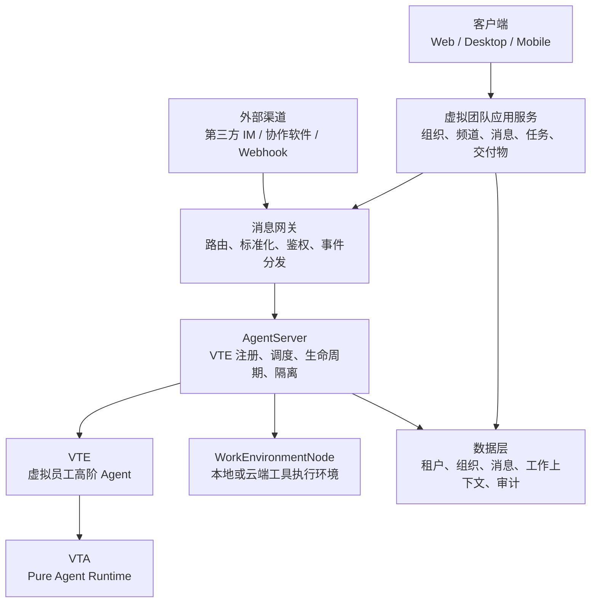
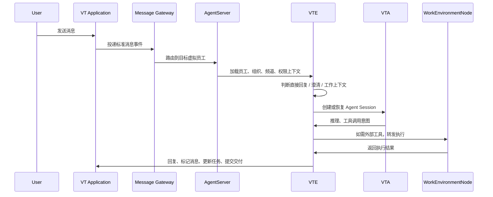

# 03. 系统架构

## 1. 总体分层

VT 系统从上到下分为：

## 2. 核心服务

### 2.1 虚拟团队应用服务

负责普通协作应用能力：

- 用户账号。
- 租户。
- 组织结构。
- 成员关系。
- 私聊、群聊、频道。
- 消息存储。
- 附件和交付物。
- 任务与工作视图。
- 权限和角色。
- 通知和审批入口。

它不负责运行 Agent loop，也不直接执行工具。

### 2.2 消息网关

负责把不同来源的消息标准化为 VT 内部事件：

- 应用内消息。
- 外部 IM 消息。
- 协作软件事件。
- Webhook。
- 系统通知。

消息网关需要处理：

- 鉴权。
- 租户识别。
- 组织和频道上下文补全。
- 消息格式标准化。
- 路由到人类成员或 AgentServer。
- 去重、幂等和重放。

### 2.3 AgentServer

AgentServer 是服务端管理虚拟员工 Agent 的服务，名称暂定。

它负责：

- 虚拟员工注册和实例管理。
- 根据消息找到对应 VTE。
- 创建、恢复、重建 Agent 资源。
- 管理工作上下文。
- 调用 VTA 运行具体 Agent Session。
- 分配和调用 WorkEnvironmentNode。
- 执行租户隔离、权限策略和成本策略。
- 对外暴露虚拟员工运行状态。

### 2.4 WorkEnvironmentNode

WorkEnvironmentNode 是工具执行环境。它可以运行在用户本地，也可以运行在 VT 提供的云端环境。

它负责：

- 提供 MCP、Built-in Tools、浏览器、命令行、文件系统、第三方 Agent 等能力。
- 通过协议连接服务端。
- 接收 AgentServer 转发的工具请求。
- 在隔离空间中执行操作。
- 返回结果、日志、文件变更和审计信息。

### 2.5 VTE

VTE 是虚拟员工 Agent 的实现形态。它位于 AgentServer 管理之下，基于 VTA 运行。

它负责：

- 理解消息上下文。
- 识别是否需要直接回复、追问、创建或关联工作上下文。
- 维护任务级上下文。
- 调度子 Agent。
- 使用服务端工具和 WorkEnvironmentNode 工具。
- 生成用户可见的沟通、汇报和交付说明。

### 2.6 VTA

VTA 是底层 Agent Runtime。它提供：

- Agent loop。
- PromptManager。
- ModelPolicy。
- MessageStore 工作轨。
- EventStore 审计轨。
- Tool loop。
- MCP 集成。
- Sub-agent Session。
- Compaction。

VTA 不直接承担 VT 的产品层组织模型和协作应用协议。

## 3. 消息处理主链路

## 4. 多租户隔离

多租户隔离是 VT 的基础约束：

- 每个租户拥有独立的数据命名空间。
- 用户、组织、消息、工作上下文、虚拟员工、工具配置均带租户边界。
- AgentServer 所有资源创建和恢复都必须带租户上下文。
- WorkEnvironmentNode 绑定租户或明确授权给特定租户。
- VTA Store 层需要支持 tenant_id 或等价隔离机制。

租户隔离不是只在 API 层做过滤，而应贯穿数据、缓存、任务队列、日志、审计、工具调用和模型上下文。

## 5. 服务端工具与工作环境工具

VT 存在两类工具：

### 5.1 服务端工具

由 AgentServer 或 VT 后端提供，不依赖用户本地工作环境，例如：

- 网络检索。
- 翻译。
- 文本分析。
- 通用文档解析。
- 商业化 API。
- 系统内组织、消息、任务查询。

### 5.2 工作环境节点工具

由 WorkEnvironmentNode 提供，通常涉及用户环境或专属执行空间，例如：

- 文件读写。
- 代码仓库操作。
- 命令执行。
- 浏览器自动化。
- 内网系统访问。
- 本地 MCP Server。
- 第三方成熟 Agent。

虚拟员工没有 WorkEnvironmentNode 时，仍可以完成纯文本、分析、规划和服务端工具任务。当它发现缺少必要工具时，应向用户提出配置工具或分配工作环境节点的申请。

## 6. 数据层

VT 数据层至少需要覆盖：

- 租户、用户、组织、成员。
- 消息、会话、频道、群组。
- 虚拟员工定义、实例、配置包引用。
- 工作上下文、任务、状态、关联消息。
- 工作环境节点、空间、工具清单、连接状态。
- 权限、审批、策略。
- 审计事件。
- 成本、用量和计费记录。

VTA 内部也有 MessageStore 和 EventStore，但 VT 产品层的数据模型不能直接等同于 VTA 的 Store。二者需要映射和关联。

## 7. 可观测性

系统需要从产品和 Agent 两个视角观测：

- 消息延迟。
- Agent 响应时间。
- 工作上下文创建和完成率。
- 工具调用成功率。
- WorkEnvironmentNode 在线率。
- 审批等待时间。
- 模型 token 和成本。
- 虚拟员工任务质量反馈。
- 租户级 SLA。

