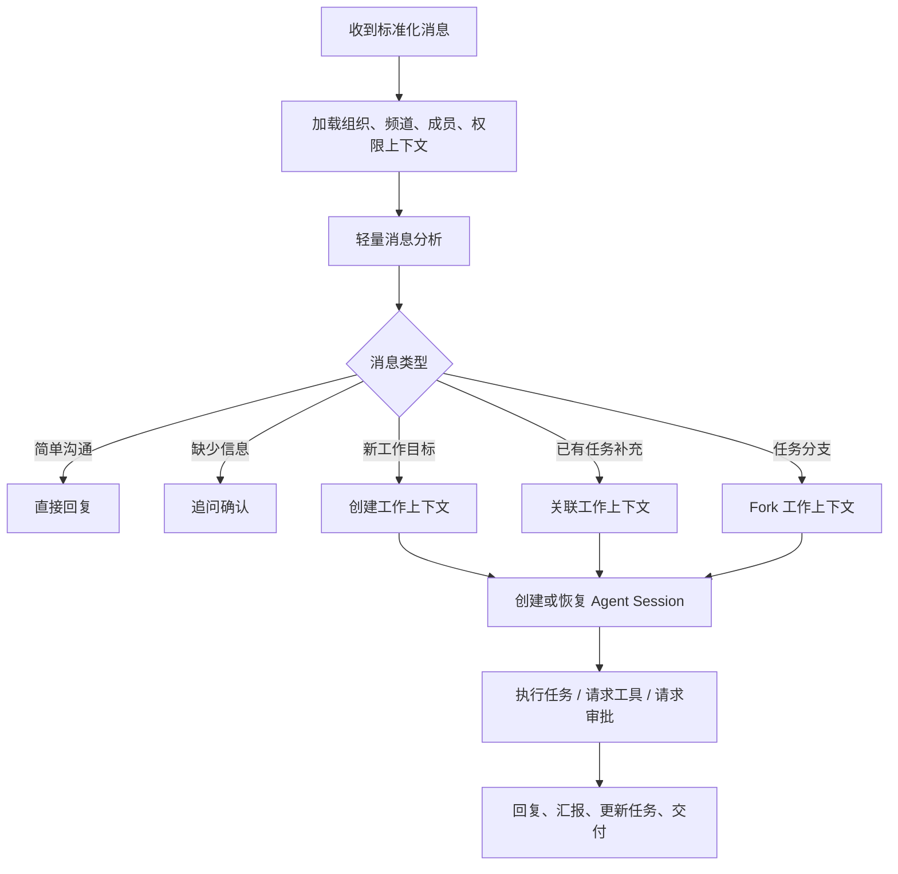

# 04. 消息与工作上下文

## 1. 核心判断

VT 的消息是 append-only 的协作记录，而不是 Agent 内部执行日志。

用户在聊天框中看到的内容应接近真实协作：

- 问候和简单问题可以直接回复。
- 模糊需求需要追问确认。
- 明确任务需要进入工作上下文。
- 工作过程中可以阶段性汇报。
- 遇到风险、缺少权限或缺少工具时需要回到聊天确认。
- 完成后说明结果并链接交付物。

## 2. 消息的产品职责

消息负责沟通和协作：

- 记录谁在什么时候说了什么。
- 记录上下文中的参与者。
- 承载附件、引用、回复和提及。
- 触发虚拟员工处理。
- 显示虚拟员工的自然回复。
- 指向任务、交付物或审批。

消息不负责：

- 展示完整推理链。
- 展示所有工具调用细节。
- 承载完整任务状态机。
- 作为唯一的任务上下文来源。

## 3. 消息基础字段

一条进入 AgentServer 的标准化消息至少需要包含：

- message_id。
- tenant_id。
- organization_id。
- conversation_id。
- conversation_type：dm、group、channel、external。
- sender_id。
- target_ids。
- mentioned_member_ids。
- content parts。
- attachments。
- reply_to / quote_refs。
- timestamp。
- delivery metadata。
- existing_work_context_refs。

这些字段用于帮助 VTE 判断消息语义和路由方式。

## 4. 工作上下文定义

工作上下文是围绕一个工作目标建立的数据层上下文切片。

它不是聊天窗口，也不是 VTA 的单条消息历史。它是 VT 产品层用于管理复杂任务的结构。

从 VTE 内部看，一个工作上下文通常会对应一个或多个独立 Agent Session。VTE 负责识别、创建、关联和汇总工作上下文；真正执行某项工作的可以是 VTE 之下的子 Agent，也可以是被 VTE 调度的第三方成熟 Agent。

一个工作上下文包含：

- work_context_id。
- tenant_id。
- organization_id。
- owner_user_id。
- responsible_employee_id。
- source_conversation_id。
- related_message_ids。
- title。
- objective。
- confirmed_requirements。
- open_questions。
- status。
- child_agent_sessions。
- tool_execution_refs。
- deliverables。
- context_summary。
- forked_from。
- related_work_context_ids。

## 5. 创建规则

创建工作上下文本身是低风险操作，一般不需要用户审批。

原因是它只是数据层切片，用于：

- 标记消息属于哪个任务。
- 隔离上下文。
- 降低后续分析成本。
- 避免一个聊天窗口混入多个任务导致上下文污染。

需要审批的不是“创建工作上下文”，而是后续具体操作，例如：

- 访问敏感文件。
- 写入或删除文件。
- 执行命令。
- 调用付费工具。
- 访问第三方系统。
- 使用云工作环境产生费用。
- 向外部成员发送消息或提交内容。

## 6. 消息分类

VTE 收到消息后，需要先做轻量分析。典型分类如下：

| 类型 | 处理方式 |
|------|----------|
| 简单沟通 | 直接回复，不创建新工作上下文 |
| 澄清问答 | 补充已有工作上下文，或直接回复 |
| 新工作目标 | 创建工作上下文 |
| 已有任务补充 | 关联已有工作上下文 |
| 已有任务中的新分支 | fork 工作上下文 |
| 审批响应 | 路由到对应审批和工具操作 |
| 状态查询 | 查询工作上下文后回复 |
| 无法判断 | 追问用户或请求人为选择 |

分析可以由低成本模型结合 VT 内部数据完成。后续通过给消息打上 work_context_id，减少重复分析和 token 消耗。

## 7. 工作上下文关联

一个消息可能：

- 不关联任何工作上下文。
- 关联一个工作上下文。
- 引用多个工作上下文。
- 触发新的工作上下文。
- 触发已有工作上下文的 fork。

系统需要保留消息到工作上下文的关联记录，而不是只把消息复制到某个 Agent 会话中。

## 8. Fork 规则

当消息与已有任务有关，但形成了新的目标、范围或交付物时，应 fork 工作上下文。

示例：

- “按刚才那个方案，再给我做一个面向销售团队的版本。”
- “这个功能先放一边，基于你刚才分析的问题单独开一个修复任务。”
- “同样的资料，帮我整理成对外发布稿。”

Fork 需要继承：

- 原上下文摘要。
- 关键决策。
- 相关消息引用。
- 必要附件和交付物引用。

Fork 不应默认继承：

- 所有内部工具结果。
- 不相关的执行日志。
- 已过期的临时状态。
- 不满足权限边界的资源。

## 9. VTE 处理流程

## 10. 与 VTA MessageStore 的关系

VT 的消息系统和 VTA 的 MessageStore 不同。

| 维度 | VT 消息 | VTA MessageStore |
|------|---------|------------------|
| 位置 | 产品层协作应用 | Agent Runtime 内部 |
| 目的 | 沟通、记录、协作 | 构建 LLM 上下文 |
| 可见性 | 用户可见为主 | 内部工作轨为主 |
| 结构 | conversation、channel、sender | session、turn、role、parts |
| 生命周期 | append-only 协作记录 | 可被 compaction 替换工作视图 |

工作上下文负责把两者关联起来：它知道哪些 VT 消息触发了哪些 VTA Session，以及哪些 VTA 执行结果需要以何种形式回到产品层。
