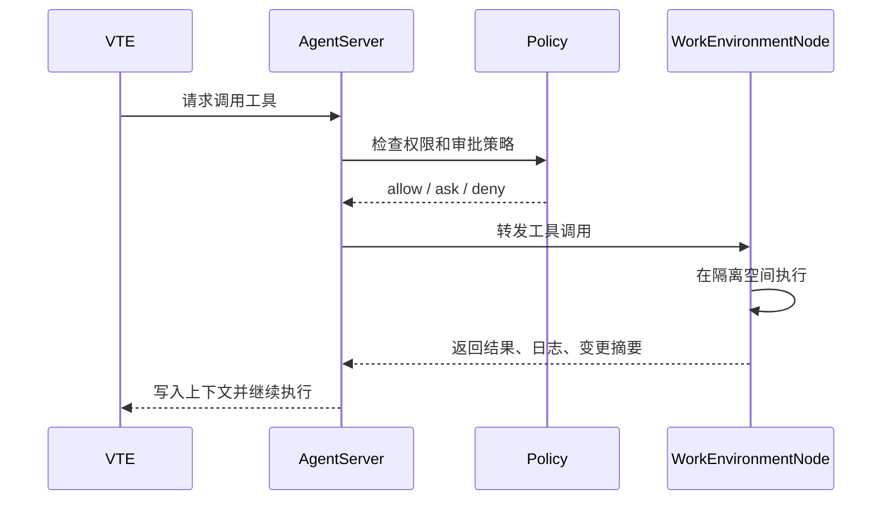

# 07. WorkEnvironmentNode

## 1. 定位

WorkEnvironmentNode 是虚拟员工的工作环境节点，负责承载工具和实际执行环境。

它不是 VTA，也不是 VTE。它更接近现实中的办公设备、办公软件和可访问系统。

## 2. 为什么需要工作环境节点

许多工作无法只靠服务端文本推理完成，例如：

- 读取和修改用户本地文件。
- 操作代码仓库。
- 执行命令。
- 使用浏览器。
- 访问用户内网系统。
- 调用本地安装的 MCP Server。
- 使用用户本地已经配置好的第三方 Agent。

这些能力不适合全部放在 VT 服务端运行，因此需要用户本地或云端的工作环境节点。

## 3. 节点形态

### 3.1 本地工作环境客户端

用户安装并启动工作环境客户端后，客户端连接 VT 服务端。

服务端可以将该节点分配给一个或多个虚拟员工。虚拟员工通过 AgentServer 转发请求，使用节点上的工具完成工作。

### 3.2 本地多空间

当用户只有一台设备但需要服务多个虚拟员工时，工作环境客户端需要支持多个隔离空间。

隔离空间可以基于：

- 独立工作目录。
- 沙箱。
- 容器。
- 文件系统权限。
- 独立环境变量。
- 独立工具配置。

目标是避免多个虚拟员工互相污染文件、状态和权限。

### 3.3 云工作环境

云工作环境是 VT 提供的托管节点，本质上是由平台提供设备、运行环境和工作环境客户端。

它适合：

- 不想安装本地客户端的用户。
- 需要稳定在线环境的任务。
- 需要专属工具或定制环境的商业用户。
- 需要更强隔离和审计的企业场景。

云工作环境是重要商业化方向之一。

## 4. 节点能力

WorkEnvironmentNode 可以提供：

- MCP Server。
- Built-in Tools。
- 文件系统工具。
- 命令执行工具。
- 浏览器自动化。
- 数据库或内部系统连接器。
- 第三方成熟 Agent。
- 项目级索引。
- 运行时依赖环境。
- 执行日志和文件变更快照。

节点应向 AgentServer 上报工具清单、能力描述、权限要求和当前状态。

## 5. 节点连接

节点连接服务端后，需要完成：

- 身份认证。
- 租户绑定。
- 设备注册。
- 心跳。
- 能力上报。
- 可用空间上报。
- 工具清单同步。
- 策略下发。

服务端应能看到：

- 节点是否在线。
- 节点属于哪个租户或用户。
- 节点被分配给哪些虚拟员工。
- 节点有哪些隔离空间。
- 节点暴露哪些工具。
- 节点当前是否繁忙。

## 6. 工具调用链路

## 7. 权限与审批

WorkEnvironmentNode 的操作可能有真实风险，因此需要策略控制：

- 哪些工具可见。
- 哪些工具可直接调用。
- 哪些操作需要用户确认。
- 哪些路径可读。
- 哪些路径可写。
- 哪些网络目标可访问。
- 哪些命令被禁止。
- 单次任务可消耗多少资源。

审批应该发生在具体操作或权限升级上，而不是发生在工作上下文创建上。

## 8. 节点与服务端工具的区别

| 维度 | 服务端工具 | WorkEnvironmentNode 工具 |
|------|------------|--------------------------|
| 运行位置 | VT 服务端 | 用户本地或云节点 |
| 典型能力 | 检索、翻译、文本分析、平台 API | 文件、命令、浏览器、内网、本地 Agent |
| 权限风险 | 平台侧可控 | 可能影响用户环境 |
| 是否必须安装客户端 | 否 | 本地节点需要 |
| 商业化 | 平台能力套餐 | 云工作环境、专属工具、托管环境 |

## 9. 节点不是 VTA

需要明确区分：

- VTA 负责 Agent loop 和运行时状态。
- VTE 负责虚拟员工高阶行为。
- AgentServer 负责资源装配、调度和权限。
- WorkEnvironmentNode 负责实际工具执行环境。

即使某个 WorkEnvironmentNode 上运行了第三方 Agent，它也只是作为工具或外部能力被 VTE 调用，不等同于 VTA。

## 10. 对 VTA 的潜在要求

为了支持 WorkEnvironmentNode，VTA 可能需要补充：

- RemoteToolExecutor 抽象。
- 工具调用异步回传。
- 工具执行上下文标识。
- 节点、空间、工具能力的 prompt 注入机制。
- 权限审批中断与恢复。
- 远程工具错误和降级策略。

这些能力应作为 VTA 的运行时扩展点设计，而不是把节点逻辑塞进 VTA。

