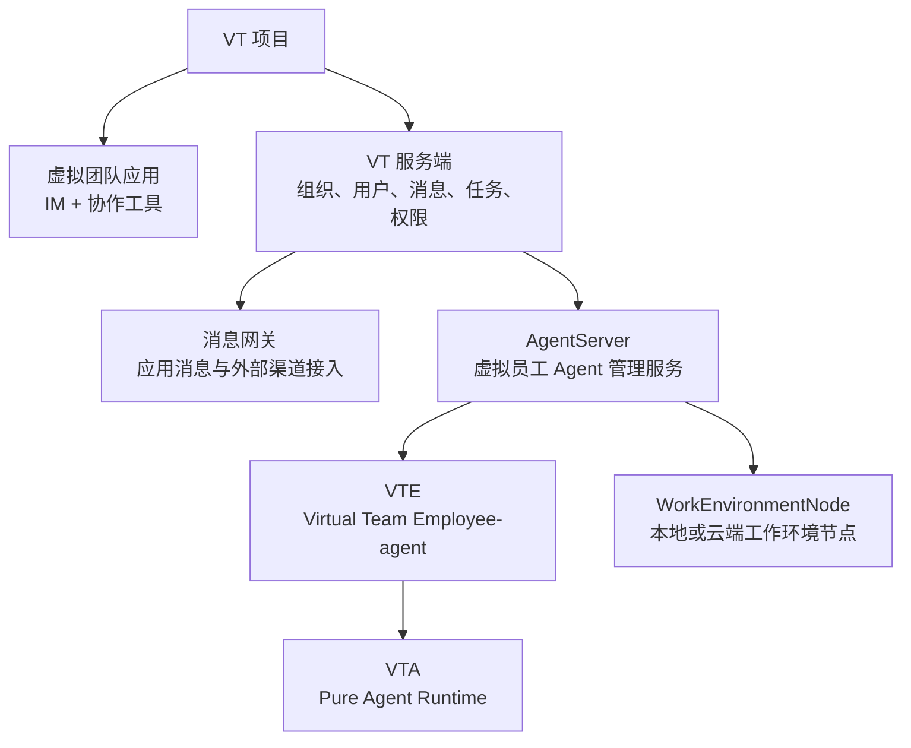

# Virtual Team 项目文档

本文档目录用于从产品和系统整体出发，描述 **Virtual Team（虚拟团队，简称 VT）** 项目的目标形态、概念模型、服务端架构、虚拟员工 Agent 体系、工作环境节点以及与 VTA 的关系。

`virtual-team/` 与 `virtual-teams-agent/` 的职责不同：

- `virtual-team/`：自上而下描述 VT 项目、虚拟团队应用、服务端、AgentServer、消息网关、WorkEnvironmentNode、VTE 和商业化体系。
- `virtual-teams-agent/`：描述 VTA 运行时本身，即支撑虚拟员工 Agent 的底层 Pure Agent Runtime。

## 一句话定位

Virtual Team 是一个以协作应用为入口、以虚拟员工为核心劳动力、以工作环境节点为工具执行载体的虚拟组织系统。

它不是单纯的聊天机器人，也不是把某个 Agent CLI 包一层界面，而是把“组织、沟通、任务、员工、工具、权限、交付”这些现实协作要素系统化映射到 AI Agent 产品中。

## 顶层结构

## 阅读顺序

1. [00-project-positioning.md](00-project-positioning.md)：项目定位、问题背景、设计原则。
2. [01-concept-model.md](01-concept-model.md)：核心概念、现实组织映射、术语边界。
3. [02-virtual-team-application.md](02-virtual-team-application.md)：虚拟团队应用作为 IM 与协作工具的产品形态。
4. [03-system-architecture.md](03-system-architecture.md)：从客户端到 VTA 的整体系统架构。
5. [04-message-and-work-context.md](04-message-and-work-context.md)：Append-only 消息、工作上下文、任务切片与上下文隔离。
6. [05-agent-server.md](05-agent-server.md)：AgentServer 的职责、边界和生命周期管理。
7. [06-vte-virtual-employee-agent.md](06-vte-virtual-employee-agent.md)：虚拟员工 Agent 的内部结构和行为模型。
8. [07-work-environment-node.md](07-work-environment-node.md)：工作环境节点、本地客户端、云工作环境和工具执行。
9. [08-security-permission-isolation.md](08-security-permission-isolation.md)：权限、安全、审批、租户隔离和沙箱。
10. [09-commercialization.md](09-commercialization.md)：高级助理、云工作环境、商业工具和开放生态。
11. [10-roadmap.md](10-roadmap.md)：完整目标架构下的实施路线和 VTA 迭代需求。

## 文档原则

- 先描述完整系统，再拆分实施阶段。
- 不把 VT 简化成某个 Agent Runtime 的 UI 外壳。
- 不把聊天窗口当作 Agent 内部执行日志。
- 不把工作环境节点与 VTA 混淆。
- 不把组织模型只当作数据库结构；它同时是用户理解系统的产品模型，也是虚拟员工理解上下文的 prompt 要素。

