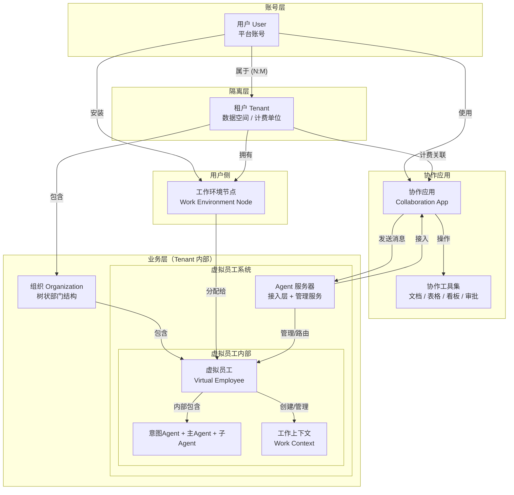
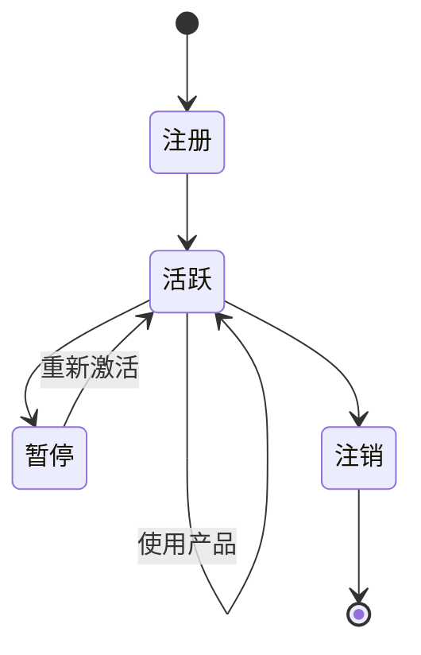
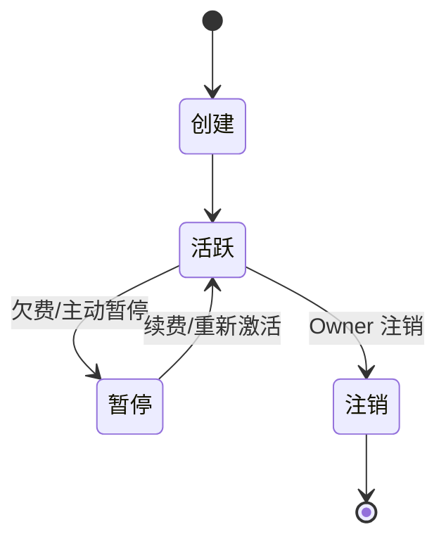
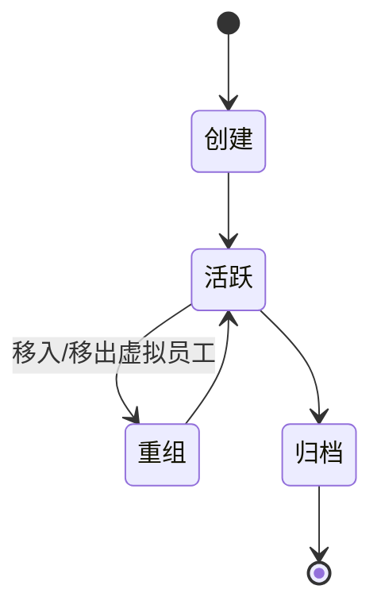
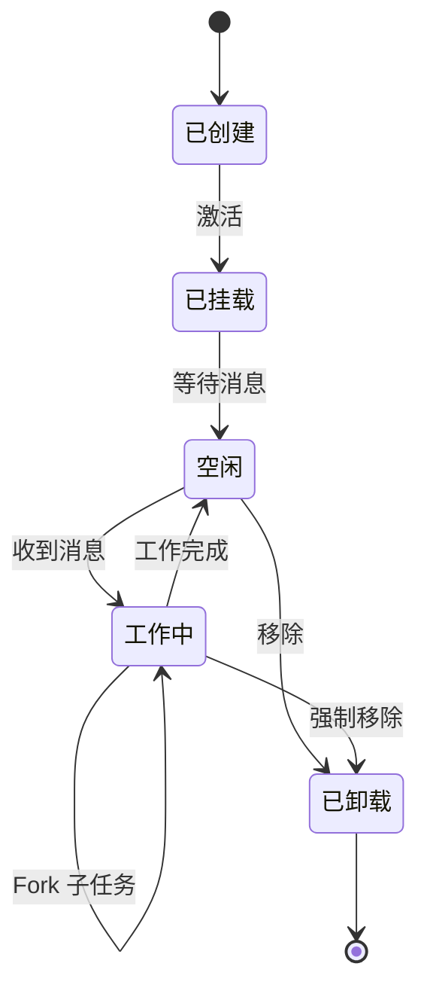

# 核心概念模型

本章定义 Virtual Team 的核心概念及其相互关系，作为后续所有架构设计的基础。每个概念包含定义、关键属性、生命周期和与其他概念的关系。

Virtual Team 的概念分为三个层级：

| 层级 | 职责 | 核心实体 |
|------|------|---------|
| **账号层** | 用户身份与认证 | User |
| **隔离层** | 数据空间边界与计费 | Tenant |
| **业务层** | 虚拟团队的组织与执行 | Organization, Virtual Employee, Work Context, Work Environment Node |

## 概念全景

**关键：三层之间的隔离边界**

- User 切换活跃 Tenant → 看到的组织、虚拟员工、消息完全不同
- 所有业务数据（VE、消息、工作上下文）的隔离键是 `tenant_id`，不直接关联 `user_id`
- 一个 User 可以属于多个 Tenant（个人空间 + 加入的企业空间）

## 概念定义

### 用户 (User)

Virtual Team 平台上的**个人账号**。User 代表一个真实的人，拥有登录凭据和个人信息。

**关键属性**：

| 属性 | 说明 |
|------|------|
| User ID | 平台唯一标识 |
| 邮箱 | 登录凭据，平台唯一 |
| 显示名称 | 个人显示名称 |
| 认证方式 | JWT（协作应用） |
| 所属 Tenant 列表 | N:M 关系，每个关联包含角色（owner/admin/member） |

**User vs Tenant**：

| 维度 | User | Tenant |
|------|------|--------|
| 是什么 | 个人账号 | 数据空间 |
| 数量关系 | 一个人一个账号 | 一个用户可以属于多个 |
| 包含什么 | 登录信息、个人偏好 | VE、组织、消息、工作上下文 |
| 类比 | 你的 GitHub 账号 | GitHub 个人空间 / GitHub Org |

**生命周期**：

**v1 vs 远期**：
- **v1**：用户注册时自动创建个人 Tenant，User:Tenant = 1:1，用户无感知
- **远期**：用户可以创建/加入多个 Tenant（个人空间 + 企业空间），在协作应用中切换

### 租户 (Tenant)

Virtual Team 的**数据隔离与计费单位**。所有业务数据（组织、虚拟员工、消息、工作上下文）都归属到一个 Tenant 之下。

**关键属性**：

| 属性 | 说明 |
|------|------|
| Tenant ID | 所有业务数据的隔离键 |
| 名称 | Tenant 显示名称（个人空间用用户名，企业空间用企业名） |
| 计划 | free / pro / team / enterprise |
| 计费邮箱 | 账单接收邮箱 |
| 成员 | 有权访问该 Tenant 的 User 列表及其角色 |

**Tenant 内的角色**：

| 角色 | 权限 |
|------|------|
| **Owner** | 完全控制：管理成员、删除 Tenant、修改计费 |
| **Admin** | 管理权限：创建/管理 VE 和组织，邀请成员 |
| **Member** | 使用权限：与 VE 交互，查看组织内容 |

**生命周期**：

**与 User 的关系**：N:M。User 通过 `user_tenants` 关联表关联到 Tenant，每次登录后选择一个活跃 Tenant，协作应用中展示该 Tenant 下的所有内容。切换 Tenant 类似于 Slack 切换 Workspace。

**设计意图**：Tenant 是平台架构中最核心的隔离边界。它不仅隔离数据，还是计费、资源配额、安全策略的应用单位。个人用户的"个人空间"和企业客户的"企业空间"在架构上是同一个 Tenant 概念，仅规模不同。

### 组织 (Organization)

Tenant **内部**的虚拟团队部门结构。呈**树状结构**（组织下可嵌套子组织），用于划分虚拟员工的归属和协作范围。

**重要区分**：

| 概念 | 含义 | 类比 |
|------|------|------|
| **Tenant** | 数据空间边界、计费单位 | 一家公司或一个个人空间 |
| **Organization（虚拟团队组织）** | Tenant 内部的部门树 | 公司里的"销售部""研发部" |

一个 Tenant 包含一个组织树。Tree root 是该 Tenant 下的默认顶级组织。

**关键属性**：

| 属性 | 说明 |
|------|------|
| 组织 ID | 全局唯一标识 |
| Tenant ID | 归属的租户 |
| 父组织 ID | 树状结构的父节点引用，null = 顶级组织 |
| 名称与描述 | 用户可见的组织信息 |
| 元数据 | 业务领域标签、典型任务类型（系统自动维护） |
| 成员 | 该组织内的虚拟员工及其角色（Leader/Member） |

**树状结构约束**：

| 约束 | 值 | 说明 |
|------|-----|------|
| 最大嵌套深度 | 5 层 | 防止过度嵌套导致路由效率下降 |
| 单节点最大子组织数 | 50 | 保持扁平化倾向 |
| 虚拟员工归属 | 仅叶节点或任意节点 | 配置项，默认允许任意节点 |

**生命周期**：

**设计意图**：用于 Tenant 内部数据和资源的逻辑划分。大多数简单场景下用户感知不到组织的存在——系统自动维护默认组织。当业务复杂度增加到需要分层管理时才显式创建。

### 虚拟员工 (Virtual Employee)

面向用户的一等 Agent 实体。在协作应用中表现为一个**联系人**，像真人同事一样接收消息、完成任务。

**关键属性**：

| 属性 | 说明 |
|------|------|
| VE ID | 全局唯一标识 |
| Tenant ID | 归属的租户 |
| 显示名称 | 在协作应用中展示的名称和头像 |
| 配置包引用 | 定义角色、能力、工具、模型 |
| 所属组织 | 归属的组织 ID（Tenant 内，可空） |
| 工作环境节点 | 分配的 WEN（可空，表示仅有平台工具） |
| 在线状态 | online / offline / busy / away |

**内部 Agent 构成**：

| 内部 Agent | 模型 | 职责 |
|-----------|------|------|
| 意图识别 Agent | 低成本模型 | 分析消息意图，路由决策 |
| 主 Agent | 主力模型 | 实际执行工作，管理工作上下文 |
| 子 Agent | 配置覆盖 | 主 Agent 动态创建，处理子任务 |

**生命周期**：

**与配置包的关系**：虚拟员工的所有能力由配置包定义——不是硬编码、不是运行时动态配置、不是数据库状态。配置包是文件资产，可版本控制和 CI/CD 部署。虚拟员工创建时锁定配置包版本，升级需用户手动触发。

### 助理 (Assistant)

一种**特殊的虚拟员工**，没有底层架构特权。其不同之处仅在于配置包：

| 差异维度 | 普通虚拟员工 | 助理 |
|---------|------------|------|
| 角色定位 | 领域执行者 | 全局协调者 |
| System Prompt | 专业领域 prompt | 管理型 prompt（任务分析、路由、汇总） |
| 可用工具 | 领域工具 | 组织管理工具 + 跨 VE 通讯工具 |
| 模型 | 按岗位选择 | 通常使用更强模型（更好的分析协调能力） |
| 视野范围 | 所在组织和相关工作 | 当前 Tenant 内全局（所有组织、所有 VE） |

用户首次创建 Tenant 时自动获得一个基本助理。高级助理（付费）通过配置包升级模型和管理能力。

### 工作上下文 (Work Context)

虚拟员工处理一项具体工作任务时的**独立工作空间**。它是面向虚拟员工的高阶 Session 封装。

**关键属性**：

| 属性 | 说明 |
|------|------|
| 上下文 ID | 全局唯一标识 |
| Tenant ID | 归属的租户 |
| 状态 | 新建 / 活跃 / 暂停 / Fork / 归档 |
| 关联消息列表 | 指向协作应用中标记为此上下文的消息 |
| VTA Session 列表 | 底层的一个或多个 VTA Session |
| 检查点 | Fork 分叉的基准点 |
| 关联工作环境节点 | 执行工具的目标节点 |
| 关联资源 | 文件、数据等引用 |

**操作**：

| 操作 | 说明 | 类比 |
|------|------|------|
| **New** | 创建全新工作上下文 | 打开新对话 |
| **Fork** | 从已有工作的检查点分叉 | Git branch |
| **Resume** | 恢复已有工作上下文继续 | 重新打开对话 |

**设计意图**：
1. 隔离不同任务的消息和上下文，避免污染
2. 支持独立的状态管理（暂停、恢复、归档）
3. 允许从工作中途分叉探索不同方案
4. 为跨 Session 的长对话提供 Resume 机制

### 工作环境节点 (Work Environment Node)

虚拟员工执行操作的物理/虚拟环境。它将"执行能力"从"推理能力"中分离。

**关键属性**：

| 属性 | 说明 |
|------|------|
| 节点 ID | 全局唯一标识 |
| Tenant ID | 归属的租户 |
| 节点类型 | local（用户设备）/ cloud（平台托管） |
| 宿主信息 | OS、架构、主机名 |
| 能力声明 | MCP Server 列表、内置工具、第三方 Agent |
| 沙盒类型 | container / process / none |
| 在线状态 | online / offline / degraded |
| 负载 | CPU、内存、活跃 VE 数、活跃工具调用数 |

**节点类型对比**：

| 维度 | Local 节点 | Cloud 节点 |
|------|-----------|-----------|
| 安装位置 | 用户自己的设备 | 平台托管 |
| 数据控制 | 用户完全掌控 | 平台负责安全 |
| 网络访问 | 用户本地网络 | 平台网络 |
| 费用 | 免费（用户自备硬件） | 按需付费 |
| 适用场景 | 个人用户、敏感数据 | 企业、高可用需求 |

### 协作应用 (Collaboration App)

用户的交互入口。以类 Slack/飞书的形态呈现，是 Virtual Team 中用户唯一直接使用的界面。

**双重身份**：

| 模式 | 说明 |
|------|------|
| **独立 IM 系统** | 即使未挂载虚拟员工系统，仍然可以作为纯粹的即时通讯协作工具运行 |
| **VE 接入平台** | 虚拟员工挂载后，作为用户与虚拟员工交互的桥梁 |

**Tenant 切换**：协作应用支持用户在所属于的多个 Tenant 之间切换，类似 Slack 切换 Workspace。切换后界面展示的频道、联系人、组织树、消息历史全部切换到新 Tenant 的内容。

**核心模块**：
- IM 通讯（WebSocket 实时通道 + HTTPS REST）
- 协作工具（文档、表格、看板、审批流）
- 组织管理（组织 CRUD、VE 管理）
- 上下文增强（消息标记、RAG 预处理）
- Tenant 切换（空间选择器）

### Agent 服务器 (Agent Server)

虚拟员工系统的服务端，由两部分组成：

| 组件 | 职责 | 类比 |
|------|------|------|
| **接入层** | 对接协作应用，协议转换，消息收发 | 人力资源公司的"前台" |
| **虚拟员工管理服务** | 管理 VE 生命周期、租户隔离、资源调度 | 人力资源公司的"管理系统" |

Agent 服务器不直接执行 Agent 推理——推理由 VTA Runtime 在虚拟员工实例中完成。Agent 服务器关注的是"虚拟员工如何被管理、消息如何被路由、资源如何被调度"这类编排层问题。

## 概念关系矩阵

|  | User | Tenant | Organization | Virtual Employee | Work Context | Work Env Node | Collaboration App | Agent Server |
|--|------|--------|-------------|-----------------|-------------|--------------|-------------------|-------------|
| **User** | — | 属于（N:M） | 通过 Tenant | 通过 Tenant | 通过 Tenant/VE | 安装/拥有 | 使用 | 不可见 |
| **Tenant** | 包含成员 | — | 包含 | 包含 | 包含 | 拥有 | 计费关联 | 隔离边界 |
| **Organization** | 通过 Tenant | 归属 | — | 包含 | 关联 | 不可见 | 展示 | 路由依据 |
| **Virtual Employee** | 通过 Tenant | 归属 | 归属 | — | 创建/管理 | 分配使用 | 作为联系人 | 被管理 |
| **Work Context** | 不可见 | 归属 | 关联 | 管理 | — | 绑定 | 标记来源 | 持久化 |
| **Work Env Node** | 安装 | 归属 | 不可见 | 被分配 | 承载执行 | — | 不可见 | 调度中转 |
| **Collaboration App** | 交互入口 | Tenant 展示 | 管理界面 | 通讯桥梁 | 标记管理 | 不可见 | — | 协议对接 |
| **Agent Server** | 不可见 | 隔离执行 | 路由依据 | 生命周期 | 持久化 | 调度 | 协议对接 | — |

## 命名与 ID 规范

| 实体 | ID 前缀 | 示例 |
|------|--------|------|
| User | `u_` | `u_3fa2b1c4` |
| Tenant | `tn_` | `tn_personal_3fa2b1c4` |
| Organization | `org_` | `org_sales_dept` |
| Virtual Employee | `ve_` | `ve_sales_01` |
| Work Context | `wc_` | `wc_q2_analysis` |
| Work Environment Node | `wen_` | `wen_user01_laptop` |
| Channel | `ch_` | `ch_general` |
| Message | `msg_` | `msg_3fa2b1c4` |
| VTA Session | `sess_` | `sess_abc123` |
| Approval | `appr_` | `appr_xyz789` |
| Config Package | `pkg_` | `pkg_sales_analyst_v1` |
