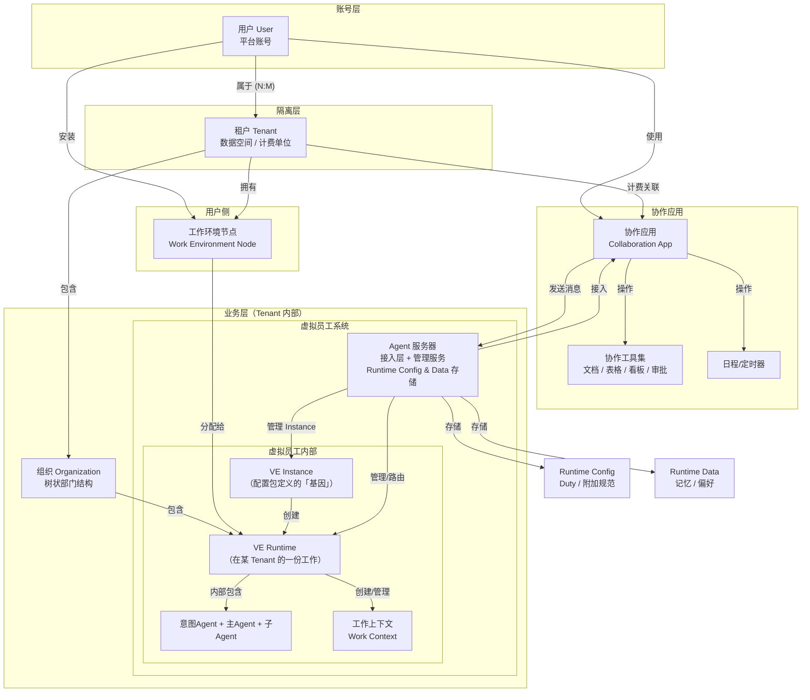
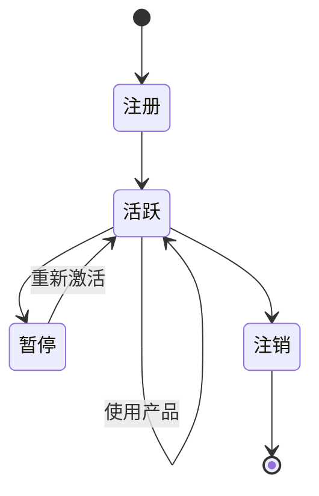
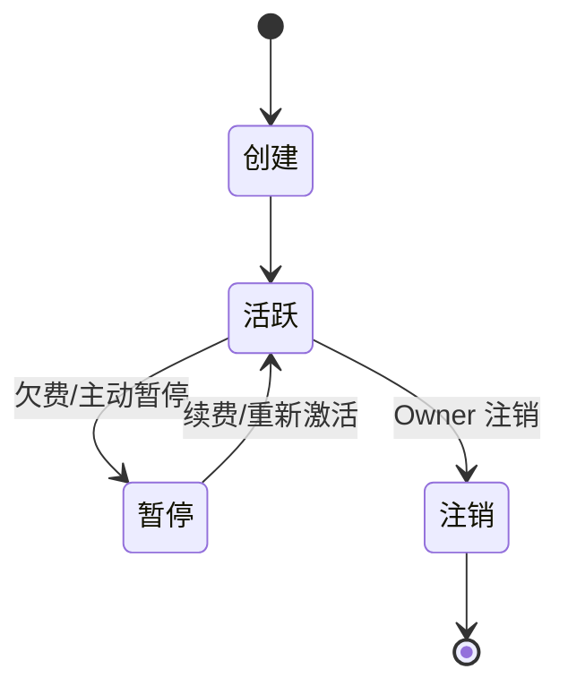
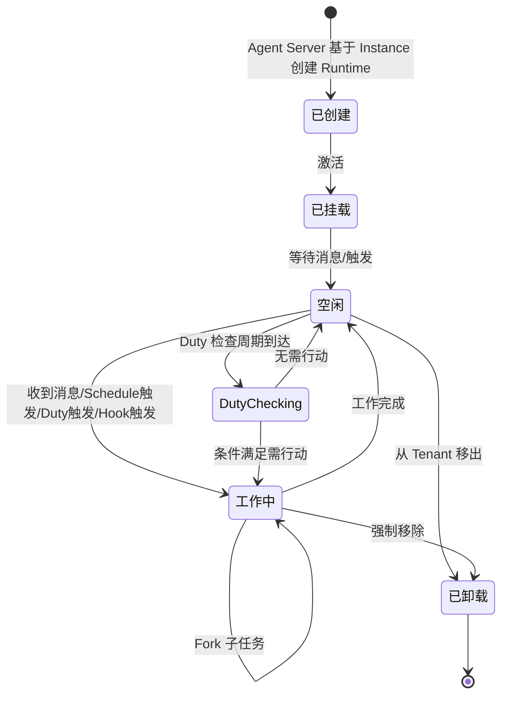

# 核心概念模型

本章定义 Virtual Team 的核心概念及其相互关系，作为后续所有架构设计的基础。每个概念包含定义、关键属性、生命周期和与其他概念的关系。

Virtual Team 的概念分为三个层级：

| 层级 | 职责 | 核心实体 |
|------|------|---------|
| **账号层** | 用户身份与认证 | User |
| **隔离层** | 数据空间边界与计费 | Tenant |
| **业务层** | 虚拟团队的组织与执行 | Organization, VE Instance, VE Runtime, Work Context, Work Environment Node |

## 概念全景

**关键：六层隔离边界**

| 边界 | 说明 |
|------|------|
| User ↔ Tenant | N:M，用户属于哪些数据空间 |
| Tenant ↔ Tenant | 绝对隔离，所有查询通过 `tenant_id` 过滤 |
| VE Instance ↔ VE Runtime | 1:N，一个"人"的多份"工作" |
| Runtime ↔ Runtime | 同一 Instance 在不同 Tenant 的 Runtime 互不干扰 |
| Organization ↔ Organization | Tenant 内部门划分，可跨组织协作 |
| 配置包 ↔ 运行时 | 静态基因 vs 动态成长，互不覆盖 |

## 设计原则：静态与动态

贯穿整个系统的核心设计原则——区分"基因"与"工作"。这个概念在理解 VE Instance 和 VE Runtime 的关系时尤为重要：

| 维度 | 静态（配置包） | 动态（运行时） |
|------|--------------|--------------|
| 是什么 | VE Instance 的"基因" | VE 在某 Tenant 的"一份工作" |
| 包含 | 名称、性格、原始技能、Prompt 模板、Hook 点定义 | 岗位职责(Duty)、附加规范、Schedule/Timer、记忆 |
| 范围 | 一份配置包 = 一个可复用的"人" | 一个 Tenant = 一份独立工作 |
| 存储 | 文件资产，版本控制 | Agent Server 持久化 |
| 变更 | 配置包版本升级 | 随工作逐步积累和调整 |

> 这份原则贯穿后续所有设计：配置包只管"基因"，Runtime Config/Data 管"成长"，二者互不覆盖。

## 概念定义

### 用户 (User)

Virtual Team 平台上的**个人账号**。User 代表一个真实的人，拥有登录凭据和个人信息。

**关键属性**：

| 属性 | 说明 |
|------|------|
| User ID | 平台唯一标识 |
| 邮箱 | 登录凭据，平台唯一 |
| 显示名称 | 个人显示名称 |
| 认证方式 | JWT（协作应用） |
| 所属 Tenant 列表 | N:M 关系，每个关联包含角色（owner/admin/member） |

**User vs Tenant**：

| 维度 | User | Tenant |
|------|------|--------|
| 是什么 | 个人账号 | 数据空间 |
| 数量关系 | 一个人一个账号 | 一个用户可以属于多个 |
| 包含什么 | 登录信息、个人偏好 | VE Runtime、组织、消息、工作上下文 |
| 类比 | 你的 GitHub 账号 | GitHub 个人空间 / GitHub Org |

**生命周期**：

**v1 vs 远期**：
- **v1**：用户注册时自动创建个人 Tenant，User:Tenant = 1:1，用户无感知
- **远期**：用户可以创建/加入多个 Tenant（个人空间 + 企业空间），在协作应用中切换

### 租户 (Tenant)

Virtual Team 的**数据隔离与计费单位**。所有业务数据（组织、虚拟员工 Runtime、消息、工作上下文）都归属到一个 Tenant 之下。

**关键属性**：

| 属性 | 说明 |
|------|------|
| Tenant ID | 所有业务数据的隔离键 |
| 名称 | Tenant 显示名称（个人空间用用户名，企业空间用企业名） |
| 计划 | free / pro / team / enterprise |
| 计费邮箱 | 账单接收邮箱 |
| 成员 | 有权访问该 Tenant 的 User 列表及其角色 |

**生命周期**：

**与 User 的关系**：N:M。User 通过 `user_tenants` 关联表关联到 Tenant，每次登录后选择一个活跃 Tenant，协作应用中展示该 Tenant 下的所有内容。切换 Tenant 类似于 Slack 切换 Workspace。

**设计意图**：Tenant 是平台架构中最核心的隔离边界。它不仅隔离数据，还是计费、资源配额、安全策略的应用单位。

### 组织 (Organization)

Tenant **内部**的虚拟团队部门结构。呈**树状结构**（组织下可嵌套子组织），用于划分虚拟员工的归属和协作范围。

**重要区分**：

| 概念 | 含义 | 类比 |
|------|------|------|
| **Tenant** | 数据空间边界、计费单位 | 一家公司或一个个人空间 |
| **Organization（虚拟团队组织）** | Tenant 内部的部门树 | 公司里的"销售部""研发部" |

一个 Tenant 包含一个组织树。Tree root 是该 Tenant 下的默认顶级组织。

**关键属性**：

| 属性 | 说明 |
|------|------|
| 组织 ID | 全局唯一标识 |
| Tenant ID | 归属的租户 |
| 父组织 ID | 树状结构的父节点引用 |
| 名称与描述 | 用户可见的组织信息 |
| 元数据 | 业务领域标签、典型任务类型（系统自动维护） |
| 成员 | 该组织内的 VE Runtime 及其角色（Leader/Member） |

**设计意图**：用于 Tenant 内部数据和资源的逻辑划分。大多数简单场景下用户感知不到组织的存在——系统自动维护默认组织。

### 虚拟员工 Instance (VE Instance)

由**配置包**定义的、可复用的 Agent 实体。一份配置包创建一个 VE Instance，映射为现实世界的"一个人"——拥有名字、性格、技能和基础能力。

VE Instance 是**静态概念**，只存在于 Agent Server 的全局注册表中。它不直接与任何 Tenant 交互——通过创建 Runtime 来"工作"。

**类比**：一个真实的人——有名字、性格、专业技能。这个人可以为多家公司工作，在每家公司有不同的岗位和职责。

**关键属性**：

| 属性 | 说明 |
|------|------|
| Instance ID | 全局唯一标识（`ve_` 前缀） |
| 配置包引用 | 定义"基因"：名称、性格、Prompt 模板、原始技能 |
| 配置包版本 | 锁定的版本号（SemVer） |
| Hook 点 | 配置包声明的可扩展点列表 |
| 预注册 Hook | 配置包预设的事件响应 |
| 所属 Runtime 列表 | 当前活跃的 Runtime（跨不同 Tenant） |

**配置包定义的内容（静态基因）**：

| 内容 | 说明 |
|------|------|
| 身份定义 | 名称、性格、沟通风格、基础 Prompt |
| 技能声明 | 原始能力列表 |
| 内部策略 | 执行策略配置、模型选择偏好 |
| Hook 点定义 | VE 内部支持的扩展点（如 before_turn、after_tool_call） |
| 预注册 Hook | 默认的事件响应（如"当收到新建任务消息时"） |

### 虚拟员工 Runtime (VE Runtime)

VE Instance 在**一个 Tenant 中**的"一份工作"。Runtime 是动态概念，包含该 Tenant 特有的岗位要求、行为规范、工作记忆和调度安排。

VE Instance 加入一个 Tenant → Agent Server 创建 Runtime → Runtime 绑定该 Tenant 内的组织和 WEN。

**类比**：一个人在一家公司就职——有岗位说明书、汇报关系、积累的工作经验。

**关键属性**：

| 属性 | 说明 |
|------|------|
| Runtime ID | 全局唯一标识（`ver_` 前缀） |
| Instance ID | 归属的 VE Instance |
| Tenant ID | 服务的 Tenant |
| 组织 ID | 归属的组织 |
| 运行时配置 | Duty、附加 Prompt、行为规范 |
| 运行时数据 | 记忆、用户偏好学习、工作历史 |
| WEN 绑定 | 分配的工作环境节点 |
| 在线状态 | online / offline / busy / away |

**Runtime 独有的内容（动态成长）**：

| 类别 | 内容 | 性质 |
|------|------|------|
| Runtime Config | Duty（岗位职责）、附加 Prompt、行为规范、特殊要求 | 确定性、声明式 |
| Runtime Data | 记忆（用户偏好、历史决策）、工作默契 | 累积性、模糊性 |
| Schedule/Timer | VE 自驱动的日程和定时提醒 | 通过协作应用工具管理 |

**VE Instance vs VE Runtime**：

| 维度 | VE Instance | VE Runtime |
|------|------------|------------|
| 是什么 | 配置包定义的"人" | 在某 Tenant 的"一份工作" |
| 数量 | 一份配置包 = 一个 Instance | 一个 Instance → N 个 Tenant = N 个 Runtime |
| 隔离 | 全局唯一 | Runtime 之间绝对隔离（不同 Tenant） |
| 存储 | Agent Server 全局注册表 | Agent Server 按 `(instance_id, tenant_id)` 存储 |
| 静态/动态 | 静态（配置包版本化） | 动态（运行中积累和调整） |
| 复用性 | 上架到市场，多个用户安装 | 仅服务于一个 Tenant |

**内部 Agent 构成**：

| 内部 Agent | 模型 | 职责 |
|-----------|------|------|
| 意图识别 Agent | 低成本模型 | 分析消息意图，路由决策 |
| 主 Agent | 主力模型 | 实际执行工作，管理工作上下文 |
| 子 Agent | 配置覆盖 | 主 Agent 动态创建，处理子任务 |

**生命周期**：

**工作启动方式**：

| 启动方式 | 说明 | 驱动来源 | 详细章节 |
|---------|------|---------|---------|
| 消息触发 | 收到用户消息后被动启动 | 用户 | [消息与工作上下文](./06-message-and-work-context.md) |
| Schedule 触发 | 定时时间到达后启动 | VE 自驱动或外驱动 | [日程与定时器](./04-collaboration-app/collaboration-tools/schedule-and-timer.md) |
| Duty 触发 | 职责检查周期到达后评估 | VE 自驱动 | [Runtime 配置与数据](./08-vte-agent-internals/runtime-config-and-data.md) |
| Hook 触发 | 事件匹配后启动 | 外部/内部事件 | [配置包规范](./08-vte-agent-internals/config-package.md) |

### 助理 (Assistant)

一种**特殊的虚拟员工**，没有底层架构特权。其不同之处仅在于配置包：

| 差异维度 | 普通虚拟员工 | 助理 |
|---------|------------|------|
| 角色定位 | 领域执行者 | 全局协调者 |
| System Prompt | 专业领域 prompt | 管理型 prompt（任务分析、路由、汇总） |
| 可用工具 | 领域工具 | 组织管理工具 + 跨 VE 通讯工具 |
| 模型 | 按岗位选择 | 通常使用更强模型 |
| 视野范围 | 所在组织和相关工作 | 当前 Tenant 内全局 |

用户首次创建 Tenant 时自动获得一个基本助理。

### 工作上下文 (Work Context)

虚拟员工 Runtime 处理一项具体工作任务时的**独立工作空间**。它是面向 VE Runtime 的高阶 Session 封装。

**关键属性**：

| 属性 | 说明 |
|------|------|
| 上下文 ID | 全局唯一标识 |
| Tenant ID | 归属的租户 |
| Runtime ID | 归属的 VE Runtime |
| 启动方式 | `message` / `schedule` / `duty` / `hook` |
| 状态 | 新建 / 活跃 / 暂停 / Fork / 归档 |
| VTA Session 列表 | 底层的一个或多个 VTA Session |

**操作**：

| 操作 | 说明 | 类比 |
|------|------|------|
| **New** | 创建全新工作上下文 | 打开新对话 |
| **Fork** | 从已有工作的检查点分叉 | Git branch |
| **Resume** | 恢复已有工作上下文继续 | 重新打开对话 |

### 工作环境节点 (Work Environment Node)

虚拟员工执行操作的物理/虚拟环境。它将"执行能力"从"推理能力"中分离。

**关键属性**：

| 属性 | 说明 |
|------|------|
| 节点 ID | 全局唯一标识 |
| Tenant ID | 归属的租户 |
| 节点类型 | local（用户设备）/ cloud（平台托管） |
| 能力声明 | MCP Server 列表、内置工具、第三方 Agent |
| 在线状态 | online / offline / degraded |

### 协作应用 (Collaboration App)

用户的交互入口。以类 Slack/飞书的形态呈现，是 Virtual Team 中用户唯一直接使用的界面。

**双重身份**：

| 模式 | 说明 |
|------|------|
| **独立 IM 系统** | 即使未挂载虚拟员工系统，仍然可以作为纯粹的即时通讯协作工具运行 |
| **VE 接入平台** | 虚拟员工挂载后，作为用户与虚拟员工交互的桥梁 |

**Tenant 切换**：协作应用支持用户在所属于的多个 Tenant 之间切换，类似 Slack 切换 Workspace。切换后界面展示的频道、联系人、组织树、消息历史、日程等全部切换到新 Tenant。

**核心模块**：
- IM 通讯（WebSocket 实时通道 + HTTPS REST）
- 协作工具（文档、表格、看板、审批流）
- 日程/定时器（Schedule/Timer，用户可查看和管理 VE 的日程）
- 组织管理（组织 CRUD、VE 管理）
- 上下文增强（消息标记、RAG 预处理）
- Tenant 切换（空间选择器）

### Agent 服务器 (Agent Server)

虚拟员工系统的服务端，管理 VE Instance 和 Runtime 的生命周期。

| 组件 | 职责 |
|------|------|
| **接入层** | 对接协作应用，协议转换，消息收发 |
| **VE Instance 管理** | Instance 注册表、配置包加载与版本管理 |
| **VE Runtime 管理** | Runtime 生命周期、多租户路由、冷热调度 |
| **Runtime Config & Data** | 运行时配置（Duty/附加规范）和数据（记忆/偏好）的存储与查询 |
| **Schedule Manager** | cron 引擎，管理 Runtime 的定时触发 |

Agent 服务器不直接执行 Agent 推理——推理由 VTA Runtime 在 VE 实例中完成。Agent 服务器关注的是编排层问题。

## 概念关系矩阵

|  | User | Tenant | VE Instance | VE Runtime | Org | Work Context | WEN | Collab App | Agent Svr |
|--|------|--------|------------|-----------|-----|-------------|-----|-----------|----------|
| **User** | — | 属于 N:M | 通过 Tenant | 通过 Tenant | 通过 Tenant | 通过 Tenant/Runtime | 安装 | 使用 | 不可见 |
| **Tenant** | 包含成员 | — | 通过 Runtime | 包含 | 包含 | 包含 | 拥有 | 计费关联 | 隔离边界 |
| **VE Instance** | 不可见 | 通过 Runtime | — | 1:N | 通过 Runtime | 通过 Runtime | 通过 Runtime | 不可见 | 被管理 |
| **VE Runtime** | 通过 Tenant | 归属 | 归属 | — | 归属 | 创建/管理 | 分配使用 | 作为联系人 | 被管理 |
| **Organization** | 通过 Tenant | 归属 | 不可见 | 包含 | — | 关联 | 不可见 | 展示 | 路由依据 |
| **Work Context** | 不可见 | 归属 | 不可见 | 管理 | 关联 | — | 绑定 | 标记来源 | 持久化 |
| **WEN** | 安装 | 归属 | 不可见 | 被分配 | 不可见 | 承载执行 | — | 不可见 | 调度中转 |
| **Collab App** | 交互入口 | Tenant 展示 | 不可见 | 通讯桥梁 | 管理界面 | 标记管理 | 不可见 | — | 协议对接 |
| **Agent Svr** | 不可见 | 隔离执行 | 管理 | 生命周期 | 路由依据 | 持久化 | 调度 | 协议对接 | — |

## 命名与 ID 规范

| 实体 | ID 前缀 | 示例 |
|------|--------|------|
| User | `u_` | `u_3fa2b1c4` |
| Tenant | `tn_` | `tn_personal_3fa2b1c4` |
| VE Instance | `ve_` | `ve_sales_analyst` |
| VE Runtime | `ver_` | `ver_3fa2b1c4` |
| Organization | `org_` | `org_sales_dept` |
| Work Context | `wc_` | `wc_q2_analysis` |
| Work Environment Node | `wen_` | `wen_user01_laptop` |
| Channel | `ch_` | `ch_general` |
| Message | `msg_` | `msg_3fa2b1c4` |
| VTA Session | `sess_` | `sess_abc123` |
| Schedule Entry | `sch_` | `sch_weekly_report` |
| Approval | `appr_` | `appr_xyz789` |
| Config Package | `pkg_` | `pkg_sales_analyst_v1` |
