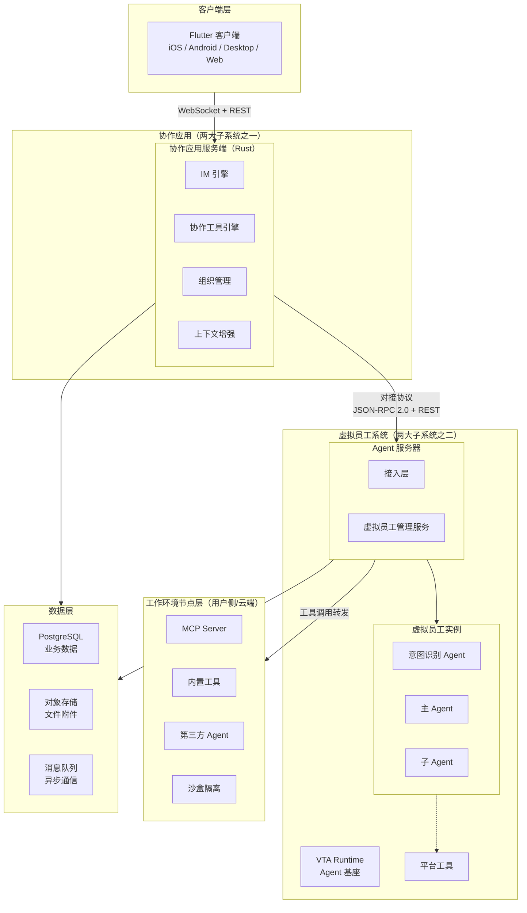
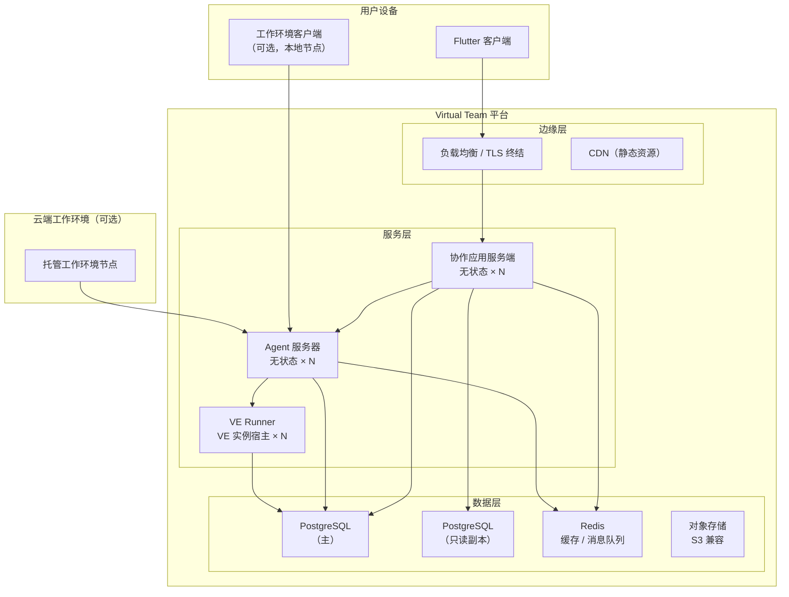
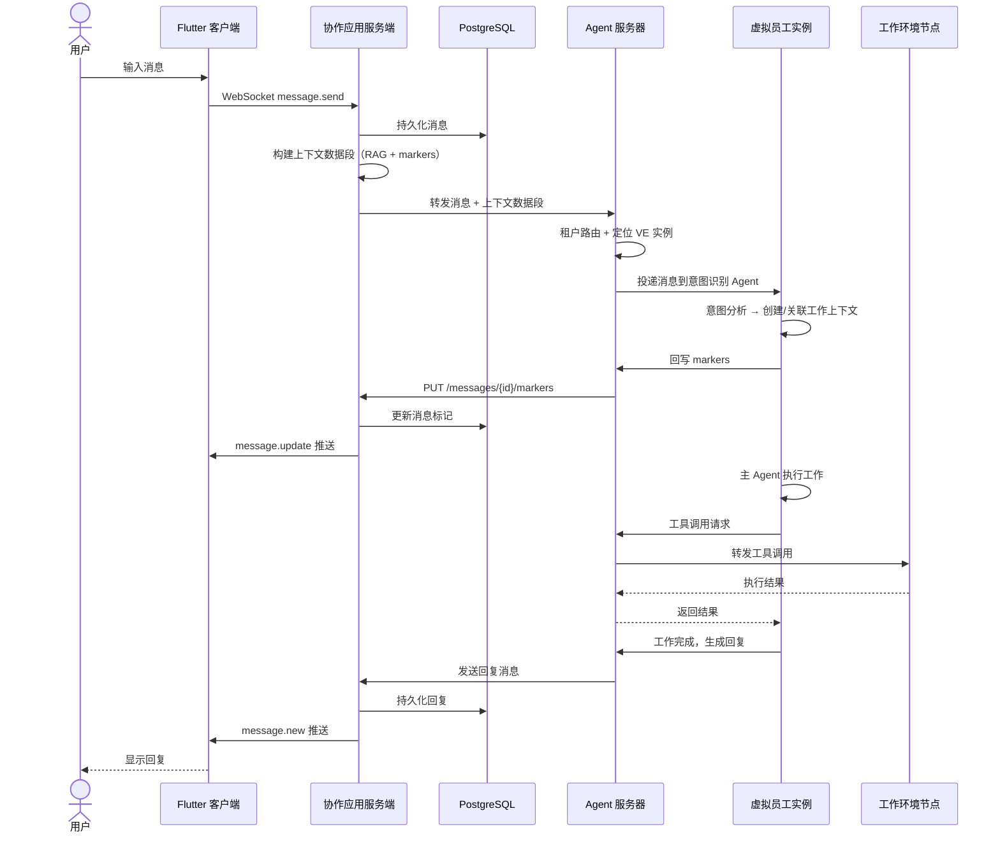
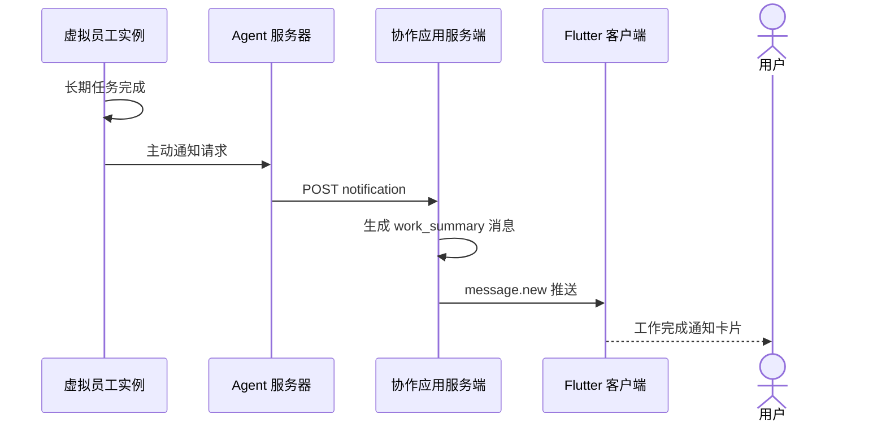
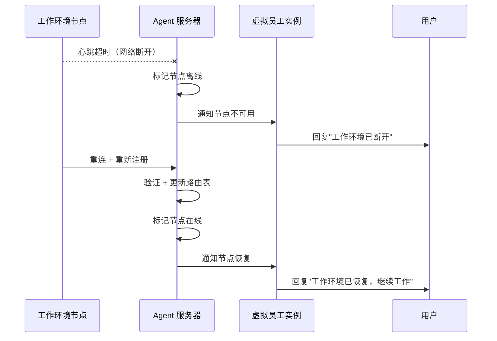

# 系统总体架构

## 宏观分层

Virtual Team 系统分为两大子系统、五个逻辑层：



## 技术栈

### 技术选型及理由

| 组件 | 技术 | 理由 |
|------|------|------|
| 协作应用客户端 | **Flutter** | 跨平台单代码库（iOS/Android/Desktop/Web）；富 UI 表现力（Block-based 消息渲染、协作工具）；成熟的 WebSocket 和状态管理生态 |
| 协作应用服务端 | **Rust** (tokio, axum) | 高性能异步 IO；内存安全；与 VTA 技术栈一致减少认知负担；tokio 异步生态成熟（WebSocket、gRPC） |
| VTA Agent Runtime | **Rust** | 与协作应用服务端一致；零成本抽象适合 Agent 推理循环的性能敏感路径；trait 系统天然适合 Agent 组件的可替换设计 |
| 数据存储 | **PostgreSQL** | 成熟的事务支持；JSONB 适合消息和配置的灵活存储；全文搜索能力；丰富的扩展生态 |
| 对象存储 | **S3 兼容**（MinIO/AWS S3） | 文件附件和配置包存储；标准化接口便于部署迁移 |
| 消息队列 | **Redis Streams / NATS** | Agent 服务器与 VE 实例间异步通信；冷热分离的事件驱动 |

### 技术栈一致性

服务端统一使用 Rust：协作应用服务端、Agent 服务器、VTA Runtime 共享同一技术栈，降低运维复杂度和团队认知负担。只有客户端使用 Flutter（跨平台 UI 的唯一合理选择）。

## 部署拓扑

### 逻辑部署视图



### 扩展策略

| 组件 | 扩展方式 | 扩展触发条件 |
|------|---------|------------|
| 协作应用服务端 | 水平扩展（无状态） | CPU / 连接数 |
| Agent 服务器 | 水平扩展（无状态） | 消息吞吐量 |
| VE Runner | 垂直 + 水平扩展 | 活跃 VE 数 × 每 VE 内存占用 |
| PostgreSQL | 读写分离（主 + 副本） | 查询负载 |
| Redis | 集群分片 | 内存 / 吞吐量 |

## 关键数据流

### 场景一：用户发送消息到虚拟员工回复



### 场景二：虚拟员工主动通知



### 场景三：工作环境节点离线恢复



## 故障域与降级策略

| 故障场景 | 影响范围 | 降级行为 |
|---------|---------|---------|
| 协作应用服务端宕机 | 用户无法收发消息 | 其他节点承载，FE 自动重连 |
| Agent 服务器宕机 | 虚拟员工不可用 | VE 在协作应用中显示为离线，协作应用 IM 功能正常 |
| VE Runner 宕机 | 该节点上的 VE 不可用 | 管理服务检测心跳超时，在其他 Runner 上恢复冷实例 |
| 工作环境节点离线 | 该节点的 VE 远程工具不可用 | VE 告知用户，平台工具仍可用 |
| PostgreSQL 主库宕机 | 写入不可用 | 读操作切换至副本，写操作等待主库恢复或 failover |
| LLM API 不可用 | Agent 推理中断 | 指数退避重试，超时后通知用户"服务暂时不可用" |

## 配置管理

### 配置层级

```
平台级配置（环境变量 / 配置中心）
  ├── 协作应用服务端配置
  ├── Agent 服务器配置
  ├── VTA Runtime 默认配置
  └── 租户级配置
       ├── 用户偏好（语言、通知、默认模型）
       ├── 组织级策略（权限模板、审批规则）
       └── 虚拟员工配置包（角色、工具、权限）
```

### 配置包版本锁定

虚拟员工创建时锁定配置包的精确版本（SemVer），不自动升级。用户在协作应用中看到可用更新提示，手动确认后触发升级。升级前系统自动对比新旧版本权限变化，新增的权限需求需用户明确确认。
