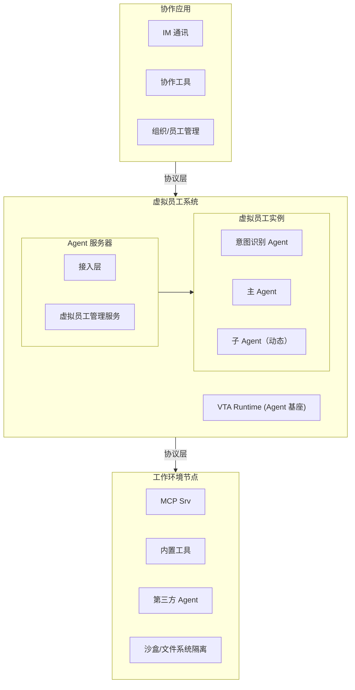
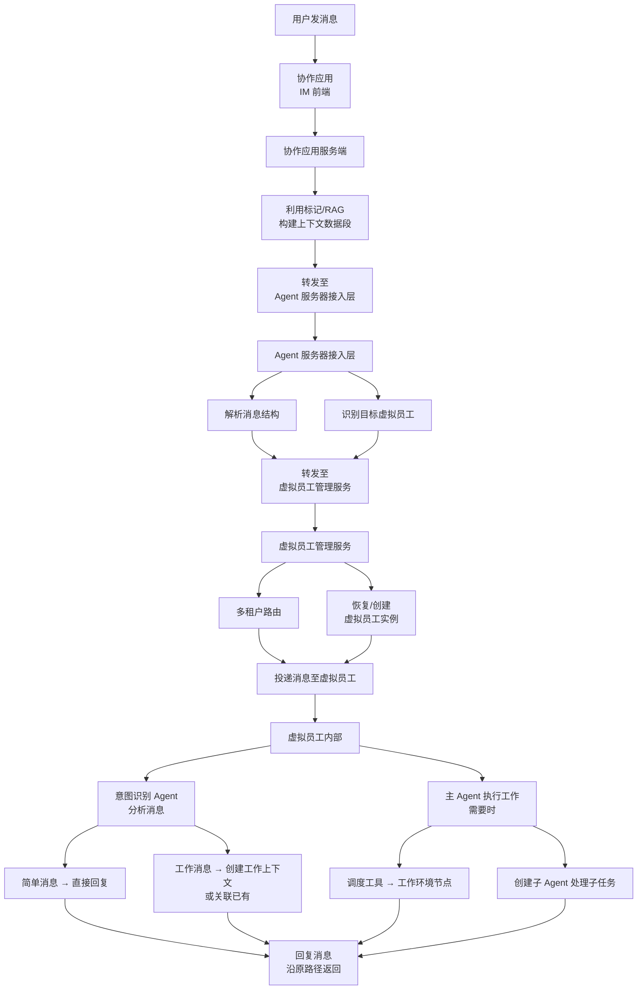

# 系统总体架构

## 宏观分层

Virtual Team 系统分为两大子系统：

## 子系统关系

### 协作应用 vs 虚拟员工系统

协作应用是**独立系统**，即使未挂载虚拟员工系统，它仍然可以作为纯粹的即时通讯协作工具运行。虚拟员工系统挂载后，用户才能与虚拟员工通讯——正如真实员工未注册登录时也无法与之对话。

虚拟员工不是协作应用的"内置功能"，而是通过协议**接入**协作应用的外部实体，与用户通过 IM 客户端接入的方式平行。

### 消息流转整体路径

## 关键设计决策

| 决策 | 方案 | 理由 |
|------|------|------|
| 两大子系统分离 | 协作应用 + 虚拟员工系统独立 | 降低耦合，协作应用可独立迭代，虚拟员工系统可独立扩展 |
| 虚拟员工系统内部两层结构 | 接入层 + 管理服务 | 接入层处理协议、管理服务处理生命周期和租户隔离 |
| Agent 基座 | VTA (virtual-teams-agent) | Pure Agent 骨架，零预设，配置包驱动 |
| 虚拟员工内部多 Agent 并行 | 意图 Agent + 主 Agent 独立并行 | 职责清晰，意图识别不阻塞主 Agent 工作 |
| 工具执行远程化 | 工作环境节点 | 适应客户本地环境和云端环境，保持灵活性和安全边界 |
| 多租户隔离 | 租户 = 用户级别 | 一个用户 = 一个独立数据空间 |
