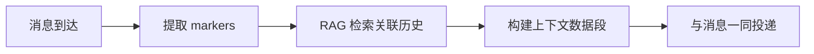

# 协作应用

## 定位

协作应用是 Virtual Team 的**用户入口**。它以类 Slack/飞书的企业协作应用形态呈现，是用户管理虚拟团队和与虚拟员工交互的唯一界面。

核心定位：

- **无虚拟员工时**：一个纯粹的即时通讯协作工具
- **虚拟员工接入后**：用户与虚拟员工通讯的桥梁

## 技术栈

| 层 | 技术 | 理由 |
|---|------|------|
| **客户端** | Flutter | 跨平台（iOS/Android/Desktop/Web），单代码库，富 UI 表现力 |
| **服务端** | Rust | 高性能、内存安全、与 VTA 技术栈一致，tokio 异步生态成熟 |

## IM 架构

Virtual Team 的协作应用是一个完整的即时通讯系统，需要独立设计其 IM 架构而非仅"对接层"。

### 传输协议

```
客户端 ←→ WebSocket ←→ 协作应用服务端
客户端 ←→ HTTPS REST ←→ 协作应用服务端
```

- **WebSocket**：承载实时消息推送、状态同步（在线/离线、正在输入）、事件通知。采用业界共识方案——参考 Slack/Discord/Mattermost 均使用 WebSocket 作为实时通道
- **HTTPS REST**：承载历史消息拉取、文件上传、配置管理等非实时操作

选择 WebSocket 的理由：
- 全双工，服务端可主动推送（新消息、虚拟员工在线状态变化、工作完成通知）
- 相比 SSE 更适合多路复用场景（一个连接承载多种事件类型）
- 相比 gRPC stream 更易于跨平台（Flutter Web 兼容性）
- 与 VTA 内部使用的 JSON-RPC 2.0 over WebSocket 协议栈一致

### 消息模型

协作应用层消息结构，在传统 IM 字段基础上扩展 Virtual Team 标记：

```json
{
  "id": "msg_xxx",
  "channel_id": "ch_xxx",
  "sender": {
    "type": "user | virtual_employee",
    "id": "u_xxx",
    "display_name": "Chongyi"
  },
  "content": {
    "type": "text | rich_text | file | system | approval_card | work_summary",
    "body": "...",
    "blocks": [...]
  },
  "thread_id": null,
  "reply_count": 0,
  "reactions": [...],
  "markers": {
    "work_context_id": "wc_xxx",
    "intent": "new_task",
    "related_message_ids": ["msg_yyy"]
  },
  "timestamp": 1714608000,
  "sequence": 12345,
  "edited_at": null
}
```

关键设计点：

- **Block-based 富文本**：参考 Slack Block Kit，使用结构化 JSON 块定义消息布局。相比 HTML 更安全（无 XSS）、跨端渲染一致
- **`markers` 扩展字段**：Virtual Team 特有，承载工作上下文关联和意图标记。这些字段不由用户填写，由意图识别 Agent 通过 API 回写
- **`sequence` 服务端分配**：单调递增的频道内消息序号，用于排序和多端同步。参考 Mattermost 方案
- **Thread** 通过 `thread_id` 指向父消息，保持频道内扁平存储。参考 Slack 的 parent-pointer 模式

### 频道与消息传播模型

```
协作应用
├── 1:1 私聊（用户 ↔ 虚拟员工）
├── 1:1 私聊（用户 ↔ 用户）
├── 群组聊天（多用户 + 多虚拟员工）
└── 频道（持久化话题空间）
```

虚拟员工作为**联系人**出现在通讯录中，可以被拉入群组或频道。从 IM 架构视角看，虚拟员工与真人用户是同一层级的消息接收者——消息路由时只需区分 `sender.type`，不需要特殊的"bot 通道"。

消息传播模式：
- **1:1**：点对点，消息仅对两端可见
- **1:N**：群组内广播，所有成员可见
- **N:N**：频道内广播，频道成员可见

虚拟员工仅需知道消息来自谁、在什么上下文中、内容是什么。复杂的意图分析在其内部处理，协作应用只负责准确投递。

### 多端同步

- **服务端分配 `sequence`**：每个频道内消息有单调递增的序列号，保证所有客户端看到一致的顺序
- **独立 WebSocket 连接**：每个客户端设备维护自己的 WebSocket 连接，服务端向所有在线设备广播事件
- **已读状态**：服务端维护每个用户在每频道的 `last_read_sequence`，计算未读数
- **重连恢复**：客户端断开后重连时，发送 `last_sequence` 请求服务端重放缺少的事件。参考 Mattermost 的 replay-from-sequence 模式

## 协作工具集

协作工具是工作产出和详细内容的载体。虚拟员工的详细工作过程和大型交付内容不是事无巨细地输出到聊天框，而是通过协作工具展示——正如现实中工作沟通在聊天框，产物在文档/表格中：

- 文档/知识库（富文本协同编辑）
- 多维表格（Bitable：电子表格 + 数据库，参考飞书）
- 任务看板（卡片 + 列表 + 拖拽）
- 审批流（表单 + 流程引擎）
- 自定义协作组件

### 与 IM 的关系

飞书的"文档中心化"相比 Slack 的"消息中心化"更符合 Virtual Team 的场景：虚拟员工的详细工作产物应当是可持久化、可协同编辑、可独立引用的文档/表格，而非淹没在聊天流中。

实现上：
- 协作文档可**内联渲染**在聊天框中（内容预览卡片）
- 聊天消息可**引用**协作文档的特定段落或表格行
- 协作工具的数据与 IM 消息共享统一搜索索引

## 扩展与插件机制

### 第一阶段（当前规划）

不实现完整插件系统，但做以下基础设施以降低未来引入成本：

1. **协作工具扩展点**：协作工具集设计为可注册的接口而非硬编码列表。每种协作工具实现统一 trait：

```rust
trait CollaborationTool {
    fn tool_type(&self) -> &str;
    fn render_config(&self) -> RenderConfig;
    fn handle_action(&self, action: ToolAction) -> ToolResult;
}
```

2. **消息渲染扩展**：消息 `content.type` 支持自定义类型。客户端渲染时，未知类型降级为纯文本展示
3. **虚拟员工操作 API**：协作应用提供的 API 通过明确的接口定义（类似 MCP 的 tool description 模式），而非直接暴露内部实现

### 远期插件系统

参考 Mattermost 的插件架构（Go hooks + UI 注入）和 Slack App 的权限声明模型：

- **服务端插件**：通过 trait 注册生命周期钩子（消息发送前、协作工具操作后等），在 Rust 编译期或动态加载
- **客户端插件**：Flutter 端的 UI 组件注入（协作工具面板扩展、消息渲染扩展）
- **权限声明**：每个插件在 manifest 中声明所需权限，安装时需用户确认

第一阶段的 `CollaborationTool` trait 和消息类型扩展机制，为远期插件系统提供了自然的接入点——插件开发者只需实现已有 trait，无需重构核心架构。

## 组织管理

用户通过应用创建和管理组织架构：

- 创建/删除/修改组织（树状嵌套）
- 虚拟员工的创建、配置、分配
- 频道和群组的组织归属

详见 [租户与组织模型](./10-tenant-and-org-model.md)。

## 虚拟员工接入管理

用户管理哪些虚拟员工可以接入其账户：

- 浏览和选择虚拟员工（内置市场 + 第三方）
- 配置虚拟员工的工作环境节点
- 设置虚拟员工的权限边界

## 消息的上下文增强

协作应用不只是消息的"搬运工"，它还为虚拟员工提供**上下文增强**能力，减少 token 消耗和分析复杂度。

### 消息标记

消息结构中的 `markers` 字段承载扩展标记：

- `work_context_id`：关联的工作上下文
- `intent`：意图分类（由意图识别 Agent 回写）
- `related_message_ids`：关联消息指针

当意图识别 Agent 确认某条消息与特定工作上下文相关后，通过上层 API 通知协作应用写入标记。后续拉取消息记录时可快速过滤关联消息。

### 前置上下文构建

协作应用在转发消息到虚拟员工时，基于已有标记和 RAG 机制预先构建精简的上下文数据段，随消息一同发送给意图识别 Agent：



这避免了 Agent 反复通过 tool call 搜索历史消息，显著减少 token 和带宽消耗。

## 与虚拟员工系统的关系

协作应用与虚拟员工系统之间通过**协议层**对接：

- 协作应用不直接调用 VTA API
- 虚拟员工通过协议层作为一个"外部客户端"接入
- 消息收发、状态同步、事件推送均通过协议承载

协议层详见 [协议与集成](./11-protocol-and-integration.md)。
