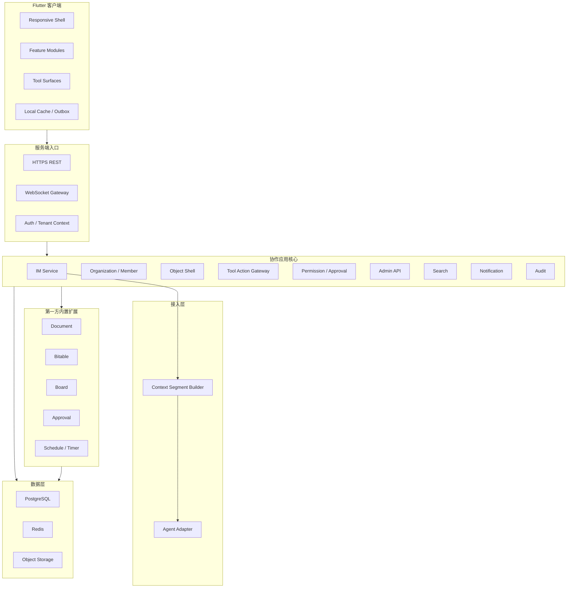

# 协作应用架构

## 定位

协作应用是一个**独立的即时通讯与协作系统**。即使不接入虚拟员工系统，它也可以作为完整的 IM 与协作工具应用运行。虚拟员工系统通过协议层接入协作应用，在用户面前表现为联系人、频道成员和协作对象操作者。

本页是协作应用架构入口，负责说明总体分层和关键边界；可实施的技术细节见[技术方案冻结包](./technical-design/overview.md)。

## 架构原则

- **独立运行**：Agent Server 不可用时，登录、组织、频道、消息、搜索和基础协作工具仍然可用。
- **多端一致**：Flutter 客户端采用单代码库，协议、模型、状态、缓存和同步逻辑共享，平台能力通过适配层处理。
- **消息与工具分工**：聊天框用于沟通、确认和交付说明；大型工作产物沉淀在文档、表格、看板、审批和日程等协作工具中。
- **核心与扩展分离**：协作应用核心管理对象壳、权限、审计、搜索、通知和 IM 引用；具体工具作为第一方内置扩展接入。
- **协议优先**：用户、系统任务和 VE 调用工具都通过结构化 Tool Action，不直接操作数据库，也不以 UI 自动化作为主路径。

## 技术栈

| 层 | 技术 | 理由 |
|---|------|------|
| **客户端** | Flutter 3.x | 跨 Mobile、Desktop、Web 的单代码库，富 UI 表现力，WebSocket 生态成熟 |
| **管理端** | Vite + React + React Router 7 + Tailwind CSS + shadcn/ui + Zustand | 独立 Web 平台全后台，适合密集表格、配置、审计和内部运营 |
| **服务端** | Rust (tokio, axum) | 高性能异步 IO，内存安全，与 VTA 相关服务技术栈一致 |
| **数据库** | PostgreSQL 15+ | 消息、组织、对象壳、扩展数据、审计和 JSONB 结构化数据 |
| **缓存/队列** | Redis 7+ | 在线状态、短期缓存、速率限制、事件 fanout 或轻量任务队列 |
| **对象存储** | S3 兼容 | 文件附件、图片、导出文件和缩略图 |
| **搜索** | PostgreSQL 全文搜索起步，远期可迁移专用搜索服务 | 降低基础版运维复杂度，同时保留扩展空间 |

## 总体分层



## 技术方案章节

| 章节 | 内容 |
|------|------|
| [技术方案总览](./technical-design/overview.md) | 基础版边界、文档分工、冻结验收口径 |
| [客户端架构](./technical-design/client-architecture.md) | Flutter 多端分层、平台能力适配、离线缓存、Tool Surface |
| [服务端架构](./technical-design/server-architecture.md) | 服务端模块、内部事件、Agent 接入和部署边界 |
| [技术选型与配套设施](./technical-design/technology-selection.md) | 外部设施、Rust 库、Flutter 库和 React 管理端库的默认与候选方案 |
| [API 与协议](./technical-design/api-and-protocol.md) | REST、WebSocket、Tool Action / JSON-RPC、同步游标和错误语义 |
| [数据与权限模型](./technical-design/data-and-permission-model.md) | 对象壳、扩展数据、消息、markers、权限、租户隔离和审计 |
| [同步、可靠性与观测](./technical-design/sync-reliability-observability.md) | 断线恢复、幂等、后台任务、降级、日志、指标和告警 |
| [管理端技术方案](./technical-design/admin-console.md) | 独立 Web 管理端、平台全后台、Admin API 和高风险操作治理 |
| [调研结论与设计决策](./technical-design/research-decisions.md) | 调研沉淀进入技术方案的结论摘要 |

## 关键数据流

### 用户发送消息

1. 客户端通过 WebSocket 或 REST 发送消息，并携带 `client_request_id`。
2. 服务端校验租户、频道成员和幂等键。
3. IM Service 持久化消息，分配频道内 `sequence`。
4. Sync Service 生成实时事件并推送给在线设备。
5. Context Segment Builder 异步构建上下文数据段。
6. 如果消息触发虚拟员工，Agent Adapter 将消息和上下文转发给 Agent Server。

Agent Server 不可用时，消息仍然写入频道历史；虚拟员工相关状态进入离线、排队或失败提示。

### 工具动作调用

1. 用户 UI、系统任务或 VE 提交 Tool Action / JSON-RPC。
2. Tool Action Gateway 根据 manifest 找到对应第一方扩展。
3. Permission / Approval 模块执行权限、配额、风险和审批检查。
4. 扩展处理业务动作并返回变更对象。
5. 核心写入审计，调度搜索索引，聚合通知，并通过 WebSocket 推送对象变更。

文档基础版采用轻量 Block/结构化内容和版本乐观锁；多维表格基础版采用类型化数据表。实时协同编辑、公式引擎、多视图和复杂嵌入属于完整形态方向，不是基础版实现承诺。

## 与外部系统的边界

```text
用户客户端
  <-> 协作应用服务端
      <-> Agent Server（消息转发、markers 回写、VE Tool Action）
      <-> 对象存储（文件上传、下载、缩略图、导出）
      <-> 推送服务（移动端、桌面端、Web 通知）
```

协作应用只通过协议与 Agent Server 交互。虚拟员工不能直接访问协作应用数据库，也不能绕过协作应用权限体系读取频道、消息或工具对象。

管理端是独立 Web 应用，通过 `/admin/api/v1` 调用 Admin API。管理端可以进行跨租户平台运营和故障处理，但必须经过 Admin RBAC、Admin Audit 和高风险操作审批，不得作为普通用户端隐藏路由混入协作应用客户端。
