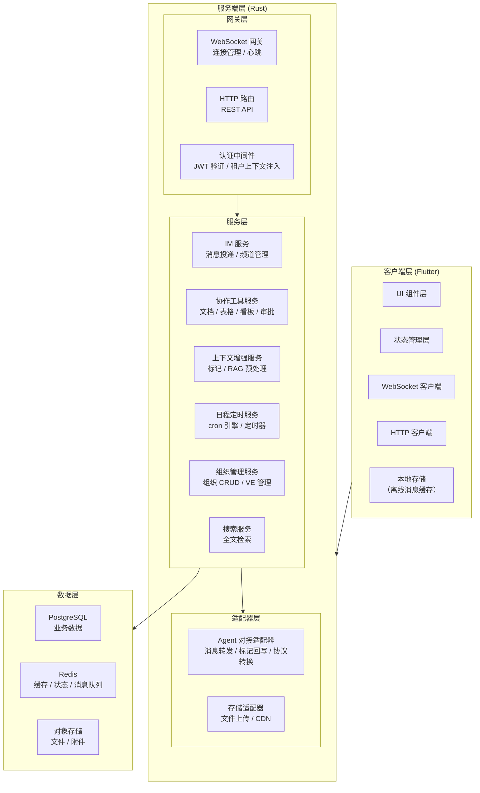
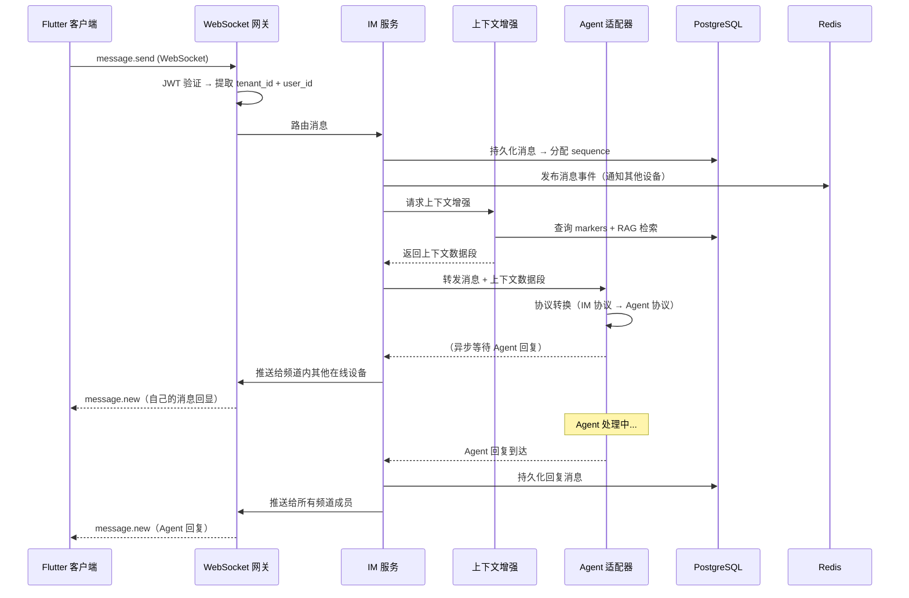

# 协作应用架构

## 定位

协作应用是一个**独立的即时通讯与协作系统**。即使不接入虚拟员工系统，它也可以作为完整的 IM 工具运行。虚拟员工通过协议层"接入"协作应用，在用户面前表现为联系人——就像真人同事一样。

## 技术栈

| 层 | 技术 | 理由 |
|---|------|------|
| **客户端** | Flutter 3.x | 跨平台单代码库（iOS/Android/Desktop/Web），Skia 渲染一致的 UI，成熟的 WebSocket 生态 |
| **服务端** | Rust (tokio, axum) | 高性能异步 IO，内存安全，与 VTA Agent Runtime 共享技术栈降低认知负担 |
| **数据库** | PostgreSQL 15+ | 消息持久化、JSONB 支持灵活的 Block 结构、全文搜索 |
| **缓存** | Redis 7+ | 在线状态、速率限制、消息队列解耦 |
| **对象存储** | S3 兼容 | 文件附件、图片缩略图 |
| **全文搜索** | PostgreSQL 内置 (pg_trgm + tsvector) 或 Elasticsearch（远期） | 统一搜索 IM 消息和协作文档内容 |

## 系统分层



## 服务端架构

### Crate 结构

```
crates/
├── collab-server/             # 服务端主入口
│   ├── main.rs                # 启动、配置加载
│   └── app.rs                 # axum Router 组装、中间件注册
│
├── collab-gateway/            # 网关层
│   ├── ws/
│   │   ├── mod.rs             # WebSocket 连接管理
│   │   ├── handler.rs         # 帧收发、心跳
│   │   ├── session.rs         # 连接会话状态
│   │   └── reconnect.rs       # 重连协议
│   ├── http/
│   │   ├── mod.rs             # REST 路由注册
│   │   └── middleware.rs      # JWT 验证、租户上下文注入、速率限制
│   └── auth.rs                # 认证服务（JWT 签发/验证/刷新）
│
├── collab-im/                 # IM 核心
│   ├── message/
│   │   ├── model.rs           # 消息数据模型
│   │   ├── router.rs          # 消息路由（channel → subscribers）
│   │   └── marker.rs          # 标记读写
│   ├── channel/
│   │   ├── model.rs           # 频道数据模型
│   │   └── membership.rs      # 成员管理
│   ├── presence.rs            # 在线状态管理
│   └── sync.rs                # 多端同步（sequence + replay）
│
├── collab-collaboration/      # 协作工具
│   ├── trait.rs               # CollaborationTool trait 定义
│   ├── registry.rs            # 工具注册表
│   ├── document/
│   │   ├── model.rs           # 文档数据模型
│   │   ├── engine.rs          # 协同编辑引擎（OT/CRDT）
│   │   └── api.rs             # 文档 REST API
│   ├── bitable/
│   │   ├── model.rs           # 多维表格数据模型
│   │   ├── formula.rs         # 公式引擎
│   │   └── api.rs
│   ├── board/
│   │   ├── model.rs
│   │   ├── workflow.rs        # 工作流状态机
│   │   └── api.rs
│   ├── approval/
│   │   ├── model.rs
│   │   ├── engine.rs          # 流程引擎
│   │   └── api.rs
│   └── schedule/
│       ├── model.rs           # Schedule/Timer 数据模型
│       ├── cron.rs            # cron 引擎
│       └── api.rs
│
├── collab-context/            # 上下文增强
│   ├── marker.rs              # 标记管理
│   ├── rag.rs                 # RAG 检索（嵌入生成 + 相似度搜索）
│   └── segment.rs             # 上下文数据段构建
│
├── collab-org/                # 组织管理
│   ├── model.rs               # 组织数据模型
│   ├── ve_management.rs       # VE 接入管理接口
│   └── api.rs
│
├── collab-search/             # 搜索
│   ├── indexer.rs             # 索引构建
│   └── query.rs               # 查询引擎
│
└── collab-agent-adapter/      # Agent 对接
    ├── protocol.rs            # 对接协议实现
    ├── forward.rs             # 消息转发
    ├── writeback.rs           # 标记回写
    └── ve_operations.rs       # VE 操作 API 封装
```

### 数据流：用户发消息到收到回复



### 关键设计决策

| 决策 | 方案 | 理由 |
|------|------|------|
| 消息持久化 | 先写 PostgreSQL 再广播 | 确保消息不丢失（at-least-once） |
| 在线状态 | Redis Hash + TTL | 低延迟读写，自动过期处理离线 |
| 文件附件 | 客户端直传 S3 → 服务端只存 URL | 减少服务端带宽压力 |
| 全文搜索 | 第一版用 PostgreSQL tsvector，远期可迁 Elasticsearch | 减少 v1 运维复杂度 |
| 协同编辑 | 第一版用 OT（Operational Transformation），轻量 | OT 实现简单，CRDT 复杂但更合适离线场景，远期可迁 |
| 服务间通信 | 同一进程内函数调用 + 跨服务用 gRPC | v1 单进程部署，远期微服务拆分 |

## 客户端架构

### Flutter 组件树

```
MaterialApp
├── AuthGate（认证门）
│   ├── LoginScreen
│   └── RegisterScreen
│
├── TenantSwitcher（空间切换器）
│
└── MainShell（主框架）
    ├── NavigationRail / BottomNav
    │   ├── ChatTab → ChannelList → MessageList → MessageInput
    │   ├── ContactsTab → ContactList → ContactDetail
    │   ├── ToolsTab → DocumentList / BitableList / BoardList
    │   ├── ScheduleTab → ScheduleCalendar / TimerList
    │   └── SettingsTab → OrgManagement / VEManagement
    │
    └── DetailPanel（右侧面板，Desktop）
        ├── ThreadView
        ├── DocumentEditor
        └── WorkContextPanel
```

### 状态管理

| 状态域 | 方案 | 说明 |
|--------|------|------|
| 认证状态 | Riverpod `AuthNotifier` | JWT 存储、刷新、Tenant 切换 |
| IM 消息 | Riverpod + `MessageStore` | 按频道缓存消息列表 |
| WebSocket 连接 | `WebSocketService` (singleton) | 自动重连、心跳管理 |
| 协作工具状态 | 各工具独立 Provider | 文档编辑器、表格视图各自管理 |
| 离线缓存 | SQLite (drift) | 离线消息、草稿、最近频道列表 |

### 路由设计

```
/login                          → 登录页
/register                       → 注册页
/tenant/:id                     → 切换 Tenant
/main/chat/channel/:id          → 频道聊天
/main/chat/thread/:id           → 线程回复
/main/contacts                  → 联系人列表
/main/tools/document/:id        → 文档编辑器
/main/tools/bitable/:id         → 多维表格
/main/tools/board/:id           → 任务看板
/main/schedule                  → 日程日历
/main/settings/org              → 组织管理
/main/settings/ve/:id           → VE 管理详情
```

### 离线策略

- 消息发送失败 → 本地队列缓存，重连后自动重发
- 已加载的消息 → SQLite 缓存，离线可浏览
- 文件上传 → 不支持离线（需网络）
- 协作工具编辑 → 离线暂存本地草稿，上线后同步

### 多平台策略

Flutter 的核心价值是**统一工程、统一协议、统一业务层，多端按能力适配**。协作应用客户端采用一个 Flutter 代码库，不拆分 Mobile/Desktop 独立仓库；但也不把多端理解为所有界面完全一致，而是在功能域内复用核心逻辑，并为不同屏幕形态、输入方式和系统能力提供明确适配点。

**代码组织**：

```
lib/
├── main.dart                     # 入口
├── app/                          # 应用装配
│   ├── app.dart                  #   MaterialApp / 全局 Provider
│   ├── router.dart               #   路由定义
│   └── shell/                    #   主外壳
│       ├── responsive_shell.dart #   根据宽度与能力选择布局
│       ├── mobile_shell.dart     #   BottomNav / 单列优先
│       └── desktop_shell.dart    #   NavigationRail / 多栏与详情面板
│
├── core/                         # 跨端共享核心
│   ├── api/                      #   HTTP 客户端
│   ├── websocket/                #   WS 连接、心跳、重连
│   ├── auth/                     #   登录态、Token、租户上下文
│   ├── models/                   #   数据模型
│   ├── storage/                  #   SQLite / 本地缓存
│   └── platform/                 #   平台能力抽象
│       ├── notification.dart     #   推送 / 本地通知适配
│       ├── file_picker.dart      #   文件选择 / 拖拽 / 权限
│       └── window.dart           #   桌面窗口能力
│
├── features/                     # 按业务域组织
│   ├── chat/
│   │   ├── data/                 #   API / DTO / repository
│   │   ├── domain/               #   领域模型与业务规则
│   │   └── presentation/
│   │       ├── widgets/          #   消息气泡、头像、Block 渲染
│   │       ├── compact/          #   窄屏 / 移动端布局
│   │       └── expanded/         #   宽屏 / 桌面端布局
│   ├── contacts/
│   ├── tools/                    #   文档 / 表格 / 看板 / 审批
│   ├── schedule/
│   └── settings/
│
└── shared/                       # 与具体业务弱相关的共享 UI
    ├── widgets/
    ├── theme/
    └── utils/
```

**共享边界**：

- 协议、模型、鉴权、状态管理、缓存、消息同步逻辑默认跨端共享。
- UI 采用“共享组件 + 响应式布局 + 少量平台特化视图”，不在方案中承诺固定共享百分比。
- 平台差异必须集中在 `app/shell`、`core/platform` 或功能域的 `compact` / `expanded` 视图中，避免在业务逻辑中散落平台判断。
- Web 被视为正式目标平台，但遵循浏览器沙盒限制；不能把 Desktop App 的文件系统、窗口和通知能力直接等同为 Web 能力。

| 差异点 | Mobile | Desktop | Web |
|--------|--------|---------|-----|
| 导航 | BottomNavigationBar、单列优先 | NavigationRail、多栏与详情面板 | 根据窗口宽度选择移动或桌面外壳 |
| 输入 | 触摸、手势、软键盘 | 鼠标悬停、右键菜单、键盘快捷键 | 指针与键盘可用，但需避免浏览器快捷键冲突 |
| 窗口 | 单窗口应用视图 | 第一阶段使用应用内标签页/详情面板；独立窗口作为后续增强 | 浏览器标签页/窗口，不依赖原生多窗口 |
| 通知 | APNs/FCM + 本地通知 | 应用内横幅；系统通知作为桌面增强 | 浏览器通知 / Web Push 作为后续增强 |
| 文件 | 系统文件选择器、相册/文件权限 | 文件选择、拖拽上传，远期支持目录类能力 | 浏览器文件选择与拖拽，受沙盒限制 |

**自适应写法**：布局由可用宽度决定，平台能力由 `core/platform` 抽象决定。不能仅用“是否桌面系统”推导布局，也不能仅用“屏幕宽度”推导通知、文件、窗口等系统能力。

```dart
@override
Widget build(BuildContext context) {
  return LayoutBuilder(
    builder: (context, constraints) {
      final width = constraints.maxWidth;

      if (width < 600) {
        return ChatCompactView();   // 单列：频道列表 / 聊天窗口分屏进入
      }

      if (width < 1024) {
        return ChatMediumView();    // 双列：频道列表 + 聊天窗口
      }

      return ChatExpandedView();    // 多栏：频道列表 + 聊天窗口 + 详情面板
    },
  );
}
```

**开发节奏**：

- 基础能力先统一：协议模型、API、WebSocket、Riverpod 状态、离线缓存和错误处理在共享层完成。
- 功能按业务域推进：每个功能同时定义窄屏、宽屏和 Web 的交互验收标准，而不是先完成一个端再整体移植。
- PC 端可优先用 Chrome/Desktop 调试提升迭代效率，但移动端必须在模拟器或真机验证触摸、软键盘、推送、文件权限和弱网恢复。
- 发布仍需逐平台验收：iOS/Android 签名与权限、桌面安装包、Web 部署、通知通道、深链、文件选择与离线缓存都要分别验证。

## 与外部系统的边界

```
协作应用
  │
  ├──→ Agent 服务器（对接协议：消息转发 / 标记回写 / 事件通知）
  │     协议层详见 [协议与集成](../11-protocol-and-integration/overview.md)
  │
  ├──→ 对象存储（文件上传 / 下载）
  │     客户端直传 → 获取 URL → 服务端存储引用
  │
  └──→ 推送服务（APNs / FCM / Web Push / 桌面通知桥接）
        远期实现
```
