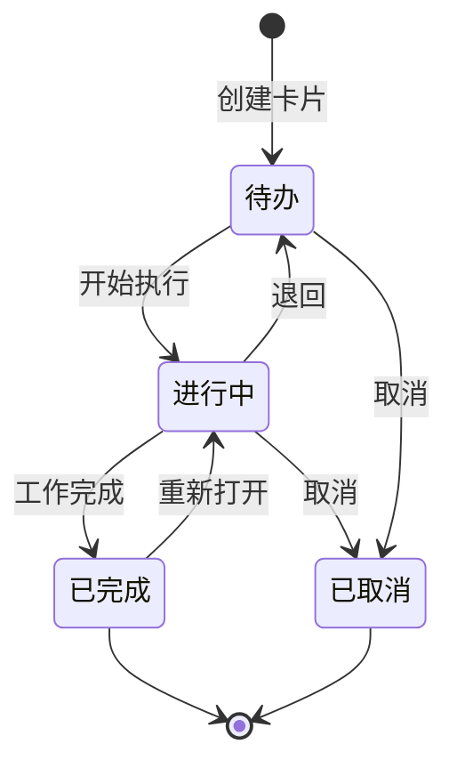

# 任务看板

任务看板提供可视化的工作流管理——卡片在列表间流转，直观展示工作进展。VE 用它管理工作任务，用户用它跟踪和调整 VE 的工作。

## 数据模型

```sql
CREATE TABLE boards (
    id UUID PRIMARY KEY DEFAULT gen_random_uuid(),
    tenant_id UUID NOT NULL,
    name VARCHAR(512) NOT NULL,
    description TEXT,

    organization_id UUID,
    work_context_id UUID,
    created_by_type VARCHAR(16),
    created_by_id UUID,

    created_at TIMESTAMPTZ NOT NULL DEFAULT now(),
    updated_at TIMESTAMPTZ NOT NULL DEFAULT now()
);

CREATE TABLE board_lists (
    id UUID PRIMARY KEY DEFAULT gen_random_uuid(),
    board_id UUID NOT NULL REFERENCES boards(id) ON DELETE CASCADE,
    name VARCHAR(256) NOT NULL,
    -- 默认列表名称：'待办', '进行中', '已完成'
    sort_order INTEGER NOT NULL DEFAULT 0,
    color VARCHAR(7) DEFAULT '#808080',

    created_at TIMESTAMPTZ NOT NULL DEFAULT now()
);

CREATE TABLE board_cards (
    id UUID PRIMARY KEY DEFAULT gen_random_uuid(),
    list_id UUID NOT NULL REFERENCES board_lists(id) ON DELETE CASCADE,

    title VARCHAR(512) NOT NULL,
    description TEXT,
    description_blocks JSONB DEFAULT '[]',
    -- 可选轻量 Block 描述，与基础版文档 Block 模型保持一致

    -- 元数据
    assignee_type VARCHAR(16),     -- 'user', 'virtual_employee'
    assignee_id UUID,
    priority VARCHAR(8) NOT NULL DEFAULT 'medium',
    -- 'urgent', 'high', 'medium', 'low'

    -- 标签
    labels TEXT[] DEFAULT '{}',

    -- 关联
    work_context_id UUID,          -- 关联的 VE 工作上下文
    linked_document_ids UUID[] DEFAULT '{}',
    linked_bitable_ids UUID[] DEFAULT '{}',

    -- 时间
    due_date DATE,
    started_at TIMESTAMPTZ,
    completed_at TIMESTAMPTZ,

    -- 排序
    sort_order REAL NOT NULL DEFAULT 0,   -- 浮点数支持插值排序

    created_at TIMESTAMPTZ NOT NULL DEFAULT now(),
    updated_at TIMESTAMPTZ NOT NULL DEFAULT now(),

    INDEX idx_board_cards_list (list_id, sort_order),
    INDEX idx_board_cards_assignee (assignee_type, assignee_id),
    INDEX idx_board_cards_due (due_date) WHERE completed_at IS NULL
);
```

### 卡片的生命周期



### 工作流配置

每个看板可配置自定义工作流列表，不限于默认的三列：

```json
{
  "lists": [
    { "name": "需求池", "color": "#808080" },
    { "name": "待评估", "color": "#FFA500" },
    { "name": "开发中", "color": "#1E90FF" },
    { "name": "待审核", "color": "#9370DB" },
    { "name": "已完成", "color": "#32CD32" }
  ],
  "rules": [
    {
      "from": "开发中",
      "to": "待审核",
      "require_approval": true,
      "approver": "user"
    }
  ]
}
```

## API

### VE 可调用的 API

| API | 参数 | 返回 |
|-----|------|------|
| `collab.board.create_card` | `{ board_id, list_id, title, description?, assignee?, priority?, due_date? }` | `{ card_id }` |
| `collab.board.move_card` | `{ card_id, target_list_id }` | `{ card_id, new_list_id }` |
| `collab.board.update_card` | `{ card_id, title?, description?, priority?, due_date? }` | `{ card_id }` |
| `collab.board.query_cards` | `{ board_id, list_id?, assignee_id?, status? }` | `{ cards }` |
| `collab.board.add_comment` | `{ card_id, content }` | `{ comment_id }` |

### REST API

| 方法 | 路径 | 说明 |
|------|------|------|
| `POST` | `/api/v1/boards` | 创建看板 |
| `GET` | `/api/v1/boards/{id}` | 获取看板（含列表和卡片） |
| `POST` | `/api/v1/boards/{id}/cards` | 创建卡片 |
| `PUT` | `/api/v1/boards/{id}/cards/{cid}/move` | 移动卡片 |
| `PUT` | `/api/v1/boards/{id}/cards/{cid}` | 更新卡片 |

### 移动卡片请求示例

```json
// PUT /api/v1/boards/{id}/cards/{cid}/move
{
  "target_list_id": "list_in_progress",
  "position": "after",
  "reference_card_id": "card_xxx",
  "comment": "开始处理这个任务"
}
```

## 与 VE 工作流程的集成

卡片可以绑定到 VE 的工作上下文——当 VE 开始处理一个看板卡片时：

```
用户在看板中创建卡片"分析 Q2 销售趋势"
  → 分配给 VE "销售分析师"
    → VE 意图识别判断为 new_task
      → 创建 Work Context（关联 card_id）
        → VE 开始工作
          → 移动卡片到"进行中"
            → 工作完成
              → VE 移动卡片到"已完成"
                → VE 在卡片上添加评论（工作摘要 + 文档链接）
```

## 评论

```sql
CREATE TABLE board_card_comments (
    id UUID PRIMARY KEY DEFAULT gen_random_uuid(),
    card_id UUID NOT NULL REFERENCES board_cards(id) ON DELETE CASCADE,
    content TEXT NOT NULL,
    created_by_type VARCHAR(16),
    created_by_id UUID,
    created_at TIMESTAMPTZ NOT NULL DEFAULT now(),

    INDEX idx_card_comments (card_id, created_at)
);
```
