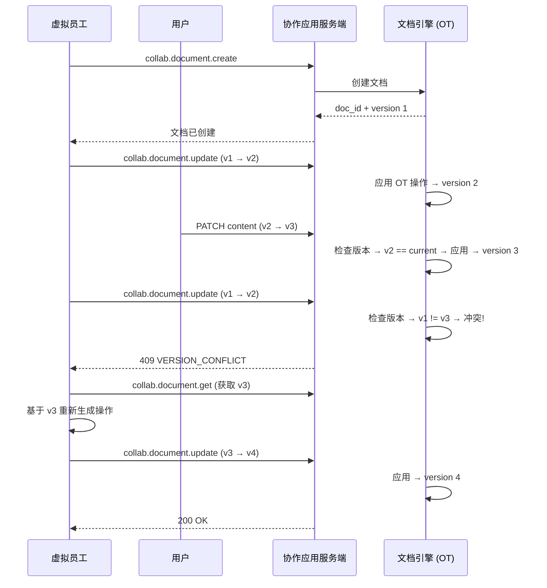

# 文档

协作文档是 Virtual Team 中最基础的内容载体。VE 在此生成分析报告、撰写文案、整理知识——用户在此编辑和补充。

## 数据模型

```sql
CREATE TABLE documents (
    id UUID PRIMARY KEY DEFAULT gen_random_uuid(),
    tenant_id UUID NOT NULL,
    title VARCHAR(512) NOT NULL,
    content JSONB NOT NULL DEFAULT '{"type":"doc","children":[]}',
    -- ProseMirror 文档结构（JSON）
    plain_text TEXT,              -- 纯文本提取（用于搜索索引）

    organization_id UUID,
    channel_id UUID,              -- 关联的频道（可选）
    work_context_id UUID,         -- 由哪个工作上下文创建

    created_by_type VARCHAR(16),  -- 'user', 'virtual_employee'
    created_by_id UUID,

    -- 版本
    version INTEGER NOT NULL DEFAULT 1,

    -- 元数据
    is_template BOOLEAN NOT NULL DEFAULT false,
    tags TEXT[] DEFAULT '{}',

    created_at TIMESTAMPTZ NOT NULL DEFAULT now(),
    updated_at TIMESTAMPTZ NOT NULL DEFAULT now(),

    INDEX idx_docs_tenant (tenant_id, updated_at DESC),
    INDEX idx_docs_org (organization_id),
    INDEX idx_docs_work_context (work_context_id)
);
```

### 文档内容结构（ProseMirror JSON）

```json
{
  "type": "doc",
  "content": [
    {
      "type": "heading",
      "attrs": { "level": 1 },
      "content": [{ "type": "text", "text": "Q2 销售分析报告" }]
    },
    {
      "type": "paragraph",
      "content": [{ "type": "text", "text": "本报告基于 Q2 销售数据..." }]
    },
    {
      "type": "bitable_embed",
      "attrs": { "bitable_id": "bitable_xxx", "view_id": "tbl_view_1" }
    },
    {
      "type": "code_block",
      "attrs": { "language": "python" },
      "content": [{ "type": "text", "text": "import pandas as pd..." }]
    }
  ]
}
```

### 支持的 Block 类型

| Block 类型 | 说明 |
|-----------|------|
| `heading` | 标题（level 1-3） |
| `paragraph` | 段落 |
| `bullet_list` / `ordered_list` | 列表 |
| `code_block` | 代码块（语法高亮） |
| `table` | 简单表格 |
| `image` | 图片（S3 URL） |
| `file_card` | 文件附件卡片 |
| `bitable_embed` | 多维表格内联嵌入 |
| `board_embed` | 看板内联嵌入 |
| `divider` | 分割线 |
| `callout` | 提示框（info/warning/tip） |

## API

### REST API

| 方法 | 路径 | 说明 |
|------|------|------|
| `POST` | `/api/v1/documents` | 创建文档 |
| `GET` | `/api/v1/documents/{id}` | 获取文档（完整 JSON） |
| `PUT` | `/api/v1/documents/{id}` | 更新文档（全量替换） |
| `PATCH` | `/api/v1/documents/{id}/content` | 更新文档内容（OT/CRDT 操作） |
| `DELETE` | `/api/v1/documents/{id}` | 删除文档（软删除） |
| `GET` | `/api/v1/documents/search?q=...` | 搜索文档 |

### 创建文档

```json
// POST /api/v1/documents
// Request
{
  "title": "Q2 销售分析报告",
  "organization_id": "org_sales",
  "channel_id": "ch_xxx",
  "content": { "type": "doc", "content": [] }
}

// Response 201
{
  "id": "doc_xxx",
  "title": "Q2 销售分析报告",
  "content": { "type": "doc", "content": [] },
  "version": 1,
  "created_by_type": "virtual_employee",
  "created_by_id": "ver_sales_01",
  "created_at": "2026-05-08T10:00:00Z"
}
```

### 协同编辑（内容更新）

v1 采用 **OT（Operational Transformation）** 方案。客户端/VE 发送 OT 操作序列，服务端转换后应用：

```json
// PATCH /api/v1/documents/{id}/content
// Request
{
  "version": 1,
  "operations": [
    { "type": "insert", "position": 12, "content": [{ "type": "text", "text": "新增内容" }] },
    { "type": "delete", "position": 5, "length": 3 }
  ]
}

// Response 200
{
  "version": 2,
  "applied": true
}

// 冲突时返回 409
{
  "error": { "code": "VERSION_CONFLICT", "current_version": 3, "message": "文档已被更新，请基于最新版本重试" }
}
```

### VE 通过平台工具 API 操作

| API | 说明 |
|-----|------|
| `collab.document.create` | `{ title, content, organization_id }` → `{ id, version, created_at }` |
| `collab.document.update` | `{ id, operations, base_version }` → `{ version, applied }` |
| `collab.document.get` | `{ id }` → `{ title, content, version, ... }` |

## 协同编辑流程



## 版本历史

每次内容更新记录版本快照，支持回退到任意历史版本：

```sql
CREATE TABLE document_versions (
    id UUID PRIMARY KEY,
    document_id UUID NOT NULL REFERENCES documents(id),
    version INTEGER NOT NULL,
    content JSONB NOT NULL,          -- 完整快照
    operations JSONB NOT NULL,       -- 从上一版本到当前版本的 OT 操作
    created_by_type VARCHAR(16),
    created_by_id UUID,
    created_at TIMESTAMPTZ NOT NULL DEFAULT now(),

    UNIQUE (document_id, version)
);
```
