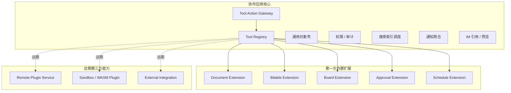
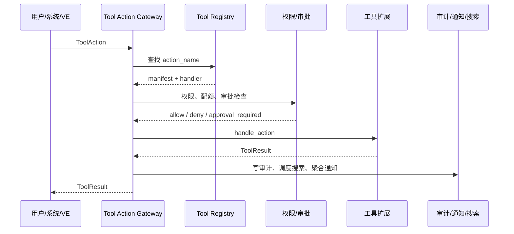
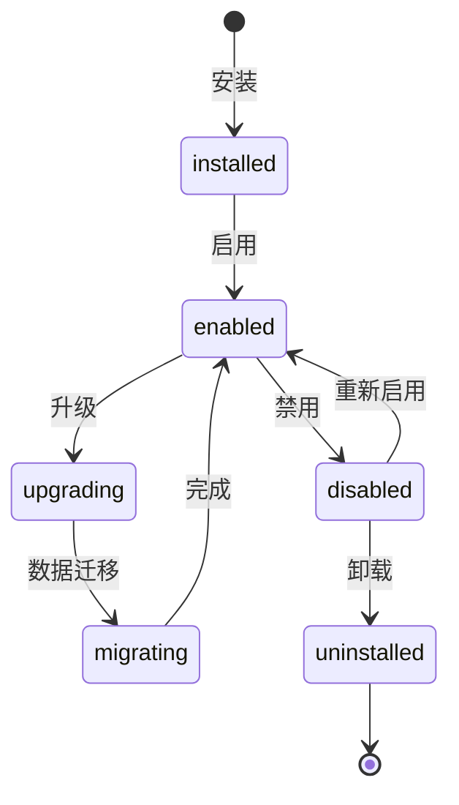

# 协作工具扩展与插件系统

## 定位

协作工具扩展系统是协作应用的基础架构之一，而不是远期插件市场的附属设计。文档、多维表格、任务看板、审批流、日程/定时器都通过同一扩展机制接入协作应用；它们默认随应用安装和启用，因此是**第一方内置扩展**，但不是写死在协作应用核心里的特殊分支。

第一阶段目标：

- 建立第一方内置扩展框架。
- 不开放第三方插件市场。
- 不承诺客户端动态加载任意 Flutter 插件。
- 不在本文选择具体文档、表格或协同编辑底层开源项目。

## 术语边界

| 术语 | 含义 | 阶段 |
|------|------|------|
| **Extension** | 协作工具扩展机制，用于接入文档、表格、看板、审批流等工具类型 | 第一阶段 |
| **First-party Built-in Extension** | 由 Virtual Team 官方提供、随应用发布、默认安装的工具扩展 | 第一阶段 |
| **Plugin** | 第三方开发者提供、可安装、可启用/禁用、受沙盒和权限控制的动态能力 | 远期 |
| **Integration** | 与外部系统或外部 API 的连接，例如第三方文档、项目管理、CRM 或自动化服务 | 远期 |
| **Tool Surface** | 前端承载工具 UI 的表面，包括 Flutter 原生组件、Schema/Card、WebView 沙盒 | 第一阶段 |
| **Tool Action** | 工具扩展声明的结构化操作，是用户、系统和 VE 操作工具的统一入口 | 第一阶段 |

`Extension` 和 `Plugin` 不混用：当前协作工具属于 Extension；第三方动态安装能力才称为 Plugin。`Integration` 只表达外部系统接入，不等同于在协作应用内新增一种工具类型。

## 核心与扩展边界

协作应用核心只提供稳定底座，不承载具体工具的业务实现。

| 层级 | 责任 |
|------|------|
| **协作应用核心** | Tool Registry、通用对象生命周期、权限校验、审计、搜索索引调度、通知聚合、IM 引用、VE 调用协议、租户隔离、资源配额 |
| **第一方工具扩展** | 工具数据模型、操作语义、渲染配置、搜索内容提取、预览卡片、通知摘要、VE 可调用动作声明 |
| **第三方插件（远期）** | 通过远程服务或受控沙盒接入，复用同一注册、权限、审计、搜索和通知规则 |

核心不得直接依赖某个工具的内部模型。例如协作应用核心可以知道一个对象是 `document` 类型，也可以调度其搜索索引和权限校验，但不直接理解文档块树如何编辑、表格公式如何计算、审批节点如何流转。

## 总体架构



第一阶段，第一方扩展在服务端以 Rust crate/module 静态集成，在客户端以随 App 编译发布的 Tool Surface 集成；但它们仍然必须通过 manifest、Tool Registry 和 Tool Action API 接入。

## 数据边界

协作工具对象分为“通用对象壳”和“扩展业务数据”两部分。

### 通用对象壳

通用对象壳由协作应用核心管理，所有工具对象都必须具备：

| 字段 | 说明 |
|------|------|
| `object_id` | 全局唯一对象 ID |
| `tool_type` | 工具类型，如 `document`、`bitable`、`board` |
| `tenant_id` | 租户隔离边界 |
| `organization_id` | 组织归属 |
| `owner` | 创建者或负责主体 |
| `scope` | 可见范围，如组织、频道、工作上下文 |
| `lifecycle_state` | `created`、`active`、`archived`、`deleted` |
| `permission_policy` | 对象级权限策略引用 |
| `audit_state` | 审计状态与最近操作摘要 |
| `search_state` | 搜索索引状态 |
| `preview_state` | IM 预览卡片摘要 |

### 扩展业务数据

扩展业务数据由对应工具扩展管理：

- 文档扩展保存文档结构、块内容、评论、修订等数据。
- 表格扩展保存表结构、字段、视图、公式、行列数据等数据。
- 看板扩展保存列表、卡片、排序、状态流转等数据。
- 审批扩展保存表单、流程定义、审批实例、审批记录等数据。
- 日程扩展保存日程、提醒、定时器和触发状态等数据。

核心不直接修改扩展业务数据。所有修改都通过工具扩展声明的 Tool Action 完成。

## Extension Manifest

Extension Manifest 是扩展与协作应用核心之间的完整契约。第一方扩展也必须声明 manifest，不能只靠代码注册。

```yaml
id: vt.document
name: Document
version: 1.0.0
publisher: virtual-team
kind: first_party

tool:
  type: document
  display_name: 文档
  supported_object_types:
    - document

enablement:
  default_enabled: true
  scopes:
    - tenant
    - organization
  channel_policy: inherit

actions:
  - name: collab.document.create
    description: 创建文档
    exposed_to_ve: true
    require_approval: false
    input_schema: schemas/document.create.input.json
    output_schema: schemas/document.create.output.json
  - name: collab.document.update
    description: 更新文档内容
    exposed_to_ve: true
    require_approval: conditional
    input_schema: schemas/document.update.input.json
    output_schema: schemas/document.update.output.json

permissions:
  messages:
    read: false
    send: false
  objects:
    read: true
    create: true
    update: true
    delete: approval_required
  files:
    read: true
    upload: true
  network:
    outbound: []
  organizations:
    read: true
    manage: false
  ve:
    expose_actions: true

rendering:
  surfaces:
    - kind: flutter_native
      component: document_editor
    - kind: schema_card
      component: document_preview_card
    - kind: webview_sandbox
      component: document_web_surface
      allowed_origins: []

search:
  extractor: document_search_extractor
  index_fields:
    - title
    - plain_text

notifications:
  preview_card: document_preview_card
  summary_generator: document_change_summary

lifecycle:
  supports_install: true
  supports_enable: true
  supports_disable: true
  supports_upgrade: true
  supports_migrate: true
  supports_uninstall: false
```

Manifest 必须覆盖基础信息、工具声明、Action 声明、权限声明、渲染声明、搜索与通知、生命周期和启用范围。即使第一阶段不开放第三方插件，manifest 仍用于约束第一方扩展，避免工具实现绕过平台治理。

## Tool Registry

Tool Registry 负责注册、发现和治理所有协作工具扩展。

### 注册规则

- 第一方扩展随服务启动静态注册。
- 第一方扩展默认启用，但可在租户或组织级关闭。
- 频道默认继承组织配置，不在第一阶段提供频道级独立启用。
- 第三方插件远期通过 manifest 审核后注册，不直接进入进程内核心。

```rust
let registry = ToolRegistry::new();

registry.register(ToolRegistration::first_party(
    Manifest::load("extensions/document/manifest.yaml"),
    DocumentExtension::new(db.clone()),
));
```

### 注册后获得的能力

扩展注册后自动获得：

- REST / JSON-RPC Action 路由生成。
- 权限检查代理。
- 审计日志写入。
- 搜索索引调度。
- 通知聚合。
- IM 引用和预览卡片渲染。
- VE API 暴露控制。
- 租户、组织和资源配额约束。

扩展不得自行绕过这些核心能力，也不得直接向 VE 暴露未声明的私有接口。

## Tool Action API

Tool Action API 是工具操作的统一入口。用户 UI、系统任务和 VE 都通过结构化 Action 调用工具。

```rust
struct ToolAction {
    action_name: String,
    target: Option<ToolTarget>,
    payload: serde_json::Value,
    context: ActionContext,
}

struct ActionContext {
    tenant_id: String,
    organization_id: Option<String>,
    channel_id: Option<String>,
    work_context_id: Option<String>,
    actor: Actor,
    request_id: String,
}

enum Actor {
    User { id: String },
    VirtualEmployee { id: String, runtime_id: String },
    System { reason: String },
}
```

处理流程：



VE 调用边界：

- VE 只能调用 manifest 中 `exposed_to_ve = true` 的 Action。
- VE 不直接操作数据库。
- VE 不绕过核心权限、审批、审计和配额。
- VE 不以 UI 自动化作为主调用路径。
- 涉及删除、外发、批量修改或高风险操作时，Action 可声明 `require_approval`。

## Tool Surface

客户端工具 UI 通过 Tool Surface 承载。第一阶段支持三类承载方式，工具可按复杂度选择一种或多种。

| Surface | 用途 | 约束 |
|---------|------|------|
| `flutter_native` | 高频基础界面，如看板、审批表单、日程列表、轻量预览 | 随 App 编译发布，不支持第三方动态加载 |
| `schema_card` | 消息卡片、对象预览、简单表单、审批卡片 | 由 schema 驱动，适合跨端一致渲染 |
| `webview_sandbox` | 文档、表格等复杂编辑器或远期第三方工具界面 | 必须沙盒化，受来源、权限、消息桥和文件访问限制 |

Flutter 客户端不承诺运行时加载任意 Flutter/Dart 插件。第三方客户端扩展远期优先通过 Schema/Card 或 WebView 沙盒实现。

WebView 沙盒必须遵循：

- 仅允许 manifest 声明的资源来源。
- 只能通过受控 message bridge 调用 Tool Action。
- 不允许直接读取本地文件系统。
- 不允许绕过协作应用认证和权限上下文。
- 所有外部网络访问必须进入权限声明和审计。

## 搜索、通知与 IM 引用

协作工具扩展必须把面向用户和 VE 的协作语义交回核心统一治理。

| 能力 | 核心职责 | 扩展职责 |
|------|----------|----------|
| 搜索 | 调度索引、统一查询、权限过滤 | 提取标题、正文、字段、摘要等可索引内容 |
| 通知 | 聚合、去重、发送 IM 摘要 | 生成用户可理解的变更摘要 |
| IM 引用 | 保存引用关系、渲染链接卡片 | 提供预览数据和深链目标 |
| 审计 | 写入统一审计日志 | 标注操作语义、风险等级和影响范围 |

扩展不得自行向聊天框刷入大量过程信息。工具变更默认通过通知聚合机制生成摘要，并在必要时附带对象预览卡片。

## 权限、安全与隔离

权限模型以最小授权为原则。第一方扩展虽然由官方提供，也必须经过同一权限和审计路径。

### 权限维度

- 租户与组织范围。
- 用户、VE、System Actor。
- 对象读写、创建、删除、归档。
- 文件读取、上传、导出。
- 网络访问。
- VE 可调用 Action。
- 高风险操作审批。

### 第三方能力远期策略

远期第三方插件不默认进入协作应用服务端进程。优先路径：

1. 远程插件服务：通过平台签发的 scoped token 调用协作应用 API。
2. 受控沙盒：如 WASM 或独立进程，禁止数据库直连。
3. WebView 沙盒：仅承载 UI，通过 message bridge 调用 Tool Action。

第三方插件必须满足：

- 权限白名单声明。
- 租户级安装和组织级启用控制。
- 网络访问白名单。
- CPU、内存、请求速率和存储配额。
- 完整审计日志。
- 可禁用、可卸载、可回滚。

## 生命周期

协作工具扩展生命周期由核心统一管理。



第一方内置扩展的生命周期约束：

- 默认随应用安装。
- 默认启用。
- 支持租户/组织级禁用。
- 升级随应用版本发布。
- 数据迁移必须随服务端迁移流程执行。
- 第一阶段不支持彻底卸载第一方核心工具，只支持禁用。

第三方插件远期生命周期：

- 租户管理员安装。
- 组织管理员可按范围启用。
- 插件升级必须声明迁移脚本和兼容版本。
- 禁用后不得继续接收事件或调用 API。
- 卸载前必须处理对象归属和历史引用。

## 第一阶段与远期演进

| 能力 | 第一阶段 | 远期 |
|------|----------|------|
| 第一方工具扩展 | 默认安装、默认启用、静态集成 | 继续沿用同一契约升级 |
| 第三方插件市场 | 不开放 | 支持安装、审核、启用、计费 |
| 服务端扩展运行 | Rust crate/module 静态集成 | 远程服务、WASM、独立沙盒进程 |
| 客户端扩展运行 | Flutter 原生、Schema/Card、受控 WebView | 第三方 Schema/Card/WebView sandbox |
| 数据治理 | 核心对象壳 + 扩展业务数据 | 保持同一数据边界 |
| VE 调用工具 | 结构化 Tool Action | 保持同一 Action API，扩展更多工具类型 |

## 不做什么

- 不把具体工具业务逻辑写死在协作应用核心中。
- 不让 VE 直接操作数据库或模拟 UI 作为主路径。
- 不允许扩展绕过权限、审计、搜索和通知体系。
- 不在第一阶段开放第三方插件市场。
- 不承诺客户端动态加载任意 Flutter 插件。
- 不在本文锁定文档、表格或协同编辑的具体底层开源项目。
