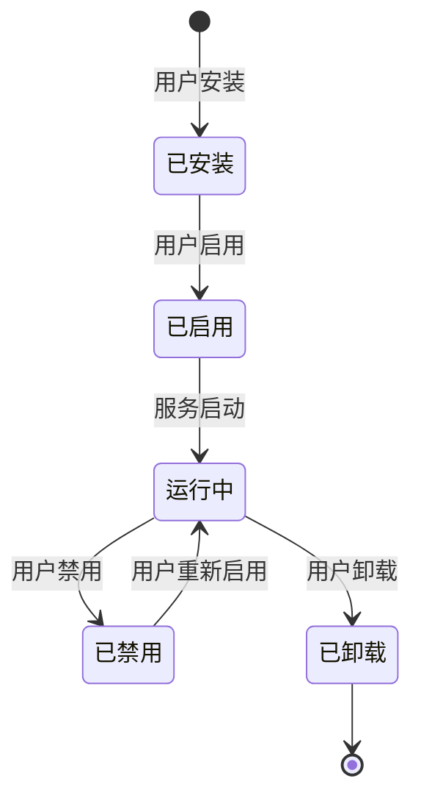

# 扩展与插件系统

## 第一阶段（当前规划）

不实现完整插件系统，但做以下基础设施以降低未来引入成本。

### 协作工具注册接口

所有内置协作工具已实现 `CollaborationTool` trait（[详见总览](./overview.md)）。这个 trait 就是未来的插件接入点——第三方开发者只需实现相同接口即可接入新的协作工具类型。

### 消息渲染扩展

消息 `content.type` 支持自定义类型。未知类型降级为纯文本展示（graceful degradation）。自定义 Block 类型需在 manifest 中声明前端渲染组件路径：

```json
{
  "name": "my-custom-block",
  "display_name": "自定义图表",
  "component": "my_plugin/chart_widget",
  "props_schema": {
    "type": "object",
    "properties": {
      "data_url": { "type": "string" },
      "chart_type": { "enum": ["line", "bar", "pie"] }
    }
  }
}
```

### 消息渲染扩展点

服务端提供消息渲染钩子，允许在消息发送前/接收后注入自定义处理逻辑：

```rust
trait MessageHook: Send + Sync {
    /// 消息发送前（VE → 用户或用户 → VE）
    fn before_send(&self, msg: &mut OutgoingMessage) -> HookResult;
    /// 消息接收后（用户客户端）
    fn after_receive(&self, msg: &mut IncomingMessage) -> HookResult;
}

enum HookResult {
    Continue,               // 继续正常流程
    Modified,               // 已修改消息，继续
    Block { reason: String }, // 阻止消息
}
```

## 远期插件系统

参考 Mattermost 的插件架构和 Slack App 的权限模型。

### 插件类型

| 类型 | 运行位置 | 能力 |
|------|---------|------|
| **服务端插件** | 协作应用服务端 | 生命周期钩子、自定义 API、协作工具扩展 |
| **客户端插件** | Flutter 客户端 | UI 组件注入、自定义面板、消息渲染扩展 |

### 服务端插件

```rust
/// 服务端插件 trait
trait ServerPlugin: Send + Sync {
    fn manifest(&self) -> PluginManifest;

    // 生命周期钩子
    fn on_init(&self, ctx: PluginContext) -> Result<(), PluginError>;
    fn on_shutdown(&self) -> Result<(), PluginError>;

    // 消息钩子
    fn on_message_send(&self, msg: &mut OutgoingMessage) -> HookResult;
    fn on_message_receive(&self, msg: &mut IncomingMessage) -> HookResult;

    // 协作工具钩子
    fn on_collaboration_tool_action(&self, action: &ToolAction) -> HookResult;

    // VE 接入钩子
    fn on_ve_connected(&self, ve: &VeRuntime) -> HookResult;
    fn on_ve_disconnected(&self, ve: &VeRuntime) -> HookResult;

    // 自定义 HTTP 端点
    fn http_handlers(&self) -> Vec<PluginHttpHandler>;
}

struct PluginManifest {
    name: String,
    version: String,
    description: String,
    author: String,
    permissions: PluginPermissions,
}
```

### 客户端插件

Flutter 端通过 `flutter_plugin` 机制动态加载：

- **协作工具面板扩展**：在协作工具区域增加新的 Tab 面板
- **消息渲染扩展**：注册自定义 Block 类型的渲染组件
- **侧边栏扩展**：在频道侧边栏增加自定义面板
- **命令扩展**：注册斜杠命令（如 `/deploy`）

### 权限声明

```toml
[plugin.permissions]
# 消息
read_messages = true
send_messages = false

# 协作工具
access_collaboration_tools = ["document", "bitable"]

# 组织
read_organizations = true
manage_organizations = false

# 文件
read_files = true
upload_files = false

# 网络
network_access = ["api.example.com"]

# VE 相关
read_ve_info = true
send_to_ve = false
```

### 插件生命周期



### 沙盒隔离

服务端插件在独立沙盒中运行：
- 文件系统访问限制在插件专属目录
- 网络访问白名单制
- CPU/内存配额限制
- 禁止访问数据库直连（仅通过 API）

## 从第一阶段到远期的平滑演进

第一阶段实现的 `CollaborationTool` trait 和 `MessageHook` trait 为远期插件系统提供了自然接入点：

```
第一阶段           远期
─────────        ────────
内置工具 trait  → 插件开发者实现 trait
注册表           → 插件动态注册
消息钩子         → 插件消息钩子
权限 trait      → 插件权限声明
```

插件开发者只需实现已有 trait，无需重构核心架构。
