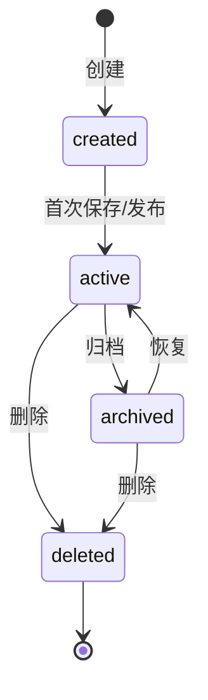

# 协作工具总览

## 定位

协作工具是 Virtual Team 协作应用中**工作产物的载体**。虚拟员工的详细工作过程和大型交付内容不输出到聊天框，而是在协作文档、表格、看板等工具中呈现——正如现实中工作沟通在 IM，产物在文档和表格中。

协作工具是协作应用的**内置能力**（非插件），每种工具实现统一的 `CollaborationTool` trait。

## 内置工具一览

| 工具 | 用途 | 类比 | 详细章节 |
|------|------|------|---------|
| **文档** | 富文本协同编辑，支持 Markdown、内嵌 Block | Notion / 飞书文档 | [文档](./documents.md) |
| **多维表格** | 电子表格 + 数据库，多视图 | 飞书多维表格 | [多维表格](./bitable.md) |
| **任务看板** | 卡片 + 列表，工作流状态流转 | Trello / Linear | [任务看板](./board.md) |
| **审批流** | 表单 + 流程引擎，条件分支 | 飞书审批 | [审批流](./approval.md) |
| **日程/定时器** | 日历日程 + 倒计时提醒 | 日历 / 闹钟 | [日程与定时器](./schedule-and-timer.md) |

## 设计哲学

### 文档中心化，而非消息中心化

飞书的"文档中心化"优于 Slack 的"消息中心化"，更符合 Virtual Team 场景：

- VE 的工作产物可**持久化**，不被聊天流淹没
- 产物可**协同编辑**（用户 + 多个 VE 异步编辑）
- 产物可**独立引用**（链接而非复制粘贴）
- 聊天框用于沟通确认、简短回复和交付说明

### 与 IM 的关系

| 交互模式 | 实现方式 |
|---------|---------|
| **内联预览** | 文档/表格链接在聊天框中渲染为内容预览卡片 |
| **消息引用** | 聊天消息可引用文档特定段落或表格行（双向链接） |
| **统一搜索** | 协作工具数据与 IM 消息共享搜索索引 |
| **通知集成** | 文档被 VE 修改后，IM 中推送通知（非事无巨细） |

### VE 可操作所有协作工具

虚拟员工通过平台工具 API 操作协作工具——创建文档、写入表格、移动看板卡片、发起审批、设定日程。用户同样可在 UI 中直接操作。

## 统一生命周期

所有协作工具对象都遵循统一生命周期。具体工具可以扩展状态，但不得绕过基础状态语义。



| 状态 | 说明 |
|------|------|
| `created` | 对象已创建，但可能尚未完整填充内容 |
| `active` | 正常可读写状态 |
| `archived` | 只读保留，可恢复 |
| `deleted` | 软删除状态，默认不在列表中展示 |

统一规则：

- 删除默认软删除，保留审计和引用。
- 归档对象仍可被历史消息和工作上下文引用。
- 由 VE 创建或修改的对象必须记录 `created_by_type = virtual_employee` 或对应更新者。
- 与工作上下文绑定的对象，删除前需要检查是否仍是活跃任务的关键产物。
- 用户和 VE 同时修改时，必须走版本或乐观锁冲突处理。

## 权限基线

协作工具权限复用协作应用的成员和组织模型，同时增加 VE Actor。

| 操作 | User | VirtualEmployee | System |
|------|------|-----------------|--------|
| 创建对象 | 有频道/组织写权限 | 工具白名单允许且有目标范围权限 | 允许 |
| 读取对象 | 有对象可见权限 | 所在频道/组织可见且工具白名单允许 | 允许 |
| 更新对象 | 创建者、协作者、管理员 | 工具白名单允许且对象授权给该 VE 或工作上下文 | 允许 |
| 删除对象 | 创建者或管理员 | 默认不允许，除非配置包显式允许并经过审批 | 允许 |
| 归档对象 | 创建者或管理员 | 需工具白名单允许 | 允许 |
| 发起审批 | 有审批模板权限 | 工具白名单允许 | 允许 |

VE 调用协作工具 API 时，必须同时满足：

1. 配置包 `platform.tools.allowed` 允许该工具。
2. Runtime Config 没有进一步收窄权限。
3. 当前 work context 有权访问目标组织、频道或对象。
4. 操作未命中 `require_approval`，或用户已审批通过。

## 通知策略

协作工具变更不应把所有细节刷到聊天框。默认通知策略如下：

| 事件 | 默认通知 |
|------|----------|
| VE 创建文档/表格/看板 | 发送一条摘要消息，附链接卡片 |
| VE 多次连续更新文档 | 不逐条通知，工作完成时汇总 |
| 审批创建 | 必须发送 approval_card |
| 审批状态变化 | 更新原审批卡片，并可发送一条状态消息 |
| Schedule/Timer 创建 | 默认不通知，但在 VE 管理面板可见 |
| Schedule/Timer 触发完成 | 根据工作结果发送摘要 |
| 用户手动修改工具对象 | 不通知 VE，除非对象绑定活跃 work context |

通知聚合窗口默认 30 秒。同一 VE 在同一 work context 内对同一对象的多次更新，聚合为一次 `work_summary` 或对象预览卡片。

## 统一 Trait 接口

所有协作工具实现统一接口，确保一致性并降低扩展成本：

```rust
/// 协作工具的统一接口
trait CollaborationTool: Send + Sync {
    /// 工具类型标识
    fn tool_type(&self) -> &'static str;
    /// 工具名称（用户可见）
    fn display_name(&self) -> &'static str;
    /// 前端渲染配置
    fn render_config(&self) -> RenderConfig;
    /// 处理来自前端或 Agent 的操作请求
    async fn handle_action(&self, action: ToolAction) -> Result<ToolResult, ToolError>;
    /// 权限检查
    async fn check_permission(&self, actor: &Actor, action: &ToolAction) -> Result<bool, ToolError>;
    /// 搜索索引回调
    fn extract_search_content(&self, data: &Self::Data) -> Vec<SearchDocument>;
}

struct RenderConfig {
    component: String,
    default_width: Option<u32>,
    default_height: Option<u32>,
    supported_interactions: Vec<InteractionType>,
}

enum InteractionType { View, Edit, Comment, Approve }

struct ToolAction {
    action_type: String,        // "create", "update", "delete", "query"
    target_id: Option<String>,
    payload: serde_json::Value,
    context: ActionContext,
}

struct ActionContext {
    actor: Actor,
    channel_id: Option<String>,
    organization_id: Option<String>,
    work_context_id: Option<String>,
}

enum Actor {
    User { id: String },
    VirtualEmployee { id: String, runtime_id: String },
}
```

## VE 可调用的协作工具 API 总表

| API | 说明 | 调用者 |
|-----|------|--------|
| `collab.document.create` | 创建文档 | 主 Agent |
| `collab.document.update` | 更新文档 | 主 Agent |
| `collab.document.get` | 读取文档 | 主 Agent / 意图 Agent |
| `collab.bitable.create` | 创建多维表格 | 主 Agent |
| `collab.bitable.insert_rows` | 写入表格行 | 主 Agent |
| `collab.bitable.query` | 查询表格 | 主 Agent |
| `collab.board.create_card` | 创建卡片 | 主 Agent |
| `collab.board.move_card` | 移动卡片 | 主 Agent |
| `collab.approval.create` | 发起审批 | 主 Agent |
| `collab.approval.get_status` | 查询审批 | 主 Agent |
| `collab.schedule.create` | 创建日程 | 主 Agent / 意图 Agent |
| `collab.schedule.delete` | 删除日程 | 主 Agent |
| `collab.timer.set` | 创建定时器 | 主 Agent / 意图 Agent |
| `collab.timer.cancel` | 取消定时器 | 主 Agent |

所有 API 通过统一 JSON-RPC 2.0 格式调用：

```json
{
  "jsonrpc": "2.0",
  "id": 1,
  "method": "collab.document.create",
  "params": {
    "title": "Q2 销售分析报告",
    "organization_id": "org_xxx",
    "content": { "type": "doc", "children": [] }
  }
}
```

## 注册机制

协作工具在服务端启动时注册到全局 ToolRegistry：

```rust
let registry = ToolRegistry::new();
registry.register("document", DocumentTool::new(db.clone()));
registry.register("bitable", BitableTool::new(db.clone(), formula_engine));
registry.register("board", BoardTool::new(db.clone()));
registry.register("approval", ApprovalTool::new(db.clone(), flow_engine));
registry.register("schedule", ScheduleTool::new(db.clone(), cron_engine));
```

注册后的工具自动获得：REST API 生成、搜索索引建立、权限检查代理、VE API 暴露。
