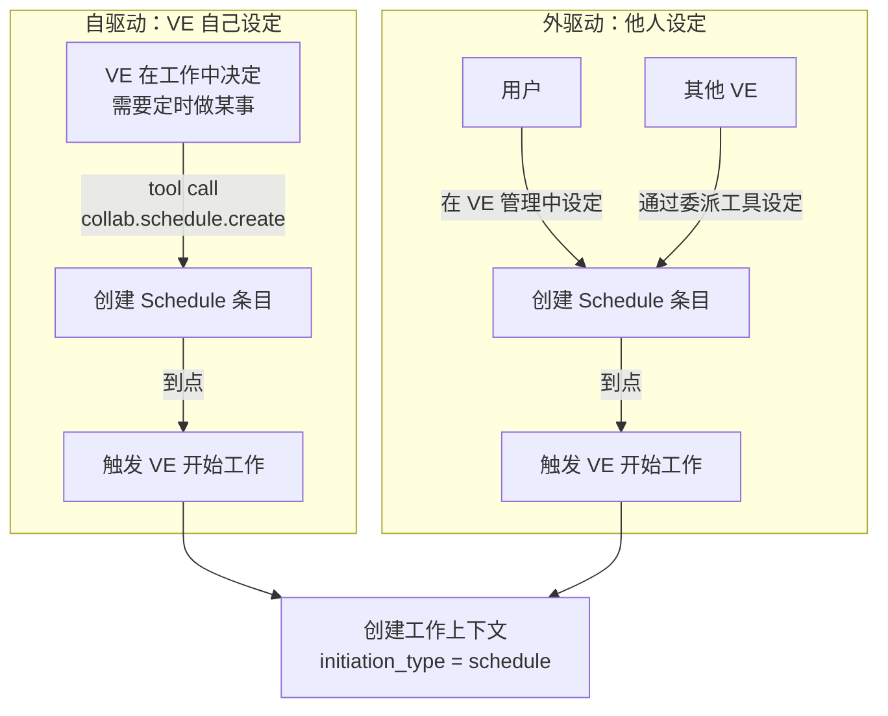
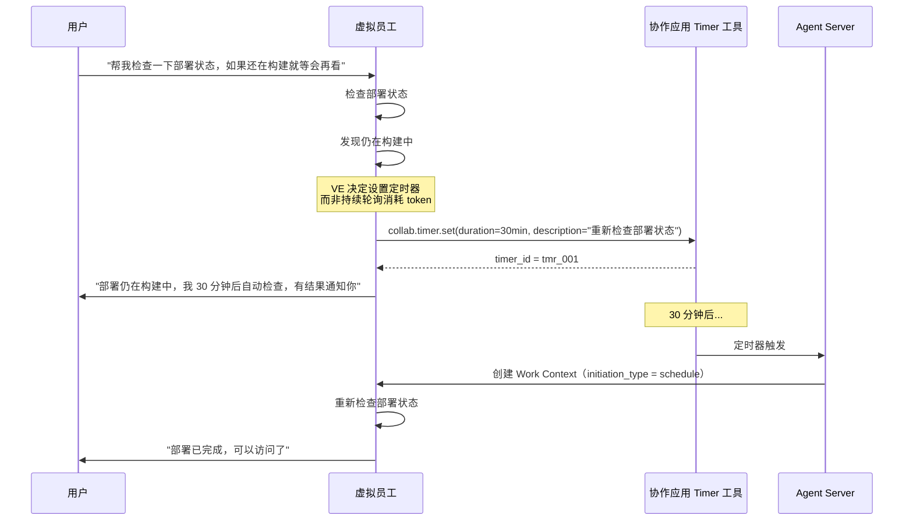

# 日程与定时器

协作应用提供的 Schedule（日程）和 Timer（定时器）工具，用于让虚拟员工像真人一样管理自己的工作计划和提醒。

日程与定时器是**调度型第一方扩展**。它们不主要承载工作产物，而是提供时间触发、提醒、计划可见性和 Work Context 自动创建能力。

## 设计动机

真人使用日历、闹钟、定时器管理自己的时间——设置"周三下午 3 点开会"、设定"30 分钟后提醒我检查部署状态"。虚拟员工需要同样的能力。

### 为什么不放在 Agent 内部

在 Agent 内部实现定时机制有严重缺陷：

1. **用户不可见**：VE 默默设定定时触发，用户不知道 VE 计划做什么、何时做——形成"黑盒"
2. **LLM 不可靠**：LLM 的输出稳定性无法 100% 保证，依赖 LLM 自行管理定时器可能导致遗漏
3. **用户无法干预**：用户看不到 VE 的日程安排，无法调整或取消

因此，Schedule 和 Timer 作为**协作应用的工具**提供给 VE，同时用户在协作应用中可直接查看和管理。

### 类比

每个人类都有日程管理工具（日历、闹钟）。人们为了提醒自己会借助这些工具——而不是靠"在脑子里记着"。VE 也一样。

## Schedule（日程）

### 概念

Schedule 是一个**带时间的任务条目**。它在指定时间触发 VE 开始工作。Schedule 存储在协作应用中，通过 API 供 VE 和用户操作。

### 数据模型

```json
{
  "id": "sch_weekly_report",
  "tenant_id": "tn_xxx",
  "title": "生成销售周报",
  "description": "汇总上周销售数据，生成周报并存入多维表格",
  "schedule_type": "cron",
  "cron_expression": "0 9 * * 1",
  "timezone": "Asia/Shanghai",
  "status": "active",
  "created_by": {
    "type": "virtual_employee",
    "id": "ver_sales_01",
    "display_name": "销售分析师"
  },
  "target": {
    "ve_runtime_id": "ver_sales_01",
    "organization_id": "org_sales"
  },
  "trigger_action": {
    "type": "create_work_context",
    "task_description": "生成上周销售数据周报",
    "task_type": "report"
  },
  "last_triggered_at": "2026-05-04T09:00:00Z",
  "next_trigger_at": "2026-05-11T09:00:00Z",
  "created_at": "2026-04-01T10:00:00Z"
}
```

### 触发类型

| 类型 | 说明 | 示例 |
|------|------|------|
| `cron` | cron 表达式定时 | `0 9 * * 1` = 每周一 9:00 |
| `once` | 一次性定时 | 指定精确时间，触发后自动标记完成 |
| `interval` | 固定间隔 | 每 4 小时、每 30 分钟 |

### 自驱动 vs 外驱动



**关键区别**：
- **自驱动**：VE 通过 tool call 自己创建。VE 只在必要时通过消息告知用户（如"我设了每周一提醒"），不会事无巨细报告
- **外驱动**：用户或其他 VE 设定。用户可通过协作应用 VE 管理界面直接查看和修改

### VE 可调用的 Schedule API

| API | 说明 |
|-----|------|
| `collab.schedule.create` | 创建日程条目 |
| `collab.schedule.delete` | 删除自己创建的日程 |
| `collab.schedule.list` | 列出与自己相关的日程 |
| `collab.schedule.update` | 修改日程（仅自驱动创建的） |

所有 API 通过协作应用的平台工具暴露给 VE。VE 调用 `collab.schedule.create` 就是一个普通的 Tool Action——就像调用其他协作工具一样。

### 触发后的行为

Schedule 时间到达 → 协作应用通知 Agent 服务器 → Agent 服务器查找绑定的 VE Runtime → 创建 Work Context（`initiation_type = schedule`）→ VE 开始工作。

VE 无需在聊天框中报告"我设了一个日程"——这属于内部工作细节。但当工作需要与其他方协调时（如"我将在周三下午生成报告，届时通知你"），VE 可以通过消息提前告知。

## Timer（定时器）

### 概念

Timer 是一个**倒计时触发器**。与 Schedule 不同，Timer 是短期的、一次性的。

典型场景：
- "30 分钟后提醒我检查部署状态"
- "这个操作需要等 5 分钟后重试"
- "1 小时后如果还没收到回复，主动跟进"

### 自驱动的典型流程



### VE 可调用的 Timer API

| API | 说明 |
|-----|------|
| `collab.timer.set` | 创建定时器（duration + description） |
| `collab.timer.cancel` | 取消定时器 |
| `collab.timer.list` | 列出自己当前的活跃定时器 |

### 用户可见性

用户可以在协作应用的**VE 管理面板**中查看该 VE 当前的 Schedule 和 Timer 列表：

| 可见项 | 说明 |
|--------|------|
| 日程列表 | 所有活跃的 Schedule 条目（cron/once/interval），含下次触发时间 |
| 定时器列表 | 所有活跃的 Timer，含剩余时间 |
| 历史记录 | 已触发的 Schedule/Timer 历史 |
| 手动操作 | 用户可取消、修改、手动触发 |

这与现实世界一致——管理者可以在员工的日程表上看到计划，但不会收到每条日程的通知。

## 与消息的关系

Schedule 和 Timer 的设计原则：

| 原则 | 说明 |
|------|------|
| **不事无巨细** | VE 设定日程/定时器不自动发消息通知用户（除非工作需要协调） |
| **用户可见** | 用户随时可在 VE 管理面板查看 |
| **关键节点告知** | 当工作需要多方协调时，VE 主动发消息告知（如"我将在周三生成报告"） |
| **结果通知** | Schedule/Timer 触发后的工作结果，按正常规则通知用户 |

## Schedule/Timer 与 Duty 的区别

| 维度 | Schedule/Timer | Duty |
|------|---------------|------|
| 是什么 | 具体的时间点/倒计时 | 持续性的岗位职责描述 |
| 创建者 | VE 自驱动 或 用户/其他 VE | 管理员在 VE 入职时设定 |
| 存储位置 | 协作应用 | Agent Server Runtime Config |
| 生命周期 | 触发后可能自动完成 | 伴随整个 Runtime 生命周期 |
| 关系 | Schedule 可能是 Duty 的**执行结果** | Duty 可能要求 VE 创建 Schedule |

**示例**：Duty "每周生成销售周报" → VE 在入职时创建 `collab.schedule.create(cron="0 9 * * 1", task="生成销售周报")`。
