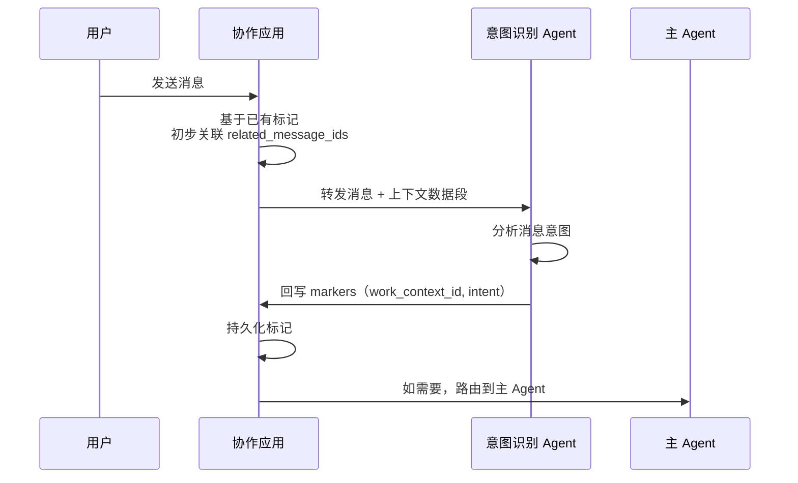
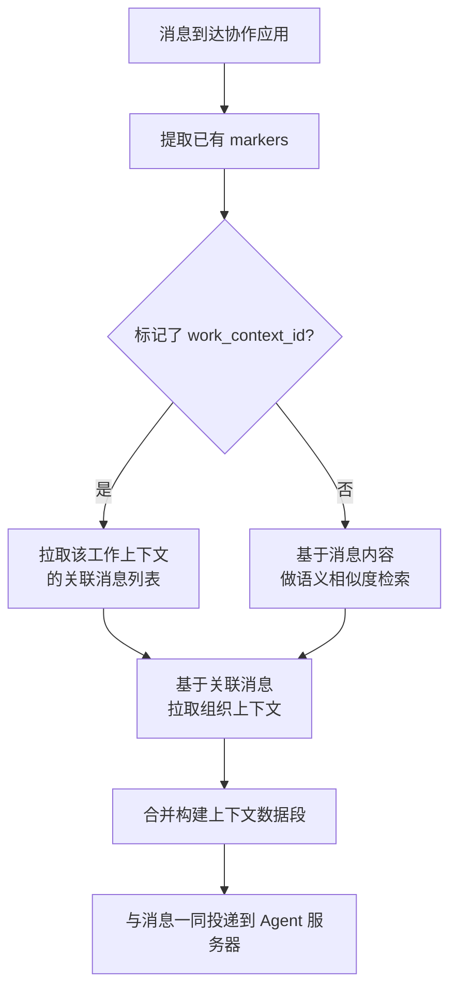

# 消息上下文增强

协作应用不只是消息的"搬运工"——它在转发消息到虚拟员工之前，为消息附加预处理的上下文数据。这显著减少了 Agent 的 token 消耗和重复分析成本。

## 设计动机

如果协作应用仅做"消息转发"，虚拟员工每次收到消息都需要：

1. 通过 tool call 搜索历史消息（消耗 token + 延迟）
2. 遍历所有工作上下文判断关联性（重复计算）
3. 每次对话都重新建立上下文（浪费注意力）

由协作应用在消息到达时做**一次预处理**，所有后续 Agent 都能复用结果。这本质是将"上下文构建"从 Agent 的推理循环中前移到了消息管道中。

## 消息标记（Markers）

### 标记字段定义

```json
"markers": {
  "work_context_id": "wc_xxx | null",
  "intent": "new_task | continuation | simple_reply | null",
  "related_message_ids": ["msg_aaa", "msg_bbb"]
}
```

| 字段 | 写入者 | 写入时机 | 说明 |
|------|--------|---------|------|
| `work_context_id` | 意图识别 Agent | 消息被分析后 | 关联的工作上下文 |
| `intent` | 意图识别 Agent | 消息被分析后 | 意图分类结果 |
| `related_message_ids` | 协作应用 + 意图识别 Agent | 消息发送时 + 分析后 | 关联消息链 |

### 标记生命周期



标记回写 API（协作应用提供给 Agent 服务器）：

```
PUT /api/v1/messages/{message_id}/markers
{
  "work_context_id": "wc_xxx",
  "intent": "new_task"
}
```

### 标记的后续用途

- **上下文构建**：后续消息到达时，基于已有标记快速过滤关联消息（无需每次全量分析）
- **搜索过滤**：用户可按工作上下文筛选历史消息
- **工作追溯**：从消息反向索引到工作上下文，便于审查和复盘

## 前置上下文构建

### 上下文数据段结构

协作应用在转发消息到 Agent 服务器时，构建并附带上下文数据段：

```json
{
  "message": { "...原本的消息..." },
  "context_segment": {
    "recent_work_contexts": [
      {
        "id": "wc_xxx",
        "status": "active",
        "summary": "Q2 销售数据分析",
        "created_at": "...",
        "last_active_at": "..."
      }
    ],
    "related_messages": [
      {
        "id": "msg_yyy",
        "sender": "u_xxx",
        "summary": "帮我分析上季度的销售数据",
        "timestamp": "...",
        "marker_intent": "new_task"
      }
    ],
    "organization_context": {
      "org_id": "org_xxx",
      "org_name": "销售部",
      "org_description": "负责销售数据分析与客户管理",
      "member_ve_ids": ["ve_sales_01", "ve_sales_02"]
    },
    "user_profile": {
      "preferred_language": "zh-CN",
      "role_hint": "business_owner"
    }
  }
}
```

### 构建流程



### RAG 检索策略

上下文构建中的语义检索采用轻量级 RAG 方案：

1. **嵌入模型**：使用与 LLM 独立的低成本嵌入模型（如 text-embedding-3-small），在消息写入时异步生成嵌入向量
2. **检索范围**：当前用户的所有消息 + 工作上下文摘要
3. **Top-K 策略**：返回相似度最高的 5-10 条消息，附带相似度分数
4. **缓存策略**：同一频道的近期消息嵌入结果缓存 5 分钟，减少重复计算

### 上下文数据段的边界

上下文数据段的设计原则：

- **精简**：总 token 控制在 500-1000 以内，仅提供"线索"而非"完整历史"
- **非侵入**：上下文数据段是辅助信息，意图识别 Agent 可以忽略它而自行分析
- **可扩展**：数据段结构支持后续增加字段（如项目里程碑、deadline 等业务上下文）
- **非权威**：上下文数据段是投递时快照，不是持久化权威数据。权威数据仍在消息、markers、工作上下文和协作工具对象中
- **可重建**：Agent Server 发现数据段过期或不可信时，可以请求协作应用基于当前消息重新构建

## 一致性与冲突处理

### 数据权威归属

| 数据 | 权威来源 | 写入者 |
|------|----------|--------|
| 消息内容 | IM 消息表 | 用户、虚拟员工、系统 |
| markers | IM 消息表 | Agent Server 回写，协作应用校验 |
| 工作上下文 | Agent Server Store | Agent Server |
| related messages 摘要 | 协作应用上下文增强服务 | 协作应用异步生成 |
| context segment | 转发时临时快照 | 协作应用构建 |

协作应用可以引用 `work_context_id`，但不拥有工作上下文的完整状态。Agent Server 可以回写 markers，但不直接修改消息正文。

### Markers 冲突

Markers 写入采用版本号控制：

- 协作应用为每条消息维护 `marker_version`。
- Agent Server 回写时携带 `expected_marker_version`。
- 版本一致则写入并递增版本。
- 版本不一致返回冲突错误，Agent Server 读取最新 markers 后重新判断。

冲突处理优先级：

1. 人工指定的 work context 关联优先级最高。
2. 已经进入 `active` 或 `archived` 工作上下文的消息，默认不自动迁移。
3. `related_message_ids` 采用合并去重策略。
4. `intent` 可被更新，但必须保留旧值到审计日志。

### 消息编辑后的处理

用户编辑消息后：

- 如果消息未被转发到 Agent Server，使用新内容构建 context segment。
- 如果消息已被 Intent Agent 处理，协作应用发出 `message.edited` 事件。
- Agent Server 根据工作上下文状态决定是否重新分析。
- 已完成或归档的工作上下文不因消息编辑自动重开。

### 删除消息后的处理

用户删除消息后：

- context segment 不再包含消息正文。
- markers 和 work_context 关联保留，用于审计和追溯。
- 搜索索引移除正文，但保留最小元数据。
- 如果删除的是待处理消息，协作应用向 Agent Server 发送撤销事件。

## 失败降级

上下文增强不能成为消息投递的单点阻塞。失败时按以下策略降级：

| 失败点 | 降级行为 | 是否阻塞消息 |
|--------|----------|--------------|
| markers 查询失败 | 不附带 markers，记录 warning | 否 |
| RAG 检索失败 | 仅使用最近消息和组织上下文 | 否 |
| 嵌入生成失败 | 异步重试，不影响当前消息 | 否 |
| 工作上下文列表查询失败 | context segment 中 `recent_work_contexts` 为空 | 否 |
| 组织上下文查询失败 | 只携带 tenant/channel 基础信息 | 否 |
| Agent Server 不可用 | 消息正常持久化，虚拟员工显示离线或排队 | 否 |

降级后的 context segment 必须带 `degraded` 标记，方便 Intent Agent 调整信任度：

```json
{
  "context_segment": {
    "degraded": true,
    "degrade_reasons": ["rag_unavailable"],
    "recent_work_contexts": [],
    "related_messages": [],
    "organization_context": { "org_id": "org_xxx" }
  }
}
```

## 索引更新策略

消息写入后，索引更新分为同步和异步两部分：

| 阶段 | 内容 | 说明 |
|------|------|------|
| 同步 | 写入消息正文、sequence、基础 markers | 保证消息立即可读 |
| 异步 | 生成 embedding、摘要、全文索引 | 失败可重试 |
| 回写后 | markers 更新索引字段 | 支持按 work_context 和 intent 过滤 |
| 工具产物更新后 | 文档/表格/看板摘要进入统一搜索 | 支持工作成果搜索 |

异步索引任务必须幂等。重复执行同一消息的索引构建，应覆盖同一索引文档而不是创建重复结果。

## 搜索索引

协作应用维护统一的搜索索引（基于 PostgreSQL 全文搜索或 Elasticsearch）：

- IM 消息内容
- 消息标记（按 `work_context_id`、`intent` 过滤）
- 协作文档内容
- 虚拟员工的工作产出摘要

搜索权限跟随租户隔离——用户仅能搜索自己数据空间内的内容。
