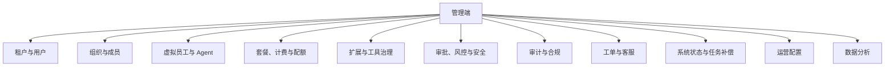

# 管理端技术方案

## 定位

管理端是 Virtual Team 面向内部运营、客服、财务、风控和系统运维的**平台全后台**。它不是普通用户协作应用的一组隐藏页面，也不属于 Flutter 用户端工程。

第一阶段管理端采用独立 Web 应用：

- 前端独立发布，预定技术栈为 Vite + React + React Router 7 + Tailwind CSS + shadcn/ui + Zustand。
- 后端提供独立 Admin API 模块，与用户端 API 在路由、权限、审计和高风险操作审批上隔离。
- 后端 Admin API 第一阶段可以在协作应用服务端内作为独立模块实现，未来可拆成独立管理后台服务。

## 与用户端的边界

| 项 | 用户端 | 管理端 |
|----|--------|--------|
| 目标用户 | 普通用户、租户管理员、虚拟团队使用者 | 平台内部人员 |
| 技术形态 | Flutter Mobile / Desktop / Web | React Web SPA |
| API | `/api/v1`、WebSocket、Tool Action | `/admin/api/v1` |
| 权限模型 | Tenant / Organization / Channel / Object 权限 | Platform Admin RBAC |
| 审计 | 用户、VE、系统任务操作审计 | 平台管理审计，风险等级更高 |
| 发布节奏 | 面向用户稳定发布 | 内部快速迭代，但高风险能力受控 |

管理端可以查看和操作租户数据，但必须通过 Admin API 和审计路径，不能直接访问生产数据库。

## 前端技术栈

| 技术 | 用途 | 约束 |
|------|------|------|
| Vite | 构建、开发服务器、生产打包 | 使用 React + TypeScript 模板 |
| React | UI 框架 | 面向密集后台界面，不追求营销页式表现 |
| React Router 7 | 路由、权限守卫、页面分组 | 第一阶段使用 SPA/Data 路由，不引入 SSR 复杂度 |
| Tailwind CSS | 样式系统 | 作为设计 token 和实用类基础 |
| shadcn/ui | 表单、表格、对话框、导航、命令面板等后台组件 | 组件进入项目源码后由我们维护，不视为黑盒 UI 库 |
| Zustand | 客户端 UI 状态 | 只保存筛选、侧边栏、临时选择、布局偏好等客户端状态 |
| TanStack Query 或等价封装 | 服务端状态 | 负责查询缓存、分页、重试、失效、后台刷新和 optimistic 状态 |

Zustand 不用于保存服务端权威数据。管理端所有资源列表、详情、任务状态和审计查询都应通过 server-state 层管理。

完整选型矩阵见[技术选型与配套设施](./technology-selection.md)。管理端默认补充：

- 表格：TanStack Table，超大企业表格再评估 AG Grid。
- 表单：React Hook Form。
- 校验：Zod。
- 图表：Recharts 或 ECharts，按运营分析复杂度选择。
- 测试：Vitest、Testing Library、Playwright。

管理端前端只通过 Admin API 获取服务端数据，不直连用户端 API，也不直接读取生产数据库。

## 信息架构



### 平台全后台能力

| 模块 | 基础能力 |
|------|----------|
| 租户与用户 | 租户检索、状态、成员、封禁/解封、登录风险、数据概览 |
| 组织与成员 | 组织树查看、成员排查、租户管理员协助 |
| 虚拟员工与 Agent | VE 状态、Runtime、配置包、工具白名单、Agent Server 连接状态 |
| 套餐、计费与配额 | 套餐、账单、用量、资源限额、试用、退款或补偿记录 |
| 扩展与工具治理 | 第一方扩展启用状态、版本、迁移状态、异常对象 |
| 审批、风控与安全 | 高风险操作审批、策略命中、异常调用、权限变更 |
| 审计与合规 | 操作审计、数据导出审计、管理员行为追溯 |
| 工单与客服 | 用户问题、租户上下文、处理记录、内部备注 |
| 系统状态与任务补偿 | 服务健康、队列积压、失败任务、重试、死信、索引重建 |
| 运营配置 | 公告、灰度、功能开关、套餐展示、模板推荐 |
| 数据分析 | 注册、活跃、留存、资源消耗、VE 使用、工具使用和转化指标 |

## 管理端角色

| 角色 | 权限范围 |
|------|----------|
| Platform Super Admin | 全部平台管理能力，必须最小人数和强 MFA |
| Operations Admin | 租户、用户、配置、扩展、运营活动 |
| Support Agent | 工单处理、租户只读诊断、有限协助操作 |
| Finance Admin | 套餐、账单、发票、退款、计费异常 |
| Risk Reviewer | 风控事件、高风险操作审批、封禁复核 |
| System Operator | 系统状态、队列、任务补偿、索引重建、服务降级 |
| Read-only Auditor | 审计、报表和合规查询，只读 |

角色权限必须支持按能力、资源范围和风险等级拆分。普通租户管理员不是平台管理端用户。

## Admin API 边界

管理端 API 使用独立前缀：

```text
/admin/api/v1
```

基础资源分组：

| 分组 | 示例 |
|------|------|
| `/admin/tenants` | 租户查询、状态、封禁、配额调整 |
| `/admin/users` | 用户检索、登录状态、风险标记 |
| `/admin/ves` | VE 状态、Runtime、配置诊断、停用 |
| `/admin/billing` | 套餐、账单、用量、财务调整 |
| `/admin/extensions` | 扩展启用、版本、迁移、异常 |
| `/admin/audits` | 审计查询和导出 |
| `/admin/support` | 工单、客服备注、处理记录 |
| `/admin/ops` | 队列、失败任务、重试、索引重建 |
| `/admin/analytics` | 指标查询、报表导出 |

### AdminAction

高风险管理操作必须封装为 `AdminAction`，而不是普通 CRUD。

```ts
type AdminAction = {
  action_name: string;
  target: {
    type: "tenant" | "user" | "ve" | "billing" | "extension" | "job" | "audit";
    id: string;
  };
  reason: string;
  risk_level: "low" | "medium" | "high" | "critical";
  request_id: string;
  idempotency_key: string;
};
```

高风险操作包括：

- 租户封禁、解封、删除或数据导出。
- 配额、套餐、账单、退款和赠送额度调整。
- VE 停用、强制重启、配置回滚。
- 扩展禁用、迁移重跑、对象批量修复。
- 审计日志导出。
- 失败任务批量重试或死信恢复。

这些操作必须记录 `reason`，写入独立 admin audit，并按风险等级要求二次确认或审批。

## 安全与审计

管理端安全要求高于用户端：

- 强制 MFA。
- 管理端 session 与用户端 session 隔离。
- 支持 IP allowlist 或企业 SSO 条件访问。
- 所有写操作写 admin audit。
- 高风险读操作也写审计，例如导出审计日志、查看敏感租户详情。
- 管理端禁止直接展示密钥、token、完整隐私正文；必要时使用脱敏视图。
- 支持 break-glass 账号，但必须单独审计和告警。

## 后端部署与演进

第一阶段：

- 管理端前端独立静态部署。
- Admin API 作为协作应用服务端内的 `collab-admin` 模块。
- 共用主数据库，但通过 admin repository 和审计层访问，不直连私有表。

未来拆分：

- Admin API 可独立为 `admin-service`。
- 管理端前端只依赖 Admin API，不直接调用用户端 API。
- 审计、工单、计费和运营配置可按业务增长进一步拆分。

## 验收标准

- 管理端不能使用普通用户 JWT 调用。
- 管理端角色缺少权限时，API 返回明确拒绝并写审计。
- 高风险操作没有 `reason`、二次确认或审批时不能执行。
- 管理端可以查看失败任务并触发单条重试，但不能绕过幂等键造成重复执行。
- 管理端前端状态刷新后，服务端权威数据不丢失，Zustand 中仅保留 UI 状态。
