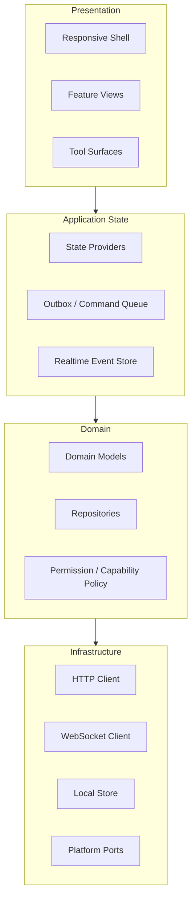
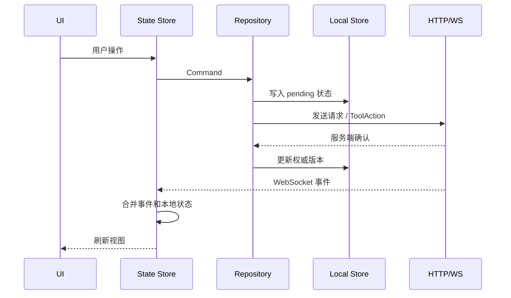

# 客户端架构

## 定位

协作应用客户端采用 Flutter 单代码库，覆盖 Mobile、Desktop 和 Web。统一的是协议、领域模型、状态、缓存、同步和权限语义；差异化的是屏幕布局、输入方式、系统通知、文件能力、深链、窗口能力和平台权限。

基础版客户端不承诺运行时加载第三方 Flutter 插件。协作工具 UI 通过第一方 Tool Surface 随应用发布，远期第三方能力优先通过 Schema/Card 或 WebView sandbox 承载。

## 分层结构



| 层 | 职责 |
|----|------|
| Presentation | 响应式外壳、页面、组件、工具承载面和用户交互 |
| Application State | 登录态、租户上下文、频道消息状态、工具对象状态、发送队列和实时事件合并 |
| Domain | 领域模型、仓储接口、权限判断、平台能力声明和错误语义 |
| Infrastructure | HTTP、WebSocket、本地缓存、安全存储、文件选择、通知、深链和窗口能力 |

## 代码组织

```text
lib/
├── app/
│   ├── app.dart
│   ├── router.dart
│   └── shell/
│       ├── responsive_shell.dart
│       ├── mobile_shell.dart
│       ├── desktop_shell.dart
│       └── web_shell.dart
├── core/
│   ├── auth/
│   ├── http/
│   ├── websocket/
│   ├── storage/
│   ├── sync/
│   ├── errors/
│   └── platform/
│       ├── notification_port.dart
│       ├── file_port.dart
│       ├── deep_link_port.dart
│       ├── window_port.dart
│       └── secure_storage_port.dart
├── features/
│   ├── chat/
│   ├── contacts/
│   ├── organizations/
│   ├── search/
│   ├── tools/
│   └── settings/
└── shared/
    ├── theme/
    ├── widgets/
    └── utils/
```

平台判断只能出现在 `app/shell`、`core/platform` 或功能域的明确适配视图中。业务仓储、协议 DTO、同步逻辑和权限逻辑不得散落平台分支。

## 多端布局策略

布局由可用宽度和交互能力共同决定，而不是简单等同于操作系统。

| 场景 | 基础版策略 |
|------|------------|
| 窄屏 Mobile | 单列导航，频道列表、消息流、详情页分步进入 |
| 中等宽度 Tablet/Web | 双列布局，频道列表 + 当前会话 |
| 宽屏 Desktop/Web | 多栏布局，导航、频道列表、消息流、右侧详情或工具面板并存 |
| 触摸输入 | 提供大触控目标、长按菜单、软键盘避让 |
| 鼠标键盘 | 支持 hover、右键菜单、快捷键和拖拽上传 |

同一功能必须定义窄屏和宽屏验收状态。例如消息线程在窄屏中作为独立页面打开，在宽屏中作为右侧面板打开；两者使用同一线程数据源和同步逻辑。

## 状态与数据流

客户端采用“服务端权威、本地缓存加速”的模型。



客户端必须区分：

- `pending`：本地已提交，服务端未确认。
- `confirmed`：服务端已持久化并返回权威序号或版本。
- `failed_retryable`：可自动重试。
- `failed_final`：不可自动重试，需要用户或 VE 处理。
- `conflicted`：服务端版本与本地基线不一致。

## 网络协议客户端

| 客户端组件 | 职责 |
|------------|------|
| HTTP Client | 登录、历史消息、搜索、对象查询、文件上传、管理类操作 |
| WebSocket Client | 实时事件、消息回显、在线状态、通知、对象变更事件 |
| Tool Action Client | 通过 JSON-RPC 或 REST wrapper 调用工具扩展动作 |
| Sync Client | 管理 `event_cursor`、频道 `sequence`、断线补拉和事件去重 |

所有写请求必须携带 `client_request_id` 或 `idempotency_key`。WebSocket 重连后，客户端使用上次确认的 `event_cursor` 补拉缺失事件，再合并本地 pending 队列。

## 平台网络策略

客户端必须显式区分不同平台的网络能力。移动端不能把 WebSocket 当作后台可靠通道；桌面端可以更积极地维持长连接；Web 端受浏览器页面生命周期和 Service Worker 能力限制。

### NetworkPolicy

```ts
type NetworkPolicy = {
  realtimeTransport: "websocket";
  foregroundMode: "realtime";
  backgroundMode: "push_then_sync" | "keepalive_best_effort" | "suspended";
  reconnect: {
    strategy: "exponential_backoff_with_jitter";
    minDelayMs: number;
    maxDelayMs: number;
    resetAfterStableMs: number;
  };
  syncOnResume: boolean;
  usePushAsAuthority: false;
};
```

| 平台 | 前台策略 | 后台策略 | 恢复策略 |
|------|----------|----------|----------|
| iOS / Android | WebSocket 实时收发 | 依赖 APNs/FCM 提醒，不承诺后台常驻连接 | 应用回前台后按 `event_cursor` 和频道 `sequence` 补拉 |
| Desktop | WebSocket 常连接，支持系统睡眠/唤醒检测 | 应用未退出时可 best-effort 保持连接 | 唤醒或断线后补拉事件并重放 outbox |
| Web | 页面活跃时 WebSocket | 页面冻结、关闭后依赖 Web Push 和 Service Worker 能力 | 页面重新打开后补拉权威状态 |

移动端不得默认申请电池优化豁免。只有当后续产品形态进入企业级强实时通讯，并且平台政策允许时，才可作为单独能力评估。

## 本地缓存与离线策略

基础版离线策略不要求完整离线编辑，但必须支持弱网和短暂断线。

| 数据 | 本地策略 |
|------|----------|
| 登录态 | 使用平台安全存储保存 refresh token 或等效凭据 |
| 频道列表 | 缓存最近访问频道和 unread 摘要 |
| 消息 | 按频道缓存最近窗口，保留 sequence 和编辑状态 |
| 草稿 | 本地持久化，按频道、线程和工具对象隔离 |
| 发送队列 | 保存 pending command，重连后按幂等键重放 |
| 工具对象 | 缓存对象壳、预览、最近打开内容和版本号 |

文件上传不要求离线；离线选择的文件只保留本地 pending 引用，真正上传必须等网络恢复后由用户确认或自动继续。

### StoragePolicy

本地存储是性能优化和弱网缓冲，不是权威数据源。缓存容量按平台设置产品上限，而不是依赖底层数据库理论上限。

```ts
type StoragePolicy = {
  authority: "server";
  cacheBackend: "sqlite" | "indexeddb" | "memory";
  softLimitMb: number;
  hardLimitMb: number;
  eviction: "lru_by_channel_and_object";
  encryptedScopes: Array<"tokens" | "drafts" | "message_cache" | "file_cache">;
  localSearch: "none" | "recent_cache_only";
};
```

| 平台 | 缓存后端 | 建议软上限 | 建议硬上限 | 本地搜索 |
|------|----------|------------|------------|----------|
| Mobile | SQLite + 安全存储 | 512 MB | 2 GB | 最近缓存消息和对象预览，可用 SQLite FTS |
| Desktop | SQLite + 文件缓存 | 5 GB | 20 GB | 最近缓存 + 常用频道，可用 SQLite FTS |
| Web | IndexedDB / Cache API | 200 MB | 由浏览器配额决定 | 默认不承诺完整本地全文搜索 |

清理规则：

- 优先保留最近会话、未发送 outbox、草稿、未上传文件引用和最近打开工具对象。
- 可清理已同步的旧消息窗口、旧附件缩略图、已关闭频道缓存和过期搜索索引。
- Web 端必须能处理浏览器清空整个 origin 数据后的冷启动。
- Enterprise 版本可评估加密本地数据库，但基础版只强制保护 token、密钥和敏感凭据。

## Tool Surface

客户端必须通过 Tool Surface 承载协作工具 UI。

| Surface | 基础版用途 |
|---------|------------|
| Flutter native | 看板、审批、日程、定时器、轻量文档/表格基础界面 |
| Schema/Card | 消息卡片、对象预览、审批卡片、工作摘要、简单表单 |
| WebView sandbox | 文档/表格完整形态或远期第三方工具承载面 |

Tool Surface 只能通过 Tool Action Client 与服务端交互，不允许直接访问扩展内部存储。WebView sandbox 必须使用受控 message bridge，不继承主应用完整权限。

## 平台能力适配

| 能力 | Mobile | Desktop | Web |
|------|--------|---------|-----|
| 通知 | APNs/FCM 与本地通知 | 应用内通知，系统通知作为增强 | 浏览器通知/Web Push 作为增强 |
| 文件 | 系统文件选择、相册权限 | 文件选择、拖拽上传 | 浏览器文件选择、拖拽，受沙盒限制 |
| 深链 | Universal Link / App Link | 自定义协议或系统链接 | URL 路由 |
| 窗口 | 单窗口 | 基础版使用应用内多面板，独立窗口后续增强 | 浏览器标签页 |
| 安全存储 | Keychain/Keystore | 系统凭据存储 | 浏览器安全存储能力受限 |

业务层只能依赖 `core/platform` 中的 capability 接口。例如工具页面需要导出文件时，先查询 `FilePort.canExport()`，再决定展示下载、分享或不可用状态。

### NotificationPolicy

```ts
type NotificationPolicy = {
  channel: "apns" | "fcm" | "web_push" | "desktop_notification" | "in_app";
  supportsBackgroundWake: boolean;
  requiresUserPermission: boolean;
  payloadAuthority: "hint_only";
  syncAfterOpen: true;
};
```

| 平台 | 通道 | 设计约束 |
|------|------|----------|
| iOS | APNs，可通过 FCM 间接接入 | 用户关闭通知或应用被强制结束时，不能保证后台处理；点击或回前台后必须补拉 |
| Android | FCM | 高优先级只用于时间敏感且用户可见内容；不能滥用为后台同步通道 |
| Desktop | 系统通知 + 应用内通知 | 应用运行时可更可靠；系统睡眠后仍需恢复补拉 |
| Web | Web Push + Notifications API | 依赖授权、Service Worker 和浏览器支持；只作为提醒 |

推送 payload 只携带最小信息：通知类型、资源 ID、租户 ID、事件游标提示和展示摘要。完整消息正文和工具对象内容仍通过认证 API 拉取。

## 发布矩阵

### ReleaseTarget

```ts
type ReleaseTarget = {
  platform: "ios" | "android" | "macos" | "windows" | "linux" | "web";
  buildHost: "macos" | "windows" | "linux" | "ci";
  signingRequired: boolean;
  storeReview: "required" | "optional" | "none";
  permissionsChecklist: string[];
  rollback: "store_phased_release" | "installer_previous_version" | "web_static_rollback";
};
```

| 平台 | 构建与发布 | 必验能力 |
|------|------------|----------|
| iOS | macOS CI 构建，Apple 签名，TestFlight / App Store | APNs、后台恢复、Universal Link、文件选择、Keychain |
| Android | keystore 签名，Play Console 或企业分发 | FCM、Doze 恢复、App Links、文件权限、Keystore |
| macOS | macOS 构建，签名和 notarization，App Store 或独立分发 | 系统通知、深链、文件拖拽、窗口恢复 |
| Windows | Windows 构建，MSIX/安装包，代码签名 | 系统通知、深链、文件拖拽、自动更新 |
| Linux | Linux 构建，deb/rpm/Snap/Flatpak 选型 | 文件门户、通知、桌面入口、沙盒差异 |
| Web | 静态资源部署，CDN 回滚 | Service Worker、Web Push、IndexedDB 清理、浏览器兼容 |

发布验收不能只跑 Flutter 通用测试。每个平台必须单独验证通知、弱网恢复、深链、文件、权限、本地缓存、登出清理和升级兼容。

## 客户端验收标准

- 同一账号在两个设备登录，发送、编辑、删除、反应和线程回复可以通过 WebSocket 实时同步。
- 断网发送消息进入 pending 队列，恢复网络后按幂等键重放，不产生重复消息。
- 窄屏和宽屏都能完成频道切换、消息发送、线程查看、对象预览和基础工具操作。
- Agent Server 不可用时，虚拟员工入口显示离线或排队，普通 IM 和协作工具仍可使用。
- Tool Surface 无法绕过 Tool Action Client 直接访问服务端私有接口。
- 移动端应用从后台恢复后，必须通过游标补拉校正状态，不能依赖推送 payload 作为权威数据。
- Web 端清空站点数据后，应能重新登录并从服务端恢复最近状态。
