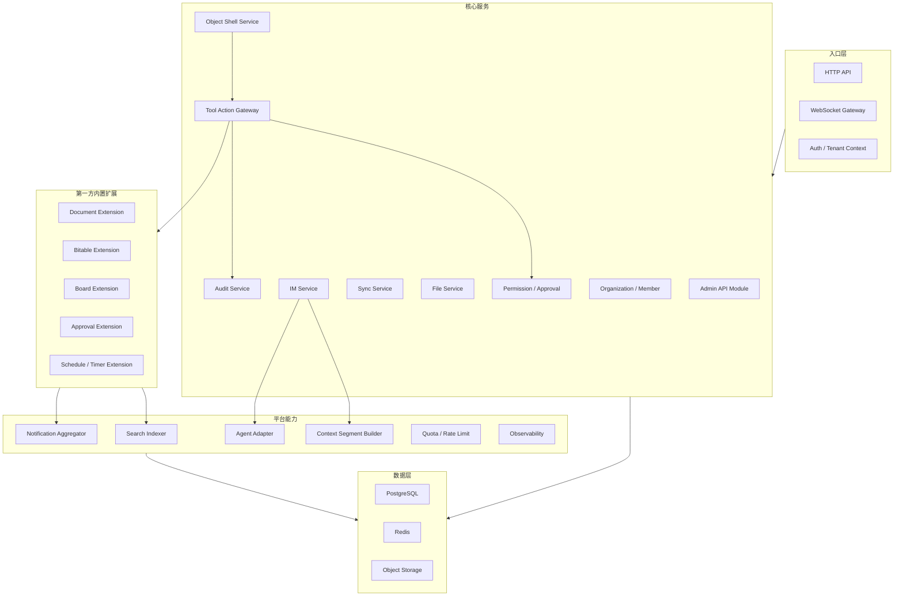
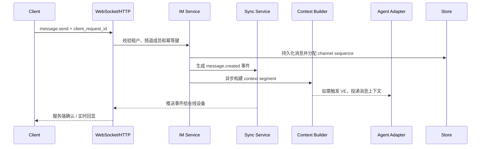
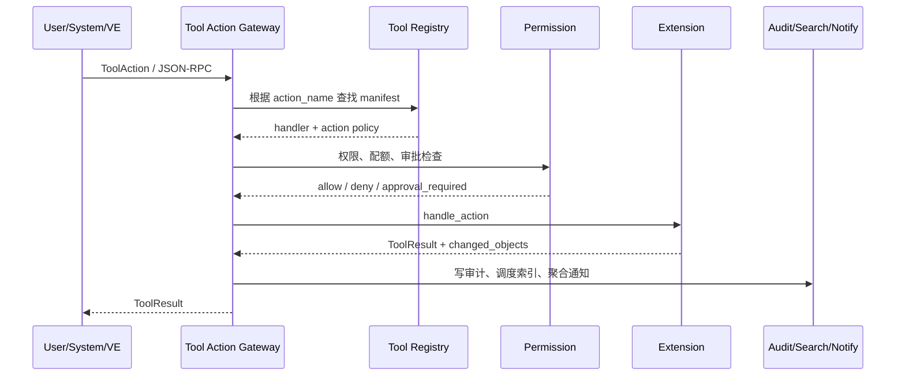
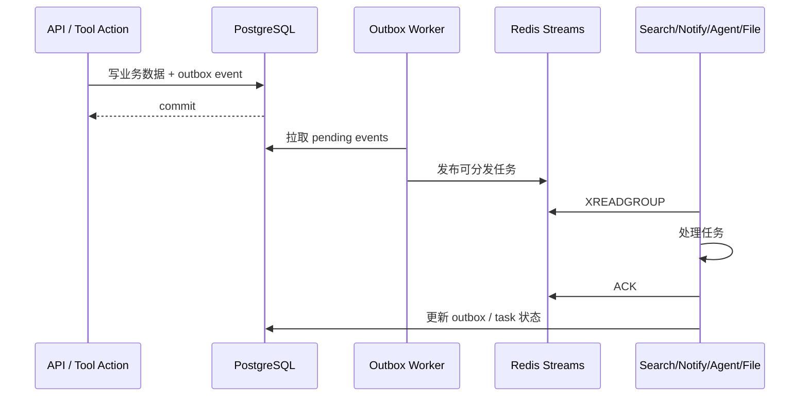

# 服务端架构

## 定位

协作应用服务端是独立的 IM 与协作平台服务。基础版采用模块化单体优先的方式组织代码，内部以清晰模块边界和事件接口隔离职责；远期可按网关、IM、工具平台、搜索、通知等边界拆分服务。

Agent Server 是外部接入方。协作应用服务端可以向 Agent Server 转发消息、接收 markers 回写、接收 VE 主动通知和代理 VE 调用 Tool Action，但不能把 Agent Server 作为自身核心能力的运行前提。

## 模块视图



## 模块职责

| 模块 | 职责 |
|------|------|
| HTTP API | REST 查询、管理类操作、文件上传签名、Tool Action JSON-RPC 入口 |
| WebSocket Gateway | 连接管理、认证、心跳、事件推送、断线重连 |
| Auth / Tenant Context | JWT/API Key 校验、租户上下文注入、Actor 解析 |
| Organization / Member | 租户、组织、成员、频道成员和虚拟员工成员类型 |
| IM Service | 频道、消息、线程、反应、编辑、软删除、markers 和消息路由 |
| Sync Service | 事件序号、频道 sequence、补拉、去重和多端同步 |
| File Service | 上传签名、附件元数据、对象存储引用、下载权限 |
| Object Shell Service | 协作对象通用壳、生命周期、引用、权限策略和索引状态 |
| Tool Action Gateway | 统一接收用户、系统、VE 的工具动作，调度扩展并写入审计 |
| Permission / Approval | 权限判断、配额、风险等级和审批要求 |
| Admin API Module | 管理端专用 API、Admin RBAC、高风险操作审批和独立审计 |
| First-party Extensions | 文档、表格、看板、审批、日程/定时器的业务数据和操作语义 |
| Search Indexer | 消息和工具对象索引调度、权限过滤、重建任务 |
| Notification Aggregator | 消息通知、工具变更摘要、审批卡片和工作摘要聚合 |
| Context Segment Builder | markers、近期消息、组织上下文和相关对象摘要构建 |
| Agent Adapter | 消息转发、markers 回写、VE 主动通知、Tool Action 代理 |
| Observability | request id、日志、指标、追踪和健康检查 |

## 代码边界建议

```text
crates/
├── collab-server/              # 进程入口、配置、Router 装配
├── collab-gateway/             # HTTP / WebSocket / auth middleware
├── collab-domain/              # 共享领域模型、Actor、错误、权限语义
├── collab-im/                  # 频道、消息、线程、markers、presence
├── collab-sync/                # event cursor、sequence、补拉与去重
├── collab-tool-platform/       # Object Shell、Registry、Action Gateway
├── collab-extensions/          # 第一方内置扩展集合
├── collab-search/              # 索引任务与查询
├── collab-notification/        # 通知聚合与投递
├── collab-context/             # context segment 构建
├── collab-agent-adapter/       # Agent Server 对接协议
├── collab-admin/               # 管理端 API、Admin RBAC、平台全后台操作
└── collab-observability/       # tracing、metrics、audit helpers
```

这只是工程边界建议，不要求第一阶段拆成多个独立进程。关键约束是模块之间不能绕过领域接口直接修改彼此数据。

## 核心流程

### 用户发送消息



上下文增强和 Agent 转发不能阻塞消息持久化。Agent Server 不可用时，消息仍然进入频道历史，虚拟员工状态显示离线、排队或失败。

### 工具动作调用



扩展不得直接向 VE 暴露未声明接口。涉及删除、外发、批量修改、权限变更或高成本执行的动作必须支持 `require_approval`。

### Agent 接入

Agent Adapter 只负责协议边界，不承载虚拟员工推理逻辑。

| 方向 | 能力 | 说明 |
|------|------|------|
| 协作应用 -> Agent Server | 消息转发 | 携带消息、频道、sender、recipient、markers 和 context segment |
| Agent Server -> 协作应用 | 回复消息 | 作为虚拟员工 sender 写入 IM |
| Agent Server -> 协作应用 | markers 回写 | 更新消息与工作上下文的关联 |
| Agent Server -> 协作应用 | 主动通知 | 写入工作摘要、审批卡片或状态消息 |
| Agent Server -> 协作应用 | Tool Action 调用 | 以 VE Actor 身份调用已暴露动作 |

## 内部事件

服务端内部通过领域事件解耦同步、搜索、通知、审计和 Agent 转发。

| 事件 | 产生方 | 消费方 |
|------|--------|--------|
| `message.created` | IM Service | Sync、Search、Notification、Context、Agent Adapter |
| `message.updated` | IM Service | Sync、Search、Context、Agent Adapter |
| `message.deleted` | IM Service | Sync、Search、Audit |
| `message.markers.updated` | IM / Agent Adapter | Sync、Context、Audit |
| `tool.object.created` | Tool Action Gateway | Sync、Search、Notification、Audit |
| `tool.object.updated` | Tool Action Gateway | Sync、Search、Notification、Audit |
| `approval.required` | Permission / Tool Action | Notification、IM |
| `schedule.triggered` | Schedule Extension | Agent Adapter、Notification |

事件至少需要包含 `tenant_id`、`actor`、`request_id`、`correlation_id`、发生时间和资源标识。

## Outbox 与队列

所有会触发跨模块副作用的写操作，都必须在同一数据库事务中写入业务数据和 outbox 事件。搜索索引、通知聚合、Agent 转发、文件处理、导出、日程触发和管理端任务补偿都从 outbox 或队列消费。



规则：

- `NOTIFY` 或 Redis Pub/Sub 只能作为唤醒信号，不作为权威事件存储。
- Redis Streams 可用于 worker fanout、consumer group、pending entry 和重试分发，但不替代 PostgreSQL outbox。
- 每个 outbox event 必须有 `event_id`、`event_type`、`tenant_id`、`aggregate_type`、`aggregate_id`、`version`、`correlation_id`、`idempotency_key`。
- consumer 必须幂等；重复消费同一 `event_id` 不得产生重复消息、通知、索引或外部调用。
- 死信任务必须可由管理端查看、重试、跳过或标记为人工处理。

## 可拆分模块契约

模块化单体内也必须按未来服务边界编码。每个可拆模块都要声明以下契约：

| 契约 | 说明 |
|------|------|
| Owned Data | 模块拥有的表、索引、缓存 key 和对象存储路径 |
| Public API | 模块对其他模块暴露的 Rust trait / service API |
| Domain Events | 模块发布和订阅的事件类型 |
| Background Jobs | 模块负责的异步任务、重试和死信规则 |
| Idempotency | 写操作和事件消费的幂等键 |
| Quota / Rate Limit | 租户、用户、VE 或系统维度的限制 |
| Metrics | 模块健康、延迟、错误率、积压和资源使用 |
| Split Readiness | 拆成独立进程时需要替换的调用方式和数据访问方式 |

模块之间不得直接读写私有表。确实需要跨模块读取时，只能通过 public API、查询投影或事件构建的 read model。

## 存储边界

| 存储 | 基础版用途 |
|------|------------|
| PostgreSQL | 权威业务数据、消息、对象壳、扩展数据、权限、审计、索引状态 |
| Redis | WebSocket presence、短期缓存、速率限制、事件 fanout 或任务队列 |
| S3 兼容对象存储 | 文件附件、图片、导出文件和缩略图 |

第一阶段可以使用 PostgreSQL 内置全文搜索作为统一搜索基础。搜索系统不可作为写路径强依赖；索引失败时记录状态并异步重试。

## 部署边界

基础版推荐模块化单体部署：

- 一个协作应用 API/WS 服务进程。
- 一个或多个后台 worker 处理搜索索引、通知聚合、导出、清理和定时任务。
- PostgreSQL、Redis、对象存储作为外部依赖。
- 管理端前端独立部署，Admin API 先作为服务端内独立模块。

### 拆分顺序

| 顺序 | 模块 | 拆分触发 | 拆分后边界 |
|------|------|----------|------------|
| 1 | WebSocket Gateway | 连接数、广播延迟、内存压力 | 独立连接层，通过事件总线和 IM API 读写 |
| 2 | Background Worker | outbox 积压、索引/通知/导出互相影响 | 独立 worker pool，按任务类型水平扩容 |
| 3 | Search Service | 索引延迟、查询压力、搜索引擎迁移 | 只拥有索引和查询投影，不拥有权威业务数据 |
| 4 | Notification Service | 推送失败、聚合延迟、外部通道复杂 | 拥有通知状态、投递记录和补偿队列 |
| 5 | File Service | 上传带宽、缩略图、扫描、导出压力 | 拥有文件元数据和对象存储操作入口 |
| 6 | Admin API | 内部操作风险、权限隔离、客服/运营高频使用 | 独立 admin-service，仍通过核心服务 API 操作权威数据 |
| 7 | Agent Adapter | Agent Server 转发延迟、VE 事件压力 | 独立接入服务，消费消息事件并调用协作应用 API |

拆分后仍必须保持同一协议、同一权限语义、同一审计规则和同一数据所有权规则。

### 扩容策略

| 压力点 | 第一阶段策略 | 远期策略 |
|--------|--------------|----------|
| WebSocket 连接 | 多实例 + Redis presence / fanout | 独立 Gateway，按连接数水平扩容 |
| 消息写入 | PostgreSQL 分区、索引优化、批量 fanout | IM Service 独立，必要时按租户或频道分片 |
| 搜索 | PostgreSQL 全文搜索 + 异步索引 | 独立搜索服务，迁移 Elasticsearch/OpenSearch 或等价方案 |
| 通知 | 聚合窗口 + 后台 worker | 独立通知服务，按通道扩容 |
| 工具动作 | Tool Action Gateway 限流和队列化高成本动作 | 工具平台独立服务或按扩展拆分 worker |
| 管理端查询 | Admin API 分页、只读投影、导出异步化 | 独立 admin-service 和 BI/分析投影 |

## 服务端验收标准

- 无 Agent Server 时，登录、频道、消息、搜索和基础协作工具可独立运行。
- 所有写请求具备幂等处理和审计记录。
- 用户、VE 和系统任务调用工具动作都经过同一 Tool Action Gateway。
- 搜索、通知、Agent 转发失败不会回滚已持久化消息或工具对象。
- 每条消息和每个工具动作都能通过 correlation id 串起入口请求、内部事件、审计和后台任务。
- 每个可拆模块都有数据所有权、事件、任务、幂等和指标契约，不能以“以后再拆”为理由跨模块直接写表。
