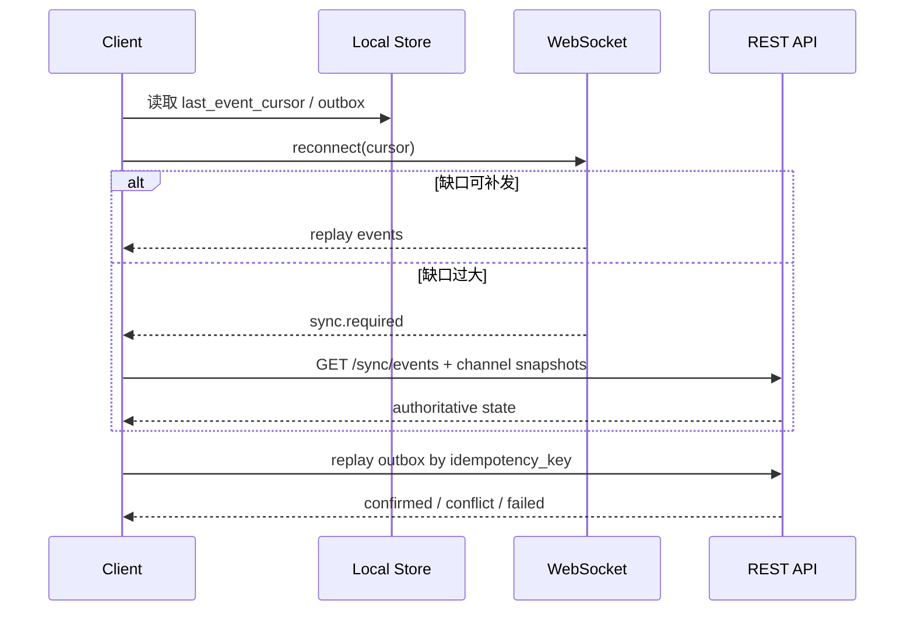

# 同步、可靠性与观测

## 定位

协作应用的基础体验取决于消息实时性、多端一致性、弱网恢复、后台任务可靠性和问题可追踪性。本文冻结基础版的同步语义、降级策略、错误处理和可观测性要求。

## 实时连接

WebSocket 是实时事件主通道。HTTPS REST 用于历史补拉、管理操作和降级查询。

连接生命周期：

1. 客户端携带 JWT 建立 WebSocket。
2. 服务端校验 token，注入 tenant、user、device 和 connection id。
3. 客户端提交最近确认的 `event_cursor`。
4. 服务端补发缺失事件或要求 REST 全量补拉。
5. 双方按心跳维持连接。
6. 断线后客户端指数退避重连。

心跳策略：

| 项 | 基础版要求 |
|----|------------|
| ping 间隔 | 20-30 秒 |
| pong 超时 | 10 秒级别 |
| 最大连续失败 | 2-3 次后断开并重连 |
| token 过期 | 服务端发送 auth 事件，客户端刷新后重连 |

## 投递与同步语义

| 对象 | 语义 |
|------|------|
| 消息写入 | 服务端持久化成功后才分配 sequence 并广播 |
| 实时事件 | at-least-once，客户端按 event id 或 seq 去重 |
| 频道消息 | 频道内 sequence 单调递增 |
| 工具对象 | 使用 object version 做乐观并发 |
| markers | 使用 marker version 做冲突检测 |
| 通知 | 可聚合、可延迟，但审批类通知必须可靠投递或可补查 |

客户端不得把 WebSocket 推送视为唯一权威。断线、切后台或事件缺口过大时，必须通过 REST 补拉权威状态。

## 幂等与重试

所有写操作必须支持幂等。

| 操作 | 幂等键 |
|------|--------|
| 发送消息 | `client_request_id` |
| 编辑消息 | `message_id + base_edited_at` 或版本 |
| Tool Action | `idempotency_key` |
| 文件上传完成 | `upload_intent_id` |
| markers 回写 | `message_id + expected_marker_version` |
| Agent 主动通知 | `agent_notification_id` |

服务端需要保存幂等结果窗口。相同幂等键重复请求时，返回第一次成功的结果；如果第一次仍在处理中，返回 pending 或可重试错误，不创建重复资源。

## 客户端断线恢复

恢复后客户端必须：

- 先合并服务端权威事件，再重放本地 outbox。
- 对重复事件去重。
- 对版本冲突进入冲突状态，不自动覆盖服务端版本。
- 对不可重试错误提示用户或让 VE 生成后续处理说明。

## 后台任务可靠性

搜索索引、通知聚合、导出、对象清理、日程触发等后台任务必须使用可重试任务模型。

| 任务 | 失败策略 |
|------|----------|
| 搜索索引 | 标记 `search_state = failed`，指数退避重试，可人工重建 |
| 通知聚合 | 可短暂延迟；审批通知失败时进入待补偿队列 |
| 文件处理 | 缩略图或扫描失败不影响附件元数据，但标记处理状态 |
| 导出任务 | 返回异步任务状态，失败可重试 |
| 日程触发 | 使用触发记录防重复，失败后按策略重试或标记 missed |
| Agent 转发 | Agent Server 不可用时排队或标记 VE 离线，不回滚消息 |
| Admin Action | 高风险操作失败时保持原状态，写入 Admin Audit，可进入人工复核 |

后台任务必须带 `correlation_id`，能关联到触发它的用户操作或系统事件。

## 降级策略

| 依赖失败 | 用户感知 | 系统行为 |
|----------|----------|----------|
| Agent Server 不可用 | 虚拟员工离线、排队或暂不可用 | IM 正常；消息可持久化；Agent 转发排队或失败记录 |
| 搜索不可用 | 搜索提示暂不可用或结果不完整 | 权威数据读写正常；索引任务重试 |
| 对象存储不可用 | 文件上传/下载失败 | 文本消息和工具对象不受影响 |
| Redis 不可用 | 在线状态、广播或限流能力降级 | 可回退数据库查询和轮询，必要时进入只读保护 |
| 通知服务不可用 | 推送延迟 | 应用内消息和通知中心仍保留记录 |
| 单个扩展失败 | 该工具操作失败 | 其他 IM 和工具能力不受影响 |
| 上下文增强失败 | VE 可能缺少辅助上下文 | 消息投递不阻塞，context segment 标记 degraded |

降级不得隐藏权限错误。权限拒绝必须明确返回，不应被包装成依赖不可用。

## 错误分类

| 类型 | 示例 | 客户端策略 |
|------|------|------------|
| 可自动重试 | 网络超时、`RATE_LIMITED`、部分 `DEPENDENCY_UNAVAILABLE` | 退避重试，尊重 `Retry-After` |
| 需用户处理 | 权限不足、审批要求、版本冲突 | 停止自动重试，展示可理解状态 |
| 需重新登录 | token 过期、refresh 失败 | 引导登录 |
| 需系统补偿 | 通知失败、索引失败、Agent 转发失败 | 后台重试，用户只看到延迟或状态提示 |

工具动作如果返回 `APPROVAL_REQUIRED`，客户端应进入审批流程，而不是当作失败重试。

## 可观测性

### 标识

| 标识 | 说明 |
|------|------|
| `request_id` | 单次入口请求唯一标识 |
| `correlation_id` | 贯穿消息、工具动作、通知、Agent 转发和后台任务的业务关联 |
| `event_id` | 实时事件唯一标识 |
| `client_request_id` | 客户端写操作幂等键 |
| `idempotency_key` | Tool Action 幂等键 |

### 日志

结构化日志至少包含：

- 时间、级别、服务模块。
- tenant、actor type、actor id。
- request id、correlation id。
- action、resource type、resource id。
- 结果、错误码、耗时。

日志不得输出完整敏感正文、token、API Key 或文件内容。

### 指标

基础指标：

| 类别 | 指标 |
|------|------|
| WebSocket | 在线连接数、连接建立失败率、重连次数、心跳超时 |
| IM | 消息写入 QPS、消息持久化延迟、广播延迟、重复请求命中 |
| 同步 | 补拉次数、事件缺口大小、sync.required 次数 |
| Tool Action | 调用次数、成功率、审批要求次数、版本冲突次数、各扩展耗时 |
| 搜索 | 索引延迟、失败任务数、查询延迟 |
| 通知 | 聚合延迟、投递成功率、审批通知待补偿数 |
| Agent Adapter | 转发成功率、Agent Server 超时、markers 回写冲突 |
| Admin API | 管理端登录失败、权限拒绝、高风险操作审批、Admin Action 成功率 |
| Worker / Outbox | outbox 积压、消费延迟、重试次数、死信数量 |

### 追踪

需要追踪的典型链路：

- 用户发送消息 -> 持久化 -> WebSocket 广播 -> context segment -> Agent 转发。
- VE 回复 -> Agent Adapter -> IM 写入 -> WebSocket 推送。
- Tool Action -> 权限 -> 扩展处理 -> 审计 -> 搜索索引 -> 通知聚合。
- Schedule 触发 -> Agent 转发或通知 -> 结果写回。

## 告警建议

| 告警 | 触发含义 |
|------|----------|
| 消息持久化错误率升高 | 核心 IM 不可用风险 |
| WebSocket 广播延迟升高 | 用户实时体验下降 |
| sync.required 激增 | 事件保留窗口、连接稳定性或客户端处理异常 |
| Tool Action 错误率升高 | 某个扩展或权限服务异常 |
| 搜索索引积压 | 搜索结果滞后 |
| 通知补偿队列积压 | 审批或工作摘要可能延迟 |
| Agent 转发超时升高 | 虚拟员工体验下降，但协作应用应保持可用 |
| Admin 高风险操作异常 | 可能存在内部误操作或权限配置问题 |
| Outbox / 死信积压 | 搜索、通知、Agent 转发或补偿任务延迟 |

## 验收场景

- 网络断开 2 分钟后恢复，客户端能补拉缺失消息并重放 pending 消息，且不重复创建。
- 同一文档被两个客户端基于不同版本更新，较晚提交的一方收到版本冲突。
- 搜索索引服务暂停时，消息和工具对象仍可创建；恢复后索引任务补偿完成。
- Agent Server 不可用时，用户仍能在频道中正常沟通，虚拟员工相关操作显示排队或失败状态。
- 高风险 Tool Action 返回 `APPROVAL_REQUIRED` 后，系统创建审批记录并发送审批卡片。
- 管理端触发高风险 Admin Action 时，缺少权限、原因、幂等键或审批状态均不能执行，并写入 Admin Audit。
- Outbox worker 重复消费同一事件时，不产生重复通知、重复索引或重复 Agent 转发。
