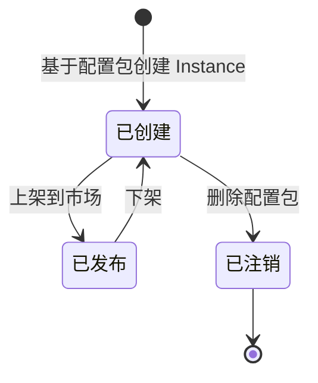
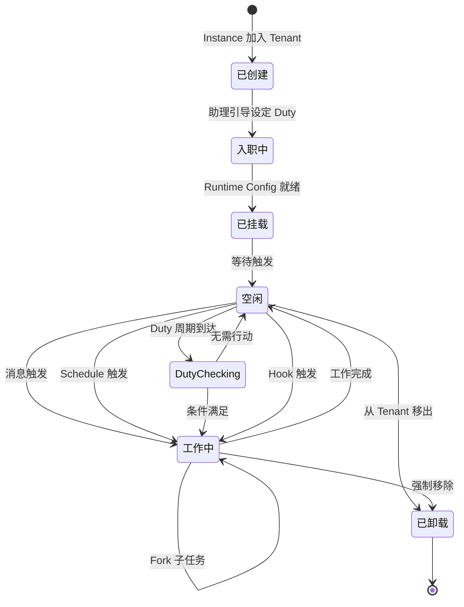

# 虚拟员工系统总览

## 定位

虚拟员工系统是 Virtual Team 的**Agent 运行时核心**，管理 VE Instance 和 VE Runtime 的生命周期、路由消息、调度执行。它独立于协作应用（VTC），通过协议层对接。

## 系统组成

```mermaid
flowchart TD
    veSystem["虚拟员工系统"]
    veSystem --> agentServer["Agent 服务器"]
    veSystem --> veInstance["VE Instance<br/>（配置包定义的"人"）"]
    veSystem --> veRuntime["VE Runtime<br/>（在某 Tenant 的一份工作）"]
    veSystem --> platformTools["平台工具"]

    agentServer --> access["接入层"]
    agentServer --> instanceMgmt["Instance 管理<br/>注册表 + 配置包加载"]
    agentServer --> runtimeMgmt["Runtime 管理<br/>生命周期 + 租户隔离"]
    agentServer --> configData["Runtime Config & Data<br/>Duty / 记忆 / 偏好"]

    veInstance -->|"1:N"| veRuntime
    veRuntime --> intent["意图识别 Agent"]
    veRuntime --> main["主 Agent"]
    veRuntime --> sub["子 Agent"]

    configData --> rtConfig["Runtime Config<br/>Duty / 附加 Prompt / 规范"]
    configData --> rtData["Runtime Data<br/>记忆 / 偏好 / 成长"]
```

### Agent 服务器

详见 [Agent 服务器](./07-agent-server.md)。

核心职责：
- 管理 VE Instance 全局注册表（配置包加载、版本管理）
- 管理 VE Runtime 生命周期（创建、挂载、卸载、销毁）
- 存储和管理 Runtime Config 与 Runtime Data
- 多租户路由——确保消息投递到正确的 Runtime
- Schedule Manager——cron 引擎驱动定时触发

### VE Instance

VE Instance 由配置包定义——一份配置包创建一个"人"。Instance 是静态概念，只存在于 Agent Server 的全局注册表中。它不直接与任何 Tenant 交互。

详见 [配置包规范](./08-vte-agent-internals/config-package.md)。

### VE Runtime

VE Runtime 是 Instance 在一个 Tenant 中的"一份工作"。Runtime 是动态概念，包含该 Tenant 特有的岗位要求、行为规范、工作记忆。

详见 [虚拟员工 Agent 内部设计](./08-vte-agent-internals/overview.md) 和 [Runtime 配置与数据](./08-vte-agent-internals/runtime-config-and-data.md)。

## 生命周期

### Instance 生命周期



### Runtime 生命周期



### 工作启动方式对比

| 启动方式 | 驱动来源 | 触发机制 | 创建者 | 详细章节 |
|---------|---------|---------|--------|---------|
| 消息触发 | 用户 | 消息到达 | 用户 | [消息与工作上下文](./06-message-and-work-context.md) |
| Schedule 自驱动 | VE 自己 | cron/once/interval 到达 | VE 通过 tool call 设定 | [日程与定时器](./04-collaboration-app/collaboration-tools/schedule-and-timer.md) |
| Schedule 外驱动 | 用户/其他 VE | cron/once 到达 | 用户或其他 VE 设定 | [日程与定时器](./04-collaboration-app/collaboration-tools/schedule-and-timer.md) |
| Duty 触发 | VE 自己 | 检查周期到达 + 条件满足 | 管理员在入职时设定 | [Runtime 配置与数据](./08-vte-agent-internals/runtime-config-and-data.md) |
| Hook 触发 | 外部/内部事件 | 事件匹配 | 配置包定义 | [配置包规范](./08-vte-agent-internals/config-package.md) |

## 多租户模型

Tenant 是 Virtual Team 的数据隔离与计费单位。同一 VE Instance 可以为多个 Tenant 创建独立的 Runtime——每个 Runtime 拥有独立的运行环境、配置和记忆，互不干扰。

Agent 服务器负责：

- Tenant 数据隔离（所有业务数据按 `tenant_id` 隔离）
- VE Runtime 的 Tenant 归属
- 同一 Instance 的不同 Runtime 之间的绝对隔离
- Tenant 级配额控制

详见 [租户与组织模型](./10-tenant-and-org-model.md)。

## 与协作应用的消息交互模式

### 消息接收

```
VTC → 接入层 → Runtime 管理服务 → 路由到目标 Runtime → 意图识别 Agent
```

### 消息发送

```
Runtime（主Agent/意图Agent）→ 格式化回复 → 接入层 → 协作应用 → 用户
```

### Schedule/Timer 触发

```
协作应用（日程/定时器到达）→ 通知 Agent 服务器 → 查找 Runtime → 创建 Work Context → VE 开始工作
```

## 扩容模型

- **Instance 管理服务**：无状态，可水平扩展
- **Runtime 管理服务**：无状态（Runtime 状态持久化在 Store），可水平扩展
- **VE Runner**：承载 Runtime 实例的进程，支持冷热分离
- **Schedule Manager**：独立的 cron 引擎，触发后通过消息队列通知 Runtime

## 相关文档

### 设计文档
- [Agent 服务器](./07-agent-server.md) — 接入层、管理服务、冷热分离调度、扩容设计
- [消息与工作上下文](./06-message-and-work-context.md) — 消息处理流程、工作上下文状态机、Fork/Resume
- [虚拟员工 Agent 内部设计](./08-vte-agent-internals/overview.md) — 意图 Agent/主 Agent/子 Agent 架构
- [工作环境节点](./09-work-environment-node.md) — 远程工具承载环境、沙箱隔离

### 技术实施方案
- [VE 技术方案总览](./virtual-employee-system/technical-design/overview.md) — 基础版实施边界、冻结验收口径
- [VE 技术选型](./virtual-employee-system/technical-design/technology-selection.md) — crate 选型、模型 provider、存储后端
- [VE API 与协议](./virtual-employee-system/technical-design/api-and-protocol.md) — VTA trait 接口规格、VE Runner 协议
- [VE 数据与权限模型](./virtual-employee-system/technical-design/data-and-permission-model.md) — 数据归属、权限执行链、索引策略
- [VE 系统可靠性与观测](./virtual-employee-system/technical-design/reliability-and-observability.md) — 冷启动优化、降级矩阵、指标告警
- [VE 管理方案](./virtual-employee-system/technical-design/management-console.md) — 用户侧管理、平台侧治理
- [VE 调研结论与设计决策](./virtual-employee-system/technical-design/research-decisions.md) — 核心设计决策记录
