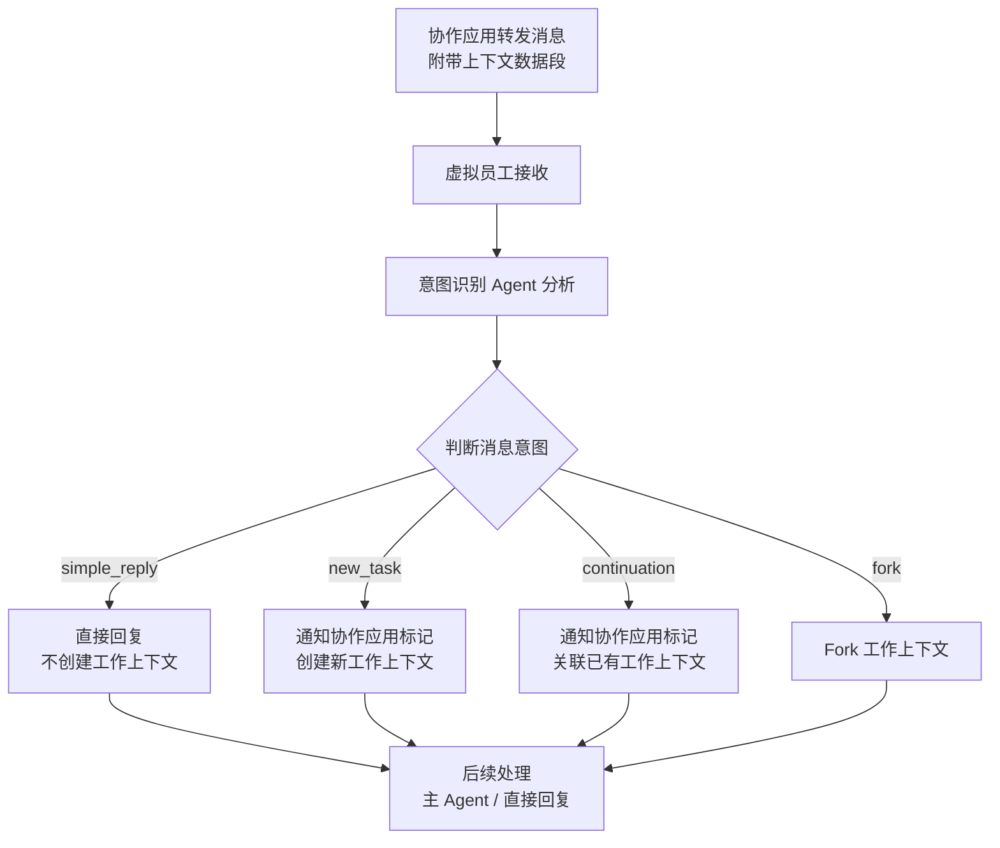
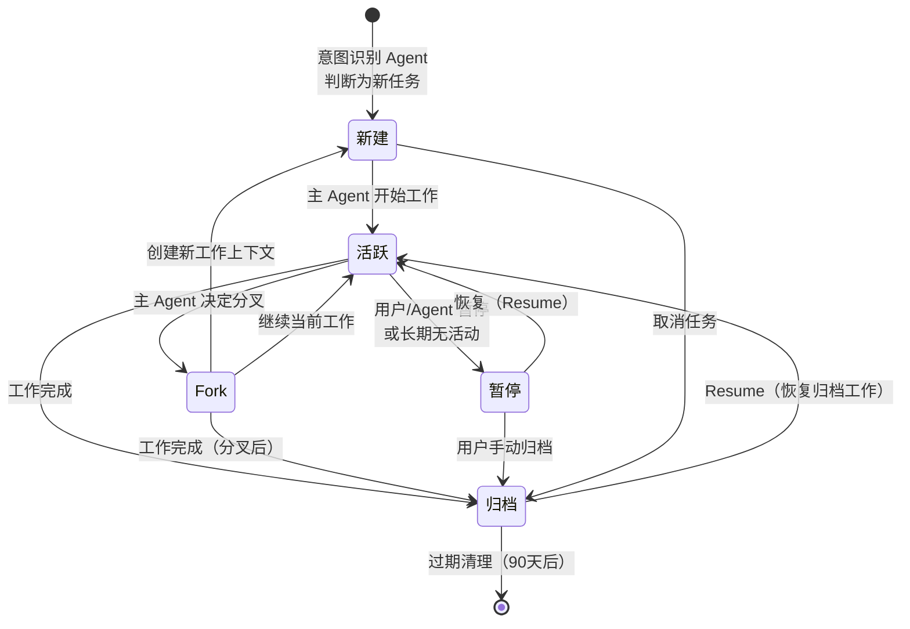
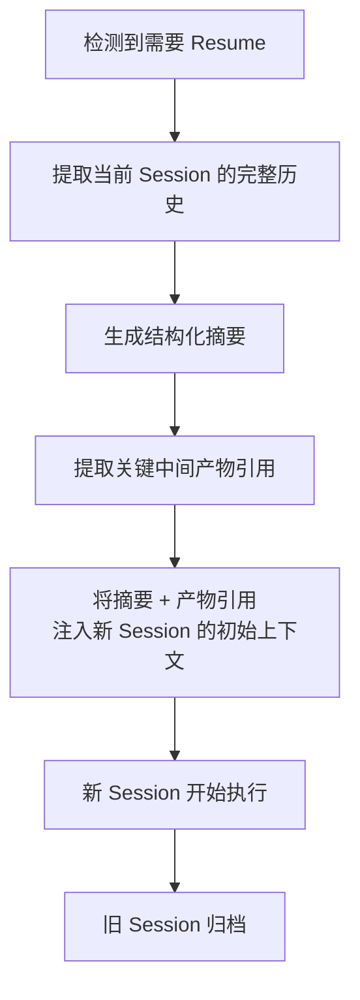

# 消息与工作上下文

## 双层消息模型

Virtual Team 中的"消息"需要从两个层面理解：

### 协作应用层消息

来自协作应用的 IM 消息，与传统聊天工具的消息结构类似：

- 内容（文本、富文本、文件等）
- 消息类型（`content.type`）
- 发送者/接收者
- 时间戳、SeqID
- **扩展标记字段**：工作上下文 ID、意图分类、关联消息指针

完整的消息结构和字段定义见 [IM 通讯系统](./04-collaboration-app/im-system.md)。

### Agent 内部消息

VTA Runtime 中的 Message 工作轨，记录 Agent 与 LLM 之间的对话历史。这部分在虚拟员工内部操作，对外不可见。Agent 内部消息的结构由 VTA Runtime 定义，不属于协作应用层关注的范围。

## 消息处理流程

### 从接收到意图识别



### 意图识别 Agent 的判断依据

意图识别 Agent 分析消息时依赖：

1. 消息内容本身
2. 协作应用附带的前置上下文数据段（关联历史消息摘要、已有工作上下文列表）
3. 虚拟员工的角色定位（不同角色对"什么是新工作"的判断标准不同）
4. 频道上下文（1:1 私聊 vs 群组 @提及 vs 频道背景消息）

意图识别 Agent 使用**低成本模型**运行，仅做分类和路由判断，不承担实际工作负载。其 system prompt 控制在 200-300 tokens 以确保低延迟。

### 标记回写

意图识别 Agent 做出判断后，通过 Agent 服务器调用协作应用 API 更新消息标记：

```
意图识别 Agent → Agent 服务器 → PUT /messages/{id}/markers → 协作应用
```

后续拉取相关消息时，协作应用可基于标记快速过滤，避免每次都全量分析。

### 消息与 VE 状态的关系

```
消息到达 → VE 状态从"空闲"变为"工作中"
意图识别完成 → 工作上下文创建/关联
主 Agent 工作完成 → 回复消息 → VE 状态从"工作中"变为"空闲"
```

## 工作上下文模型

### 数据模型

```sql
CREATE TABLE work_contexts (
    id UUID PRIMARY KEY DEFAULT gen_random_uuid(),
    tenant_id UUID NOT NULL,
    ve_id UUID NOT NULL,
    status VARCHAR(16) NOT NULL DEFAULT 'new',
    -- 'new', 'active', 'paused', 'fork', 'archived'

    -- 上下文元数据
    summary TEXT,                         -- 工作摘要（由 Agent 生成）
    task_description TEXT,                -- 原始任务描述
    task_type VARCHAR(32),                -- 任务类型标签

    -- 组织归属
    organization_id UUID,
    channel_id UUID,                      -- 发起对话的频道

    -- 关联资源
    linked_message_ids UUID[] DEFAULT '{}',
    linked_document_ids UUID[] DEFAULT '{}',
    linked_bitable_ids UUID[] DEFAULT '{}',

    -- Fork 关系
    parent_work_context_id UUID,          -- Fork 来源
    fork_checkpoint JSONB,                -- Fork 时的状态快照

    -- 关联的工作环境节点
    wen_id UUID,                          -- 绑定的工作环境节点

    -- VTA Session 映射
    vta_sessions JSONB NOT NULL DEFAULT '[]',
    -- [{"session_id": "sess_xxx", "type": "main", "status": "active"}, ...]

    -- 时间戳
    created_at TIMESTAMPTZ NOT NULL DEFAULT now(),
    updated_at TIMESTAMPTZ NOT NULL DEFAULT now(),
    last_active_at TIMESTAMPTZ,
    completed_at TIMESTAMPTZ,
    archived_at TIMESTAMPTZ,

    -- 统计
    total_turns INTEGER DEFAULT 0,
    total_tokens_used BIGINT DEFAULT 0,
    total_tool_calls INTEGER DEFAULT 0,
    total_sub_agents INTEGER DEFAULT 0,

    -- 索引
    INDEX idx_wc_tenant_ve (tenant_id, ve_id, status),
    INDEX idx_wc_parent (parent_work_context_id),
    INDEX idx_wc_org (organization_id),
    INDEX idx_wc_channel (channel_id),
    INDEX idx_wc_last_active (tenant_id, last_active_at DESC)
);
```

### 工作上下文状态机



### 状态转换条件

| 转换 | 触发条件 | 副作用 |
|------|---------|--------|
| → 新建 | 意图识别 Agent 判定为 new_task | 生成上下文 ID，创建 VTA Session |
| 新建 → 活跃 | 主 Agent 开始执行 | 更新 last_active_at |
| 活跃 → 暂停 | 用户主动暂停 / Agent 完成一轮等待 / 超过 30min 无活动 | VTA Session 保持，内存可释放 |
| 暂停 → 活跃 | Resume 操作：用户发新消息 / Agent 主动恢复 | VTA Session 状态恢复 |
| 活跃 → Fork | 主 Agent 调用 fork 工具 | 创建快照，生成新的子工作上下文 |
| * → 归档 | 工作完成 / 用户手动归档 / 取消 | VTA Session 归档，释放 VE 槽位 |
| 归档 → 活跃 | Resume 归档工作 | 创建新 VTA Session，注入压缩上下文 |

### 工作上下文与 VTA Session 的关系

```
一个工作上下文
├── 1 个主 Session（主 Agent 的工作会话）
├── 0-N 个子 Session（子 Agent 的工作会话）
└── 0-1 个意图 Session（意图识别 Agent 的会话，可复用）
```

| 维度 | 工作上下文 | VTA Session |
|------|-----------|------------|
| 负责层 | 虚拟员工层 | VTA Runtime 层 |
| 生命周期 | 与任务绑定 | 与 Agent 推理循环绑定 |
| 数量关系 | 1 个工作上下文 → N 个 VTA Session | — |
| 隔离策略 | 上下文间通过工具调用交互 | Session 间独立，通过显式工具调用获取信息 |
| 状态管理 | Agent 服务器 Store | VTA Store（SQLite/PostgreSQL） |
| 可恢复性 | 支持 Resume + Fork | Session 结束后归档，不可直接恢复 |

### Fork 机制

Fork 允许从已有工作上下文分叉出独立的工作上下文。这在以下场景中很有用：

- "试试另一种方案"——保留当前进度，探索替代方案
- "基于这个结果继续做两件事"——一个上下文处理 A，另一个处理 B

Fork 时的操作：

1. 创建当前工作上下文的快照（`fork_checkpoint`），包含当前状态、关键中间产物路径
2. 创建新的工作上下文，`parent_work_context_id` 指向源上下文
3. 新上下文继承源上下文的 VE、组织、工作环境节点绑定
4. 新上下文拥有独立的 VTA Session，不共享 LLM 对话历史

## 上下文压缩与 Resume

对于超出 LLM 上下文限制的长期工作，采用 Resume 机制——本质是将压缩后的摘要 + 关键上下文作为新 VTA Session 的启动上下文，而非试图在一个 Session 内承载无限历史。

### 压缩触发条件

| 条件 | 阈值 |
|------|------|
| Token 使用量 | 超过模型上下文窗口的 80% |
| Turn 数量 | 超过 50 轮 |
| 活跃时长 | 超过 2 小时 |

### Resume 流程



### 结构化摘要格式

Resume 时生成的摘要不是自由文本，而是结构化 JSON，确保后续 Agent 可以精确获取信息：

```json
{
  "work_context_id": "wc_xxx",
  "generated_at": "2026-05-07T12:00:00Z",
  "original_task": "分析 Q2 销售数据并生成报告",
  "progress": {
    "completed_steps": [
      "数据获取：已从 sales_db 导出 Q2 CSV",
      "数据清洗：处理缺失值 12 处，异常值 3 处",
      "描述性统计：完成月度销售额汇总表"
    ],
    "current_step": "趋势分析和可视化",
    "remaining_steps": [
      "生成 Q2 销售分析报告",
      "将结果写入多维表格"
    ]
  },
  "key_findings": [
    "Q2 总销售额 ¥2,847,000，环比增长 12.3%",
    "6 月销售额最高（¥1,023,000），5 月有短暂下滑"
  ],
  "artifacts": [
    { "type": "bitable", "id": "bitable_xxx", "description": "月度销售数据表" },
    { "type": "file", "path": "/workspace/q2_sales_clean.csv", "description": "清洗后数据" }
  ],
  "pending_approvals": [],
  "resume_hint": "继续趋势分析部分，数据已就绪"
}
```

### Resume 后的 Session 初始化

新 VTA Session 的初始 system prompt 附加：

```
[续接上文]
你正在恢复一个之前的工作上下文。以下是该工作的结构化摘要：
{compressed_summary_json}

请基于以上摘要继续工作。当前进度：{current_step}。
剩余步骤：{remaining_steps}。
相关产物：{artifacts}。
```
