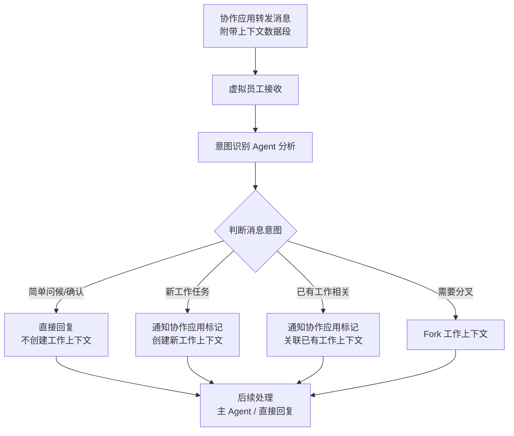
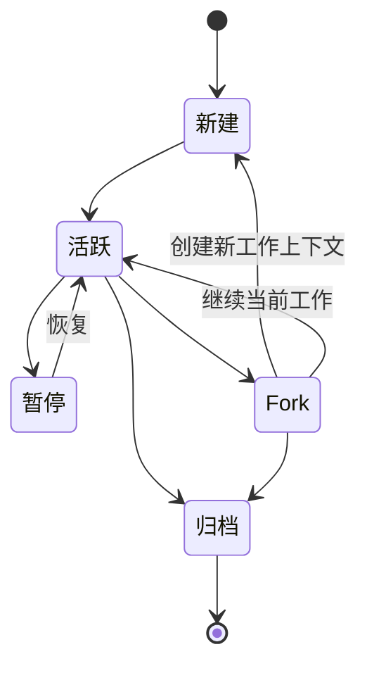

# 消息与工作上下文

## 双层消息模型

Virtual Team 中的"消息"需要从两个层面理解：

### 协作应用层消息

来自协作应用的 IM 消息，与传统聊天工具的消息结构类似：

- 内容（文本、富文本、文件等）
- 消息类型
- 发送者/接收者
- 时间戳、SeqID
- **扩展标记字段**：工作上下文 ID、意图分类、关联消息指针

扩展标记字段是协作应用为虚拟团队场景设计的增强，用于减少后续 token 消耗和分析成本。

### Agent 内部消息

VTA Runtime 中的 Message 工作轨，记录 Agent 与 LLM 之间的对话历史。这部分在虚拟员工内部操作，对外不可见。

## 消息处理流程

### 从接收到意图识别



### 意图识别 Agent 的判断依据

意图识别 Agent 分析消息时依赖：

1. 消息内容本身
2. 协作应用附带的前置上下文数据段（关联历史消息摘要、已有工作上下文列表）
3. 虚拟员工的角色定位（不同角色对"什么是新工作"的判断标准不同）

意图识别 Agent 使用**低成本模型**运行，仅做分类和路由判断，不承担实际工作负载。

### 标记回写

意图识别 Agent 做出判断后，通过上层 API 通知协作应用更新消息标记：

```
意图识别 Agent → 接入层 → 协作应用 API → 更新消息标记
```

后续拉取相关消息时，协作应用可基于标记快速过滤，避免每次都全量分析。

## 工作上下文模型

### 什么是工作上下文

工作上下文是虚拟员工处理一项具体任务时的**独立工作空间**。类比理解：

| Virtual Team | 对应类比 |
|-------------|---------|
| 工作上下文 | Claude Code 中的一个独立对话 |
| 新工作 | 打开新对话 |
| Fork | 从某个对话的检查点分叉 |
| Resume | 恢复已有对话继续 |

### 工作上下文的内部结构

工作上下文是一个**面向虚拟员工的高阶 Session 封装**（高于 VTA Session）：

```
工作上下文
├── 上下文 ID
├── 状态（活跃/暂停/归档）
├── 关联消息列表（指向协作应用的标记消息）
├── 一个或多个 VTA Session
│   ├── 主 Session（主 Agent 的工作会话）
│   └── 子 Session（子 Agent 的工作会话，可选）
├── 检查点（Fork 分叉点）
├── 关联的工作环境节点
└── 关联资源（文件、数据等引用）
```

### 工作上下文与 VTA Session 的关系

一个工作上下文可能包含多个 VTA Session，但主要通过**工具调用**实现跨 Session 信息获取而非直接共享上下文——这增强了围栏和沙盒效果。

不同工作上下文之间默认隔离，信息交换通过显式的工具调用或协作应用的消息链接实现。

### 工作上下文状态机



### 高阶 Session 的特殊处理

不同任务类型需要不同的执行环境：

- **编码任务**：是否需要 git worktree 避免在同一目录工作？
- **网页操作**：是否需要特定的 headless 浏览器参数？
- **数据分析**：是否需要特定的数据库连接？

这些差异在虚拟员工的高阶 Session 层面处理，根据工作上下文类型动态配置底层 VTA Session 的执行环境。

## 上下文压缩与长对话处理

对于超出 LLM 上下文限制的长期工作，采用 Resume 机制——本质是将压缩后的摘要 + 关键上下文作为新 VTA Session 的启动上下文，而非试图在一个 Session 内承载无限历史。

当意图识别 Agent 判断需要恢复一个已超出上下文长度的工作时：
1. 提取该工作上下文的归档摘要
2. 结合 RAG 检索关联的关键消息片段
3. 构建恢复上下文注入新的 VTA Session
4. 主 Agent 在这个基础上继续工作
