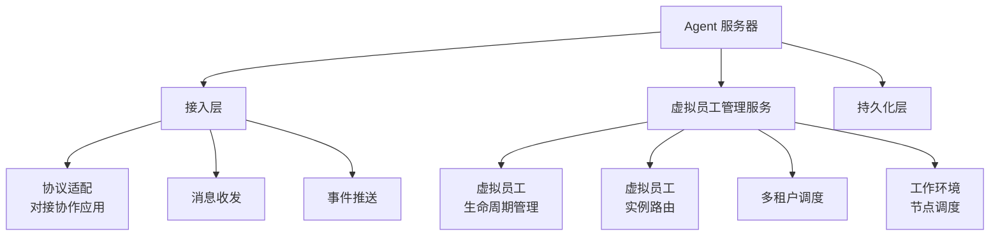
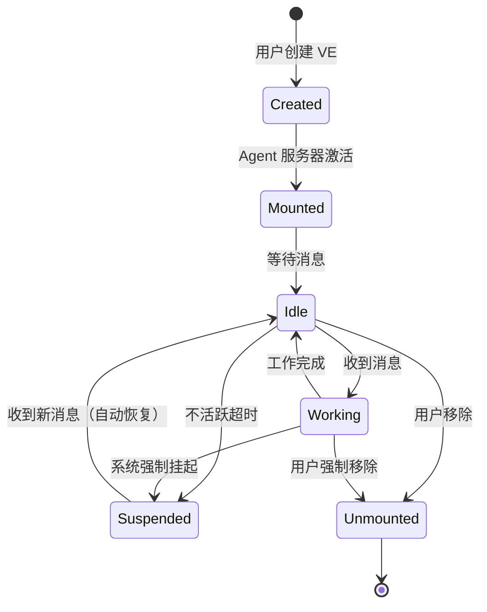
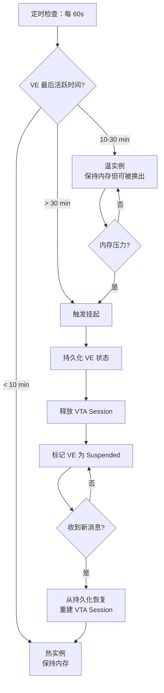
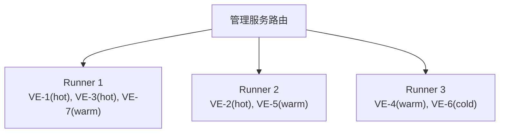

# Agent 服务器

## 定位

Agent 服务器是虚拟员工系统在**服务端**的承载。它独立于协作应用，负责接收消息、管理虚拟员工生命周期、调度 Agent 执行。

## 组成



## 接入层

### 职责

接入层是协作应用与虚拟员工系统之间的**协议桥梁**。它不执行任何 Agent 推理，只做协议的接收、转换和路由。

### 核心功能

**1. 消息接收与解析**

- 接收协作应用转发的消息（含上下文数据段）
- 验证消息来源（API Key 认证 + 租户归属验证）
- 解析消息结构，提取目标虚拟员工 ID 和消息内容
- 将消息转换为内部格式，交由虚拟员工管理服务路由

**2. 协议适配**

```
协作应用协议 ←→ 接入层 ←→ 内部协议 (VTA / JSON-RPC)
```

接入层屏蔽协作应用协议与内部协议的差异。协作应用的协议变化（如新增消息类型、修改事件格式）只需更新接入层的适配逻辑，不影响虚拟员工内部。

**3. 回复格式化**

将虚拟员工的回复从内部格式转换为协作应用可消费的格式。包括：
- 消息内容转换（内部结构 → Block-based 富文本）
- 工作上下文状态映射（内部状态 → 协作应用 work_summary 卡片）
- 审批请求转换（VTA Approval → 协作应用 approval_card）

**4. 主动推送**

虚拟员工可主动发起通知（工作完成、需要确认），接入层将这些通知转换为协作应用的推送事件。

**5. 速率限制**

对接入层实施速率限制，防止单个租户过度调用：
- 每租户消息接收速率：60 msg/min
- 每租户标记回写速率：120 req/min

### 错误处理

接入层的错误处理策略：

| 错误类型 | 处理方式 | 响应 |
|---------|---------|------|
| 消息格式错误 | 拒绝，返回错误详情 | 400 Bad Request + 错误描述 |
| 认证失败 | 拒绝，记录安全日志 | 401 Unauthorized |
| 目标 VE 不存在 | 返回错误，提示用户检查 | 404 VE Not Found |
| VE 离线 | 队列暂存（5min TTL），或返回离线状态 | 503 VE Offline |
| 租户不匹配 | 拒绝，记录安全日志 | 403 Forbidden |
| 内部错误 | 记录错误日志，返回通用错误 | 500 Internal Error |

## 虚拟员工管理服务

### 定位类比

虚拟员工管理服务类比于**人力资源公司的管理系统**——一个人力资源公司同时服务多家客户公司，由管理系统统一调度。在 Virtual Team 中：一个虚拟员工管理服务管理多个虚拟员工实例，这些实例服务于不同租户。

### 核心职责

#### 虚拟员工生命周期管理



每个状态对应的资源占用：

| 状态 | 内存 | VTA Session | 工作上下文 | 消息路由 |
|------|------|------------|-----------|---------|
| Created | 仅元数据 | 无 | 无 | 未注册 |
| Mounted | 完整实例 | 待命 | 无 | 已注册 |
| Idle | 完整实例 | 空闲 | 无活跃 | 已注册 |
| Working | 完整实例 + 推理开销 | 活跃 | 活跃 | 已注册 |
| Suspended | 仅持久化 | 归档 | 持久化 | 已注册（触发恢复） |
| Unmounted | 仅元数据 | 无 | 归档 | 已注销 |

#### VE 实例管理 API

虚拟员工管理服务暴露以下内部 API（由接入层和 VTA Host 调用）：

| API | 说明 |
|-----|------|
| `ve.create(config_package, org_id, wen_id)` | 创建 VE 实例 |
| `ve.mount(ve_id)` | 激活 VE，注册到路由表 |
| `ve.suspend(ve_id)` | 挂起 VE，持久化状态后释放内存 |
| `ve.resume(ve_id)` | 从持久化状态恢复 VE |
| `ve.unmount(ve_id)` | 注销 VE 并回收资源 |
| `ve.route_message(ve_id, message)` | 路由消息到 VE 实例 |
| `ve.get_status(ve_id)` | 查询 VE 状态 |
| `ve.list_by_tenant(tenant_id)` | 列出租户的所有 VE |

#### 冷热分离调度



配置参数（可调整）：

| 参数 | 默认值 | 说明 |
|------|--------|------|
| 热窗口 | 10 min | 热实例保持时间 |
| 温窗口 | 30 min | 温实例最大保持时间 |
| 检查间隔 | 60 s | 调度器检查周期 |
| 内存阈值 | 80% | 触发温→冷切换的内存使用率 |

#### 多租户调度

租户 = 用户级别。管理服务确保：

1. **路由隔离**：消息路由到 VE 前验证租户归属——消息的 `tenant_id` 必须匹配目标 VE 的 `tenant_id`
2. **数据过滤**：所有 Store 查询自动附加 `WHERE tenant_id = $current_tenant`
3. **资源公平性**：单租户的 VE 数量上限和并发工作上下文数上限，防止资源垄断

#### 工作环境节点调度

管理服务维护每个租户的 WEN 路由表：

```json
{
  "tenant_id": "u_xxx",
  "nodes": [
    {
      "wen_id": "wen_laptop",
      "status": "online",
      "latency_ms": 25,
      "load": { "cpu": 45, "memory_mb": 2048 },
      "supported_tools": ["file_read", "file_write", "shell_exec"],
      "assigned_ves": ["ve_sales_01"]
    }
  ]
}
```

VE 发出工具调用请求时，管理服务：
1. 查询 VE 绑定的 WEN 是否在线
2. 在线则转发工具调用，离线则返回错误给 VE
3. 如有多个可用 WEN，优先选择延迟最低的

## 扩容设计

### 无状态管理服务

虚拟员工管理服务设计为**无状态**：

- VE 的状态持久化在 Store 中（PostgreSQL）
- 管理服务实例可水平扩展，任意实例可接管任意 VE
- 新实例启动时从 Store 恢复路由表

### VE Runner 分布

VE 实例（VTA Runtime 进程）分布在独立的 Runner 节点上：



Runner 节点：

- 每个 Runner 承载多个 VE 实例（进程或协程级别隔离）
- 管理服务根据负载将新 VE 分配到负载最低的 Runner
- Runner 定期上报资源使用情况（CPU、内存、活跃 VE 数）
- Runner 宕机时，管理服务在其他 Runner 上恢复冷实例（热实例状态丢失，需用户重新触发）

### 消息队列解耦

```
协作应用 → 接入层 → 消息队列 → 虚拟员工管理服务 → VE Runner
```

使用消息队列（Redis Streams / NATS）解耦接入层和管理服务：
- 消息持久化在队列中，管理服务重启不丢消息
- 支持背压——管理服务处理不过来时，消息在队列中排队
- 消息按 `ve_id` 分区，保证同一 VE 的消息顺序处理

## 可观测性

### 关键指标

| 指标 | 说明 | 告警阈值 |
|------|------|---------|
| `ve_active_count` | 活跃 VE 数 | > Runner 容量 80% |
| `ve_create_latency_ms` | VE 创建延迟 | p95 > 5000ms |
| `message_route_latency_ms` | 消息路由延迟 | p95 > 500ms |
| `tool_call_forward_latency_ms` | 工具调用转发延迟 | p95 > 200ms |
| `cold_start_latency_ms` | VE 冷启动延迟 | p95 > 10000ms |
| `wen_offline_ratio` | WEN 离线率 | > 10% |
| `error_rate` | 错误率 | > 1% |

### 日志级别

| 级别 | 场景 |
|------|------|
| ERROR | VE 创建失败、消息路由失败、WEN 连接异常 |
| WARN | VE 冷启动、审批超时、速率限制触发 |
| INFO | VE 生命周期变更、消息路由成功、工作上下文完成 |
| DEBUG | 工具调用详情、Session 创建/销毁、路由表更新 |
