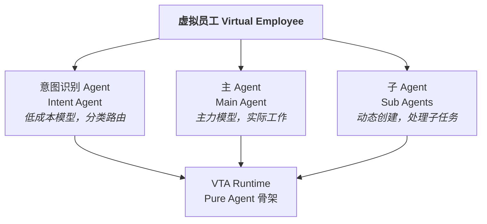

# 虚拟员工 Agent 内部设计

## 概述

虚拟员工是面向用户的 Agent 实体，其内部不是单一 Agent，而是由**多个 VTA Agent 协作**构成的复合系统。

## 内部 Agent 架构



### 意图识别 Agent (Intent Agent)

**职责**：处理来自协作应用的每一条消息，判断消息意图并路由。

- 分析消息是新问候、已有工作延续还是新工作启动
- 简单消息直接回复（无需主 Agent 参与）
- 需要工作时，判断是新建、Fork 还是 Resume
- 将判断结果通知协作应用更新消息标记

**特点**：
- 使用**低成本/快速模型**，仅做分类和路由判断
- 轻量 prompt，专注意图识别
- 通过工具调用获取已有工作上下文列表、RAG 检索结果等

### 主 Agent (Main Agent)

**职责**：虚拟员工的"大脑"，负责实际完成工作任务。

- 接收意图识别 Agent 的工作指派
- 创建和管理工作上下文
- 通过工具调用操作工作环境节点
- 动态创建子 Agent 处理复杂子任务
- 输出工作结果（通过聊天框或协作工具）

**特点**：
- 使用**主力模型**（根据配置包选择）
- 持有完整的虚拟员工角色 prompt
- 可访问虚拟员工的所有工具和能力
- 根据任务类型动态调整执行策略

### 子 Agent (Sub Agent)

**职责**：由主 Agent 动态创建，处理特定子任务。

- 类似其他 Agent 应用中的 Sub-agent 概念
- 独立的 VTA Session，有独立的上下文
- 可配置不同的模型和工具集
- 结果回传主 Agent

**特点**：
- 子 Agent 独立于主 Agent 的上下文
- 支持并行执行多个子 Agent
- 子 Agent 的工作产物通过工具或协作工具回传
- 跨 Session 信息获取通过显式工具调用（增强隔离和沙盒效果）

## 虚拟员工的配置包

虚拟员工的所有能力通过配置包定义，VTA 配置包的基础上进行高阶扩展：

```
virtual-employee-package/
├── manifest.toml              # 虚拟员工元信息
├── identity.hbs               # 虚拟员工身份定义
├── intent-agent/
│   ├── prompt.hbs             # 意图识别 Agent 的 prompt
│   └── model.toml             # 使用的模型配置
├── main-agent/
│   ├── system.hbs             # 主 Agent 系统 prompt
│   ├── scenes/                # 场景路由 prompt
│   └── model.toml             # 模型选择策略
├── tools/                     # 可用工具声明
├── skills/                    # 技能声明
└── permissions.toml           # 权限边界
```

## 虚拟员工的状态管理

除了底层 VTA 的 Session/Message/Event 持久化外，虚拟员工层维护额外的状态：

- **工作上下文列表**：当前所有活跃/暂停/归档的工作上下文
- **消息关联映射**：协作应用消息 ID 与工作上下文 ID 的关联
- **子 Agent 登记表**：当前活跃的子 Agent 及其状态
- **资源占用**：工作环境节点的分配和负载状态

## 与 VTA 的关系

虚拟员工是 VTA 之上的**高阶封装**：

| 层面 | 关注点 | 核心概念 |
|------|--------|---------|
| **VTA Runtime** | Agent 推理循环、LLM 交互、工具调用 | Session、Turn、Message、Event |
| **虚拟员工层** | 消息处理、意图识别、工作上下文、多 Agent 协作 | 工作上下文、意图路由、Agent 编排 |

虚拟员工层不修改 VTA——它使用 VTA 提供的标准能力构建更复杂的 Agent 行为。
