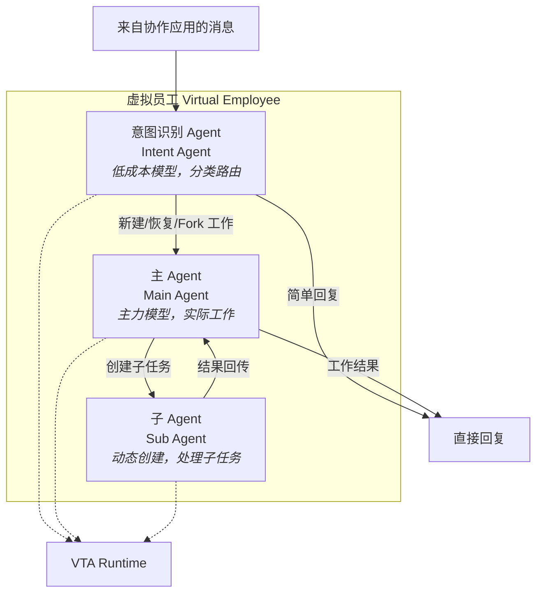
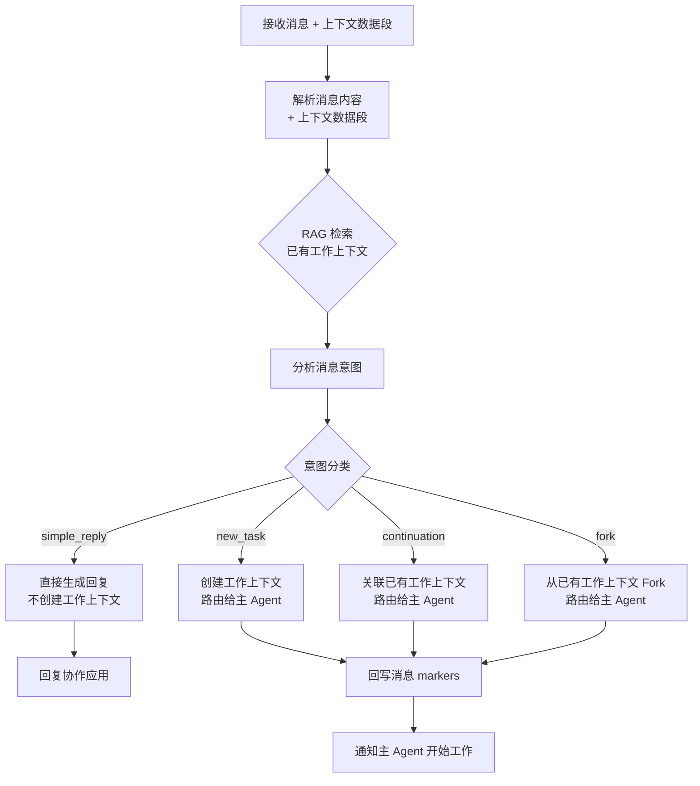
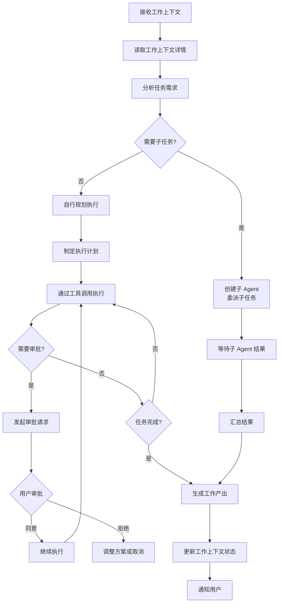
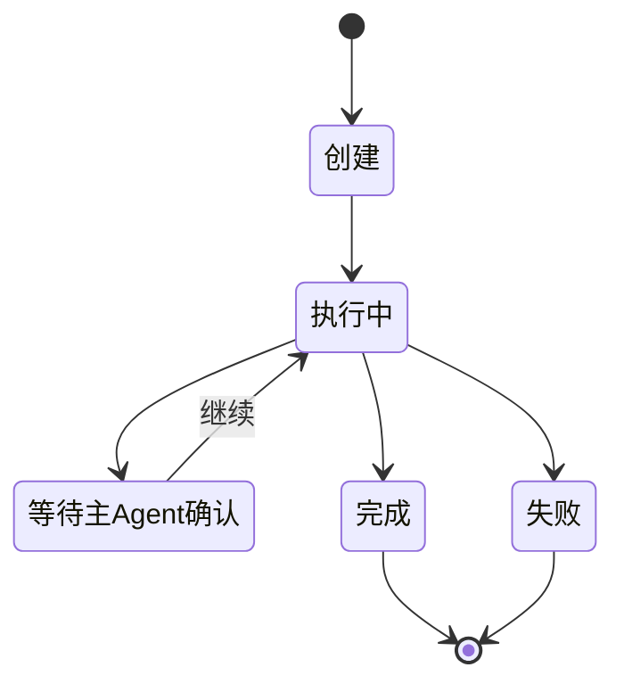

# 内部 Agent 架构

虚拟员工内部由三个类型的 VTA Agent 协作构成。它们各自拥有独立的 VTA Session，通过明确的消息协议协作。

## 架构全景



## 意图识别 Agent（Intent Agent）

### 职责

处理来自协作应用的每一条消息，判断消息意图并路由。它是虚拟员工的"前台"，所有消息首先经过它。

### 工作流程



### 模型配置

| 配置项 | 典型值 | 说明 |
|--------|--------|------|
| 模型 | Claude Haiku / GPT-4o-mini | 低成本快速模型 |
| max_tokens | 1024 | 仅需分类输出 |
| temperature | 0.1 | 需要稳定一致的判断 |
| system_prompt | 精简意图分类 prompt | 约 200-300 tokens |

### 可用的平台工具

意图识别 Agent 仅能调用**平台工具**（服务端同环境），不能操作工作环境节点：

| 工具 | 用途 |
|------|------|
| `context.list_active` | 获取当前虚拟员工的活跃工作上下文列表 |
| `context.search` | 搜索历史工作上下文（按关键词或语义） |
| `message.search` | 搜索历史消息 |
| `org.query` | 查询组织结构信息 |
| `message.reply` | 发送简单回复消息 |

### 与主 Agent 的协作协议

意图识别 Agent 不是主 Agent 的"老板"——它只做路由决策，不管理工作执行。两者通过**工作上下文**作为消息传递的中介：

```
意图 Agent → 创建/更新工作上下文 → 主 Agent 轮询/订阅 → 开始执行
```

主 Agent 可通过以下方式获知新工作：
1. **轮询模式**：主 Agent 定期检查是否有状态为 `pending` 的工作上下文
2. **事件订阅**：Agent 服务器推送 `work_context.created` 事件到主 Agent 的 VTA Session

## 主 Agent（Main Agent）

### 职责

虚拟员工的"大脑"，负责实际完成工作任务。

### 工作流程



### 模型配置

| 配置项 | 典型值 | 说明 |
|--------|--------|------|
| 模型 | Claude Opus / GPT-4 | 主力模型，根据配置包选择 |
| max_tokens | 8192-32768 | 需要生成复杂工作产出 |
| temperature | 0.3-0.7 | 根据任务类型可调 |
| system_prompt | 完整角色定义 + 指令 | 约 500-2000 tokens |

### 可用的工具

主 Agent 可调用虚拟员工的**全部工具**——远程工具（经工作环境节点）和平台工具。详细工具体系见 [工具体系](./tool-system.md)。

### 执行策略

根据任务类型，主 Agent 采用不同的执行策略：

| 任务类型 | 执行策略 | 说明 |
|---------|---------|------|
| **编码任务** | Plan → Code → Review → Test | 需要 git worktree 隔离 |
| **数据分析** | 获取数据 → 分析 → 可视化 → 报告 | 可能需要数据库连接 |
| **信息检索** | 搜索 → 筛选 → 汇总 → 呈现 | 主要使用平台工具 |
| **内容创作** | 大纲 → 草稿 → 修改 → 定稿 | 产出为协作文档 |
| **审批协调** | 发起审批 → 等待确认 → 执行 | 需要用户参与 |

执行策略在虚拟员工的配置包中预定义，主 Agent 在分析任务后选择合适的策略。

## 子 Agent（Sub Agent）

### 职责

由主 Agent 动态创建的临时 Agent，处理特定子任务。类似于其他 Agent 应用（Claude Code、Codex）中的 Sub-agent 概念。

### 创建条件

主 Agent 在以下情况创建子 Agent：

1. **并行任务**：多个独立子任务可同时执行（如同时搜索多个数据源）
2. **上下文隔离**：子任务需要独立上下文以免污染主 Agent 的注意力
3. **不同能力**：子任务需要不同的模型或工具集（如代码审查用不同模型）
4. **降低复杂度**：拆分大任务使每个 Agent 的关注范围更窄

### 生命周期



### 配置覆盖

子 Agent 可覆盖主 Agent 的部分配置：

```json
{
  "sub_agent_config": {
    "model": "claude-haiku-4-5",
    "max_tokens": 4096,
    "tools": ["file_read", "web_search"],
    "system_prompt_override": "你是一个代码审查专家...",
    "timeout_seconds": 300,
    "max_turns": 20
  }
}
```

### 结果回传

子 Agent 的工作结果通过以下方式回传主 Agent：

1. **结构化结果**：子 Agent 完成后，将其 VTA Session 的输出摘要返回给主 Agent
2. **工具产物**：子 Agent 创建的文件/文档通过工作环境节点中的共享目录传递
3. **协作工具**：子 Agent 可直接写入协作文档/表格，主 Agent 通过引用获取

不同子 Agent 的工作上下文之间默认隔离，信息交换通过显式的工具调用实现（增强围栏和沙盒效果）。

### 并行控制

- 同时活跃的子 Agent 数量上限由配置包控制（默认 5 个）
- 超出上限时，主 Agent 将额外子任务排队
- 子 Agent 超时未完成时，主 Agent 可选择取消或等待

## Agent 间通信

三种 Agent 之间的通信不通过直接消息传递，而是通过**共享状态存储**：

```
意图 Agent ──写入──→ 工作上下文 Store ←──读取── 主 Agent
主 Agent ──创建──→ 子 Agent 任务队列 ←──轮询── 子 Agent
子 Agent ──写入──→ 工作上下文 Store ←──读取── 主 Agent
```

优点：
- 解耦：各 Agent 独立运行，不相互阻塞
- 可恢复：状态持久化，Agent 崩溃后可恢复
- 可观测：所有通信记录在案，便于调试和审计
