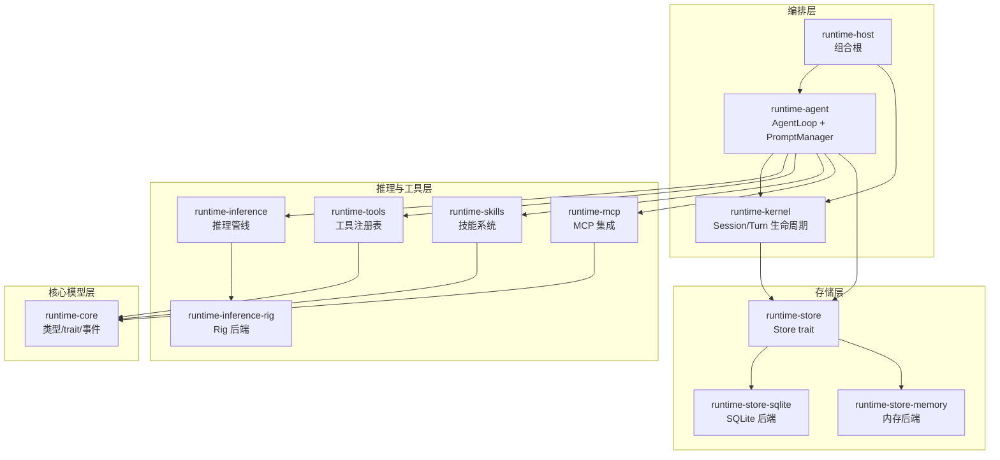
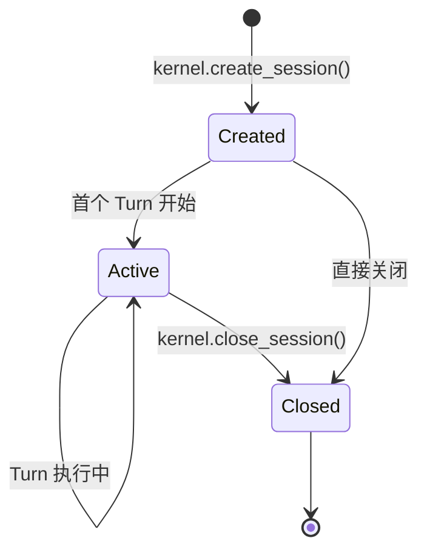
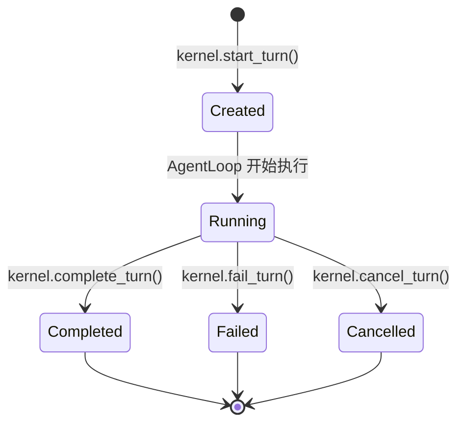

# 内部 Agent 架构

虚拟员工的推理能力由 VTA（Virtual Teams Agent）Runtime 提供。VTA 是遵循 Pure Agent 原则的 Agent 基座：零预设 prompt、零内置工具、零默认技能。所有能力通过配置包注入。

## 架构层级

VTA Runtime 是一个多 crate 的 Rust workspace，分为四个职责层：

| 层 | crate | 职责 |
|----|-------|------|
| **核心模型** | `runtime-core` | 领域类型（Session、Turn、Message、Part）、ID 类型、事件类型、核心 trait（RuntimeKernel、EventBus、ApprovalService） |
| **存储** | `runtime-store` / `runtime-store-sqlite` / `runtime-store-memory` | MessageStore trait、SQLite 后端、内存后端 |
| **推理与工具** | `runtime-inference` / `runtime-inference-rig` / `runtime-tools` / `runtime-skills` / `runtime-mcp` | 推理管线、Rig LLM 后端、工具注册表、技能系统、MCP 集成 |
| **编排** | `runtime-kernel` / `runtime-agent` / `runtime-host` | Session/Turn 生命周期、Agent 推理循环、组合根 |



**关键约束**：`runtime-kernel` 只管理 Session/Turn 生命周期和事件广播，不包含推理循环逻辑。`runtime-host` 是组合根，负责装配所有依赖并注入到 AgentLoop，不包含业务逻辑。

## 核心概念

### AgentProfile（对应 VE Instance）

AgentProfile 是一个可复用的 Agent 定义，在 Turn 开始时解析为不可变快照。它由配置包驱动，定义：

| 策略 | 说明 |
|------|------|
| `model_policy` | 默认模型选择器、模型切换策略、运行时路由策略 |
| `prompt_policy` | Prompt 模板引用、是否允许运行时注入和插件变更 |
| `tool_policy` | 工具覆盖链（全局→profile→host→turn），控制工具可见性 |
| `skill_policy` | 默认激活的技能、可见技能范围 |
| `runtime_policy` | 运行时行为开关（是否允许子 Agent、是否启用流式输出等） |
| `limits` | 执行限制（最大迭代次数、最大 token、超时等） |

AgentProfile 对应 virtual-team 设计中的 **VE Instance**——配置包定义的"人"。代码中当前未实现 `fast_selector` 和 `scene_selectors`（Phase 3 计划）。

### Session（对应 VE Runtime）

Session 是 AgentProfile 在一个 Tenant 中的"一份工作"。由 `runtime-kernel` 管理生命周期：



Session 包含 `profile_id`（指向 AgentProfile）、`status`、`defaults`（回退模型参数）、`model_state`（跨 Turn 共享的模型状态）、`metadata`（宿主扩展元数据）。

Session 对应 virtual-team 设计中的 **VE Runtime**。代码中 `parent_session_id` 和 `parent_turn_id` 尚未实现（Phase 3 计划，用于子 Agent）。

### Turn（推理回合）

Turn 是一次完整的推理执行单元：接收用户输入 → 运行 AgentLoop → 返回结果。由 `runtime-kernel` 管理生命周期：



### TurnExecutionContext

Host 在调用 AgentLoop 前构造的完整上下文，包含 AgentLoop 所需的全部依赖：

| 字段 | 类型 | 说明 |
|------|------|------|
| `session_id` | SessionId | 所属会话 |
| `turn_id` | TurnId | 当前回合 |
| `input` | TurnInput | 用户输入（Text 或 JSON） |
| `turn` | Turn | 已由 kernel 创建的 Turn 快照 |
| `inference_backend` | Arc\<dyn InferenceBackend\> | LLM 推理后端 |
| `tool_bridge` | Arc\<dyn ToolBridge\> | 工具桥接层 |
| `kernel` | Arc\<StoreBackedRuntimeKernel\> | 内核（用于完成/失败回调） |
| `history` | Arc\<dyn TurnHistory\> | 回合内临时消息历史 |
| `message_store` | Option\<Arc\<dyn MessageStore\>\> | 持久化消息工作轨（Phase 2+） |
| `prompt_manager` | Option\<Arc\<PromptManager\>\> | 配置包 Prompt 管理器（Phase 2+） |
| `stream_inference` | bool | 是否启用流式推理 |
| `max_iterations` | u32 | 最大推理循环迭代次数 |

## AgentLoop（推理循环）

`AgentLoop` trait 是 VTA 推理循环的唯一入口。`DefaultAgentLoop` 是 Phase 1 的完整实现。

### 执行流程

```
1. 写入用户消息 → history + message_store（双轨）
2. 从 turn.resolved_context 提取模型选择器和可见工具快照
3. 推理循环（最多 max_iterations 次）：
   a. 获取当前 history
   b. 构建 PromptProjection（System Prompt + 技能 + 工具描述 + 历史）
   c. 调用推理后端（LLM）
   d. 解析 LLM 返回：
      - ToolCall → 校验冻结的 visible_tools → 执行工具 → 工具结果回灌 → 继续循环
      - 其他 → 提取输出文本 → 退出循环
4. 写入助手回复 → history + message_store
5. 回调 kernel.complete_turn() 或 kernel.fail_turn()
```

### 关键安全边界

- **可见工具冻结**：Turn 开始时快照 `visible_tools`，执行过程中 LLM 只能看到和调用冻结集合内的工具
- **工具调用校验**：即使 LLM 返回了不在冻结集合中的工具调用，AgentLoop 也会拒绝并报错
- **连续工具失败节流**：连续工具执行失败超过 `MAX_CONSECUTIVE_TOOL_FAILURES`（3 次）时终止 Turn
- **最大迭代守卫**：推理循环超过 `max_iterations` 时强制终止

### Tool Bridge

工具桥接层（`ToolBridge` trait + `McpToolBridge` 实现）统一封装工具的发现和执行：

```
ToolBridge
├── discover_tools() → ToolRegistry（所有可用工具）
├── invoke_routed(tool_call, registry, name_to_id)
│   ├── 本地工具（runtime-tools、runtime-skills）
│   └── 远程工具（runtime-mcp → MCP Server）
```

### Prompt 构建

Phase 1 的 Prompt 构建走简化路径（不经过完整的 Composer/Renderer/Projector 管线），直接构建 `PromptProjection`：

优先级链：`PromptManager scene` → `prompt_context_patch["system_prompt"]` → 默认回退

```rust
// PromptProjection 分段
instruction_segments   // System Prompt、技能、插件 patch
conversation_segments  // 用户/助手/工具结果历史
tool_segments          // 可用工具描述（JSON Schema）
resource_segments      // 资源上下文（文件内容、数据片段）
```

## 与上层 VE 概念的关系

| 代码概念 | virtual-team 设计概念 | 状态 |
|---------|---------------------|------|
| `AgentProfile` | VE Instance | 已实现，对应的配置包加载在 Phase 2 完善 |
| `Session` | VE Runtime | 已实现，parent 字段 Phase 3 |
| `Turn` + `TurnExecutionContext` | WorkContext 的推理单元 | 已实现，WorkContext 的更丰富状态机（new/active/paused/fork/archived）需在上层封装 |
| `AgentLoop` / `DefaultAgentLoop` | 主 Agent（Main Agent） | Phase 1 已实现 |
| `PromptManager` | 配置包 Prompt 管理 | 最小化实现，完整规格 Phase 2 |
| `ToolBridge` / `McpToolBridge` | 双轨工具（远程/平台） | 已实现 |
| 子 Agent（Sub Agent） | 子 Agent | Phase 4 计划，未实现 |
| Intent Agent（意图识别 Agent） | Intent Agent | 未在 VTA 层计划——这是 VE 上层概念，通过低成本模型+路由逻辑在上层实现，不属于 VTA Runtime |

## 当前实施状态

| Phase | 关键能力 | 状态 |
|-------|---------|------|
| Phase 1 | AgentLoop MVP、InMemoryHistory、轻量 Prompt 组装、MCP 工具桥接 | ✅ 已实现 |
| Phase 2 | MessageStore 作为规范工作轨、Prompt 配置包完整规格 | 🔧 类型定义就绪，集成进行中 |
| Phase 3 | SQLite MessageStore、Agent 服务器协议处理器、审批延续、多轮对话 | 📋 计划中 |
| Phase 4 | Compaction 策略、子 Agent 调度、传输层（WebSocket/stdio） | 📋 计划中 |
| Phase 5 | 可观测性、生产加固、性能优化 | 📋 计划中 |
