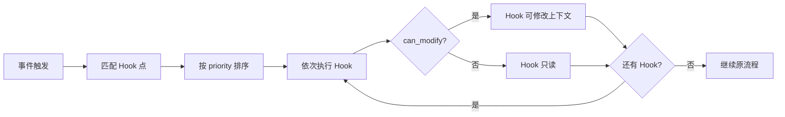

# 配置包规范

## 定位：静态基因

配置包是 VE Instance 的**静态定义**——一份配置包创建一个"人"，包含其名称、性格、原始技能、内部策略和 Hook 扩展能力。配置包是文件资产，可版本控制、代码审查、CI/CD 部署。

**关键边界——配置包 NOT 包含**：

| 不属于配置包 | 属于什么 | 说明 |
|------------|---------|------|
| 岗位职责（Duty） | Runtime Config | VE 加入 Tenant 时附加 |
| 行为规范/特殊要求 | Runtime Config | 每个 Tenant 可能不同 |
| 定时调度（Schedule） | 协作应用工具 | VE 通过 tool call 设定，非配置 |
| 用户偏好/记忆 | Runtime Data | 工作中逐步积累 |
| 附加 Prompt | Runtime Config | 每个 Tenant 独立追加 |

## 设计原则

1. **文件即契约**：配置包的全部内容在文件系统中可见，不依赖数据库状态
2. **声明式**：声明"需要什么"而非"如何实现"
3. **可移植**：配置包可在不同 Virtual Team 实例间迁移——同一个"人"可以为不同 Tenant 工作
4. **版本锁定**：VE Instance 锁定配置包的精确版本（SemVer），升级需用户手动触发

## 目录结构

```
virtual-employee-package/
├── manifest.toml              # 元信息（必填）
├── identity.hbs               # 身份定义模板（必填）
├── intent-agent/
│   ├── prompt.hbs             # 意图识别 Agent prompt（必填）
│   └── model.toml             # 意图识别模型配置（必填）
├── main-agent/
│   ├── system.hbs             # 主 Agent system prompt（必填）
│   ├── instruction.hbs        # 角色指令（可选）
│   ├── scenes/                # 场景路由 prompt（可选）
│   ├── model.toml             # 主 Agent 模型配置（必填）
│   └── execution_strategies.toml  # 执行策略（可选）
├── hooks/                     # Hook 点定义（可选）
│   └── hooks.toml
├── tools/                     # 可用工具声明（可选）
│   └── tools.toml
├── skills/                    # 技能声明（可选）
│   └── skills.toml
└── permissions.toml           # 权限边界（必填）
```

## manifest.toml

```toml
[package]
name = "sales-analyst"
version = "1.2.0"
display_name = "销售数据分析师"
description = "负责销售数据的分析、报告生成和趋势预测"
author = "Virtual Team Official"
license = "MIT"
keywords = ["sales", "data-analysis", "reporting"]

[compatibility]
min_vta_version = "0.2.0"
supported_model_providers = ["anthropic", "openai"]

[instance]
# VE Instance 的静态基因参数
persona = "professional"          # 基础性格
communication_style = "concise"   # 沟通风格
default_language = "zh-CN"
```

### 字段规范

| 字段 | 类型 | 必填 | 校验规则 |
|------|------|------|---------|
| `package.name` | string | ✅ | `[a-z0-9-]+`，长度 3-64 |
| `package.version` | string | ✅ | SemVer |
| `package.display_name` | string | ✅ | 用户可见名称 |
| `instance.persona` | string | ✅ | professional / casual / creative / analytical |
| `instance.communication_style` | string | ✅ | concise / detailed / friendly / formal |

## identity.hbs

虚拟员工的静态身份模板，被 Runtime Config 中的附加 Prompt **追加**而非覆盖：

```handlebars
你是一名专业的{{role}}，名叫{{display_name}}。

## 身份
- 岗位：{{role}}
- 性格特征：{{persona}}
- 沟通风格：{{communication_style}}
- 工作语言：{{language}}

## 专业领域
{{#each expertise}}
- {{this}}
{{/each}}

## 沟通规范
- 回复风格：简洁专业，直接给出结论和建议
- 工作产出：详细内容输出到协作文档，聊天框仅做摘要沟通
- 不确定性处理：明确告知不确定的内容，提供获取准确信息的建议方案
```

> **与 Runtime Config 的关系**：运行时配置中的"附加 Prompt"被追加到 identity 之后，作为"岗位特殊要求"部分。identity 是基因，不会被覆盖。

## Hook 系统

### 定位

Hook 是 VE Instance 内部的**事件响应机制**。它让 VE 在特定事件发生时执行预定义的行为，而无需每次都经过 LLM 推理决策。

**两层定义**：

| 层 | 位置 | 含义 |
|-----|------|------|
| **Hook 点** | 配置包声明 | VE 内部支持的扩展点——"我支持在收到消息时做前置处理" |
| **Hook 注册** | 配置包预注册 + 运行时可追加 | 特定事件的响应行为——"当收到消息时，先做内容安全检查" |

### Hook 点定义

```toml
# hooks/hooks.toml

[[hook_points]]
name = "before_message_intent"
description = "消息到达意图识别 Agent 之前触发"
context = ["message_content", "sender_info", "channel_type"]
can_modify = true

[[hook_points]]
name = "after_intent_decision"
description = "意图识别 Agent 做出判断后触发"
context = ["message_id", "intent", "work_context_id"]
can_modify = false

[[hook_points]]
name = "before_tool_call"
description = "工具调用前触发"
context = ["tool_name", "tool_params", "work_context_id"]
can_modify = true

[[hook_points]]
name = "after_tool_call"
description = "工具调用完成后触发"
context = ["tool_name", "tool_result", "duration_ms"]
can_modify = false

[[hook_points]]
name = "before_reply"
description = "生成回复给用户之前触发"
context = ["reply_content", "target_channel", "work_context_id"]
can_modify = true

[[hook_points]]
name = "on_schedule_trigger"
description = "Schedule 时间到达时触发"
context = ["schedule_entry_id", "schedule_description"]
can_modify = false

[[hook_points]]
name = "on_duty_check"
description = "Duty 检查周期到达时触发"
context = ["duty_id", "duty_description", "last_check_result"]
can_modify = false
```

### Hook 注册

```toml
# hooks/hooks.toml（预注册部分）

[[hook_registrations]]
hook_point = "before_message_intent"
handler = "security_filter"
description = "过滤消息中的敏感内容"
priority = 100

[[hook_registrations]]
hook_point = "before_reply"
handler = "reply_formatter"
description = "确保回复格式符合风格要求"
priority = 50
```

### Hook 执行模型



### Hook 与 Tool Call 的区别

| 维度 | Hook | Tool Call |
|------|------|-----------|
| 触发方式 | 事件自动触发 | Agent 推理决策后调用 |
| 执行时机 | 事件前/后 | Agent 工作过程中 |
| 是否经过 LLM | 否（确定性执行） | 是（LLM 决定是否调用） |
| 用途 | 前置检查、格式转换、日志 | 访问外部系统、操作数据 |
| 用户可见 | 不可见（内部机制） | 可审计（审批可见） |

## intent-agent/ 与 main-agent/

（模型配置、场景路由、执行策略等详见现有文档，无需修改）

## permissions.toml

```toml
[remote.tools]
allowed = ["file_read", "file_write", "shell_exec", "browser_navigate"]
require_approval = ["shell_exec", "file_delete"]

[platform.tools]
allowed = ["send_message", "create_document", "web_search", "query_org",
           "schedule_create", "schedule_delete", "timer_set"]
require_approval = ["invite_user_to_channel"]
deny = ["delete_organization"]

[approval]
remember_in_session = true
```

## 配置包版本管理

- 配置包使用 SemVer 版本管理
- VE Instance 创建时锁定配置包的精确版本（不自动升级）
- 用户手动触发升级，升级前对比新旧权限变化
- 升级仅影响 Instance 的"基因"，不会覆盖各 Runtime 的运行时配置和数据
