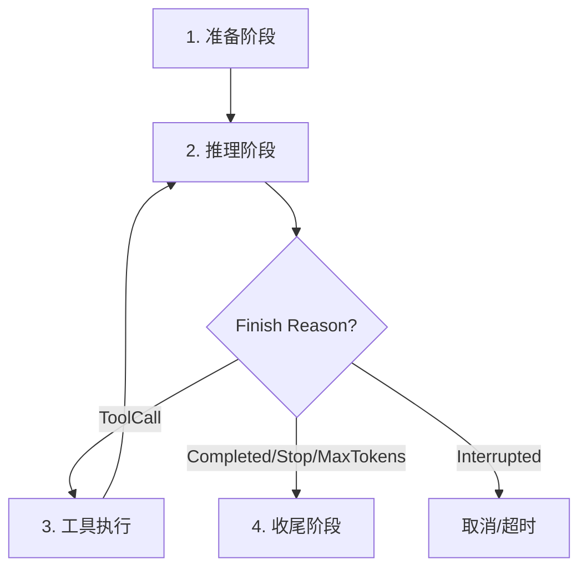

# 执行循环

## Turn 生命周期

一次完整的 Turn 执行包含四个阶段：



### 1. 准备阶段

- 提取用户输入文本（支持 Text 和 JSON 两种格式）
- 写入用户消息到 history + message_store（双轨）
- 从 `turn.resolved_context` 提取模型选择器（`effective_model`）
- 从 `turn.resolved_context.visible_tools` 构建冻结的工具 ID 集合
- 发现可用工具，按冻结集合过滤，生成 `ToolSpec` 快照

### 2. 推理阶段

- 获取当前 history 完整记录
- 构建 `PromptProjection`：System Prompt → 技能 → 插件 patch → 资源上下文 → 工具描述 → 对话历史
- 构造 `InferenceRequest`，携带模型选择器、projection、流式标记和工具元数据
- 调用推理后端（LLM API）
- 接收 `InferenceResult`，解析 `finish_reason`

### 3. 工具执行

当 LLM 返回 `finish_reason = ToolCall` 时：

- 从 `InferenceResult.metadata.tool_calls` 解析工具调用列表（OpenAI 兼容格式：`{id, function: {name, arguments}}`）
- 记录结构化的 Assistant tool_call 轨迹到 history（空 content + tool_call_id/tool_name/tool_arguments 元数据）
- 逐一校验每个工具调用是否在冻结的 `visible_tools` 中
- 通过 `ToolBridge.invoke_routed()` 执行工具
- 成功：工具结果序列化后作为 ToolResult 写入 history
- 失败：错误信息序列化为 `{is_error: true, ...}` 格式，同样写入 history（让 LLM 有机会纠正）
- 连续工具失败计数：成功时清零，失败时累加，超过上限（3 次）终止 Turn
- 工具执行完成后回到推理阶段继续循环

### 4. 收尾阶段

- 写入最终的助手回复到 history + message_store
- 调用 `kernel.complete_turn()`：传递 output_text、finish_reason、leading_events
- 失败时调用 `kernel.fail_turn()`：传递 error、leading_events

## 状态机

Turn 在 `runtime-kernel` 中管理，`DefaultAgentLoop` 通过 kernel 回调驱动状态转换：

```
Created → Running → Completed
                 → Failed
                 → Cancelled
```

AgentLoop 不直接操作 Turn 状态——所有状态变更通过 kernel trait 接口完成。

## 流式推理 vs 批量推理

**流式模式**（`stream_inference = true`，CLI/UI 场景）：
- 通过 `InferenceEventSink` 接收逐 chunk 事件
- 按活跃 section（reasoning/output/tool-call）分组输出，避免重复前缀
- section 切换时输出分隔 header，便于阅读

**批量模式**（后台任务）：
- 等待完整 `InferenceResult` 返回
- 适合非交互式工作上下文

## 协作式取消

VTA 支持优雅的协作式取消（非强制杀线程）：

- 取消令牌在 Turn 级别传播
- 推理阶段检测到取消信号后，mid-inference 中断
- 工具执行阶段检测到取消信号后，不启动新工具调用
- 取消后仍回调 `kernel.cancel_turn()`，确保状态一致

## Turn 间的隔离保证

- 每个 Turn 的工具快照互不影响（`visible_tools` 在 Turn 开始时冻结）
- 每个 Turn 独立计数（iteration、consecutive_tool_failures）
- Turn 间不共享 LLM 对话上下文（仅通过 Session 的 `model_state` 传递跨 Turn 状态）
- 一个 Turn 的失败不影响同一 Session 中后续 Turn

## 安全守卫

| 守卫 | 阈值 | 行为 |
|------|------|------|
| 最大迭代次数 | `max_iterations`（默认 50） | 终止 Turn |
| 连续工具失败 | 3 次 | 终止 Turn |
| 工具可见性冻结 | `visible_tools` 白名单 | 拒绝不在集合中的工具调用 |
| Max Output Tokens | 模型配置 | LLM 自动截断 |
