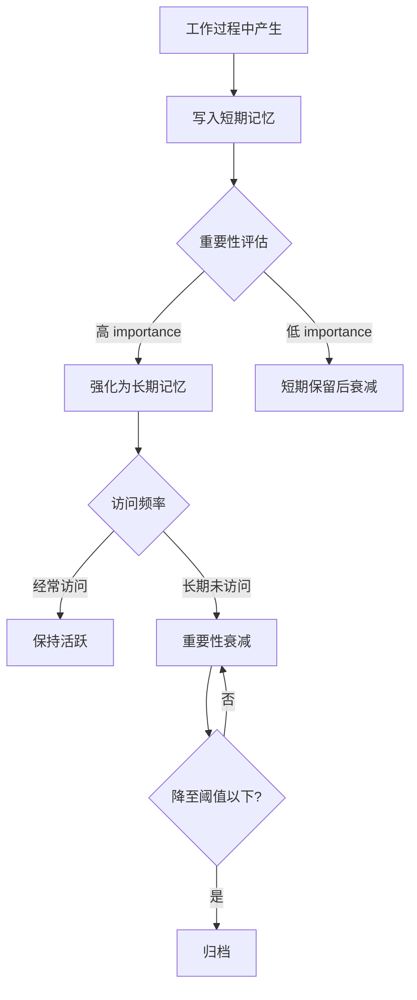
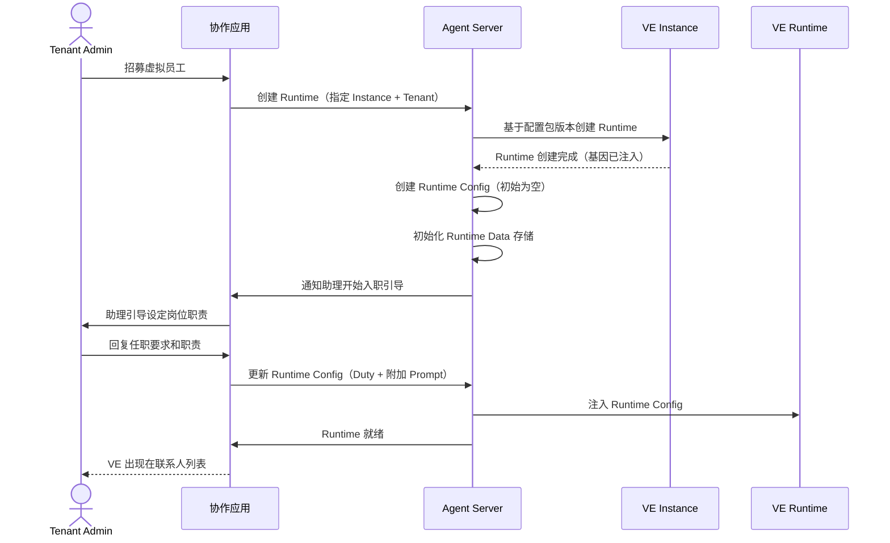

# Runtime 配置与数据

本章描述 VE Runtime 层面的动态内容——静态配置包（基因）之外的、随工作积累和调整的部分。

## 静态 vs 动态

```
VE Instance（静态 = 配置包 = "基因"）
  │
  │  在一个 Tenant 中"就职"
  ▼
VE Runtime（动态 = 本章描述的内容）
  ├── Runtime Config（确定性）
  │   ├── Duty（岗位职责）
  │   ├── 附加 Prompt / 行为规范
  │   ├── 特殊技能要求
  │   └── 权限覆盖（在配置包权限范围内的进一步缩小）
  │
  └── Runtime Data（累积性）
      ├── 记忆（用户偏好、历史决策）
      ├── 工作默契（用户习惯）
      └── 成长轨迹（技能提升、经验积累）
```

**关键原则**：
- Runtime Config **不覆盖**配置包——它是在配置包基础上**追加和约束**
- Runtime Data **不修改**配置行为——它提供上下文参考，影响决策但不改变"人格"
- 同一 VE Instance 的不同 Runtime（不同 Tenant）之间完全隔离——一个 Tenant 的记忆不会泄露到另一个 Tenant

## Runtime Config

### 定义

Runtime Config 是 VE 加入一个 Tenant 时被赋予的**确定性配置**。它回答"这个人在这个公司需要遵守什么"的问题。

### 存储模型

```sql
CREATE TABLE ve_runtime_configs (
    id UUID PRIMARY KEY DEFAULT gen_random_uuid(),
    runtime_id UUID NOT NULL UNIQUE,
    tenant_id UUID NOT NULL,

    -- 基础信息
    custom_display_name VARCHAR(128),  -- 在该 Tenant 中的别名（可选）

    -- 配置内容
    duties JSONB NOT NULL DEFAULT '[]',
    additional_prompts JSONB NOT NULL DEFAULT '[]',
    behavior_rules JSONB NOT NULL DEFAULT '[]',
    skill_overrides JSONB NOT NULL DEFAULT '[]',
    permission_overrides JSONB NOT NULL DEFAULT '{}',

    -- 版本控制
    config_version INTEGER NOT NULL DEFAULT 1,
    updated_by UUID,                    -- 谁修改的（User ID）

    created_at TIMESTAMPTZ NOT NULL DEFAULT now(),
    updated_at TIMESTAMPTZ NOT NULL DEFAULT now(),

    INDEX idx_rt_config_runtime (runtime_id),
    INDEX idx_rt_config_tenant (tenant_id)
);
```

### Duty（岗位职责）

Duty 是 Runtime Config 的核心——定义 VE 在这个 Tenant 中"负责什么"。它不是一次性任务，而是**持续性的职责描述**。

**Duty 的结构**：

```json
{
  "duties": [
    {
      "id": "duty_001",
      "name": "销售周报",
      "description": "每周一上午生成上周销售数据周报并存入多维表格",
      "type": "scheduled",
      "schedule": { "cron": "0 9 * * 1" },
      "priority": "routine",
      "output": {
        "target_tool": "bitable",
        "target_id": "bitable_sales_weekly"
      },
      "check_condition": null
    },
    {
      "id": "duty_002",
      "name": "库存预警监控",
      "description": "每 4 小时检查库存水平，低于安全阈值时通知用户",
      "type": "polling",
      "schedule": { "interval": "4h" },
      "priority": "high",
      "check_condition": "any_product_stock < safety_threshold",
      "action_on_trigger": "notify_user + suggest_restock_order"
    },
    {
      "id": "duty_003",
      "name": "新客户画像分析",
      "description": "当 CRM 中新客户注册时，分析客户画像并推荐跟进策略",
      "type": "event_driven",
      "hook": { "source": "webhook", "event": "customer.created" },
      "priority": "normal",
      "check_condition": null
    },
    {
      "id": "duty_004",
      "name": "响应客户咨询",
      "description": "当客户在协作应用或关联渠道中咨询时，实时响应并协助解决问题",
      "type": "reactive",
      "schedule": null,
      "priority": "high",
      "check_condition": null
    }
  ]
}
```

**Duty 类型**：

| 类型 | 启动方式 | 调度机制 | 示例 |
|------|---------|---------|------|
| `scheduled` | 定时触发 | Schedule Manager（cron） | 每周一早生成周报 |
| `polling` | 周期检查 | Schedule Manager（interval） | 每 4h 检查库存 |
| `event_driven` | 事件触发 | Hook 系统 | 新客户注册时分析画像 |
| `reactive` | 被动响应 | 消息到达 | 响应客户咨询 |

**Duty 的设定方式**：

1. **入职设定**：VE 加入 Tenant 时，管理员（或助理）通过专门的 prompt 流程定义 Duty。这是一个结构化的交互——助理引导管理员定义"这个岗位需要负责什么"
2. **运行中调整**：管理员通过协作应用的 VE 管理界面修改 Duty
3. **VE 自行建议**：VE 在工作中可能发现新的持续性需求，主动建议添加 Duty（需管理员确认）

### 附加 Prompt

在配置包的 `identity.hbs` 基础上追加的 Runtime 级 Prompt：

```json
{
  "additional_prompts": [
    {
      "scope": "global",
      "content": "你目前服务于某电商公司。该公司的品牌调性是年轻、活力，请在你的沟通中体现这一点。",
      "priority": 10
    },
    {
      "scope": "data_analysis",
      "content": "该公司的数据口径以周为单位（周一至周日），请在分析时注意。",
      "priority": 20
    }
  ]
}
```

附加 Prompt 在编译 system prompt 时追加到 identity 之后，优先级数字越大越靠后（即放在更后面，作为更具体的指令）。

### 行为规范

该 Tenant 特有的行为约束：

```json
{
  "behavior_rules": [
    {
      "rule": "no_weekend_messages",
      "description": "周末不主动发送消息，除非用户明确要求",
      "enforcement": "before_reply_hook"
    },
    {
      "rule": "max_daily_messages",
      "description": "每天主动发消息不超过 5 条",
      "enforcement": "soft_limit"
    }
  ]
}
```

### 权限覆盖

Runtime 级权限只能**缩小**配置包中声明的权限范围，不能扩大：

```json
{
  "permission_overrides": {
    "remote.filesystem.read": ["/workspace/tenant_projects"],
    "remote.tools.require_approval": ["shell_exec", "file_write"]
  }
}
```

## Runtime Data

### 定义

Runtime Data 是 VE 在此 Tenant 工作中**累积的数据**——非确定性的、逐步形成的"工作经验"。

### 存储模型

```sql
CREATE TABLE ve_runtime_memories (
    id UUID PRIMARY KEY DEFAULT gen_random_uuid(),
    runtime_id UUID NOT NULL,
    tenant_id UUID NOT NULL,

    -- 记忆内容
    memory_type VARCHAR(32) NOT NULL,
    -- 'user_preference', 'work_pattern', 'decision_history', 'feedback', 'fact'

    content TEXT NOT NULL,
    embedding VECTOR(1536),              -- 向量嵌入（pgvector）
    importance REAL NOT NULL DEFAULT 0.5,
    -- 重要性分数，越高越不容易被遗忘

    -- 来源
    source_work_context_id UUID,
    source_event_type VARCHAR(32),

    -- 生命周期
    access_count INTEGER NOT NULL DEFAULT 0,
    last_accessed_at TIMESTAMPTZ,
    created_at TIMESTAMPTZ NOT NULL DEFAULT now(),

    INDEX idx_rt_memories_runtime (runtime_id, memory_type),
    INDEX idx_rt_memories_embedding USING ivfflat (embedding vector_cosine_ops)
);
```

### 记忆类型

| 类型 | 说明 | 示例 |
|------|------|------|
| `user_preference` | 用户偏好 | "用户更喜欢表格而非图表呈现数据" |
| `work_pattern` | 用户工作模式 | "用户通常在周五下午做下周规划" |
| `decision_history` | 历史决策 | "上次分析 Q1 数据时，用户选择了按月度拆分" |
| `feedback` | 用户反馈 | "用户说上次的报告太冗长，希望精简" |
| `fact` | 工作中学到的事实 | "该公司的核心 KPI 是月 GMV 和复购率" |

### 记忆的生命周期



### 记忆的检索与注入

每次创建新工作上下文时，Agent 服务器从 Runtime Data 中检索相关记忆，注入到初始上下文中：

```
1. 分析任务描述 → 提取关键概念
2. 向量检索相关记忆（cosine similarity > 0.8）
3. 按 importance × recency 排序，取 Top 5
4. 编译为 "已知上下文" 片段注入 system prompt
```

注入格式：

```
[已知上下文（来自此 Tenant 的工作经验）]
- 用户偏好：表格而非图表（来源：2026-04 数据分析任务反馈）
- 工作模式：周五下午做下周规划（来源：多次观察）
- 事实：核心 KPI = 月 GMV、复购率（来源：入职时确认）
```

### 成长性设计

随着 Runtime 持续工作，VE 在这个 Tenant 中逐步变得更"懂"用户：

| 维度 | 短期（1 周） | 中期（1 月） | 长期（3 月+） |
|------|-----------|-----------|------------|
| 偏好学习 | 基础沟通偏好 | 数据格式、报告风格 | 深度工作习惯 |
| 知识积累 | 关键业务术语 | 核心业务流程 | 行业专业知识 |
| 效率提升 | 减少确认性问题 | 预判用户需求 | 主动建议优化 |

## Runtime 初始化流程



## 与配置包的关系

```
配置包（Pkg）              Runtime Config       Runtime Data
─────────────              ─────────────        ────────────
identity.hbs      ←追加──  additional_prompts
skills.toml       ←缩小──  permission_overrides
permissions.toml  ←缩小──  permission_overrides
（无）             ←新增──  duties
（无）             ←新增──  behavior_rules
（无）                        ←积累────  memories
```

- 配置包是**基线**，Runtime Config 是**附加层**
- 运行时编译 system prompt = identity + additional_prompts + behavior_rules
- 权限 = min(配置包权限, Runtime 权限覆盖)
- 记忆是独立维度，仅影响上下文注入，不修改配置
