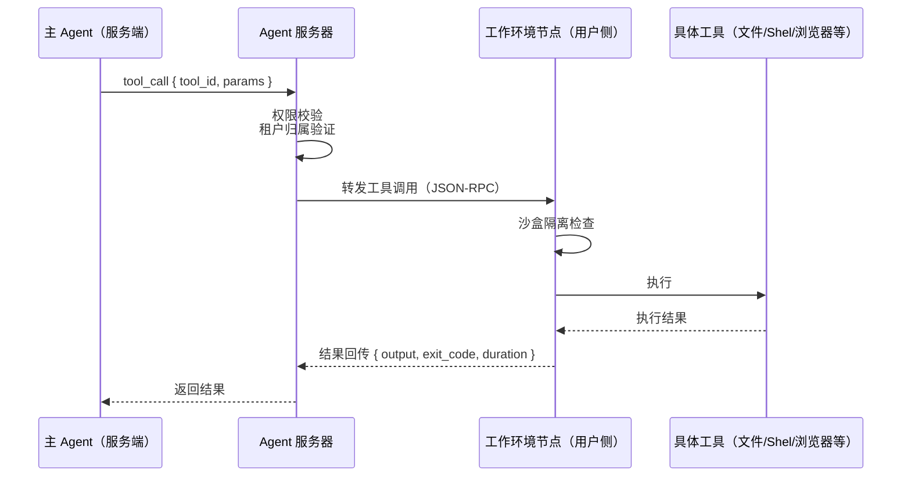
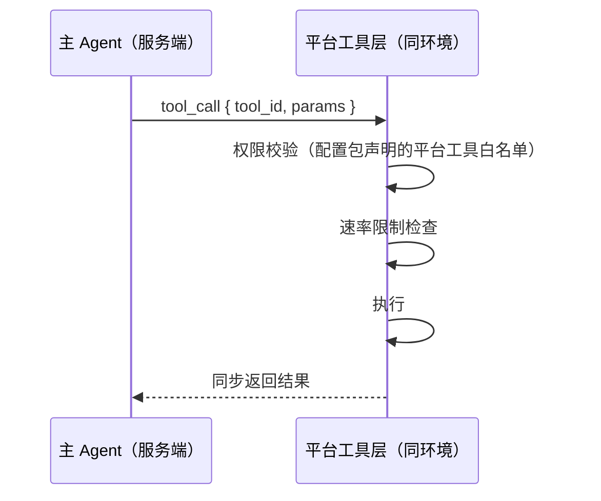
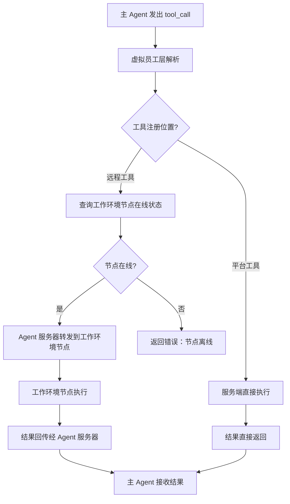
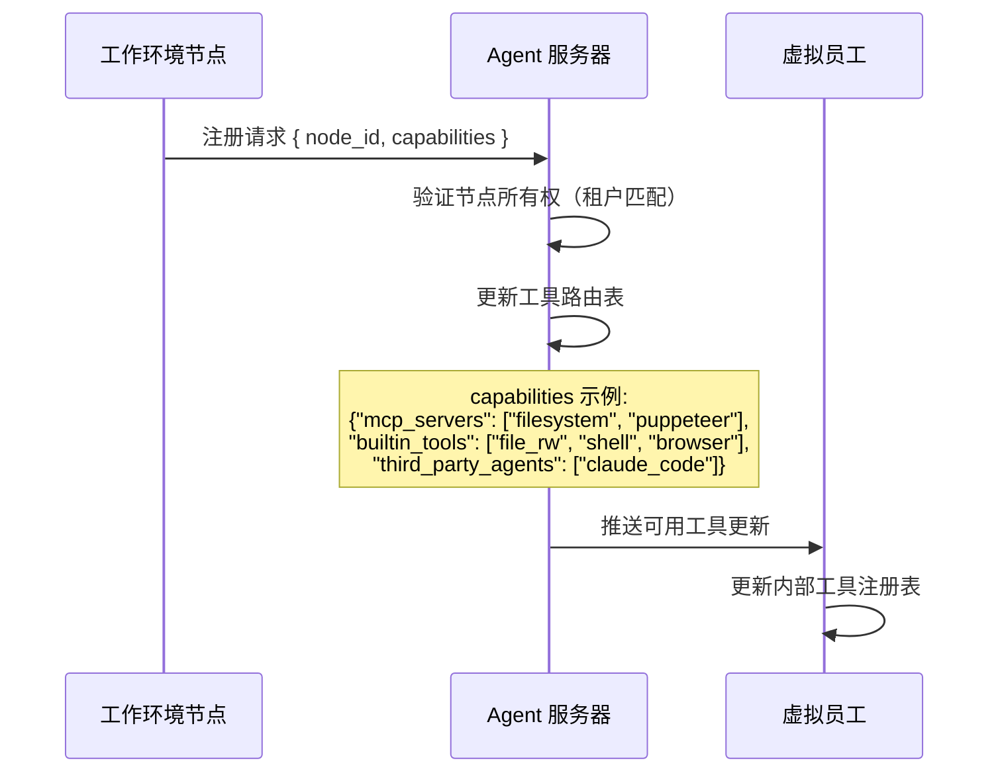

# 工具体系

虚拟员工的工具分为两大类别，按**执行位置**区分。主 Agent 不感知工具的实际执行位置——它只看到统一的工具接口。

## 远程工具（工作环境节点工具）

运行在**用户侧或云端**的工作环境节点上，通过网络协议远程调用。

### 工具类型

| 工具类型 | 能力 | 典型用途 |
|---------|------|---------|
| **文件系统** | 文件读写、搜索、组织、权限管理 | 操作本地项目文件、生成报告 |
| **Shell** | 命令执行、进程管理、管道 | 运行脚本、安装依赖、执行编译 |
| **浏览器** | 网页导航、数据采集、表单填写 | Web 调研、数据抓取、自动化测试 |
| **第三方 Agent** | 委托 Claude Code / Codex 等执行任务 | 复杂编码、专业领域任务 |
| **MCP Server** | 兼容任何 MCP 协议的工具生态 | 数据库查询、API 集成、自定义工具 |

### 调用路径



### 超时与重试

| 工具类型 | 默认超时 | 重试策略 |
|---------|---------|---------|
| 文件操作 | 30s | 不重试（文件系统错误通常不可恢复） |
| Shell 执行 | 300s | 可重试 1 次（网络波动导致的超时） |
| 浏览器操作 | 120s | 不重试 |
| 第三方 Agent | 600s | 不重试 |

### 安全控制

所有远程工具调用经过两层权限检查：

1. **配置包权限**：`permissions.toml` 中声明允许的工具和文件路径范围
2. **用户审批**：高风险操作（代码执行、文件删除、外网访问）需用户确认

详见 [安全、权限与隔离](../12-security-and-isolation.md)。

## 平台工具（服务端工具）

与虚拟员工运行于**同一服务端环境**，直接调用不需要经工作环境节点中转。

### 工具类型

| 工具类型 | 能力 | 说明 |
|---------|------|------|
| **协作应用交互** | 发送消息、创建文档、操作看板 | 通过协作应用 API |
| **网络检索** | Web 搜索、HTTP API 调用 | 平台统一出口 |
| **虚拟员工间通讯** | 向其他 VE 发消息/委派任务 | 通过 Agent 服务器路由 |
| **平台内置工具** | Token 计数、上下文摘要、时间查询、文件格式转换 | 通用工具能力 |

### 调用路径



### 速率限制

平台工具需要防止单个虚拟员工过度消耗共享资源：

| 工具 | 限制维度 | 默认限制 |
|------|---------|---------|
| `collab.message.send` | 每分钟消息数 | 30 msg/min |
| `web.search` | 每分钟请求数 | 20 req/min |
| `collab.document.update` | 每分钟写入次数 | 60 writes/min |
| `ve_to_ve.message` | 每分钟跨 VE 消息数 | 10 msg/min |

## 工具路由

### 路由决策流程



### 路由表

Agent 服务器维护虚拟员工的工具路由表：

```json
{
  "ve_id": "ve_sales_01",
  "tools": [
    {
      "name": "file_read",
      "location": "remote",
      "wen_id": "wen_user01_laptop",
      "status": "online"
    },
    {
      "name": "send_message",
      "location": "platform",
      "status": "available"
    }
  ]
}
```

## 工具注册与发现

### 注册流程



### 能力声明格式

工作环境节点上线时声明其承载的工具能力：

```json
{
  "node_id": "wen_user01_laptop",
  "node_type": "local | cloud",
  "host_info": {
    "os": "darwin",
    "arch": "arm64",
    "hostname": "Chongyi-MacBook"
  },
  "capabilities": {
    "mcp_servers": [
      {
        "name": "filesystem",
        "version": "1.0.0",
        "tools": ["read_file", "write_file", "list_directory", "search_files"]
      },
      {
        "name": "chrome-devtools",
        "version": "0.5.0",
        "tools": ["navigate_page", "take_screenshot", "take_snapshot", "click"]
      }
    ],
    "builtin_tools": ["file_read", "file_write", "shell_exec", "http_request"],
    "third_party_agents": [
      {
        "name": "claude_code",
        "version": "2.0.0",
        "capabilities": "full_development"
      }
    ],
    "sandbox": {
      "type": "container | process | none",
      "supported_isolation": ["filesystem", "network", "process"]
    }
  }
}
```

### 工具描述生成

注册后的工具自动生成适配 VTA tool call 格式的描述：

```json
{
  "name": "file_read",
  "description": "读取指定路径的文件内容",
  "parameters": {
    "type": "object",
    "properties": {
      "path": {
        "type": "string",
        "description": "相对于工作目录的文件路径"
      },
      "encoding": {
        "type": "string",
        "enum": ["utf-8", "binary"],
        "default": "utf-8"
      }
    },
    "required": ["path"]
  }
}
```

工具描述由工作环境节点根据工具元数据自动生成，或在 MCP Server 的 `tools/list` 中获取。

### 虚拟员工可用的工具

意图识别 Agent 和主 Agent 的工具权限不同：

| Agent | 远程工具 | 平台工具 | 说明 |
|-------|---------|---------|------|
| **意图识别 Agent** | 不可用 | 仅查询类（`context.*`、`message.search`、`org.query`） | 只读分析，不执行操作 |
| **主 Agent** | 全部可用 | 全部可用 | 完整工具权限 |
| **子 Agent** | 按配置覆盖 | 按配置覆盖 | 由主 Agent 创建时指定 |

## 工具执行的安全性

### 执行前检查

每次工具调用前，Agent 服务器执行以下检查：

1. **配置包权限**：工具名是否在 `permissions.toml` 的允许列表中
2. **文件路径限制**：远程文件操作的目标路径是否在允许范围内
3. **审批规则匹配**：是否需要用户审批
4. **速率限制**：是否超出当前时窗的调用限制
5. **节点在线状态**：远程工具的目标节点是否在线

### 审批触发规则

```toml
# permissions.toml 中的审批配置
[remote.tools]
allowed = ["file_read", "file_write", "shell_exec", "browser_navigate"]
require_approval = ["shell_exec", "file_delete", "browser_form_submit"]

[platform.tools]
allowed = ["send_message", "create_document", "web_search", "query_org"]
require_approval = ["invite_user_to_channel", "create_organization"]
deny = ["delete_organization"]

[approval.rules]
# 本次会话内记住选择（减少审批频率）
remember_in_session = true
# 文件写入超过此大小需审批
file_write_size_threshold_bytes = 1048576
# Shell 执行时间超过此时长需审批
shell_exec_duration_threshold_seconds = 60
```
