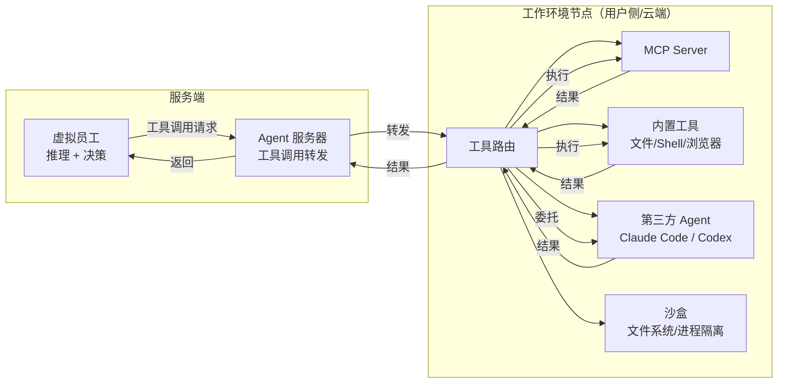
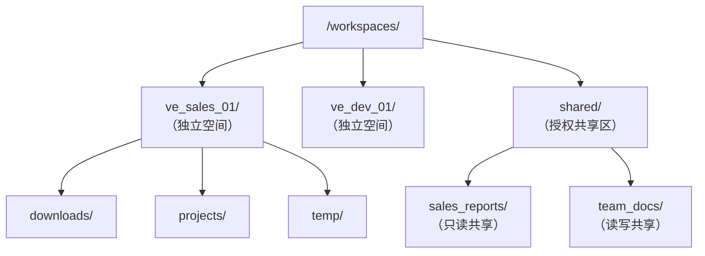

# 工作环境节点

## 定位

工作环境节点（Work Environment Node）是虚拟员工**远程工具**的承载环境。它将"执行能力"从"推理能力"中分离出来，使两者可以物理分离——虚拟员工运行于服务端进行推理，而工具调用在用户侧或云端的工作环境节点上实际执行。

完整的工具体系（远程工具 + 平台工具）见 [工具体系](./08-vte-agent-internals/tool-system.md)。

## 为什么需要分离

传统 Agent 在本地进程内执行所有工具，但在 Virtual Team 中：

- 虚拟员工运行于服务端（Agent 服务器/VE Runner）
- 许多工具需要访问用户本地环境（本地文件、私有网络、内部系统、特定软件）
- 用户可能不想将敏感数据上传到服务端
- 某些工具的执行环境要求与推理环境不同（如需要 GPU 的本地模型）

工作环境节点解决了这个矛盾：推理在服务端，执行在用户侧。

## 工作模式



**关键设计**：虚拟员工不直接与工作环境节点通信。所有指令和结果通过 Agent 服务器中转，确保：
1. 统一的权限校验点
2. 完整的审计日志
3. 节点离线时的统一错误处理

## 承载能力

### MCP Server

工作环境节点可内置 MCP Server，将本地工具能力暴露给虚拟员工。支持标准 MCP 协议，可接入任何兼容 MCP 的工具生态。

MCP Server 在工作环境节点中以子进程或 sidecar 形式运行：

| 运行模式 | 隔离级别 | 适用场景 |
|---------|---------|---------|
| 子进程 | 进程级隔离 | 标准 MCP Server |
| Sidecar 容器 | 容器级隔离 | 需要网络隔离的 MCP Server |
| 内嵌 | 无隔离 | 受信任的内置工具 |

### 内置工具 (Built-in Tools)

工作环境节点内置的基础工具集，不依赖 MCP Server：

- **文件系统操作**：读写、搜索、组织、权限管理
- **Shell 命令执行**：命令执行、管道、进程管理
- **网络请求**：HTTP 客户端，支持自定义 header 和代理
- **进程管理**：启动、监控、终止外部进程

### 第三方 Agent

工作环境节点可运行成熟的第三方 Agent（Claude Code、Codex 等），虚拟员工可将特定任务委托给这些 Agent——这对应了 Virtual Team 的"外部 Agent 调度"能力。

委托模式：

```
虚拟员工 → 构造委托任务描述 → Agent 服务器 → WEN → 启动第三方 Agent → 执行 → 结果回传
```

第三方 Agent 在工作环境节点中以独立进程运行，其文件系统和网络访问同样受沙盒限制。

## 沙盒与隔离

### 隔离级别

工作环境节点支持三种隔离级别：

| 级别 | 实现方式 | 资源开销 | 安全强度 | 适用场景 |
|------|---------|---------|---------|---------|
| **None** | 无隔离，宿主机直接执行 | 零 | 低 | 用户完全信任的 VE，开发/测试 |
| **Process** | 操作系统用户级隔离（独立 UID/GID）+ 文件系统权限 | 低 | 中 | 生产环境默认级别 |
| **Container** | Docker/Podman 容器隔离 + cgroup 资源限制 | 中 | 高 | 运行不可信代码、企业环境 |

### 文件系统隔离



文件系统权限矩阵：

| 路径 | ve_sales_01 | ve_dev_01 | 说明 |
|------|-----------|----------|------|
| `/workspaces/ve_sales_01/` | 读写 | 不可访问 | VE 独立空间 |
| `/workspaces/shared/sales_reports/` | 读 | 只读 | 跨 VE 只读共享 |
| `/workspaces/shared/team_docs/` | 读写 | 读写 | 跨 VE 协作区 |
| `/etc/`, `/usr/`, `/.ssh/` | 拒绝 | 拒绝 | 系统保护 |

### 网络隔离

| 模式 | 说明 |
|------|------|
| **完全开放** | VE 可访问任意外网地址 |
| **白名单** | 仅允许访问指定的域名/IP 列表 |
| **完全阻断** | 不允许任何外网访问（仅 localhost 和内网） |

默认策略：`完全开放`，但高危操作（Shell 执行、浏览器导航）仍需要用户审批。

### 资源限制（Container 模式）

| 资源 | 默认限制 | 说明 |
|------|---------|------|
| CPU | 2 cores | 单 VE 最大 CPU 使用量 |
| 内存 | 4 GB | 单 VE 最大内存 |
| 磁盘 | 50 GB | 单 VE 工作空间上限 |
| 进程数 | 100 | 单 VE 最大并发进程数 |
| 网络带宽 | 100 Mbps | 单 VE 最大出站带宽 |

## 用户场景

### 场景一：用户自建环境

用户在自己的设备上安装工作环境客户端（桌面应用或 CLI 工具），连接服务端后分配给虚拟员工使用。

```
用户设备：
├── 工作环境客户端（常驻后台）
├── VE-1 工作空间 (~/workspaces/ve_sales_01/)
├── VE-2 工作空间 (~/workspaces/ve_dev_01/)
└── 共享空间 (~/workspaces/shared/)
```

优点：数据完全在用户掌控中，不产生额外费用。

### 场景二：单设备多员工

用户只有一台设备，需要多个虚拟员工共享。工作环境客户端为每个虚拟员工建立独立空间（独立文件目录 + 独立进程 UID + 独立网络命名空间），实现逻辑隔离。

### 场景三：云端托管

商业化方案——由 Virtual Team 平台提供云端工作环境（类似云主机/云 PC），预装优化和定制工具，用户按需订阅。

```
Virtual Team 平台：
├── 云端 WEN 集群
│   ├── WEN-1 (用户 A，Starter 套餐)
│   ├── WEN-2 (用户 B，Professional 套餐)
│   └── WEN-3 (用户 C，Enterprise 套餐)
└── 预装工具：
    ├── 常用 MCP Server
    ├── Claude Code / Codex
    └── 企业专属工具
```

## 虚拟员工与工作环境的绑定

### 分配模式

1. **用户手动分配**：用户在协作应用中显式选择在线的工作环境节点分配给特定虚拟员工
2. **虚拟员工申请**：虚拟员工检测到用户有可用节点但未分配时，主动发消息申请（需用户确认）
3. **自动匹配**：如果用户只有一个在线节点，创建 VE 时自动分配

### 绑定关系

```sql
CREATE TABLE ve_wen_bindings (
    id UUID PRIMARY KEY DEFAULT gen_random_uuid(),
    ve_id UUID NOT NULL,
    wen_id UUID NOT NULL,
    binding_type VARCHAR(16) NOT NULL DEFAULT 'exclusive',
    -- 'exclusive'（独占）, 'shared'（共享）
    isolation_level VARCHAR(16) NOT NULL DEFAULT 'process',
    -- 'none', 'process', 'container'
    workspace_path TEXT NOT NULL,
    created_at TIMESTAMPTZ NOT NULL DEFAULT now(),
    UNIQUE (ve_id, wen_id)
);
```

### 共享与隔离

一个工作环境节点可同时服务多个虚拟员工。隔离策略由 `isolation_level` 和 `binding_type` 决定：

| binding_type | 说明 |
|-------------|------|
| exclusive | VE 独占该节点（其他 VE 不可同时使用），隔离级别最高 |
| shared | 多个 VE 共享该节点，通过文件系统级别隔离区分工作空间 |

## 节点健康监控

工作环境节点通过心跳上报健康状态：

```json
{
  "type": "heartbeat",
  "node_id": "wen_laptop",
  "status": {
    "cpu_percent": 45.2,
    "memory_mb": 2048,
    "memory_available_mb": 6144,
    "disk_free_gb": 120.5,
    "active_ve_count": 2,
    "active_tool_calls": 1,
    "uptime_seconds": 86400,
    "last_error": null
  }
}
```

Agent 服务器评估节点健康：

| 指标 | 健康阈值 | 降级阈值 | 离线判定 |
|------|---------|---------|---------|
| 心跳间隔 | < 30s | 30-90s | > 90s × 3 次 |
| CPU 使用率 | < 80% | 80-95% | > 95% |
| 可用内存 | > 1GB | 512MB-1GB | < 512MB |
| 磁盘空间 | > 10GB | 2-10GB | < 2GB |

降级状态的节点仍可接受工具调用，但：
- Agent 服务器在路由时降低其优先级
- 有健康节点时优先分配给健康节点
- 降级节点不接受新的 VE 绑定
