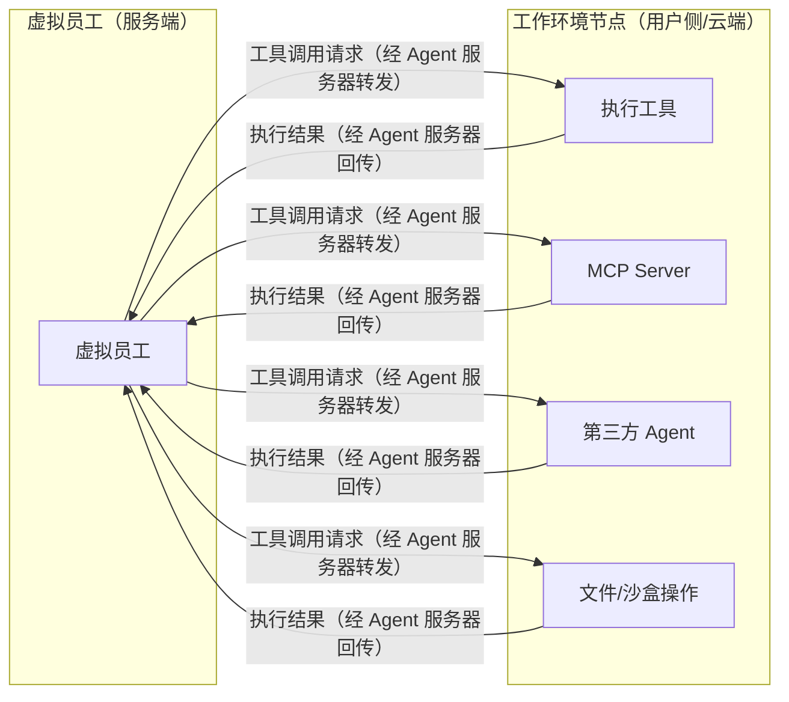

# 工作环境节点

## 定位

工作环境节点（Work Environment Node）是虚拟员工**远程工具**的承载环境。

虚拟员工的工具分为两大类：**平台工具**（服务端同环境执行，如协作应用 API、网络检索）和**远程工具**（经由工作环境节点执行）。本章描述的是远程工具的承载基础设施。完整工具体系见 [虚拟员工 Agent 内部设计](./08-vte-agent-internals/overview.md)。

传统 Agent 在本地进程内执行所有工具。但在 Virtual Team 中，虚拟员工运行于服务端，而许多用户工具需要访问用户本地环境（本地文件、私有网络、内部系统、特定软件）。工作环境节点将"执行能力"从"推理能力"中分离出来，使两者可以物理分离。

## 工作模式

虚拟员工**不直接**与工作环境节点通信。所有指令和结果通过**Agent 服务器中转**：

- 虚拟员工 → Agent 服务器 → 工作环境节点 → 执行 → 结果 → Agent 服务器 → 虚拟员工

## 承载能力

### MCP Server

工作环境节点可内置 MCP Server，将本地工具能力暴露给虚拟员工。支持标准 MCP 协议，可接入任何兼容 MCP 的工具生态。

### 内置工具 (Built-in Tools)

工作环境节点内置的基础工具集：

- 文件系统操作（读写、搜索、组织）
- Shell 命令执行
- 网络请求
- 进程管理

### 第三方 Agent

工作环境节点可运行成熟的第三方 Agent（Claude Code、Codex 等），虚拟员工可将特定任务委托给这些 Agent——这对应了 Virtual Team 的"外部 Agent 调度"能力。

### 沙盒与文件系统隔离

工作环境节点通过沙盒机制提供隔离：

- 不同虚拟员工被分配独立的文件系统空间（类似操作系统用户目录）
- 在授权范围内支持跨虚拟员工的文件共享
- 隔离级别可根据用户配置调整

## 用户场景

### 场景一：用户自建环境

用户在自己的设备上安装工作环境客户端，连接服务端后分配给虚拟员工使用。用户掌控数据和执行环境，虚拟员工"借用"这个环境完成工作。

### 场景二：单设备多员工

用户只有一台设备，需要多个虚拟员工共享。工作环境客户端为每个虚拟员工建立独立空间（沙盒 + 独立文件目录），实现逻辑隔离。

### 场景三：云端托管

商业化方案——由 Virtual Team 平台提供云端工作环境（类似云主机/云 PC），预装优化和定制工具，用户按需订阅。

## 虚拟员工与工作环境的绑定

### 分配模式

1. **用户手动分配**：用户将在线的工作环境节点显式分配给特定虚拟员工
2. **虚拟员工申请**：虚拟员工发现可用的工作环境节点后，主动申请使用（需用户确认）
3. **发现机制**：工作环境节点上线后，虚拟员工可发现并提示用户分配

### 共享与隔离

一个工作环境节点可同时服务多个虚拟员工：

- **文件系统级别**隔离（不同虚拟员工 = 不同工作目录）
- 服务端配合调度，防止工具调用冲突
- 用户可配置隔离强度（共享目录、完全隔离、只读共享等）

## 工作环境协议

工作环境客户端与服务端之间的协议：

- 节点注册与心跳
- 能力声明（节点上有哪些工具、Agent、MCP Server）
- 工具调用请求/响应
- 文件传输
- 沙盒状态管理
- 节点离线/重连处理
