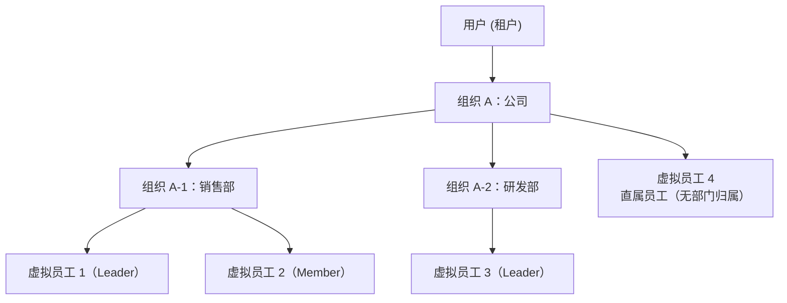
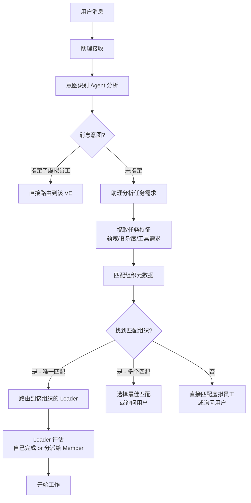

# 租户与组织模型

## 租户模型

### 定义

租户（Tenant）= **用户**。一个用户 = 一个独立的 Virtual Team 数据空间。

### 设计决策：为什么租户 = 用户而非"团队"

许多 SaaS 产品将租户定义为"团队/工作区"，一个租户下可以有多个用户。但 Virtual Team 的虚拟员工本身就是 Agent，每个用户的虚拟员工、配置、工作上下文是高度个性化的，不适合共享租户模型。

如果未来需要"团队协作"，正确的方式是让**虚拟员工之间协作**——通过 Agent 服务器路由跨用户消息——而非共享底层数据空间。

### 租户的隔离范围

| 隔离项 | 隔离级别 | 实现方式 |
|--------|---------|---------|
| 虚拟员工实例 | 完全隔离 | `tenant_id` 过滤，不可跨租户访问 |
| 消息与对话 | 完全隔离 | Store 查询默认带 `tenant_id` |
| 工作上下文 | 完全隔离 | 工作上下文归属创建者 |
| 组织数据 | 完全隔离 | 用户创建的组织仅自己可见 |
| 配置包 | 租户级副本 | 用户导入的配置包存储在自己的命名空间 |
| 工作环境节点 | 完全隔离 | 节点只能在注册租户内使用 |
| 搜索索引 | 完全隔离 | 搜索限制在当前租户数据范围内 |

### 数据模型预留

所有核心实体在数据库层面预留 `tenant_id` 字段：

```sql
-- 示例：工作上下文表
CREATE TABLE work_contexts (
    id UUID PRIMARY KEY,
    tenant_id UUID NOT NULL,          -- 租户隔离
    ve_id UUID NOT NULL,
    status VARCHAR(16) NOT NULL,      -- 'active', 'paused', 'archived'
    summary TEXT,
    created_at TIMESTAMPTZ NOT NULL,
    updated_at TIMESTAMPTZ NOT NULL,
    -- 索引中包含 tenant_id 保证所有查询高效隔离
    INDEX idx_work_contexts_tenant_ve (tenant_id, ve_id, status)
);
```

Store 层所有查询默认附加 `WHERE tenant_id = $current_tenant`，无法通过 API 跨越租户边界。

## 组织模型

### 定义与数据结构

组织是用户创建的逻辑管理单元，呈**树状结构**。核心数据模型：

```sql
CREATE TABLE organizations (
    id UUID PRIMARY KEY,
    tenant_id UUID NOT NULL,
    parent_id UUID,                    -- NULL = 顶级组织
    name VARCHAR(128) NOT NULL,
    description TEXT,
    metadata JSONB NOT NULL DEFAULT '{}',  -- 业务领域标签、典型任务类型等
    sort_order INTEGER NOT NULL DEFAULT 0,
    created_at TIMESTAMPTZ NOT NULL,
    updated_at TIMESTAMPTZ NOT NULL,
    UNIQUE INDEX idx_orgs_tenant_name (tenant_id, parent_id, name),
    INDEX idx_orgs_tenant_parent (tenant_id, parent_id)
);

-- 虚拟员工与组织的关联
CREATE TABLE organization_members (
    id UUID PRIMARY KEY,
    organization_id UUID NOT NULL REFERENCES organizations(id),
    ve_id UUID NOT NULL,
    role VARCHAR(16) NOT NULL,         -- 'leader', 'member'
    assigned_at TIMESTAMPTZ NOT NULL,
    UNIQUE INDEX idx_org_members_unique (organization_id, ve_id)
);
```

### 组织结构图



### 组织的用途

**1. 资源与数据划分**

- 不同业务的虚拟员工归属于不同组织
- 组织级别的配置和策略管理（如默认权限模板、审批规则）
- 频道可绑定到组织，成员自动继承频道访问权

**2. 工作路由辅助**

- 助理接收到任务后，通过匹配组织元数据和虚拟员工能力摘要找到目标组织
- 不需要每次分析任务都扫描所有虚拟员工

**3. 减少 token 消耗**

- 组织有元数据和描述，便于 AI 快速识别匹配
- 意图识别 Agent 只需分析"找哪个组织"，而非"找哪个员工"

### 组织中的角色

| 角色 | 职责 | 典型配置 |
|------|------|---------|
| **Leader** | 工作拆分、分派、协调、审查、汇总。组织内虚拟员工的"主管" | 更强模型 + 管理型 prompt + 组织读写权限 |
| **Member** | 具体执行工作 | 按岗位配置的模型和工具 |
| **Assistant** | 跨组织协调、用户意图理解、全局任务分发 | 不属于特定组织，全局视野 |

### 用户感知程度

在大多数简单场景下（1-3 个虚拟员工），组织对用户是透明的——系统自动创建默认组织，虚拟员工直接展示在联系人列表中。

只有当业务复杂度增加到需要分层管理时才显式创建。这与现实场景一致——个体商户不需要部门架构，企业集团才需要。

系统自动管理"默认组织"：

```
用户创建虚拟员工 → 未指定组织 → 自动放入"我的团队"（默认组织）
用户创建第二个虚拟员工 → 同样放入"我的团队"
用户手动创建"销售部"组织 → 可将虚拟员工移入
```

## 组织元数据

每个组织维护结构化的元数据，用于 AI 任务路由匹配：

```json
{
  "org_id": "org_sales",
  "name": "销售部",
  "description": "负责销售数据分析、客户关系管理、销售策略制定",
  "business_domains": ["sales", "crm", "data-analysis"],
  "typical_tasks": [
    "销售数据报告生成",
    "客户线索分析",
    "销售业绩预测",
    "竞品调研"
  ],
  "member_summaries": [
    {
      "ve_id": "ve_sales_01",
      "role": "leader",
      "display_name": "销售分析师",
      "capability_summary": "数据分析、报告生成、趋势预测、数据可视化",
      "tools": ["file_read", "shell_exec", "web_search", "bitable"]
    }
  ],
  "active_work_contexts": 3,
  "total_work_contexts": 128
}
```

### 元数据的维护

元数据由系统**自动维护**而非用户手动填写：

| 元数据字段 | 来源 | 更新时机 |
|-----------|------|---------|
| `business_domains` | 虚拟员工配置包的 keywords + 实际任务类型统计 | 虚拟员工加入/离开 + 定期评估 |
| `typical_tasks` | 已完成工作上下文的摘要聚类 | 每次工作上下文完成 |
| `member_summaries` | 虚拟员工配置包的能力声明 | 配置包变更 |
| `active_work_contexts` | 工作上下文状态计数 | 实时更新 |

## 任务路由算法

### 从消息到虚拟员工



### 匹配评分

组织匹配的评分公式：

```
score = 领域匹配度 × 0.4 + 负载因子 × 0.3 + 历史成功率 × 0.2 + 响应速度 × 0.1
```

| 因子 | 计算方式 | 说明 |
|------|---------|------|
| 领域匹配度 | 任务关键词 ∩ 组织 business_domains 的 Jaccard 相似度 | 基于配置包和任务历史 |
| 负载因子 | 1.0 - (active_work_contexts / max_concurrent) | 避免向忙碌组织派发更多任务 |
| 历史成功率 | 该组织过去 30 天内任务成功完成的比例 | 失败/取消的任务降低分数 |
| 响应速度 | 该组织过去 30 天任务平均完成时间的归一化倒数 | 快速组织获得加分 |

### 兜底策略

- 无匹配组织 → 助理直接向用户确认"你想让谁处理这个任务？"并提供候选列表
- Leader 不可用（离线）→ 降级为直接匹配组织内 Member
- 匹配分数低于阈值 → 助理列出 Top 3 候选并说明原因，等待用户选择

## 跨组织协作

同一租户内不同组织的虚拟员工可以协作，通过以下方式：

1. **共享频道**：用户将不同组织的虚拟员工拉入同一频道
2. **任务委派**：Leader A 可将子任务委派给组织 B 的虚拟员工（通过 Agent 服务器路由）
3. **共享文件区**：在工作环境节点中配置跨组织的共享目录

权限约束：跨组织协作仍需遵守配置包的权限边界——委派任务不能授予接收方超出其配置包声明的权限。
