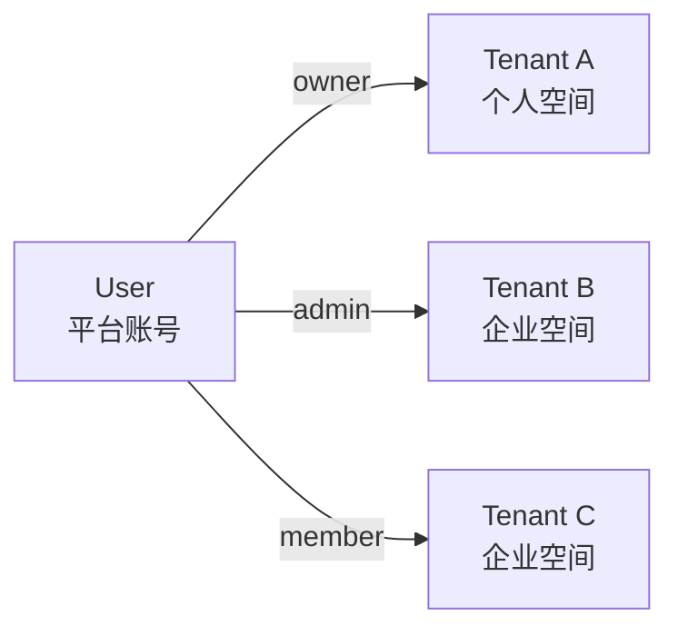
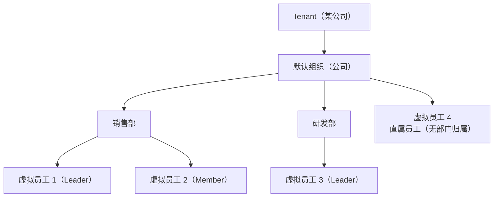
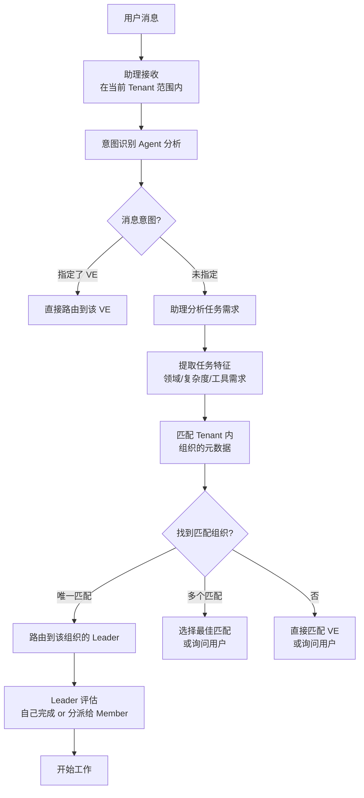

# 租户与组织模型

## 三层架构总览

```
User（账号层）
  │
  │  N:M（user_tenants）
  ▼
Tenant（隔离层）── 数据空间边界、计费单位
  │
  │  1:N
  ▼
Organization（业务层）── 虚拟团队内部的部门树
  │
  │  1:N
  ▼
Virtual Employee（执行层）
```

| 层级 | 实体 | 隔离键 | 类比 |
|------|------|--------|------|
| 账号层 | User | — | 你的 GitHub 账号 |
| 隔离层 | **Tenant** | `tenant_id` | GitHub 个人空间 / GitHub Org |
| 业务层 | Organization | `tenant_id`（继承） | 公司里的"销售部""研发部" |

## User 模型

### 定义

User 是平台上的个人账号。一个 User 可以属于多个 Tenant（个人空间 + 加入的企业空间）。

### User ↔ Tenant 关系



每个关联包含 User 在该 Tenant 中的角色，角色决定其在该 Tenant 内的操作权限。

### User 数据模型

```sql
CREATE TABLE users (
    id UUID PRIMARY KEY DEFAULT gen_random_uuid(),
    email VARCHAR(255) NOT NULL UNIQUE,
    password_hash TEXT NOT NULL,
    display_name VARCHAR(128) NOT NULL,
    avatar_url TEXT,

    -- 偏好设置
    preferred_language VARCHAR(8) NOT NULL DEFAULT 'zh-CN',
    timezone VARCHAR(64) NOT NULL DEFAULT 'Asia/Shanghai',
    notification_prefs JSONB NOT NULL DEFAULT '{}',

    -- 当前活跃 Tenant
    active_tenant_id UUID,

    status VARCHAR(16) NOT NULL DEFAULT 'active',
    last_login_at TIMESTAMPTZ,
    created_at TIMESTAMPTZ NOT NULL DEFAULT now(),
    updated_at TIMESTAMPTZ NOT NULL DEFAULT now(),
    deleted_at TIMESTAMPTZ
);

-- User 与 Tenant 的多对多关联
CREATE TABLE user_tenants (
    id UUID PRIMARY KEY DEFAULT gen_random_uuid(),
    user_id UUID NOT NULL REFERENCES users(id),
    tenant_id UUID NOT NULL REFERENCES tenants(id),
    role VARCHAR(16) NOT NULL DEFAULT 'member',
    -- 'owner', 'admin', 'member'

    joined_at TIMESTAMPTZ NOT NULL DEFAULT now(),
    invited_by UUID REFERENCES users(id),

    UNIQUE INDEX idx_user_tenant_unique (user_id, tenant_id),
    INDEX idx_tenant_users (tenant_id, role)
);
```

### v1 行为

用户注册时：
1. 创建 User 记录
2. 自动创建个人 Tenant（Tenant 名 = User 显示名）
3. 自动创建 `user_tenants` 关联，role = owner
4. 设置 `active_tenant_id` 为该 Tenant

用户无感知这一过程——他们看到的就是"自己的虚拟团队"。

### 远期行为

- 用户可以创建新的 Tenant（如"我的副业"）
- 企业管理员可以邀请其他 User 加入 Tenant
- 用户在协作应用中通过空间选择器切换活跃 Tenant
- 切换后导航栏、频道列表、联系人、消息全部刷新为新 Tenant 内容

## Tenant 模型

### 定义

Tenant 是 Virtual Team 的数据隔离与计费单位。所有业务实体（组织、虚拟员工、消息、工作上下文、工作环境节点）都归属到一个 Tenant。

### 隔离范围

所有业务数据通过 `tenant_id` 隔离：

| 隔离项 | 说明 |
|--------|------|
| 虚拟员工实例 | 不可跨 Tenant 访问 |
| 消息与对话 | Store 查询默认带 `WHERE tenant_id = $current_tenant` |
| 工作上下文 | 归属创建时的 Tenant |
| 组织数据 | Tenant 内部的部门树 |
| 配置包 | Tenant 级副本 |
| 工作环境节点 | 节点只能在注册 Tenant 内使用 |
| 搜索索引 | 搜索限制在当前 Tenant 数据范围内 |

### Tenant 数据模型

```sql
CREATE TABLE tenants (
    id UUID PRIMARY KEY DEFAULT gen_random_uuid(),
    name VARCHAR(128) NOT NULL,
    display_name VARCHAR(255),
    plan VARCHAR(16) NOT NULL DEFAULT 'free',
    -- 'free', 'pro', 'team', 'enterprise'

    -- 计费
    billing_email VARCHAR(255),
    billing_info JSONB DEFAULT '{}',

    -- 配额
    max_users INTEGER NOT NULL DEFAULT 1,
    max_ve_count INTEGER NOT NULL DEFAULT 3,
    max_organizations INTEGER NOT NULL DEFAULT 1,
    max_concurrent_work_contexts INTEGER NOT NULL DEFAULT 3,
    max_wen_count INTEGER NOT NULL DEFAULT 2,

    status VARCHAR(16) NOT NULL DEFAULT 'active',
    -- 'active', 'suspended', 'deleted'
    created_at TIMESTAMPTZ NOT NULL DEFAULT now(),
    updated_at TIMESTAMPTZ NOT NULL DEFAULT now(),
    deleted_at TIMESTAMPTZ,

    INDEX idx_tenants_status (status)
);
```

### 数据模型预留

所有业务实体在数据库层面预留 `tenant_id` 字段：

```sql
CREATE TABLE work_contexts (
    id UUID PRIMARY KEY,
    tenant_id UUID NOT NULL REFERENCES tenants(id),  -- 隔离键
    ve_id UUID NOT NULL,
    -- ...
    INDEX idx_work_contexts_tenant_ve (tenant_id, ve_id, status)
);
```

Store 层所有查询默认附加 `WHERE tenant_id = $current_tenant`，无法通过 API 跨越 Tenant 边界。`$current_tenant` 从当前请求的 JWT 中提取（JWT 中同时包含 `sub`=user_id 和 `tenant_id`）。

### Tenant 资源配额

| 配额项 | Free | Pro | Team | Enterprise |
|--------|------|-----|------|------------|
| 用户数 | 1 | 1 | 10 | 不限 |
| VE 数 | 3 | 10 | 30 | 不限 |
| 组织数 | 1 | 5 | 不限 | 不限 |
| 并发工作上下文 | 3 | 10 | 30 | 不限 |
| 工作环境节点 | 1 | 2 | 5 | 不限 |

## Organization 模型

### 定义

Organization 是 Tenant **内部**的虚拟团队部门结构，呈树状。**它不是现实世界中的公司**——现实中的公司对应的是 Tenant。

### 区分：Tenant vs Organization

| 维度 | Tenant | Organization |
|------|--------|-------------|
| 是什么 | 数据空间 + 计费单位 | Tenant 内部的部门树 |
| 数量 | 一个用户可以属于多个 | 一个 Tenant 内有一棵组织树 |
| 隔离 | 绝对的 `tenant_id` 隔离 | Tenant 内共享空间 |
| 类比 | 一家公司 | 公司里的"销售部""研发部" |
| 用户感知 | v1 无感知，远期可切换 | 业务复杂时才显式创建 |

### 组织树结构



### 数据模型

```sql
CREATE TABLE organizations (
    id UUID PRIMARY KEY DEFAULT gen_random_uuid(),
    tenant_id UUID NOT NULL REFERENCES tenants(id),
    parent_id UUID REFERENCES organizations(id),
    name VARCHAR(128) NOT NULL,
    description TEXT,

    -- 自动维护的元数据
    metadata JSONB NOT NULL DEFAULT '{}',
    /*
    {
      "business_domains": ["sales", "data-analysis"],
      "typical_tasks": ["报告生成", "数据分析"],
      "member_count": 3,
      "active_work_contexts": 2,
      "member_summaries": [...]
    }
    */

    sort_order INTEGER NOT NULL DEFAULT 0,
    created_at TIMESTAMPTZ NOT NULL DEFAULT now(),
    updated_at TIMESTAMPTZ NOT NULL DEFAULT now(),
    archived_at TIMESTAMPTZ,

    UNIQUE INDEX idx_orgs_tenant_name (tenant_id, parent_id, name),
    INDEX idx_orgs_tenant_parent (tenant_id, parent_id)
);

CREATE TABLE organization_members (
    id UUID PRIMARY KEY DEFAULT gen_random_uuid(),
    organization_id UUID NOT NULL REFERENCES organizations(id) ON DELETE CASCADE,
    ve_id UUID NOT NULL,
    role VARCHAR(16) NOT NULL DEFAULT 'member',
    -- 'leader', 'member'
    assigned_at TIMESTAMPTZ NOT NULL DEFAULT now(),

    UNIQUE INDEX idx_org_members_unique (organization_id, ve_id),
    INDEX idx_org_members_ve (ve_id)
);
```

### 组织中的角色

| 角色 | 职责 | 典型配置 |
|------|------|---------|
| **Leader** | 工作拆分、分派、协调、审查、汇总 | 更强模型 + 管理型 prompt + 组织读写权限 |
| **Member** | 具体执行工作 | 按岗位配置的模型和工具 |
| **Assistant** | 跨组织协调、任务分析、全局分发 | 不属于特定组织，Tenant 内全局视野 |

### 用户感知程度

在大多数简单场景下，组织对用户是透明的——系统自动维护默认组织（Tenant 创建时自动创建）。虚拟员工未指定组织时自动放入默认组织。

只有业务复杂度增加时才需要显式创建多层组织。

### 组织元数据

每个组织维护结构化的元数据，用于 AI 任务路由匹配。元数据由系统自动维护：

| 元数据字段 | 来源 | 更新时机 |
|-----------|------|---------|
| `business_domains` | VE 配置包 keywords + 任务类型统计 | VE 加入/离开 + 定期评估 |
| `typical_tasks` | 已完成工作上下文的摘要聚类 | 每次工作上下文完成 |
| `member_summaries` | VE 配置包的能力声明 | 配置包变更 |

## 任务路由

### 从消息到虚拟员工



匹配范围限制在当前 Tenant 内。助理的视野是 Tenant 全局（跨组织），普通 VE 的视野是所在组织。

### 匹配评分

```
score = 领域匹配度 × 0.4 + 负载因子 × 0.3 + 历史成功率 × 0.2 + 响应速度 × 0.1
```

| 因子 | 计算方式 | 说明 |
|------|---------|------|
| 领域匹配度 | 任务关键词 ∩ 组织 business_domains 的 Jaccard 相似度 | 基于配置包和任务历史 |
| 负载因子 | 1.0 - (active_work_contexts / max_concurrent) | 避免向忙碌组织派发 |
| 历史成功率 | 该组织过去 30 天内任务成功完成的比例 | 失败/取消降低分数 |
| 响应速度 | 过去 30 天任务平均完成时间的归一化倒数 | 快速组织加分 |

### 兜底策略

- 无匹配组织 → 助理向用户确认并列出候选
- Leader 不可用（离线）→ 降级为直接匹配组织内 Member
- 匹配分数低于阈值 → 助理列出 Top 3 候选并说明原因

## 跨组织协作

同一 Tenant 内不同组织的虚拟员工可以协作：

1. **共享频道**：用户将不同组织的 VE 拉入同一频道
2. **任务委派**：Leader A 可将子任务委派给组织 B 的 VE（通过 Agent 服务器路由）
3. **共享文件区**：在工作环境节点中配置跨组织的共享目录

权限约束：跨组织协作仍需遵守 VE 配置包的权限边界——委派任务不能授予接收方超出其配置包声明的权限。
