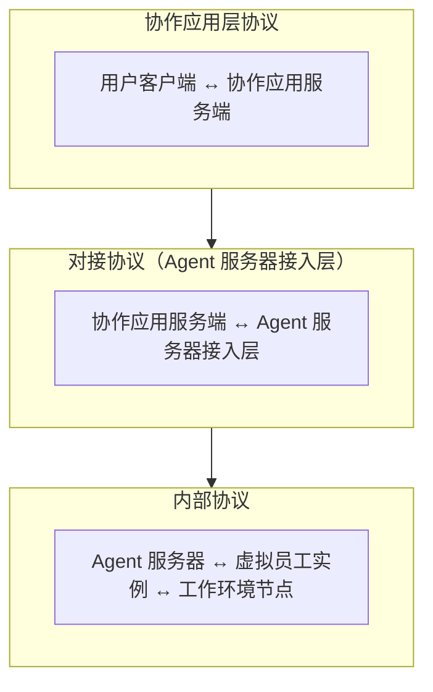

# 协议与集成

## 三层协议架构

Virtual Team 系统中的协议分为三个层面：



## 对接协议：协作应用 ↔ Agent 服务器

### 消息格式

协作应用与 Agent 服务器之间的消息包含增强的上下文信息：

```json
{
  "message_id": "msg_xxx",
  "tenant_id": "user_xxx",
  "sender": {
    "type": "user",
    "id": "user_xxx"
  },
  "recipient": {
    "type": "virtual_employee",
    "id": "ve_xxx"
  },
  "content": {
    "type": "text",
    "body": "帮我分析一下上季度的销售数据"
  },
  "context": {
    "recent_work_contexts": [...],
    "related_messages": [...],
    "organization_context": {...}
  },
  "markers": {
    "work_context_id": null,
    "intent_hint": null
  },
  "timestamp": "...",
  "sequence_id": 12345
}
```

### 消息回写

虚拟员工可通过接入层回写消息标记：

```
PUT /messages/{message_id}/markers
{
  "work_context_id": "wc_xxx",
  "intent": "new_task"
}
```

### 虚拟员工操作

协作应用提供的、虚拟员工可调用的 API（通过接入层）：

- 发送消息（文本、富文本、文件、特殊消息卡片）
- 创建/更新协作文档
- 管理任务看板
- 发起审批流
- 查询组织结构和成员

## 内部协议：VTA JSON-RPC

虚拟员工系统内部使用基于 VTA 的 JSON-RPC 2.0 协议：

- `runtime.turn.run`：启动 Agent 推理
- `runtime.turn.get/cancel`：查询/取消 Turn
- `runtime.approval.respond`：处理审批请求
- `runtime.event.subscribe`：订阅事件流
- `runtime.session.create/delete`：管理 Session

详见 VTA 设计文档中的 Protocol Handler 部分。

## 工作环境节点协议

Agent 服务器与工作环境节点之间的通信协议：

- **注册**：节点上线 → 声明能力（工具列表、Agent 列表、MCP Server 列表）
- **心跳**：定期保活和状态上报
- **工具调用**：服务端 → 节点（转发虚拟员工的工具调用）
- **结果回传**：节点 → 服务端
- **文件传输**：二进制文件的上传下载
- **沙盒操作**：工作空间创建、清理、快照

## 集成模式

### 虚拟员工作为 IM 客户端

从协作应用视角看，虚拟员工是**通过专用协议接入的外部客户端**——与用户通过 Web/移动客户端接入是对等的：

```
用户客户端 ←→ 协作应用 ←→ 虚拟员工客户端（Agent 服务器）
```

这种设计使得：

- 虚拟员工的在线/离线状态像真实用户一样管理
- 消息推送、已读/未读等 IM 特性自然适用
- 协作应用不需要理解 Agent 内部机制

### 第三方 Agent 接入

远期，第三方开发者可通过实现对接协议，将自己的 Agent 接入协作应用，成为可用的虚拟员工——类似应用商店的模式。
