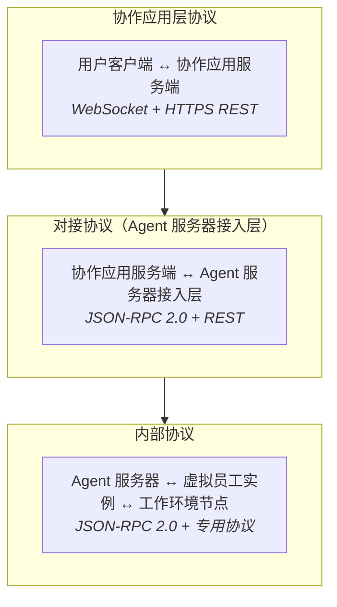

# 协议与集成

## 三层协议架构

Virtual Team 系统中的协议分为三个层面：



## 第一层：协作应用层协议

用户客户端与协作应用服务端之间的通信协议。

### WebSocket 实时通道

承载所有实时事件推送和双向通讯：

```
wss://collab.virtual-team.com/ws?token=<jwt>
```

WebSocket 事件类型（JSON 帧）：

| 事件 | 方向 | 说明 |
|------|------|------|
| `message.new` | 服务端 → 客户端 | 新消息通知 |
| `message.update` | 服务端 → 客户端 | 消息编辑/标记更新 |
| `message.delete` | 服务端 → 客户端 | 消息删除 |
| `presence.change` | 服务端 → 客户端 | 用户/虚拟员工在线状态变化 |
| `typing` | 双向 | 正在输入指示 |
| `reaction.add/remove` | 服务端 → 客户端 | 表情反应更新 |
| `work_context.updated` | 服务端 → 客户端 | 工作上下文状态变化 |
| `channel.updated` | 服务端 → 客户端 | 频道元数据变更 |
| `ping/pong` | 双向 | 心跳保活（30s 间隔） |

### HTTPS REST

用于非实时操作：历史消息拉取、文件上传、配置管理、搜索等。

```
GET    /api/v1/channels/{id}/messages?before={seq}&limit=50
POST   /api/v1/channels/{id}/messages
PUT    /api/v1/messages/{id}
DELETE /api/v1/messages/{id}
GET    /api/v1/users/{id}/presence
POST   /api/v1/files/upload
GET    /api/v1/search?q=...
```

### 多端同步协议

每个客户端设备维护独立的 WebSocket 连接。同步机制：

1. 服务端为每个频道的每条消息分配单调递增的 `sequence` 号
2. 客户端在内存中维护每个频道的 `last_sequence`
3. WebSocket 断开重连时，客户端通过 REST `GET /channels/{id}/sync?since={last_seq}` 获取期间的错过的消息
4. 已读状态通过 `PUT /channels/{id}/read { last_read_sequence }` 上报

### 身份认证

- 用户登录后获取 JWT token
- WebSocket 连接和 REST 请求均通过 `Authorization: Bearer <jwt>` 认证
- 虚拟员工通过专用 API Key 认证（与服务端下发机制不同）

## 第二层：对接协议：协作应用 ↔ Agent 服务器

### 消息格式

协作应用与 Agent 服务器之间的消息包含增强的上下文信息：

```json
{
  "message_id": "msg_xxx",
  "tenant_id": "user_xxx",
  "sender": {
    "type": "user",
    "id": "user_xxx"
  },
  "recipient": {
    "type": "virtual_employee",
    "id": "ve_xxx"
  },
  "content": {
    "type": "text",
    "body": "帮我分析一下上季度的销售数据"
  },
  "context": {
    "recent_work_contexts": [...],
    "related_messages": [...],
    "organization_context": {...}
  },
  "markers": {
    "work_context_id": null,
    "intent_hint": null
  },
  "timestamp": "...",
  "sequence_id": 12345
}
```

### 消息回写

虚拟员工可通过接入层回写消息标记：

```
PUT /messages/{message_id}/markers
{
  "work_context_id": "wc_xxx",
  "intent": "new_task"
}
```

### 虚拟员工操作

协作应用提供的、虚拟员工可调用的 API（通过接入层）：

- 发送消息（文本、富文本、文件、特殊消息卡片）
- 创建/更新协作文档
- 管理任务看板
- 发起审批流
- 查询组织结构和成员

## 第三层：内部协议

### VTA JSON-RPC 2.0

- `runtime.turn.run`：启动 Agent 推理
- `runtime.turn.get/cancel`：查询/取消 Turn
- `runtime.approval.respond`：处理审批请求
- `runtime.event.subscribe`：订阅事件流
- `runtime.session.create/delete`：管理 Session

详见 VTA 设计文档中的 Protocol Handler 部分。

### 工作环境节点协议

Agent 服务器与工作环境节点之间的通信：

- **注册**：节点上线 → 声明能力（工具列表、Agent 列表、MCP Server 列表）
- **心跳**：定期保活和状态上报
- **工具调用**：服务端 → 节点（转发虚拟员工的工具调用）
- **结果回传**：节点 → 服务端
- **文件传输**：二进制文件的上传下载
- **沙盒操作**：工作空间创建、清理、快照

## 集成模式

### 虚拟员工作为 IM 客户端

从协作应用视角看，虚拟员工是**通过专用协议接入的外部客户端**——与用户通过 Web/移动客户端接入是对等的：

```
用户客户端 ←→ 协作应用 ←→ 虚拟员工客户端（Agent 服务器）
```

这种设计使得：

- 虚拟员工的在线/离线状态像真实用户一样管理
- 消息推送、已读/未读等 IM 特性自然适用
- 协作应用不需要理解 Agent 内部机制

### 第三方 Agent 接入

远期，第三方开发者可通过实现对接协议，将自己的 Agent 接入协作应用，成为可用的虚拟员工——类似应用商店的模式。
