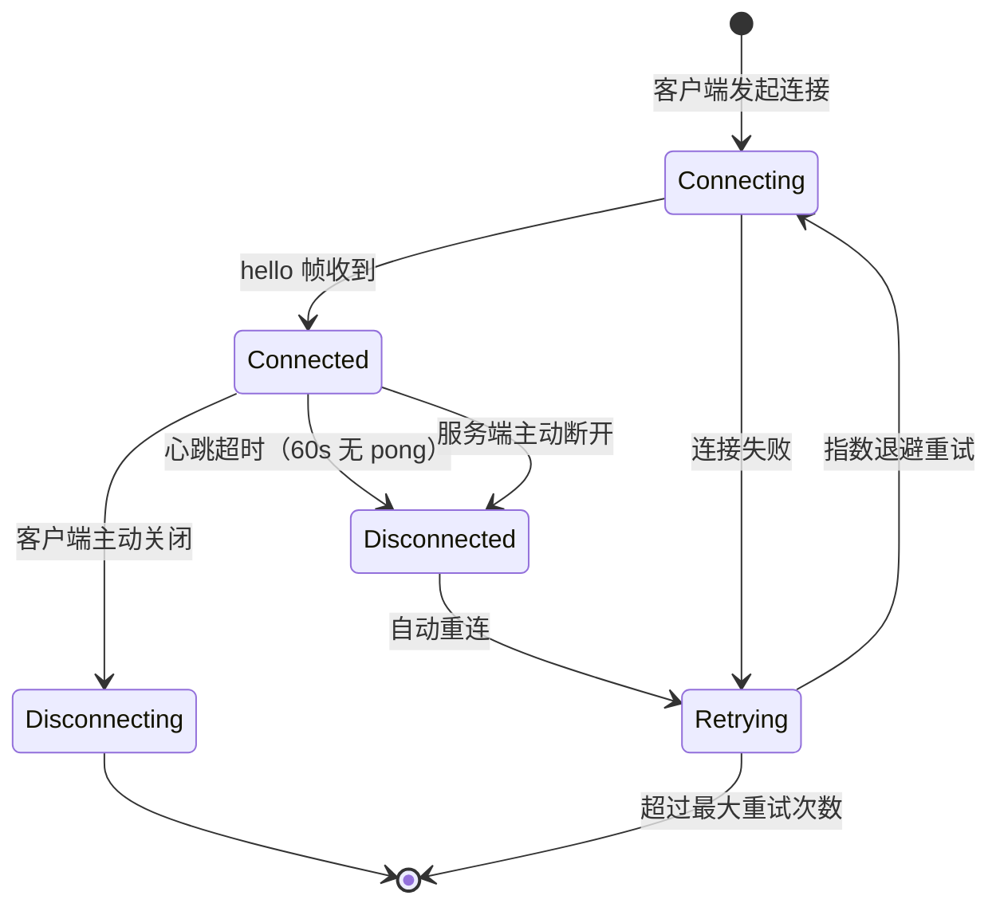

# 协作应用层协议

用户客户端与协作应用服务端之间的通信协议。这是 Virtual Team 系统中用户直接感知的通信层。

## 协议概览

```
客户端 ←→ WebSocket ←→ 服务端（实时通道：消息推送、事件通知）
客户端 ←→ HTTPS REST ←→ 服务端（非实时：历史数据、配置、文件上传）
```

## WebSocket 实时通道

### 连接

```
wss://collab.virtual-team.com/ws?token=<jwt>&version=1
```

| 参数 | 必填 | 说明 |
|------|------|------|
| `token` | ✅ | JWT 认证令牌 |
| `version` | ❌ | 客户端支持的协议版本，默认 1 |

连接建立后服务端发送 `hello` 帧：

```json
{
  "type": "hello",
  "seq": 0,
  "ts": "2026-05-08T10:30:00Z",
  "data": {
    "server_version": "1.0.0",
    "session_id": "sess_ws_xxx",
    "user_id": "u_xxx",
    "tenant_id": "tn_xxx",
    "reconnect_url": "wss://collab.virtual-team.com/ws?token=<new_jwt>&session_id=sess_ws_xxx",
    "heartbeat_interval_ms": 30000
  }
}
```

### 连接生命周期



### 事件帧结构

所有 WebSocket 帧使用统一的 JSON 结构：

```json
{
  "type": "事件类型标识",
  "seq": 12345,
  "ts": "2026-05-08T10:30:00Z",
  "data": { }
}
```

| 字段 | 类型 | 说明 |
|------|------|------|
| `type` | string | 事件类型 |
| `seq` | uint64 | 服务端全局单调递增事件序号 |
| `ts` | ISO 8601 | 服务端时间戳 |
| `data` | object | 事件负载 |

### 客户端 → 服务端事件

| 事件 | 说明 |
|------|------|
| `message.send` | 发送消息 |
| `message.update` | 编辑消息 |
| `message.delete` | 删除消息 |
| `presence.query` | 查询在线状态 |
| `typing` | 正在输入指示 |
| `ping` | 心跳 |

### 服务端 → 客户端事件

| 事件 | 说明 |
|------|------|
| `message.new` | 新消息通知 |
| `message.update` | 消息内容/标记更新 |
| `message.delete` | 消息被删除 |
| `presence.change` | 在线状态变化 |
| `typing` | 对方正在输入 |
| `reaction.added` | 表情反应添加 |
| `reaction.removed` | 表情反应移除 |
| `work_context.created` | VE 创建了新的工作上下文 |
| `work_context.updated` | 工作上下文状态变化 |
| `channel.created` | 新频道创建 |
| `channel.updated` | 频道元数据变更 |
| `channel.member_added` | 成员加入频道 |
| `channel.member_removed` | 成员离开频道 |
| `schedule.triggered` | 日程触发通知 |
| `error` | 服务端错误 |
| `pong` | 心跳响应 |
| `reconnect` | 服务端要求重连 |

### 消息事件详设

**发送消息（C→S）**：

```json
{
  "type": "message.send",
  "data": {
    "channel_id": "ch_xxx",
    "content": {
      "type": "rich_text",
      "body": "帮我分析一下销售数据",
      "blocks": [
        {
          "type": "section",
          "text": { "type": "mrkdwn", "text": "帮我分析一下销售数据" }
        }
      ]
    },
    "thread_id": null,
    "client_msg_id": "client_uuid_xxx"
  }
}
```

| 字段 | 类型 | 必填 | 说明 |
|------|------|------|------|
| `channel_id` | UUID | ✅ | 目标频道 ID |
| `content.type` | string | ✅ | 消息内容类型 |
| `content.body` | string | ✅ | 纯文本摘要（用于通知和搜索） |
| `content.blocks` | Block[] | ❌ | Block Kit 富文本 |
| `thread_id` | UUID\|null | ❌ | 线程回复的目标消息 ID |
| `client_msg_id` | string | ✅ | 客户端去重 ID（幂等） |

**新消息推送（S→C）**：

```json
{
  "type": "message.new",
  "seq": 12345,
  "ts": "2026-05-08T10:30:00Z",
  "data": {
    "id": "msg_xxx",
    "channel_id": "ch_xxx",
    "sequence": 12345,
    "sender": {
      "type": "user",
      "id": "u_xxx",
      "display_name": "Chongyi",
      "avatar_url": "https://..."
    },
    "content": {
      "type": "rich_text",
      "body": "帮我分析一下销售数据",
      "blocks": [...]
    },
    "thread_id": null,
    "reply_count": 0,
    "markers": {
      "work_context_id": null,
      "intent": null,
      "related_message_ids": []
    },
    "timestamp": 1714608000,
    "edited_at": null
  }
}
```

### 在线状态

状态变更推送（S→C）：

```json
{
  "type": "presence.change",
  "data": {
    "entity_type": "user",
    "entity_id": "u_xxx",
    "status": "online",
    "last_active_at": "2026-05-08T10:30:00Z"
  }
}
```

| status | 说明 |
|--------|------|
| `online` | 在线 |
| `offline` | 离线 |
| `busy` | 忙碌（VE 正在工作） |
| `away` | 离开（30min 无操作） |

### 心跳保活

- 客户端每 30s 发送 `{"type":"ping"}` 帧
- 服务端立即回复 `{"type":"pong","seq":...,"ts":"..."}`
- 服务端 60s 未收到 ping → 主动关闭连接
- 客户端 60s 未收到 pong → 触发重连

### 重连协议

客户端断线后自动重连流程：

1. 指数退避重试：1s → 2s → 4s → 8s → 16s（最大 30s）
2. 重连成功后发送上次收到的 `last_seq`
3. 服务端下发 `last_seq` 之后的所有错过的消息
4. 客户端合并本地缓存和服务端下发的事件

```
客户端 → 重连 → GET /channels/{id}/sync?since={last_seq}&limit=200
服务端 → { events: [...], has_more: bool, latest_seq: 12345 }
```

## Block Kit 规范

协作应用使用类 Slack Block Kit 的结构化 JSON 块定义消息布局。

### Block 类型

| Block 类型 | 说明 | 嵌套限制 |
|-----------|------|---------|
| `section` | 文本段落 | 可含 text fields、accessory |
| `header` | 标题 | 仅 plain_text |
| `divider` | 分割线 | 无子元素 |
| `context` | 辅助信息 | 仅含 text elements |
| `actions` | 按钮组 | 仅含 button elements |
| `image` | 图片 | 含 image_url、alt_text |
| `file` | 文件附件卡片 | 含 file 元数据 |
| `approval_card` | 审批卡片 | 含决策按钮 |
| `work_summary` | 工作摘要 | 含结构化工作结果 |

### Block 通用结构

```json
{
  "type": "section",
  "block_id": "blk_xxx",
  "text": {
    "type": "mrkdwn",
    "text": "这是 **粗体** 文本",
    "verbatim": false
  },
  "accessory": {
    "type": "image",
    "image_url": "https://...",
    "alt_text": "图表"
  }
}
```

### 文本对象

| 类型 | 说明 |
|------|------|
| `plain_text` | 纯文本，含 `emoji` 布尔字段 |
| `mrkdwn` | Markdown 子集，含 `verbatim` 布尔字段 |

### Markdown 子集支持

- **粗体** (`**text**`)、*斜体* (`*text*`)、~~删除线~~ (`~~text~~`)
- 行内代码 (`` `code` ``)、链接 (`[text](url)`)
- 无序列表、有序列表
- 不支持：表格、HTML、图片嵌入

## HTTPS REST API

### 通用约定

**Base URL**：`https://collab.virtual-team.com/api/v1`

**认证**：所有请求携带 `Authorization: Bearer <jwt>`

**租户上下文**：JWT 中 `tenant_id` 声明决定数据范围，所有响应仅包含当前 Tenant 数据。

**Content-Type**：请求 `application/json`，响应 `application/json; charset=utf-8`

**分页**：

| 参数 | 类型 | 说明 |
|------|------|------|
| `before` | uint64 | 游标（sequence 或 timestamp），获取此值之前的数据 |
| `after` | uint64 | 游标，获取此值之后的数据 |
| `limit` | uint16 | 每页数量，默认 50，最大 200 |

响应中包含分页元数据：

```json
{
  "data": [...],
  "pagination": {
    "has_more": true,
    "next_cursor": 12300,
    "total": 1500
  }
}
```

**速率限制**：响应头包含：

```
X-RateLimit-Limit: 100
X-RateLimit-Remaining: 95
X-RateLimit-Reset: 1714700000
X-RateLimit-Retry-After: 5
```

超出限制返回 `429 Too Many Requests`。

### 消息接口

| 方法 | 路径 | 说明 |
|------|------|------|
| `GET` | `/channels/{id}/messages?before={seq}&limit=50` | 拉取历史消息 |
| `GET` | `/channels/{id}/messages?around={seq}&limit=20` | 以某消息为中心的上下文 |
| `POST` | `/channels/{id}/messages` | 发送消息 |
| `PUT` | `/messages/{id}` | 编辑消息 |
| `DELETE` | `/messages/{id}` | 删除消息（软删除） |
| `GET` | `/messages/search?q=...&channel_id=...&from=...&to=...` | 搜索消息 |

**发送消息响应**：

```json
// 201 Created
{
  "id": "msg_xxx",
  "channel_id": "ch_xxx",
  "sequence": 12345,
  "content": { "...原样返回..." },
  "thread_id": null,
  "markers": { "work_context_id": null, "intent": null },
  "timestamp": 1714608000
}
```

**获取历史消息响应**：

```json
// 200 OK
{
  "data": [
    {
      "id": "msg_xxx",
      "channel_id": "ch_xxx",
      "sequence": 12345,
      "sender": { "type": "user", "id": "u_xxx", "display_name": "Chongyi" },
      "content": { "type": "rich_text", "body": "...", "blocks": [...] },
      "thread_id": null,
      "reply_count": 2,
      "reactions": [{ "name": "thumbsup", "count": 2, "users": ["u_xxx"] }],
      "markers": { "work_context_id": "wc_xxx", "intent": "new_task" },
      "timestamp": 1714608000,
      "edited_at": null
    }
  ],
  "pagination": { "has_more": true, "next_cursor": 12300 }
}
```

### 频道接口

| 方法 | 路径 | 说明 |
|------|------|------|
| `GET` | `/channels` | 列出用户的所有频道 |
| `POST` | `/channels` | 创建频道 |
| `PUT` | `/channels/{id}` | 更新频道 |
| `POST` | `/channels/{id}/members` | 添加成员 |
| `DELETE` | `/channels/{id}/members/{uid}` | 移除成员 |
| `GET` | `/channels/{id}/members` | 频道成员列表 |

**创建频道**：

```json
// POST /channels
// Request
{
  "type": "group",
  "name": "销售团队",
  "organization_id": "org_sales",
  "member_ids": [
    { "type": "user", "id": "u_xxx" },
    { "type": "virtual_employee", "id": "ver_sales_01" }
  ]
}

// Response 201
{
  "id": "ch_xxx",
  "type": "group",
  "name": "销售团队",
  "organization_id": "org_sales",
  "created_by": "u_xxx",
  "member_count": 2,
  "created_at": "2026-05-08T10:30:00Z"
}
```

### 同步接口

| 方法 | 路径 | 说明 |
|------|------|------|
| `GET` | `/channels/{id}/sync?since={seq}&limit=100` | 获取错过的消息 |
| `PUT` | `/channels/{id}/read` | 更新已读状态 |

**同步响应**：

```json
// GET /channels/{id}/sync?since=12300&limit=100
{
  "events": [
    { "type": "message.new", "seq": 12301, "data": { "...消息..." } },
    { "type": "message.delete", "seq": 12302, "data": { "message_id": "msg_yyy" } },
    { "type": "presence.change", "seq": 12303, "data": { "entity_id": "u_zzz", "status": "offline" } }
  ],
  "has_more": false,
  "latest_seq": 12303
}
```

**更新已读状态**：

```json
// PUT /channels/{id}/read
// Request
{ "last_read_sequence": 12340 }

// Response 200
{ "channel_id": "ch_xxx", "last_read_sequence": 12340, "unread_count": 5 }
```

### 文件上传

采用两阶段上传：

**阶段一：获取上传 URL**

```json
// POST /files/upload-url
// Request
{
  "filename": "sales_report_q2.pdf",
  "mime_type": "application/pdf",
  "size_bytes": 2048000,
  "channel_id": "ch_xxx"
}

// Response
{
  "file_id": "file_xxx",
  "upload_url": "https://s3.virtual-team.com/uploads/file_xxx?signature=...",
  "expires_at": "2026-05-08T10:35:00Z",
  "max_size_bytes": 104857600
}
```

**阶段二：上传文件**

客户端直传文件到 `upload_url`（PUT，binary body）。上传完成后通知服务端：

```json
// POST /files/{file_id}/upload-complete
// Response 200
{
  "id": "file_xxx",
  "url": "https://cdn.virtual-team.com/files/file_xxx.pdf",
  "filename": "sales_report_q2.pdf",
  "mime_type": "application/pdf",
  "size_bytes": 2048000,
  "thumbnail_url": "https://cdn.virtual-team.com/thumbnails/file_xxx.jpg"
}
```

**获取缩略图**：

```
GET /files/{id}/thumbnail?size=small
size: small(128x128) | medium(256x256) | large(512x512)
```

### 搜索接口

```
GET /api/v1/search?q=<query>&type=messages,objects&channel_id=<optional>&limit=20
```

| 参数 | 类型 | 必填 | 说明 |
|------|------|------|------|
| `q` | string | ✅ | 搜索关键词 |
| `type` | string | ❌ | 逗号分隔：`messages,objects,documents,bitables,boards`，默认全部；工具内容来自统一对象壳和扩展索引 |
| `channel_id` | UUID | ❌ | 限定频道 |
| `before` | ISO 8601 | ❌ | 时间上限 |
| `after` | ISO 8601 | ❌ | 时间下限 |
| `limit` | uint16 | ❌ | 默认 20，最大 50 |

**搜索响应**：

```json
{
  "results": [
    {
      "type": "message",
      "id": "msg_xxx",
      "channel_id": "ch_xxx",
      "highlight": "请帮我分析<em>销售数据</em>的季度趋势",
      "score": 0.92,
      "timestamp": "2026-05-08T10:30:00Z"
    },
    {
      "type": "document",
      "id": "doc_yyy",
      "title": "Q2 销售分析报告",
      "highlight": "...<em>销售数据</em>环比增长12%...",
      "score": 0.85
    }
  ],
  "total": 42,
  "has_more": true
}
```

### 组织管理接口

| 方法 | 路径 | 说明 |
|------|------|------|
| `GET` | `/orgs` | 列出 Tenant 内的组织树 |
| `POST` | `/orgs` | 创建组织 |
| `PUT` | `/orgs/{id}` | 更新组织 |
| `DELETE` | `/orgs/{id}` | 删除组织 |
| `GET` | `/orgs/{id}/members` | 组织内 VE 列表 |
| `POST` | `/orgs/{id}/members` | 添加 VE 到组织 |

### VE 管理接口

| 方法 | 路径 | 说明 |
|------|------|------|
| `GET` | `/ve/runtimes` | 列出当前 Tenant 的 VE Runtime |
| `POST` | `/ve/runtimes` | 招募 VE Instance 到当前 Tenant |
| `GET` | `/ve/runtimes/{id}` | VE Runtime 详情（状态、配置、日程） |
| `PUT` | `/ve/runtimes/{id}/config` | 更新 Runtime Config（Duty、附加 Prompt） |
| `GET` | `/ve/runtimes/{id}/schedules` | 查看 VE 的 Schedule 和 Timer 列表 |
| `DELETE` | `/ve/runtimes/{id}` | 移除 VE Runtime |

### 协作对象与 Tool Action API

协作应用核心提供对象壳查询，具体工具业务操作统一进入 Tool Action Gateway。第一方工具可以提供面向 UI 的 REST wrapper，但 wrapper 不得绕过 Tool Action、权限、审计和通知聚合。

| 方法 | 路径 | 说明 |
|------|------|------|
| `GET` | `/objects/{id}` | 获取对象壳、权限摘要、预览和引用 |
| `GET` | `/objects?tool_type={type}&scope={scope}` | 按工具类型和范围列出对象 |
| `POST` | `/objects/{id}/archive` | 归档对象，内部映射为对应工具动作 |
| `POST` | `/objects/{id}/restore` | 恢复对象 |
| `DELETE` | `/objects/{id}` | 软删除对象，按权限和审批规则执行 |
| `POST` | `/tool-actions/rpc` | JSON-RPC Tool Action 入口 |

Tool Action 示例：

```json
{
  "jsonrpc": "2.0",
  "id": "rpc_123",
  "method": "collab.document.update",
  "params": {
    "object_id": "obj_doc_123",
    "base_version": 3,
    "blocks": [
      { "type": "paragraph", "text": "更新后的内容" }
    ]
  },
  "meta": {
    "idempotency_key": "idem_123",
    "correlation_id": "corr_123"
  }
}
```

文档基础版采用轻量 Block/结构化内容和版本乐观锁；多维表格基础版采用类型化数据表。实时协同编辑、公式、多视图和复杂嵌入属于完整形态方向，不作为基础版协议承诺。

各工具详细 API 见[协作工具章节](../04-collaboration-app/collaboration-tools/overview.md)，可实施协议边界见[协作应用技术方案](../04-collaboration-app/technical-design/api-and-protocol.md)。

## 身份认证

### JWT 令牌

```json
{
  "header": { "alg": "RS256", "typ": "JWT" },
  "payload": {
    "sub": "u_3fa2b1c4",
    "tenant_id": "tn_personal_3fa2b1c4",
    "display_name": "Chongyi",
    "tenant_name": "个人空间",
    "plan": "pro",
    "iat": 1714608000,
    "exp": 1714694400,
    "iss": "virtual-team",
    "jti": "jti_xxx"
  }
}
```

| 声明 | 说明 |
|------|------|
| `sub` | User ID |
| `tenant_id` | 当前活跃 Tenant ID |
| `plan` | 当前 Tenant 的付费计划 |
| `jti` | 令牌唯一 ID（用于撤销） |

令牌生命周期：

| 令牌 | 有效期 | 说明 |
|------|--------|------|
| Access Token | 24h | 所有 API 请求使用 |
| Refresh Token | 30d | 获取新 Access Token |
| API Key | 90d | Agent 服务器认证 |

### Tenant 切换

```
POST /api/v1/auth/switch-tenant
{ "tenant_id": "tn_enterprise_xxx" }

→ 返回新的 JWT（tenant_id 更新）
→ 客户端断开 WebSocket，用新 JWT 重连
→ 所有界面刷新为新 Tenant 内容
```

### 虚拟员工认证

虚拟员工通过服务端下发的专用 **API Key** 认证（非 JWT）：

```
Authorization: Bearer vt-api-key-xxx
```

API Key 绑定特定 Tenant，服务端从 API Key 中解析出 `tenant_id`。

## 错误响应

### 统一错误格式

```json
{
  "error": {
    "code": "CHANNEL_NOT_FOUND",
    "message": "频道不存在或无权访问",
    "details": { "channel_id": "ch_nonexistent" }
  },
  "request_id": "req_uuid_xxx"
}
```

### HTTP 状态码

| 状态码 | 说明 |
|--------|------|
| 200 | 成功 |
| 201 | 创建成功 |
| 204 | 删除成功（无 body） |
| 400 | 请求参数错误 |
| 401 | 认证失败 |
| 403 | 权限不足 |
| 404 | 资源不存在 |
| 409 | 冲突（版本冲突、重复创建） |
| 429 | 速率限制 |
| 500 | 服务端内部错误 |
| 503 | 服务暂时不可用 |

### 错误码前缀

| 前缀 | 领域 | 示例 |
|------|------|------|
| `AUTH_*` | 认证授权 | `AUTH_TOKEN_EXPIRED` |
| `CHANNEL_*` | 频道 | `CHANNEL_NOT_FOUND` |
| `MESSAGE_*` | 消息 | `MESSAGE_TOO_LONG` |
| `FILE_*` | 文件 | `FILE_TOO_LARGE` |
| `VE_*` | 虚拟员工 | `VE_OFFLINE` |
| `DOC_*` | 文档 | `DOC_VERSION_CONFLICT` |
| `BITABLE_*` | 多维表格 | `BITABLE_FIELD_TYPE_INVALID` |
| `APPROVAL_*` | 审批 | `APPROVAL_EXPIRED` |
| `RATE_LIMIT_*` | 速率限制 | `RATE_LIMIT_EXCEEDED` |
| `INTERNAL_*` | 内部错误 | `INTERNAL_ERROR` |
