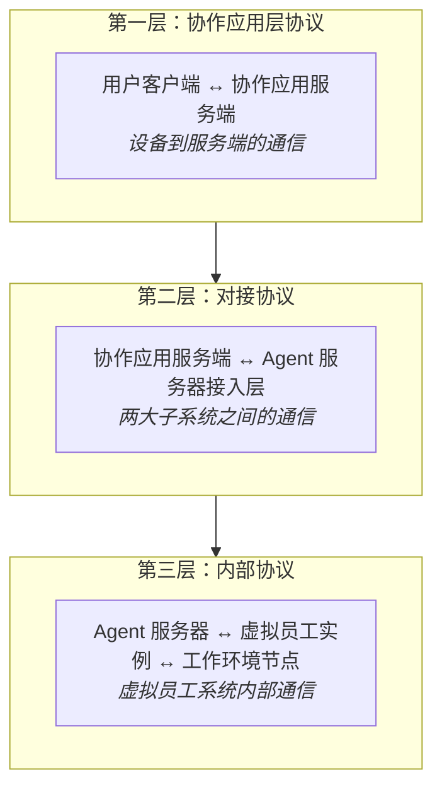

# 协议与集成

## 三层协议架构

Virtual Team 系统中的协议分为三个层面，每一层关注不同的通信边界：



| 协议层 | 范围 | 传输方式 | 详细章节 |
|--------|------|---------|---------|
| 第一层 | 客户端 ↔ 协作应用服务端 | WebSocket + HTTPS REST | [协作应用层协议](./app-layer-protocol.md) |
| 第二层 | 协作应用 ↔ Agent 服务器 | JSON-RPC 2.0 + REST | [对接协议](./integration-protocol.md) |
| 第三层 | Agent 服务器 ↔ VE 实例 ↔ 工作环境节点 | JSON-RPC 2.0 + 专用协议 | [内部协议](./internal-protocol.md) |

## 设计原则

**1. 协议边界 = 开发边界**

每一层协议定义了子系统之间的交互契约。只要遵守协议，各子系统可独立开发、独立测试、独立部署。

**2. 降级容错**

协议层不是"透明代理"——当下一层不可用时，上一层应有明确的降级行为：
- Agent 服务器不可用：协作应用正常提供 IM 功能，虚拟员工显示为"离线"
- 工作环境节点离线：虚拟员工可回复"我暂时无法执行该操作，请检查工作环境连接"

**3. 版本协商**

协议支持版本号。客户端和 Agent 服务器在握手时声明支持的协议版本范围，协商使用最高共同版本。

## 集成模式

### 虚拟员工作为 IM 客户端

从协作应用视角看，虚拟员工是**通过专用协议接入的外部客户端**——与用户通过 Web/移动客户端接入是对等的：

```
用户客户端 ←→ 协作应用服务端 ←→ Agent 服务器（虚拟员工客户端）
```

这种设计使得：

- 虚拟员工的在线/离线状态像真实用户一样管理
- 消息推送、已读/未读等 IM 特性自然适用于虚拟员工
- 协作应用不需要理解 Agent 内部机制
- 虚拟员工的行为对它所在的频道和群组来说是"透明的"——看起来就像一个真人同事

### 第三方 Agent 接入

远期，第三方开发者可通过实现对接协议，将自己的 Agent 接入协作应用，成为可用的虚拟员工：

```
第三方 Agent 服务 → 实现对接协议 → 注册到 Agent 市场 → 用户安装 → 出现在联系人列表
```

这要求：
- 对接协议标准化且有完善的 SDK
- Agent 市场为每个第三方 Agent 提供沙盒测试环境
- 用户在安装时明确授权权限范围
