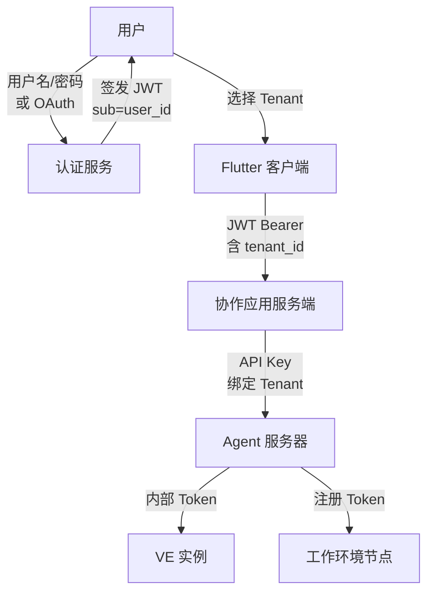
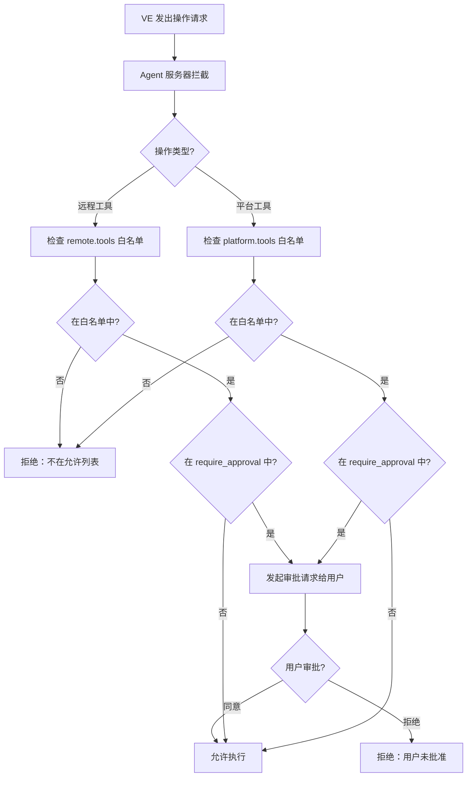

# 安全、权限与隔离

## 安全模型概述

Virtual Team 安全模型基于现实场景拟合：虚拟员工像真实员工一样，有明确的权限边界和工作空间限制。

安全策略分为四个层面：

| 层面 | 关注点 | 实现位置 |
|------|--------|---------|
| **租户隔离** | Tenant 之间数据不可交叉访问 | Agent 服务器 + 数据层 |
| **虚拟员工权限** | 确定虚拟员工能做什么 | 配置包 + VTA 权限引擎 |
| **工作环境隔离** | 远程工具的物理/虚拟执行边界 | 工作环境节点 |
| **平台工具权限** | 服务端同环境工具的安全边界 | 配置包 + Agent 服务器 |

## 威胁模型

### 威胁参与者

| 参与者 | 威胁等级 | 描述 |
|--------|---------|------|
| **恶意租户** | 中 | 试图访问其他租户数据、绕过付费限制 |
| **恶意虚拟员工配置包** | 中 | 第三方配置包试图越权操作 |
| **恶意工作环境工具** | 中 | 第三方 MCP Server 试图读取超出授权的文件 |
| **外部攻击者** | 高 | 通过网络攻击窃取数据或中断服务 |
| **内部运维人员** | 低 | 有基础设施访问权限的运维人员 |
| **LLM 提示注入** | 高 | 通过消息内容诱导虚拟员工执行非预期操作 |

### 威胁矩阵

| 威胁 | 影响 | 可能性 | 缓解措施 |
|------|------|--------|---------|
| 跨租户数据泄露 | 严重 | 低 | 所有查询强制 `tenant_id` 过滤；审计日志 |
| VE 越权操作 | 高 | 中 | 配置包权限声明；用户审批高危操作；文件路径白名单 |
| LLM 提示注入 | 高 | 高 | 用户消息与 system prompt 分层；高危操作二次确认 |
| WEN 节点伪造 | 严重 | 低 | 节点注册 token 认证；TLS + 证书绑定 |
| API Key 泄露 | 严重 | 低 | Key 定期轮换；最小权限原则；异常检测 |
| 拒绝服务 | 中 | 中 | 速率限制；资源配额；水平扩展 |
| 审计日志篡改 | 中 | 低 | Event 体系不可变性；日志写入后不可修改 |

## 租户隔离

### 数据层

```sql
-- 所有核心实体带 tenant_id
CREATE TABLE work_contexts (
    id UUID PRIMARY KEY,
    tenant_id UUID NOT NULL,
    -- ...
    INDEX idx_work_contexts_tenant (tenant_id, id)
);

-- Store 层查询默认过滤
-- 所有查询通过统一的 Store trait，自动附加 tenant_id
trait TenantScopedStore {
    async fn query<T>(&self, tenant_id: Uuid, query: Query) -> Result<Vec<T>, Error>;
    async fn insert<T>(&self, tenant_id: Uuid, entity: T) -> Result<T, Error>;
}
```

隔离保证：

- 所有核心实体（Session、Message、Event、工作上下文）带 `tenant_id`
- Store 层面默认按 `tenant_id` 过滤——无法构造不包含 `tenant_id` 的查询
- API 层面二次验证——即使 Store 层有 bug，API 层也会拒绝跨租户请求

### 运行时层

- Agent 服务器在路由消息前验证租户归属
- 工作环境节点在注册时绑定租户，工具调用验证所有权
- 租户间无共享内存或进程（每个 VE Runner 内的 VE 实例按租户隔离）
- 搜索索引按租户分片

## 身份认证

### 认证架构



### JWT 令牌（用户认证）

```json
{
  "header": { "alg": "RS256", "typ": "JWT" },
  "payload": {
    "sub": "u_3fa2b1c4",
    "tenant_id": "tn_personal_3fa2b1c4",
    "display_name": "Chongyi",
    "tenant_name": "个人空间",
    "plan": "pro",
    "iat": 1714608000,
    "exp": 1714694400,
    "iss": "virtual-team",
    "jti": "jti_xxx"
  }
}
```

| 声明 | 说明 |
|------|------|
| `sub` | 用户 ID（User ID） |
| `tenant_id` | 当前活跃的租户 ID（Tenant ID） |
| `tenant_name` | 当前 Tenant 显示名称 |
| `plan` | 当前 Tenant 的付费计划 |
| `jti` | 令牌唯一 ID（用于撤销） |

**Tenant 切换**：当用户在协作应用中切换 Tenant 时，客户端请求认证服务签发新的 JWT，其中 `tenant_id` 和 `plan` 声明更新为切换后的 Tenant。用户无需重新登录。

令牌生命周期：

| 令牌类型 | 有效期 | 刷新方式 |
|---------|--------|---------|
| Access Token | 24 小时 | 使用 Refresh Token |
| Refresh Token | 30 天 | 重新登录 |
| API Key（VE 系统） | 90 天 | 自动轮换 |

### API Key（Agent 服务器认证）

协作应用服务端使用 API Key 认证到 Agent 服务器：

- API Key 在 Agent 服务器注册时由协作应用下发
- Key 绑定到特定租户和权限范围
- Key 以哈希形式存储，仅在创建时返回原始值
- 支持多个活跃 Key 以支持无缝轮换

```json
{
  "api_key_id": "key_xxx",
  "tenant_id": "tn_xxx",
  "permissions": ["message:send", "message:read", "marker:write"],
  "created_at": "2026-01-01T00:00:00Z",
  "expires_at": "2026-04-01T00:00:00Z",
  "last_used_at": "2026-05-07T10:30:00Z"
}
```

## 虚拟员工权限

### 权限由配置包定义

虚拟员工的能力边界在配置包中声明，不通过运行时动态授权：

```toml
# permissions.toml（配置包内）

# 远程工具权限（工作环境节点执行）
[remote.filesystem]
read = ["/workspace"]
write = ["/workspace"]
deny = ["/etc", "/usr", "/.ssh", "/.aws", "/.config"]

[remote.network]
allow_outbound = true
allow_inbound = false
restricted_hosts = ["internal.corp.com"]

[remote.tools]
allowed = ["file_read", "file_write", "shell_exec", "browser_navigate"]
require_approval = ["shell_exec", "file_delete", "browser_form_submit"]
deny = ["system_shutdown", "docker_destroy"]

# 平台工具权限（服务端同环境执行）
[platform.tools]
allowed = ["send_message", "create_document", "web_search", "query_org"]
require_approval = ["invite_user_to_channel"]
deny = ["delete_organization"]
```

### 权限验证流程



### 审批机制

审批请求通过协作应用的消息卡片呈现——用户在 IM 中直接点"同意/拒绝"：

```json
{
  "approval_id": "appr_xxx",
  "ve_id": "ve_sales_01",
  "work_context_id": "wc_xxx",
  "operation": "shell_exec",
  "details": {
    "command": "python analyze.py --input sales_q2.csv",
    "working_directory": "/workspace/ve_sales_01/projects",
    "estimated_duration_ms": 60000,
    "risk_level": "medium"
  },
  "created_at": "2026-05-07T10:30:00Z",
  "expires_at": "2026-05-07T10:35:00Z"
}
```

审批配置：

- **"本次会话记住选择"**：用户在审批卡片上勾选后，当前工作上下文内的同类操作不再重复审批
- **审批超时**：5 分钟未响应则自动拒绝
- **审批队列**：同一 VE 最多 3 个并发的待审批请求

## 工作环境隔离

详见 [工作环境节点](./09-work-environment-node.md) 中的沙盒与隔离章节。

## 平台工具安全

平台工具运行在服务端同环境，隔离策略不同于远程工具：

| 安全控制 | 实现 |
|---------|------|
| **API 访问控制** | VE 调用协作应用 API 时，只能操作其有权访问的频道、文档、组织 |
| **网络出口限制** | 平台级网络检索通过受控的代理出口（域名白名单可选） |
| **VE 间通讯** | 跨 VE 通讯受组织归属约束，不可跨租户 |
| **速率限制** | 每 VE 每工具类型的调用速率限制 |
| **输入清理** | 所有 VE 输入在进入 Agent 推理循环前做内容安全检查 |

## 提示注入防护

LLM 提示注入是 AI Agent 系统特有的安全威胁。攻击者可能通过消息内容诱导虚拟员工执行非预期操作。

### 防护策略

**1. System Prompt 分层**

用户消息和 system prompt 在 LLM 请求中严格分层——用户消息永远在 `user` role 中，不可通过 `system` role 传递。阻止用户消息中的"忽略上述指令"类攻击。

**2. 高危操作强制审批**

即使 LLM 被诱导调用高危工具（如 `shell_exec`、`file_delete`），审批机制提供独立的第二道防线。用户必须在协作应用中明确点"同意"才能执行。

**3. 配置包权限硬限制**

无论 LLM 输出什么，权限边界在 Agent Runtime 层面强制生效。LLM 无法通过"说服"来绕过权限检查。

**4. 内容安全扫描（远期）**

- 用户消息进入 VE 前，通过独立的轻量级模型扫描是否有明显的注入模式
- VE 输出回复前，检查是否包含敏感信息泄露（如系统 prompt）

## 网络安全

- 所有外部通信使用 TLS 1.3
- 虚拟员工系统内部通信（Agent 服务器 ↔ VE Runner ↔ WEN）强制 mTLS
- API 认证与授权（token-based，定期轮换）
- 支持 IP 白名单（企业版）

## 审计

### 审计日志模型

所有安全相关操作通过 VTA Event 体系记录不可变审计日志：

```sql
CREATE TABLE audit_events (
    id UUID PRIMARY KEY DEFAULT gen_random_uuid(),
    tenant_id UUID NOT NULL,
    event_type VARCHAR(64) NOT NULL,
    actor_type VARCHAR(16) NOT NULL,    -- 'user', 've', 'system'
    actor_id UUID NOT NULL,
    target_type VARCHAR(32),
    target_id UUID,
    action VARCHAR(64) NOT NULL,
    details JSONB,
    outcome VARCHAR(16) NOT NULL,        -- 'success', 'denied', 'error'
    ip_address INET,
    user_agent TEXT,
    created_at TIMESTAMPTZ NOT NULL DEFAULT now(),
    
    INDEX idx_audit_tenant_time (tenant_id, created_at DESC),
    INDEX idx_audit_actor (actor_type, actor_id),
    INDEX idx_audit_event_type (event_type, created_at DESC)
);
```

### 审计事件类型

| 事件类型 | 记录内容 |
|---------|---------|
| `user.login` | 登录时间、IP、设备 |
| `user.token_refresh` | 令牌刷新 |
| `ve.created` | 创建者、配置包引用 |
| `ve.permission_violation` | 越权尝试详情 |
| `tool.call` | 工具名、参数、目标 WEN、耗时 |
| `tool.approval` | 审批操作、用户决策、耗时 |
| `tenant.cross_access_attempt` | 跨租户访问尝试（严重事件） |
| `wen.register` | 节点注册、能力声明 |
| `config.change` | 配置包变更、权限变化 diff |
| `data.export` | 数据导出操作 |

审计日志保留期：90 天（热存储）+ 1 年（冷存储），企业版可自定义。
