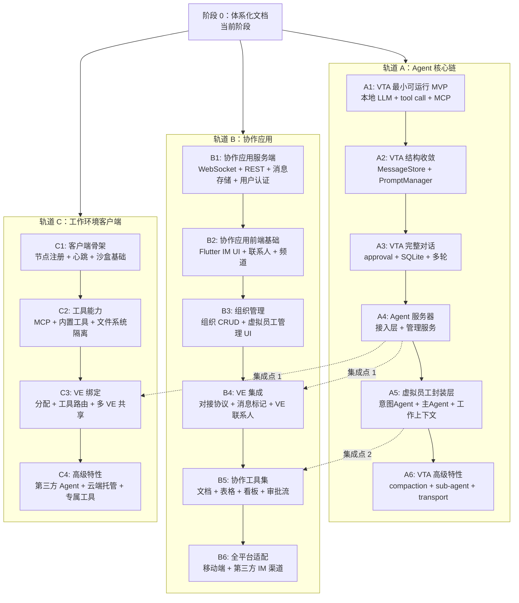

# 路线图

## 当前阶段

Virtual Team 处于**架构设计与体系化文档阶段**。在进入具体实现前，先建立完整的项目级设计文档，确保从全局到细节的连贯性。

## 依赖分析

在规划并行实施路径之前，需要先明确子系统之间的依赖关系。下表列出各核心模块的依赖：

| 模块 | 依赖 | 可独立启动？ |
|------|------|-------------|
| **VTA Agent Runtime** | 无（自包含） | ✅ 是 |
| **协作应用 IM 核心** | 无（自包含的 IM 系统） | ✅ 是 |
| **工作环境客户端基础** | 无（自包含的工具宿主） | ✅ 是 |
| **Agent 服务器（接入层）** | VTA 核心 API 稳定 | ❌ 需 VTA 先行 |
| **Agent 服务器（管理服务）** | VTA 核心 + 接入层 | ❌ 需 VTA 先行 |
| **虚拟员工封装层** | Agent 服务器 | ❌ 需 Agent 服务器 |
| **协作应用 VE 集成** | Agent 服务器接入层 | ❌ 需 Agent 服务器 |

### 关键发现

三个模块**完全没有相互依赖**，可以完全并行启动：

1. **VTA Agent Runtime** — 自包含的 Pure Agent 骨架
2. **协作应用 IM 核心** — 独立的即时通讯系统（Flutter 客户端 + Rust 服务端）
3. **工作环境客户端** — 独立的工具宿主程序（节点注册、沙盒、MCP、内置工具）

这意味着我们可以用**三条并行轨道**推进开发，在关键集成点汇合。

## 三轨并行路径

### 轨道 A：Agent 核心链

这条轨道的详细阶段划分已在 VTA 的 `frozen-plan/` 中冻结，此处仅作里程碑级映射。

**A1：VTA 最小可运行 MVP**
- 本地/in-process 跑通 LLM API、最小 loop、tool call、MCP 工具
- `chrome-devtools` 示例端到端验证
- 产出：`runtime-agent` crate 可运行原型

**A2：VTA 结构收敛**
- Message/Part/SceneId 类型定义
- MessageStore trait + memory 后端
- Prompt 配置包基础加载
- 产出：稳定 API 接口（其他轨道可开始对接）

**A3：VTA 完整对话能力**
- Approval continuation
- SQLite MessageStore
- 三类别模型选择
- Session parent 字段
- 产出：生产级 Agent Runtime 核心

**A4：Agent 服务器**
- 接入层：协作应用协议适配
- 虚拟员工管理服务：生命周期、多租户路由
- 虚拟员工实例冷热管理
- 产出：可管理虚拟员工的服务器 ← **集成点 1**

**A5：虚拟员工封装层**
- 意图识别 Agent + 主 Agent 协作
- 工作上下文创建/管理/Fork/Resume
- 配置包高阶扩展
- 产出：完整的虚拟员工行为 ← **集成点 2**

**A6：VTA 高级特性**
- CompactionStrategy
- Sub-agent 调度
- WebSocket/stdio transport
- 可观测性与生产加固

### 轨道 B：协作应用

B1-B3 **完全不依赖轨道 A**，可与 A1-A3 完全并行。

**B1：协作应用服务端**
- WebSocket 实时通道 + HTTPS REST API
- 消息模型（Block-based 富文本 + markers 扩展字段）
- 频道/群组/1:1 消息路由
- 用户认证（JWT）
- 消息持久化（PostgreSQL）
- 多端同步（sequence + replay）

**B2：协作应用前端基础**
- Flutter 项目骨架与导航
- IM 聊天界面（消息列表、输入框、富文本渲染）
- 联系人列表（用户 + 虚拟员工占位）
- 频道/群组管理界面

**B3：组织管理**
- 组织 CRUD 界面与 API
- 虚拟员工管理界面（创建、配置、分配）
- 工作环境节点管理界面

**B4：VE 集成** ← 需要 A4 完成
- 对接协议实现（协作应用 ↔ Agent 服务器）
- 虚拟员工作为联系人接入
- 消息标记回写 API
- 上下文数据段构建（RAG + markers）
- 虚拟员工在线状态同步

**B5：协作工具集** ← 需要 A5 完成
- 文档协同编辑
- 多维表格（Bitable）
- 任务看板
- 审批流
- 虚拟员工可在协作工具中产出内容

**B6：全平台适配**
- iOS/Android 移动端适配
- 第三方 IM 渠道接入（参考 OpenClaw 的 Gateway 模式）
- 推送通知

### 轨道 C：工作环境客户端

C1-C2 **完全不依赖轨道 A**，可与 A1-A3 完全并行。

**C1：客户端骨架**
- 服务端注册与心跳保活
- 沙盒环境基础（文件系统隔离、进程隔离）
- 能力声明协议
- 离线/重连处理

**C2：工具能力**
- MCP Server 集成（标准 MCP 协议）
- 内置工具（文件读写、Shell 执行、网络请求）
- 文件系统级别多 VE 隔离
- 本地工具测试（使用模拟的 VE 调用）

**C3：VE 绑定** ← 需要 A4 完成
- 用户分配 VE 到工作环境节点
- VE 申请使用节点（用户确认）
- 工具调用路由（Agent 服务器 → 工作环境节点 → 具体工具）
- 多 VE 共享与隔离策略

**C4：高级特性**
- 第三方 Agent 集成（ClaudeCode、Codex 等）
- 云端托管版本（类似云 PC 的部署方案）
- 专属工具定制

## 并行执行策略

### 启动条件

三条轨道并行启动前，需先完成以下冻结：

| 冻结项 | 内容 | 已冻结？ |
|--------|------|---------|
| VTA 核心 trait 接口 | AgentLoop、PromptManager、MessageStore、ModelSelector | ✅ 已冻结（frozen-plan/interfaces/） |
| Agent 服务器协议 | 协作应用 ↔ Agent 服务器的消息格式和 API | ✅ 已冻结（11-protocol-and-integration.md） |
| 工作环境节点协议 | 节点注册、心跳、工具调用、结果回传 | ✅ 已冻结（09-work-environment-node.md） |
| 协作应用消息模型 | 消息结构、markers 字段、sequence 机制 | ✅ 已冻结（04-collaboration-app.md） |

所有协议边界和接口规格已在本文档中定义，三条轨道可以据此独立开发，集成时只需按协议对接。

### Vibecoding 适配

由于采用 vibecoding（多 Agent 并行开发），以下措施确保各轨道 Agent 能独立高效工作：

1. **接口先行**：每个轨道启动前，先冻结与其他轨道的协议边界。Agent 只需读取协议文档即可知道"对方接受什么、返回什么"，无需理解对方内部逻辑
2. **Mock 降级**：每个轨道提供 mock 实现用于测试。例如：
   - 协作应用 B1-B3 阶段，虚拟员工只是一个返回固定回复的 mock 端点
   - 工作环境客户端 C1-C2 阶段，用本地脚本模拟 Agent 服务器调用
   - VTA A1 阶段，用 mock LLM backend 加速测试
3. **独立 CI**：三条轨道在各自仓库中独立构建和测试，集成测试在关键汇合点执行
4. **文档即契约**：本文档中的协议描述、消息格式、序列图即为开发契约

### 并行阶段建议

| 阶段 | 轨道 A | 轨道 B | 轨道 C | 并行度 |
|------|--------|--------|--------|--------|
| **Phase 1** | A1（VTA MVP） | B1（IM 服务端） | C1（客户端骨架） | ═══ 3 线并行 |
| **Phase 2** | A2（结构收敛） | B2（IM 前端） | C2（工具能力） | ═══ 3 线并行 |
| **Phase 3-4** | A3-A4（完整对话 + Agent 服务器） | B3-B4（组织管理 + VE 集成） | — | ═══ 2 线并行 |
| **Phase 5** | A5（VE 封装层） | B5（协作工具集） | C3（VE 绑定） | ═══ 3 线并行 |
| **Phase 6** | A6（高级特性） | B6（全平台） | C4（高级特性） | ═══ 3 线并行 |

## 里程碑

| 里程碑 | 触发条件 | 内容 |
|--------|---------|------|
| **M1** | A1 完成 | VTA 最小可运行 Agent：本地 LLM + tool call + MCP |
| **M2** | A3 + B1 + C1 完成 | 三轨基础就绪：VTA 稳定 API + IM 服务端可部署 + 工作环境客户端可连接 |
| **M3** | A4 + B3 + C2 完成 | 首次集成准备就绪：Agent 服务器可管理 VE + 协作应用可显示 VE + 工作环境可提供工具 |
| **M4** | A4 + B4 + C3 完成 | **首次三方集成**：用户可在协作应用中向虚拟员工发消息，虚拟员工可调用工作环境工具 |
| **M5** | A5 + B5 完成 | 内测版：完整虚拟员工行为 + 协作工具集 |
| **M6** | A6 + B6 + C4 完成 | 公测版：高级特性 + 全平台 + 云端工作环境 |
