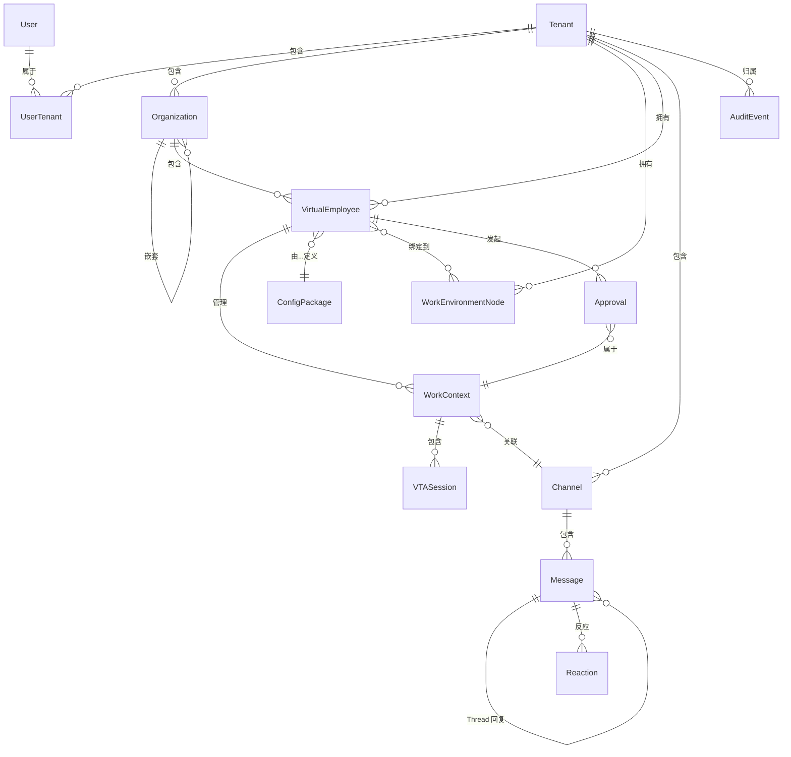

# 数据模型参考

本章集中定义 Virtual Team 所有核心实体的数据库模型，作为各子系统实现的统一数据契约。

## ER 总览



## 实体定义

### 用户 (users)

```sql
CREATE TABLE users (
    id UUID PRIMARY KEY DEFAULT gen_random_uuid(),
    email VARCHAR(255) NOT NULL UNIQUE,
    password_hash TEXT NOT NULL,
    display_name VARCHAR(128) NOT NULL,
    avatar_url TEXT,

    -- 偏好设置
    preferred_language VARCHAR(8) NOT NULL DEFAULT 'zh-CN',
    timezone VARCHAR(64) NOT NULL DEFAULT 'Asia/Shanghai',
    notification_prefs JSONB NOT NULL DEFAULT '{}',

    -- 当前活跃 Tenant
    active_tenant_id UUID,

    status VARCHAR(16) NOT NULL DEFAULT 'active',
    -- 'active', 'suspended', 'deleted'
    last_login_at TIMESTAMPTZ,
    created_at TIMESTAMPTZ NOT NULL DEFAULT now(),
    updated_at TIMESTAMPTZ NOT NULL DEFAULT now(),
    deleted_at TIMESTAMPTZ,

    INDEX idx_users_email (email),
    INDEX idx_users_status (status)
);
```

### 租户 (tenants)

```sql
CREATE TABLE tenants (
    id UUID PRIMARY KEY DEFAULT gen_random_uuid(),
    name VARCHAR(128) NOT NULL,
    plan VARCHAR(16) NOT NULL DEFAULT 'free',
    -- 'free', 'pro', 'team', 'enterprise'

    -- 计费
    billing_email VARCHAR(255),
    billing_info JSONB DEFAULT '{}',

    -- 配额
    max_users INTEGER NOT NULL DEFAULT 1,
    max_ve_count INTEGER NOT NULL DEFAULT 3,
    max_organizations INTEGER NOT NULL DEFAULT 1,
    max_concurrent_work_contexts INTEGER NOT NULL DEFAULT 3,
    max_wen_count INTEGER NOT NULL DEFAULT 2,

    status VARCHAR(16) NOT NULL DEFAULT 'active',
    -- 'active', 'suspended', 'deleted'
    created_at TIMESTAMPTZ NOT NULL DEFAULT now(),
    updated_at TIMESTAMPTZ NOT NULL DEFAULT now(),
    deleted_at TIMESTAMPTZ,

    INDEX idx_tenants_status (status)
);
```

### User-Tenant 关联 (user_tenants)

```sql
CREATE TABLE user_tenants (
    id UUID PRIMARY KEY DEFAULT gen_random_uuid(),
    user_id UUID NOT NULL REFERENCES users(id) ON DELETE CASCADE,
    tenant_id UUID NOT NULL REFERENCES tenants(id) ON DELETE CASCADE,
    role VARCHAR(16) NOT NULL DEFAULT 'member',
    -- 'owner', 'admin', 'member'

    joined_at TIMESTAMPTZ NOT NULL DEFAULT now(),
    invited_by UUID REFERENCES users(id),

    UNIQUE INDEX idx_user_tenant_unique (user_id, tenant_id),
    INDEX idx_tenant_users (tenant_id, role),
    INDEX idx_user_tenants_user (user_id)
);
```

### 组织 (organizations)

```sql
CREATE TABLE organizations (
    id UUID PRIMARY KEY DEFAULT gen_random_uuid(),
    tenant_id UUID NOT NULL REFERENCES tenants(id),
    parent_id UUID REFERENCES organizations(id),
    name VARCHAR(128) NOT NULL,
    description TEXT,

    -- 自动维护的结构化元数据
    metadata JSONB NOT NULL DEFAULT '{}',
    /*
    {
      "business_domains": ["sales", "data-analysis"],
      "typical_tasks": ["报告生成", "数据分析"],
      "member_count": 3,
      "active_work_contexts": 2,
      "member_summaries": [
        { "ve_id": "...", "role": "leader", "capability_summary": "..." }
      ]
    }
    */

    sort_order INTEGER NOT NULL DEFAULT 0,
    created_at TIMESTAMPTZ NOT NULL DEFAULT now(),
    updated_at TIMESTAMPTZ NOT NULL DEFAULT now(),
    archived_at TIMESTAMPTZ,

    UNIQUE INDEX idx_orgs_tenant_name (tenant_id, parent_id, name),
    INDEX idx_orgs_tenant_parent (tenant_id, parent_id),
    INDEX idx_orgs_parent (parent_id)
);
```

### 组织成员 (organization_members)

```sql
CREATE TABLE organization_members (
    id UUID PRIMARY KEY DEFAULT gen_random_uuid(),
    organization_id UUID NOT NULL REFERENCES organizations(id) ON DELETE CASCADE,
    ve_id UUID NOT NULL,
    role VARCHAR(16) NOT NULL DEFAULT 'member',
    -- 'leader', 'member'
    assigned_at TIMESTAMPTZ NOT NULL DEFAULT now(),

    UNIQUE INDEX idx_org_members_unique (organization_id, ve_id),
    INDEX idx_org_members_ve (ve_id)
);
```

### 虚拟员工 (virtual_employees)

```sql
CREATE TABLE virtual_employees (
    id UUID PRIMARY KEY DEFAULT gen_random_uuid(),
    tenant_id UUID NOT NULL REFERENCES tenants(id),
    display_name VARCHAR(128) NOT NULL,
    avatar_url TEXT,

    -- 配置
    config_package_id UUID NOT NULL,
    config_package_version VARCHAR(32) NOT NULL,

    -- 归属
    organization_id UUID REFERENCES organizations(id),
    role_in_org VARCHAR(16) NOT NULL DEFAULT 'member',
    -- 'leader', 'member'
    is_assistant BOOLEAN NOT NULL DEFAULT false,

    -- 状态
    status VARCHAR(16) NOT NULL DEFAULT 'created',
    -- 'created', 'mounted', 'idle', 'working', 'suspended', 'unmounted'
    online_status VARCHAR(16) NOT NULL DEFAULT 'offline',
    -- 'online', 'offline', 'busy', 'away'

    -- 资源
    runner_id UUID,
    current_wen_id UUID,

    -- 统计
    total_work_contexts INTEGER DEFAULT 0,
    active_work_contexts INTEGER DEFAULT 0,
    total_tokens_used BIGINT DEFAULT 0,

    created_at TIMESTAMPTZ NOT NULL DEFAULT now(),
    updated_at TIMESTAMPTZ NOT NULL DEFAULT now(),
    last_active_at TIMESTAMPTZ,

    INDEX idx_ve_tenant (tenant_id, status),
    INDEX idx_ve_org (organization_id),
    INDEX idx_ve_runner (runner_id),
    INDEX idx_ve_status (status, last_active_at)
);
```

### 工作上下文 (work_contexts)

```sql
CREATE TABLE work_contexts (
    id UUID PRIMARY KEY DEFAULT gen_random_uuid(),
    tenant_id UUID NOT NULL REFERENCES tenants(id),
    ve_id UUID NOT NULL,

    status VARCHAR(16) NOT NULL DEFAULT 'new',
    -- 'new', 'active', 'paused', 'fork', 'archived'

    -- 任务信息
    summary TEXT,
    task_description TEXT,
    task_type VARCHAR(32),

    -- 关联
    organization_id UUID REFERENCES organizations(id),
    channel_id UUID,
    linked_message_ids UUID[] DEFAULT '{}',
    linked_document_ids UUID[] DEFAULT '{}',
    linked_bitable_ids UUID[] DEFAULT '{}',

    -- Fork 关系
    parent_work_context_id UUID REFERENCES work_contexts(id),
    fork_checkpoint JSONB,

    -- 执行环境
    wen_id UUID,
    vta_sessions JSONB NOT NULL DEFAULT '[]',

    -- 统计
    total_turns INTEGER DEFAULT 0,
    total_tokens_used BIGINT DEFAULT 0,
    total_tool_calls INTEGER DEFAULT 0,
    total_sub_agents INTEGER DEFAULT 0,

    created_at TIMESTAMPTZ NOT NULL DEFAULT now(),
    updated_at TIMESTAMPTZ NOT NULL DEFAULT now(),
    last_active_at TIMESTAMPTZ,
    completed_at TIMESTAMPTZ,
    archived_at TIMESTAMPTZ,

    INDEX idx_wc_tenant_ve (tenant_id, ve_id, status),
    INDEX idx_wc_tenant_active (tenant_id, last_active_at DESC) WHERE status IN ('active', 'paused'),
    INDEX idx_wc_parent (parent_work_context_id),
    INDEX idx_wc_org (organization_id),
    INDEX idx_wc_channel (channel_id)
);
```

### 工作环境节点 (work_environment_nodes)

```sql
CREATE TABLE work_environment_nodes (
    id UUID PRIMARY KEY DEFAULT gen_random_uuid(),
    tenant_id UUID NOT NULL REFERENCES tenants(id),
    node_name VARCHAR(128) NOT NULL,
    node_type VARCHAR(16) NOT NULL DEFAULT 'local',
    -- 'local', 'cloud'

    -- 宿主信息
    host_os VARCHAR(32),
    host_arch VARCHAR(16),
    hostname VARCHAR(255),
    client_version VARCHAR(16),

    -- 能力声明
    capabilities JSONB NOT NULL DEFAULT '{}',

    -- 认证
    auth_token_hash TEXT NOT NULL,

    -- 状态
    status VARCHAR(16) NOT NULL DEFAULT 'offline',
    -- 'online', 'offline', 'degraded'
    isolation_level VARCHAR(16) NOT NULL DEFAULT 'process',
    -- 'none', 'process', 'container'

    -- 资源
    cpu_cores INTEGER,
    memory_mb INTEGER,
    disk_gb INTEGER,
    current_cpu_percent REAL,
    current_memory_used_mb INTEGER,
    current_disk_free_gb REAL,

    last_heartbeat_at TIMESTAMPTZ,
    created_at TIMESTAMPTZ NOT NULL DEFAULT now(),
    updated_at TIMESTAMPTZ NOT NULL DEFAULT now(),

    UNIQUE INDEX idx_wen_tenant_name (tenant_id, node_name),
    INDEX idx_wen_tenant_status (tenant_id, status),
    INDEX idx_wen_heartbeat (last_heartbeat_at)
);
```

### VE-WEN 绑定 (ve_wen_bindings)

```sql
CREATE TABLE ve_wen_bindings (
    id UUID PRIMARY KEY DEFAULT gen_random_uuid(),
    ve_id UUID NOT NULL,
    wen_id UUID NOT NULL REFERENCES work_environment_nodes(id),
    binding_type VARCHAR(16) NOT NULL DEFAULT 'exclusive',
    -- 'exclusive', 'shared'
    workspace_path TEXT NOT NULL,
    created_at TIMESTAMPTZ NOT NULL DEFAULT now(),
    released_at TIMESTAMPTZ,

    UNIQUE INDEX idx_ve_wen_active (ve_id, wen_id) WHERE released_at IS NULL,
    INDEX idx_wen_bindings (wen_id) WHERE released_at IS NULL
);
```

### IM 频道 (channels)

```sql
CREATE TABLE channels (
    id UUID PRIMARY KEY DEFAULT gen_random_uuid(),
    tenant_id UUID NOT NULL REFERENCES tenants(id),
    type VARCHAR(16) NOT NULL,
    -- 'direct', 'group', 'channel'
    name VARCHAR(128),
    organization_id UUID REFERENCES organizations(id),
    created_by UUID NOT NULL,
    last_message_sequence BIGINT NOT NULL DEFAULT 0,
    created_at TIMESTAMPTZ NOT NULL DEFAULT now(),
    updated_at TIMESTAMPTZ NOT NULL DEFAULT now(),

    INDEX idx_channels_tenant (tenant_id, type),
    INDEX idx_channels_org (organization_id)
);

CREATE TABLE channel_members (
    id UUID PRIMARY KEY DEFAULT gen_random_uuid(),
    channel_id UUID NOT NULL REFERENCES channels(id) ON DELETE CASCADE,
    member_type VARCHAR(16) NOT NULL,
    -- 'user', 'virtual_employee'
    member_id UUID NOT NULL,
    last_read_sequence BIGINT NOT NULL DEFAULT 0,
    joined_at TIMESTAMPTZ NOT NULL DEFAULT now(),

    UNIQUE INDEX idx_ch_members_unique (channel_id, member_type, member_id)
);
```

### 消息 (messages)

```sql
CREATE TABLE messages (
    id UUID PRIMARY KEY DEFAULT gen_random_uuid(),
    tenant_id UUID NOT NULL REFERENCES tenants(id),
    channel_id UUID NOT NULL REFERENCES channels(id),

    -- 发送者
    sender_type VARCHAR(16) NOT NULL,
    -- 'user', 'virtual_employee', 'system'
    sender_id UUID NOT NULL,
    sender_display_name VARCHAR(128),

    -- 内容
    content_type VARCHAR(32) NOT NULL DEFAULT 'text',
    content_body TEXT,
    content_blocks JSONB,

    -- 线程
    thread_id UUID REFERENCES messages(id),
    reply_count INTEGER NOT NULL DEFAULT 0,

    -- 排序
    sequence BIGINT NOT NULL,

    -- Virtual Team 标记
    work_context_id UUID,
    intent VARCHAR(32),
    related_message_ids UUID[] DEFAULT '{}',

    -- 元数据
    client_msg_id VARCHAR(64),
    edited_at TIMESTAMPTZ,
    deleted_at TIMESTAMPTZ,
    created_at TIMESTAMPTZ NOT NULL DEFAULT now(),

    UNIQUE INDEX idx_messages_channel_seq (channel_id, sequence DESC),
    INDEX idx_messages_thread (thread_id, sequence),
    INDEX idx_messages_tenant_time (tenant_id, created_at DESC),
    INDEX idx_messages_work_context (work_context_id) WHERE work_context_id IS NOT NULL
);
```

### 消息反应 (reactions)

```sql
CREATE TABLE reactions (
    id UUID PRIMARY KEY DEFAULT gen_random_uuid(),
    message_id UUID NOT NULL REFERENCES messages(id) ON DELETE CASCADE,
    user_id UUID NOT NULL,
    emoji_name VARCHAR(64) NOT NULL,
    created_at TIMESTAMPTZ NOT NULL DEFAULT now(),

    UNIQUE INDEX idx_reactions_unique (message_id, user_id, emoji_name)
);
```

### 审批 (approvals)

```sql
CREATE TABLE approvals (
    id UUID PRIMARY KEY DEFAULT gen_random_uuid(),
    tenant_id UUID NOT NULL REFERENCES tenants(id),
    ve_id UUID NOT NULL,
    work_context_id UUID REFERENCES work_contexts(id),

    operation VARCHAR(64) NOT NULL,
    details JSONB NOT NULL,

    status VARCHAR(16) NOT NULL DEFAULT 'pending',
    -- 'pending', 'approved', 'rejected', 'expired', 'cancelled'
    decided_by UUID,
    decided_at TIMESTAMPTZ,
    remember_in_session BOOLEAN NOT NULL DEFAULT false,

    expires_at TIMESTAMPTZ NOT NULL,
    created_at TIMESTAMPTZ NOT NULL DEFAULT now(),

    INDEX idx_approvals_tenant (tenant_id, status),
    INDEX idx_approvals_ve (ve_id, status),
    INDEX idx_approvals_expires (expires_at) WHERE status = 'pending'
);
```

### 审计事件 (audit_events)

```sql
CREATE TABLE audit_events (
    id UUID PRIMARY KEY DEFAULT gen_random_uuid(),
    tenant_id UUID NOT NULL,
    event_type VARCHAR(64) NOT NULL,
    actor_type VARCHAR(16) NOT NULL,
    -- 'user', 've', 'system'
    actor_id UUID NOT NULL,
    target_type VARCHAR(32),
    target_id UUID,
    action VARCHAR(64) NOT NULL,
    details JSONB,
    outcome VARCHAR(16) NOT NULL,
    -- 'success', 'denied', 'error'
    ip_address INET,
    user_agent TEXT,
    request_id UUID,
    created_at TIMESTAMPTZ NOT NULL DEFAULT now(),

    INDEX idx_audit_tenant_time (tenant_id, created_at DESC),
    INDEX idx_audit_actor (actor_type, actor_id),
    INDEX idx_audit_event (event_type, created_at DESC)
);

-- 审计日志按时间分区
SELECT create_hypertable('audit_events', 'created_at');
```

### 配置包 (config_packages)

```sql
CREATE TABLE config_packages (
    id UUID PRIMARY KEY DEFAULT gen_random_uuid(),
    name VARCHAR(64) NOT NULL UNIQUE,

    display_name VARCHAR(128) NOT NULL,
    description TEXT,
    author VARCHAR(128),
    license VARCHAR(32),
    keywords TEXT[] DEFAULT '{}',

    -- 版本
    latest_version VARCHAR(32) NOT NULL,
    min_vta_version VARCHAR(32) NOT NULL,

    -- 来源
    source VARCHAR(16) NOT NULL DEFAULT 'official',
    -- 'official', 'third_party', 'custom'
    repository_url TEXT,

    -- 统计
    install_count INTEGER NOT NULL DEFAULT 0,
    rating_avg REAL,
    rating_count INTEGER DEFAULT 0,

    is_published BOOLEAN NOT NULL DEFAULT false,
    created_at TIMESTAMPTZ NOT NULL DEFAULT now(),
    updated_at TIMESTAMPTZ NOT NULL DEFAULT now(),

    INDEX idx_packages_source (source),
    INDEX idx_packages_keywords (keywords)
);

CREATE TABLE config_package_versions (
    id UUID PRIMARY KEY DEFAULT gen_random_uuid(),
    package_id UUID NOT NULL REFERENCES config_packages(id),
    version VARCHAR(32) NOT NULL,
    package_files JSONB NOT NULL,
    checksum VARCHAR(64) NOT NULL,
    changelog TEXT,
    is_deprecated BOOLEAN NOT NULL DEFAULT false,
    created_at TIMESTAMPTZ NOT NULL DEFAULT now(),

    UNIQUE INDEX idx_pkg_versions (package_id, version)
);
```

## 索引策略

| 策略 | 说明 |
|------|------|
| 所有查询必经 `tenant_id` | 每个多租户表的主查询索引都以 `tenant_id` 为前缀 |
| 部分索引 | 热数据（活跃/待处理状态）使用 `WHERE` 条件的部分索引 |
| 时序分区 | 审计日志、消息使用时间分区或超表 |
| 复合索引 | 常用查询组合（如 `tenant_id + ve_id + status`）创建复合索引 |
| JSONB 索引 | 对 `metadata`、`capabilities` 等 JSONB 字段的高频查询键创建 GIN 索引 |

## 迁移策略

- 所有 DDL 变更纳入版本控制，与代码仓库同仓库管理
- 使用 SQL 迁移工具（如 `refinery` 或 `sqlx migrate`）
- 迁移文件命名：`V{seq}__{description}.sql`
- 每个迁移包含正向（up）和回滚（down，用于开发环境）
- 生产环境迁移在 CI/CD 中自动执行，回滚需人工审批
