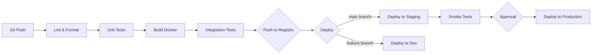

# 部署架构

## 概述

Virtual Team 采用云原生微服务架构部署，所有服务容器化，通过 Kubernetes 编排。本章定义生产环境的部署拓扑、CI/CD 流程和环境策略。

## 基础设施要求

### 云平台

优先选择支持 Kubernetes 的云平台（AWS EKS / GCP GKE / Azure AKS / 阿里云 ACK）。以下以 AWS 为例：

| 服务 | AWS 产品 | 说明 |
|------|---------|------|
| Kubernetes | EKS | 容器编排 |
| 数据库 | RDS PostgreSQL 15+ | 多可用区部署 |
| 缓存/队列 | ElastiCache Redis 7+ | 消息队列和缓存 |
| 对象存储 | S3 | 文件附件和配置包 |
| CDN | CloudFront | 静态资源和文件加速 |
| DNS | Route 53 | 域名管理 |
| 证书管理 | ACM | TLS 证书自动续期 |
| 密钥管理 | KMS / Secrets Manager | 密钥加密存储 |
| 日志 | CloudWatch / Loki | 日志聚合 |
| 监控 | Prometheus + Grafana | 指标和告警 |

### 最小生产集群规模

| 组件 | 副本数 | 每副本资源 | 说明 |
|------|--------|----------|------|
| 协作应用服务端 | 3 | 2 vCPU / 4GB | 无状态，可水平扩展 |
| Agent 服务器 | 2 | 2 vCPU / 4GB | 无状态，可水平扩展 |
| VE Runner | 2 | 4 vCPU / 8GB | 有状态（VE 实例），需优雅迁移 |
| PostgreSQL | 1 主 + 1 副本 | 4 vCPU / 16GB / 500GB SSD | 多可用区 |
| Redis | 3 节点集群 | 2 vCPU / 4GB | 高可用 |
| OpenTelemetry Collector | 1 / 节点 | DaemonSet | 日志/指标/追踪采集 |

## Docker 化

### 服务镜像

```
virtual-team/
├── docker/
│   ├── collab-server.Dockerfile
│   ├── agent-server.Dockerfile
│   ├── ve-runner.Dockerfile
│   └── wen-client.Dockerfile
```

### 镜像命名与标签

```
ghcr.io/virtual-team/collab-server:{version}-{commit_sha}
ghcr.io/virtual-team/agent-server:{version}-{commit_sha}
ghcr.io/virtual-team/ve-runner:{version}-{commit_sha}
ghcr.io/virtual-team/wen-client:{version}-{commit_sha}
```

- `{version}`: SemVer（如 `0.1.0`）
- `{commit_sha}`: Git commit SHA 短码（用于可追溯性）
- `latest` 标签指向当前生产版本

### 协作应用服务端 Dockerfile 示例

```dockerfile
FROM rust:1.85-alpine AS builder
WORKDIR /app
COPY Cargo.toml Cargo.lock ./
COPY crates/ ./crates/
RUN cargo build --release --bin collab-server

FROM alpine:3.21
RUN apk add --no-cache ca-certificates tzdata
COPY --from=builder /app/target/release/collab-server /usr/local/bin/
EXPOSE 8080 8443
CMD ["collab-server"]
```

## Kubernetes 部署

### Namespace 规划

```
virtual-team/
├── vt-prod/          # 生产环境
├── vt-staging/       # 预发布环境
└── vt-dev/           # 开发环境
```

### 协作应用服务端 Deployment

```yaml
apiVersion: apps/v1
kind: Deployment
metadata:
  name: collab-server
  namespace: vt-prod
spec:
  replicas: 3
  selector:
    matchLabels:
      app: collab-server
  template:
    metadata:
      labels:
        app: collab-server
    spec:
      containers:
      - name: collab-server
        image: ghcr.io/virtual-team/collab-server:0.1.0-abc1234
        ports:
        - containerPort: 8080
          name: http
        - containerPort: 8443
          name: https
        env:
        - name: DATABASE_URL
          valueFrom:
            secretKeyRef:
              name: vt-secrets
              key: database-url
        - name: REDIS_URL
          valueFrom:
            secretKeyRef:
              name: vt-secrets
              key: redis-url
        - name: JWT_PUBLIC_KEY
          valueFrom:
            secretKeyRef:
              name: vt-secrets
              key: jwt-public-key
        resources:
          requests:
            cpu: "1"
            memory: "2Gi"
          limits:
            cpu: "2"
            memory: "4Gi"
        livenessProbe:
          httpGet:
            path: /healthz
            port: 8080
          initialDelaySeconds: 10
          periodSeconds: 15
        readinessProbe:
          httpGet:
            path: /readyz
            port: 8080
          initialDelaySeconds: 5
          periodSeconds: 10
        volumeMounts:
        - name: config
          mountPath: /etc/virtual-team
      volumes:
      - name: config
        configMap:
          name: collab-server-config
---
apiVersion: v1
kind: Service
metadata:
  name: collab-server
  namespace: vt-prod
spec:
  selector:
    app: collab-server
  ports:
  - port: 443
    targetPort: 8443
    name: https
  type: ClusterIP
```

### 健康检查端点

| 端点 | 用途 | 检查内容 |
|------|------|---------|
| `/healthz` | Liveness | 进程存活（简单 200 OK） |
| `/readyz` | Readiness | 可接收流量（DB + Redis 连接正常） |

### 配置管理

```
kubectl create configmap collab-server-config \
  --from-file=config.toml \
  --namespace=vt-prod

kubectl create secret generic vt-secrets \
  --from-literal=database-url="postgres://..." \
  --from-literal=redis-url="redis://..." \
  --from-literal=jwt-private-key="..." \
  --namespace=vt-prod
```

## CI/CD

### 流水线阶段



### GitHub Actions 示例（核心步骤）

```yaml
name: CI/CD
on:
  push:
    branches: [main]
  pull_request:
    branches: [main]

jobs:
  test:
    runs-on: ubuntu-latest
    services:
      postgres:
        image: postgres:16
        env:
          POSTGRES_PASSWORD: test
        options: >-
          --health-cmd pg_isready
          --health-interval 10s
      redis:
        image: redis:7
        options: >-
          --health-cmd "redis-cli ping"
          --health-interval 10s
    steps:
      - uses: actions/checkout@v4
      - uses: actions-rs/toolchain@v1
        with: { toolchain: stable }
      - run: cargo test --workspace
      - run: cargo clippy -- -D warnings

  build-and-deploy:
    needs: test
    if: github.ref == 'refs/heads/main'
    runs-on: ubuntu-latest
    steps:
      - uses: actions/checkout@v4
      - name: Build Docker images
        run: |
          docker build -f docker/collab-server.Dockerfile -t ghcr.io/virtual-team/collab-server:${{ github.sha }} .
          docker push ghcr.io/virtual-team/collab-server:${{ github.sha }}
      - name: Deploy to staging
        run: |
          kubectl set image deployment/collab-server \
            collab-server=ghcr.io/virtual-team/collab-server:${{ github.sha }} \
            --namespace=vt-staging
      - name: Smoke tests
        run: ./scripts/smoke-test.sh staging
      - name: Deploy to production
        if: success()
        run: |
          kubectl set image deployment/collab-server \
            collab-server=ghcr.io/virtual-team/collab-server:${{ github.sha }} \
            --namespace=vt-prod
```

## 环境策略

| 环境 | 用途 | 数据 | 部署方式 |
|------|------|------|---------|
| **dev** | 开发测试，每个 feature branch 可创建独立环境 | 测试数据，可随时重置 | PR 自动创建，合并后自动销毁 |
| **staging** | 预发布验证，与生产配置一致 | 脱敏的生产镜像数据 | main 分支自动部署 |
| **production** | 生产环境 | 真实用户数据 | 手动审批后部署 |

### 数据库迁移

迁移在部署前自动执行：

```yaml
# Kubernetes InitContainer 执行迁移
initContainers:
- name: db-migrate
  image: ghcr.io/virtual-team/migrate:latest
  command: ["migrate", "up", "--database-url", "$(DATABASE_URL)"]
  env:
  - name: DATABASE_URL
    valueFrom:
      secretKeyRef:
        name: vt-secrets
        key: database-url
```

生产迁移规则：
- 迁移脚本必须是幂等的（可安全重跑）
- 禁止在迁移中执行可能长时间锁表的操作（如大表添加索引，使用 `CONCURRENTLY`）
- 回滚迁移需人工审批和手动执行

## 密钥管理

- 所有密钥存储在 Kubernetes Secrets 或云平台 Secrets Manager（如 AWS Secrets Manager）
- 密钥定期轮换：
  - JWT 签名密钥：90 天
  - API Key：90 天
  - 数据库密码：180 天
  - TLS 证书：自动续期（ACM / cert-manager）
- 密钥不写入配置文件、环境变量文件或代码仓库
- 开发环境使用独立的密钥集，禁止与生产环境共享

## 备份与灾难恢复

### 备份策略

| 数据 | 方法 | 频率 | 保留期 |
|------|------|------|--------|
| PostgreSQL | `pg_dump` + WAL 归档 | 每日全量 + 持续增量 | 30 天 |
| 对象存储 (S3) | 跨区域复制 + 版本控制 | 实时 | 永久 |
| Kubernetes 资源 | etcd 快照（EKS 自动） | 自动 | 由云平台管理 |
| 配置 (ConfigMap/Secret) | Git 仓库 + 加密备份 | 每次变更 | 永久 |

### 恢复流程

1. 从备份恢复 PostgreSQL
2. 验证数据完整性
3. 部署应用并指向恢复的数据库
4. 执行冒烟测试
5. 切换 DNS 到恢复的环境

恢复时间目标（RTO）：< 4 小时
恢复点目标（RPO）：< 1 小时（基于 WAL 持续归档）
