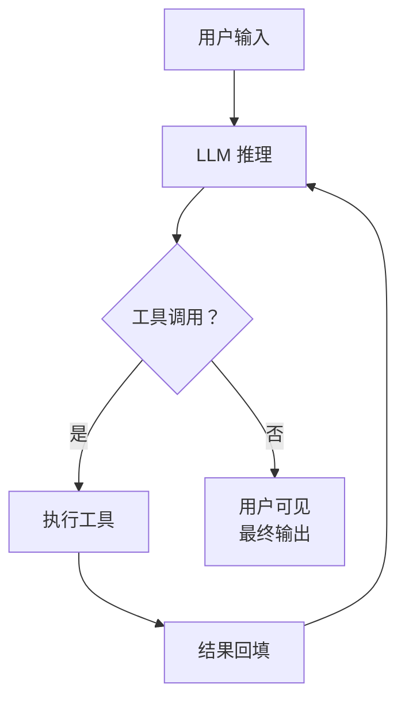

# Agent Runtime 设计总览

## 一、什么是 Agent Runtime

Agent Runtime 不是"调用一次大模型 API"这么简单。它是一个**有状态、可扩展、受控、可观测的交互式执行环境**，负责在用户与大型语言模型（LLM）之间建立持续、可靠、安全的对话循环。

一个 Agent Runtime 的核心职责是：

1. **管理对话状态**：维护用户输入、模型输出、工具调用结果的完整历史
2. **编排执行流程**：决定何时调用 LLM、何时执行工具、何时等待用户确认
3. **桥接外部能力**：将 LLM 的文本意图转化为可执行的操作（文件读写、命令执行、网络请求等）
4. **保障安全边界**：确保敏感操作经过授权，执行环境可控可隔离
5. **维持长期可用性**：在超长会话中管理上下文窗口，支持中断后恢复

## 二、Agent 不是 Chatbot

| 维度 | Chatbot | Agent |
|------|---------|-------|
| **交互模式** | 单次问答 | 多轮闭环（LLM → 工具 → LLM → ...） |
| **状态管理** | 无状态或简单上下文 | 显式状态机（idle/running/waiting/done/error） |
| **外部能力** | 仅文本生成 | 调用工具、执行代码、操作文件 |
| **执行控制** | 直接返回结果 | 需要 Approval、Sandbox、重试、容错 |
| **生命周期** | 一次请求-响应 | 可持久化、可恢复、可中断 |

理解这个区别是设计 Agent 架构的前提。

## 三、Agent Runtime 的十二项核心能力

基于对主流 Agent 实现（awaken、claude-code、codex、openclaw、opencode 等）的共性分析，一个完备的 Agent Runtime 必须具备以下能力：

### 1. Turn-based 执行循环
Agent 的基本执行单元是 **Turn**（或 Step）：一次 LLM 调用 + 零到多次工具调用 + 结果回填，构成一个完整的推理-行动闭环。

### 2. Provider-neutral 的 LLM 抽象
不绑定单一 LLM API。Runtime 需要一层抽象，统一处理不同 provider 的流式输出、函数调用协议、参数配置。

### 3. 动态工具注册与执行
工具不是硬编码的。Runtime 必须支持运行时注册/注销工具，接入外部工具生态（如 MCP），并支持串行和并行两种执行策略。

### 4. 生命周期 Hook 系统
扩展 Runtime 行为的唯一正确方式是在关键生命周期点（推理前、工具执行前、工具执行后、Turn 结束后）注入 Hook，而非修改核心循环代码。

### 5. 分层 Prompt 管理
System Prompt 不是单一字符串，而是多层拼接：Base Identity + Skills + Rules + Dynamic Context + User Append。

### 6. 状态机 + 持久化
Runtime 必须显式建模运行状态，并支持 Checkpoint 持久化，以便中断后恢复、多 Agent 切换。

### 7. 权限与策略引擎
Agent 不是无限制执行的。必须有策略引擎控制什么能做（allow）、什么需要批准（ask）、什么不能做（deny）。

### 8. Context Window 管理
长会话必须进行上下文压缩（Compaction / Truncation / Summarization），否则将触达模型上下文上限。

### 9. 可观测性
Runtime 是生产系统，必须暴露 Trace、Metrics、Event Sink，用于监控工具决策延迟、Token 消耗、执行路径。

### 10. MCP 兼容
Model Context Protocol 正在成为工具生态的事实标准，Runtime 应具备 MCP 客户端能力以接入外部工具服务。

### 11. 重试与容错
LLM API 是不可靠依赖。Runtime 必须具备指数退避重试、状态可见、可配置最大重试次数的容错机制。

### 12. 反模式防护
Runtime 需要内置运行时防护，检测并打断重复调用、无限循环、权限提升等危险模式。

## 四、本文档结构

本文档按以下顺序展开 Agent Runtime 的系统性设计：

| 章节 | 主题 |
|------|------|
| 01 | 执行循环与状态机 |
| 02 | LLM 抽象层 |
| 03 | 工具系统 |
| 04 | 消息与 Hook 设计 |
| 05 | 提示词管理 |
| 06 | 状态机与持久化 |
| 07 | 权限与策略引擎 |
| 08 | 上下文窗口管理 |
| 09 | 可观测性 |
| 10 | 重试与容错 |
| 11 | 反模式防护 |
| 12 | 沙箱与执行隔离 |
| 13 | 文件系统感知 |
| 14 | MCP 兼容性 |
| 15 | 多模态支持 |

每一章都基于多个生产级 Agent 实现的共性提炼而成，目标是提供一套与具体编程语言无关的设计原则与架构蓝图。
