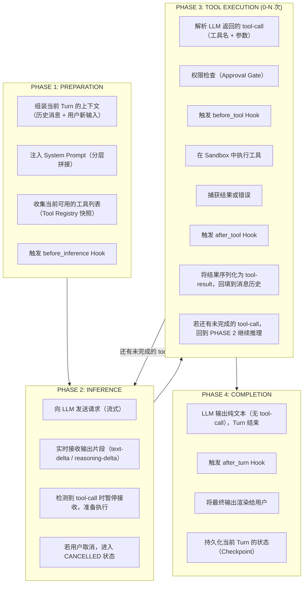
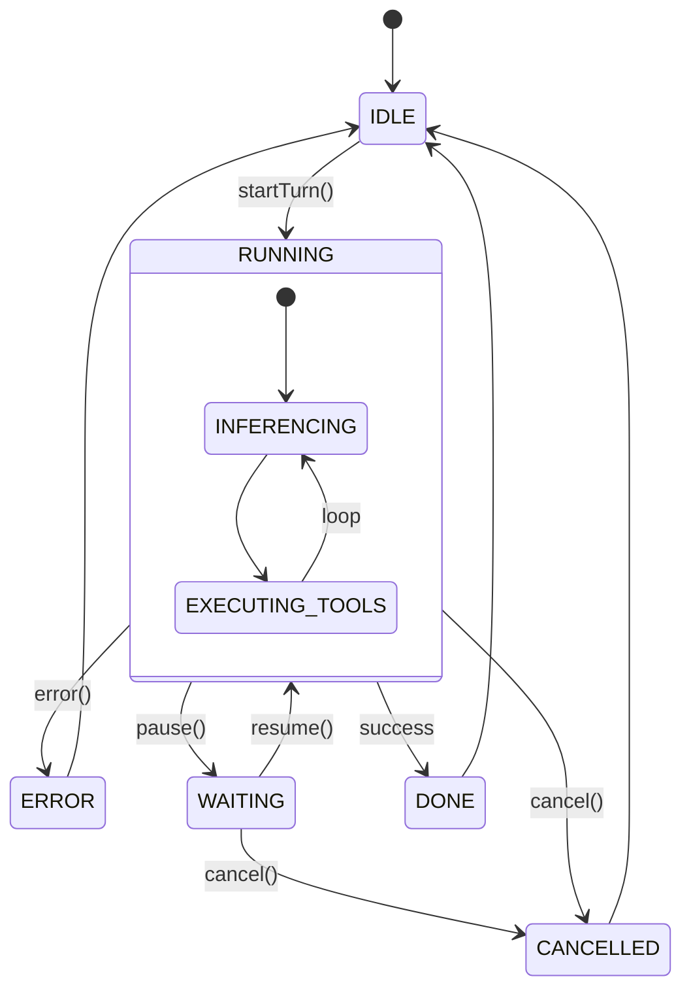
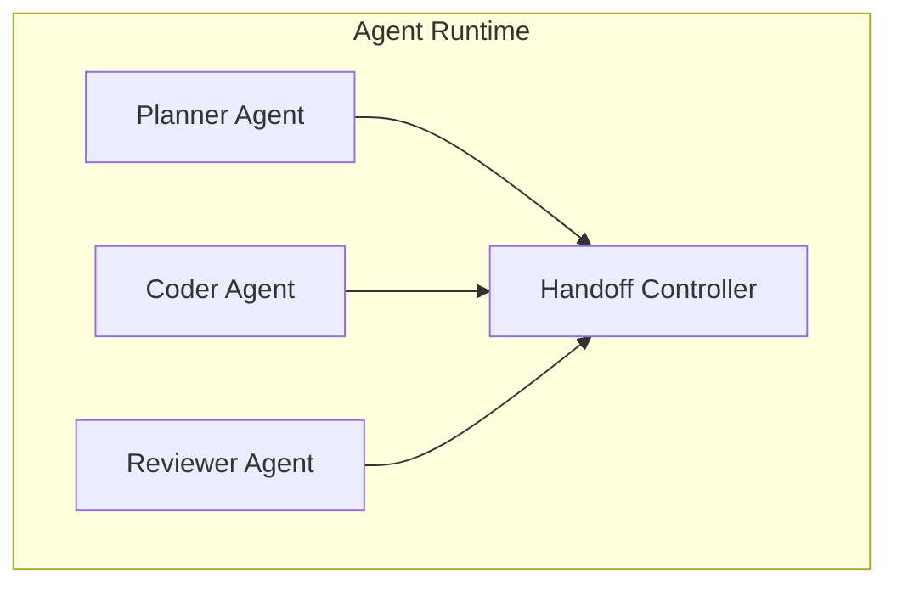

# 01. 执行循环与状态机

## 一、Turn 是基本执行单元

Agent 不是一次性的问答系统。它的核心是一个**循环**：接收输入 → 调用 LLM → 可能需要执行工具 → 将结果回填给 LLM → 再次推理 → 直到完成。

我们将"一次 LLM 调用 + 零到多次工具调用 + 结果回填"定义为一个 **Turn**（或 Step）。

### 1.1 Turn 的完整生命周期



### 1.2 流式 Turn vs 批量 Turn

两种主流的 Turn 实现模式：

| 模式 | 特点 | 适用场景 |
|------|------|----------|
| **流式 Turn** | LLM 输出通过 Stream 实时消费，text-delta / tool-call 在流中交错出现 | 交互式 CLI、实时 UI |
| **批量 Turn** | 等待 LLM 完整响应后再解析，一次性获取所有 tool-call | 后台任务、批处理 |

**流式 Turn 的伪代码示意**：

```
function executeTurn(session, userInput):
    session.status = RUNNING

    // 组装消息上下文
    messages = buildMessageContext(session.history, userInput)

    // 流式调用 LLM
    stream = llm.streamChat(messages, availableTools)

    currentTurn = createEmptyTurn()
    activeToolCalls = []

    for part in stream:
        if part.type == "text-delta":
            currentTurn.appendText(part.content)
            emitEvent("text_delta", part.content)

        else if part.type == "reasoning-delta":
            currentTurn.appendReasoning(part.content)
            emitEvent("reasoning_delta", part.content)

        else if part.type == "tool-call":
            toolCall = parseToolCall(part)
            activeToolCalls.append(toolCall)
            currentTurn.addToolCallPart(toolCall)

        else if part.type == "step-start":
            emitEvent("step_start", part.stepNumber)

        else if part.type == "step-finish":
            emitEvent("step_finish", part.stepNumber)

    // 流结束，检查是否有待执行的工具
    if activeToolCalls.isNotEmpty():
        results = executeToolCalls(activeToolCalls, session)
        // 将结果注入消息历史，触发下一轮推理
        session.history.append(createToolResultMessage(results))
        return executeTurn(session, null)  // 递归或循环

    // Turn 完成
    session.history.append(createAssistantMessage(currentTurn))
    session.status = IDLE
    emitEvent("turn_complete", currentTurn)
    return currentTurn
```

**关键设计点**：流式模式下，`text-delta` 和 `tool-call` 可能在同一个 Stream 中交错出现。Runtime 必须能**边接收边解析**，而非等全部内容到达后再处理。

## 二、状态机设计

Agent Runtime 必须显式建模运行状态。不能依赖隐式的布尔标志或锁，而应该有清晰的状态转换图。

### 2.1 最小状态集合



| 状态 | 含义 | 可转换到 |
|------|------|----------|
| **IDLE** | 等待用户输入 | RUNNING |
| **RUNNING** | 正在执行 Turn（推理中或执行工具中） | IDLE, WAITING, CANCELLED, ERROR |
| **WAITING** | 等待用户批准/输入（如敏感操作确认） | RUNNING, CANCELLED |
| **CANCELLED** | 用户主动取消当前 Turn | IDLE |
| **ERROR** | 发生不可恢复错误 | IDLE |
| **DONE** | Turn 正常完成 | IDLE |

### 2.2 状态持久化的意义

状态机不是内存中的临时结构。每个关键状态转换都应该**可持久化**：

- 用户可以随时关闭客户端，下次打开时从上次状态恢复
- 系统崩溃后，能从最后一个 Checkpoint 继续
- 支持多设备间的会话同步

```
function transition(session, fromState, toState, reason):
    validateTransition(fromState, toState)
    session.state = toState
    session.stateHistory.append({
        from: fromState,
        to: toState,
        timestamp: now(),
        reason: reason
    })
    persistSession(session)  // 立即写入持久存储
    emitEvent("state_change", {from: fromState, to: toState})
```

## 三、事件驱动架构

Agent Runtime 的内部状态变化必须通过**事件**向外部世界广播，而不是让外部组件轮询状态。

### 3.1 事件类型分层

| 层级 | 事件类型 | 示例 |
|------|----------|------|
| **Turn 级** | Turn 生命周期 | `turn_start`, `turn_complete`, `turn_cancelled` |
| **Step 级** | Step 生命周期 | `step_start`, `step_finish`, `step_error` |
| **Part 级** | 内容增量 | `text_delta`, `reasoning_delta`, `tool_call_delta` |
| **工具级** | 工具执行 | `tool_call_start`, `tool_call_finish`, `tool_call_error` |
| **状态级** | 状态转换 | `state_change`, `session_resumed` |
| **系统级** | 系统事件 | `context_compaction`, `permission_request` |

### 3.2 事件消费模式

```
// 模式一：Event Sink（推模式）
// Runtime 主动将事件推送到注册的消费端

interface EventSink:
    function onEvent(event: AgentEvent)

runtime.registerSink(consoleSink)
runtime.registerSink(uiSink)
runtime.registerSink(telemetrySink)

// 模式二：Async Iterator（拉模式）
// 消费者通过异步迭代器拉取事件流

async function consumeEvents():
    for event in runtime.eventStream:
        if event.type == "text_delta":
            ui.appendText(event.content)
        else if event.type == "tool_call_start":
            ui.showToolIndicator(event.toolName)
        else if event.type == "permission_request":
            decision = await ui.promptUser(event.description)
            runtime.submitPermissionDecision(event.id, decision)
```

**生产环境建议**：同时使用两种模式。Event Sink 用于内部组件（日志、遥测），Async Iterator 用于前端 UI（需要响应式更新）。

## 四、Cancellation 设计

用户必须能随时中断当前 Turn。Cancellation 不是简单地"杀掉线程"，而是一个协作式的终止协议。

### 4.1 协作式取消

```
function executeTurn(session, userInput, cancellationToken):
    session.status = RUNNING

    stream = llm.streamChat(messages, tools)

    for part in stream:
        if cancellationToken.isCancelled:
            // 不是立即退出，而是优雅地终止
            stream.abort()
            session.status = CANCELLED
            emitEvent("turn_cancelled", {turnId: currentTurn.id})
            persistSession(session)
            return createCancelledTurn()

        // 正常处理 part...
```

### 4.2 取消的粒度

| 粒度 | 说明 |
|------|------|
| **Turn 级取消** | 停止当前 Turn，丢弃未完成的推理，回到 IDLE |
| **Tool 级取消** | 停止当前正在执行的工具，但保留已完成的 tool-call 结果 |
| **Stream 级取消** | 仅停止 LLM 流式输出，不触发工具执行 |

**关键原则**：取消操作必须是**可观测的**（UI 知道取消了什么）和**可恢复的**（取消后系统仍处于一致状态）。

## 五、多 Agent 支持

高级 Agent Runtime 不只有一个 Agent 实例，而是支持多个 Agent 的编排。

### 5.1 多 Agent 模式



| 模式 | 说明 |
|------|------|
| **子 Agent 派生** | 主 Agent 在运行中派生一个子 Agent 处理特定任务，完成后合并结果 |
| **Agent 切换（Handoff）** | 当前 Agent 将控制权转移给另一个 Agent，通常伴随配置重新解析和上下文传递 |
| **Agent 隔离** | 不同 Agent 拥有独立的权限集、提示词、模型配置，但共享底层 Runtime |

### 5.2 Handoff 的关键设计

```
function handoff(fromAgent, toAgent, context):
    // 1. 暂停当前 Agent
    fromAgent.pause()

    // 2. 保存当前上下文快照
    snapshot = createContextSnapshot(fromAgent.session)

    // 3. 解析目标 Agent 的配置（工具集、提示词、权限）
    toAgentConfig = resolveAgentConfig(toAgent.id)

    // 4. 初始化目标 Agent 的会话
    toAgent.session = createSession(toAgentConfig)
    toAgent.session.importContext(snapshot)

    // 5. 激活目标 Agent
    toAgent.resume()

    emitEvent("agent_handoff", {from: fromAgent.id, to: toAgent.id})
```

**注意**：Handoff 不是简单的"切换进程"，而是**上下文的结构化传递**——需要明确哪些历史消息传递、哪些丢弃、哪些转换格式。

## 六、执行循环的最佳实践

1. **始终使用流式接口与 LLM 通信**：即使是后台任务，流式接口也更利于取消和实时反馈
2. **状态转换必须是原子操作**：避免半完成的状态（如已经调用了 LLM 但还没记录状态）
3. **每个 Turn 都必须可追踪**：分配唯一 Turn ID，所有事件都携带该 ID，便于调试和审计
4. **区分内部执行和用户可见输出**：LLM 的 reasoning 过程可以展示给用户（如思维链），但工具调用的原始 JSON 通常只需要展示结果
5. **在循环边界做 Checkpoint**：每个 Turn 结束后、每次状态转换后，都写入持久化存储
