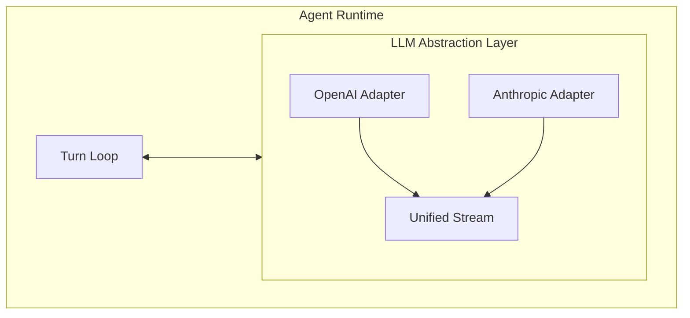

# 02. LLM 抽象层

## 一、为什么需要抽象层

Agent Runtime 不能绑定单一 LLM Provider。今天的 Agent 可能需要：

- 根据成本在不同模型间切换（GPT-4 ↔ Claude ↔ 本地模型）
- 根据任务复杂度选择不同能力的模型（简单总结用小模型，复杂推理用大模型）
- 支持用户自定义 API Key 和 Endpoint
- 在 Provider 故障时自动 Fallback

因此，Runtime 与 LLM 之间必须有一层** Provider-Neutral 的抽象**。

## 二、抽象层的职责边界



抽象层的核心职责：

1. **统一请求格式**：将 Runtime 的内部表示转换为 Provider 特定的 API 格式
2. **统一流式输出**：无论底层是 SSE、WebSocket 还是 HTTP/2 Stream，对外都暴露统一的事件流
3. **统一函数调用协议**：将 Tool Schema 转换为 Provider 特定的 function/tool 格式，将返回的调用解析为统一结构
4. **参数映射**：temperature、max_tokens、top_p 等通用参数映射到 Provider 特定字段
5. **错误标准化**：将 Provider 特定的错误（速率限制、上下文超限、内容过滤）转换为 Runtime 可处理的统一错误码

## 三、核心接口设计

### 3.1 最简抽象接口

```
// 统一的 LLM 接口
interface LanguageModel:
    function chat(request: ChatRequest): ChatResponse
    function streamChat(request: ChatRequest): Stream<ChatEvent>

// 请求结构
struct ChatRequest:
    messages: List<Message>
    tools: List<ToolDefinition>        // 可选
    systemPrompt: SystemPrompt          // 可选
    parameters: GenerationParameters    // 温度、最大长度等
    modelId: String                     // "gpt-4", "claude-3-opus", ...

// 生成参数
struct GenerationParameters:
    temperature: Float        // 0.0 - 2.0
    maxTokens: Integer        // 最大输出长度
    topP: Float               // 核采样
    stopSequences: List<String>
    toolChoice: ToolChoice    // auto / required / none / specific

// 流式事件（Provider 无关）
union ChatEvent:
    TextDelta          { content: String }
    ReasoningDelta     { content: String }
    ToolCallStart      { id: String, name: String }
    ToolCallDelta      { id: String, argumentsDelta: String }
    ToolCallEnd        { id: String }
    StepStart          { stepNumber: Integer }
    StepFinish         { stepNumber: Integer, usage: TokenUsage }
    Error              { code: ErrorCode, message: String }
    Finish             { reason: FinishReason, usage: TokenUsage }

// Token 使用统计
struct TokenUsage:
    promptTokens: Integer
    completionTokens: Integer
    totalTokens: Integer
```

### 3.2 适配器模式

每个 Provider 实现一个 Adapter，负责协议转换：

```
abstract class LlmAdapter:
    function supports(modelId: String): Boolean
    function chat(request: ChatRequest): ChatResponse
    function streamChat(request: ChatRequest): Stream<ChatEvent>

class OpenAiAdapter extends LlmAdapter:
    function chat(request):
        openAiRequest = convertToOpenAiFormat(request)
        response = httpPost("https://api.openai.com/v1/chat/completions", openAiRequest)
        return convertFromOpenAiFormat(response)

    function streamChat(request):
        openAiRequest = convertToOpenAiFormat(request)
        openAiRequest.stream = true
        sseStream = httpPostStream("https://api.openai.com/v1/chat/completions", openAiRequest)
        return map(sseStream, event -> convertSseEvent(event))

class AnthropicAdapter extends LlmAdapter:
    // Anthropic 的 API 格式不同：
    // - 工具声明格式不同
    // - 流式事件名称不同
    // - 系统提示的传递方式不同
    // 但对外暴露相同的 ChatEvent 流
```

## 四、流式输出的统一处理

流式输出是 Agent 交互的默认模式。不同 Provider 的流式实现差异很大，抽象层必须抹平这些差异。

### 4.1 Provider 流式差异

| Provider | 协议 | 特点 |
|----------|------|------|
| OpenAI | SSE | `data: {...}` 行，每个 delta 是一个 JSON 片段 |
| Anthropic | SSE | 类似 OpenAI，但事件名称和字段命名不同 |
| Google Gemini | HTTP/2 Stream | 二进制 protobuf 流 |
| 本地模型 | WebSocket | 自定义协议 |

### 4.2 统一流的事件序列

无论底层是什么协议，一个典型的 tool-calling Turn 的流事件序列应该是：

```
StepStart { stepNumber: 1 }
  TextDelta { content: "I'll" }
  TextDelta { content: " help" }
  TextDelta { content: " you" }
  ToolCallStart { id: "call_123", name: "read_file" }
  ToolCallDelta { id: "call_123", argumentsDelta: '{"path": ' }
  ToolCallDelta { id: "call_123", argumentsDelta: '"src/main' }
  ToolCallDelta { id: "call_123", argumentsDelta: '.js"}' }
  ToolCallEnd { id: "call_123" }
  TextDelta { content: "\n\nNow let me check..." }
StepFinish { stepNumber: 1, usage: {...} }
Finish { reason: "stop", usage: {...} }
```

**关键设计点**：
- `ToolCallDelta` 允许工具参数分片到达（某些 Provider 会逐字符发送 JSON）
- `StepStart` / `StepFinish` 标记一个推理步骤的边界
- 当存在多个 tool-call 时，它们会交错出现在流中

### 4.3 流式解析器的伪代码

```
class UnifiedStreamParser:
    currentText = ""
    currentReasoning = ""
    activeToolCalls = Map<String, PartialToolCall>()

    function parseEvent(rawEvent):
        if rawEvent.type == "content_block_delta":
            if rawEvent.delta.type == "text":
                return TextDelta { content: rawEvent.delta.text }
            else if rawEvent.delta.type == "thinking":
                return ReasoningDelta { content: rawEvent.delta.thinking }

        else if rawEvent.type == "tool_use":
            if rawEvent.isStart:
                activeToolCalls[rawEvent.id] = PartialToolCall {
                    id: rawEvent.id,
                    name: rawEvent.name,
                    arguments: ""
                }
                return ToolCallStart { id: rawEvent.id, name: rawEvent.name }
            else if rawEvent.isDelta:
                partial = activeToolCalls[rawEvent.id]
                partial.arguments += rawEvent.delta.partial_json
                return ToolCallDelta {
                    id: rawEvent.id,
                    argumentsDelta: rawEvent.delta.partial_json
                }
            else if rawEvent.isEnd:
                partial = activeToolCalls.remove(rawEvent.id)
                return ToolCallEnd { id: rawEvent.id }
```

## 五、Function Calling 协议

Function Calling（或称 Tool Use）是 Agent 能力的基石。抽象层必须统一不同 Provider 的函数调用协议。

### 5.1 Tool 定义的统一表示

```
struct ToolDefinition:
    name: String
    description: String
    parameters: JsonSchema    // JSON Schema 对象是事实标准

// 示例
readFileTool = ToolDefinition {
    name: "read_file",
    description: "Read the contents of a file at the given path",
    parameters: {
        type: "object",
        properties: {
            path: { type: "string", description: "Absolute or relative file path" },
            encoding: { type: "string", enum: ["utf-8", "binary"], default: "utf-8" }
        },
        required: ["path"]
    }
}
```

### 5.2 Provider 间的格式映射

不同 Provider 对工具的声明和调用格式不同：

| 维度 | OpenAI | Anthropic | Google Gemini |
|------|--------|-----------|---------------|
| **声明字段** | `tools` | `tools` | `tools` |
| **Schema 格式** | JSON Schema | JSON Schema | OpenAPI Schema 子集 |
| **调用返回** | `tool_calls` 数组 | `content_blocks` 中的 `tool_use` | `functionCalls` |
| **参数传递** | `arguments` JSON 字符串 | `input` JSON 对象 | `args` JSON 对象 |
| **结果回填** | `tool` role message | `tool_result` content block | `functionResponse` |

抽象层需要将这些差异封装在 Adapter 内部，对外暴露统一的 `ToolCall` 和 `ToolResult` 结构。

### 5.3 Tool Result 回填

```
struct ToolResult:
    toolCallId: String          // 对应原始 ToolCall 的 id
    toolName: String
    status: "success" | "error"
    content: String             // 文本结果或错误信息
    isError: Boolean            // 标记是否为错误结果

// 回填到消息历史的方式
function buildToolResultMessage(results: List<ToolResult>): Message:
    return Message {
        role: "tool",
        parts: results.map(r -> ToolResultPart {
            toolCallId: r.toolCallId,
            toolName: r.toolName,
            content: r.content,
            isError: r.isError
        })
    }
```

**重要设计原则**：即使工具执行出错，也应该将错误信息回填给 LLM，让它有机会修正策略或向用户解释。不要静默吞掉错误。

## 六、多 Provider 与 Fallback

### 6.1 Provider 选择策略

```
class ProviderRouter:
    providers: List<ProviderConfig>

    function selectProvider(request: ChatRequest): LlmAdapter:
        // 策略 1：按 modelId 精确匹配
        for provider in providers:
            if provider.supports(request.modelId):
                return provider.adapter

        // 策略 2：按能力匹配（简单任务用小模型）
        if request.complexityScore < 0.3:
            return providers.find(p -> p.modelId == "gpt-3.5-turbo").adapter

        // 策略 3：默认 Provider
        return providers.default.adapter
```

### 6.2 Fallback 机制

```
function chatWithFallback(request: ChatRequest):
    attempts = []
    for provider in getFallbackChain(request.modelId):
        try:
            return provider.chat(request)
        catch error:
            attempts.append({provider: provider.id, error: error})
            if error.isRetryable and provider != last:
                continue
            else:
                throw AggregateError(attempts)
```

常见的可恢复错误：
- 速率限制（429）→ 切换 Provider 或指数退避
- 服务不可用（503）→ 切换 Provider
- 上下文超限 → 触发 Compaction（见第 8 章）
- 内容过滤 → 通常不可恢复，需向用户解释

## 七、上下文窗口管理接口

抽象层应该向 Runtime 暴露上下文相关的元数据，帮助 Runtime 做出管理决策：

```
interface LanguageModel:
    function getContextLimit(modelId: String): Integer
    function estimateTokenCount(messages: List<Message>): Integer
    function supportsPromptCaching(modelId: String): Boolean
```

- `getContextLimit`：返回模型的最大上下文长度（如 128k、200k）
- `estimateTokenCount`：在发送请求前估算 Token 消耗（不同 Provider 的 tokenizer 不同）
- `supportsPromptCaching`：某些 Provider（如 Anthropic）支持 System Prompt 缓存，可以显著降低成本

## 八、最佳实践

1. **流式接口是默认，批量接口是例外**：即使做后台任务，流式也更利于取消和进度反馈
2. **Adapter 必须是无状态的**：不保存会话状态，所有上下文通过参数传递
3. **错误码必须标准化**：Runtime 不应处理 Provider 特定的 HTTP 状态码，只看到 `RATE_LIMITED`、`CONTEXT_OVERFLOW`、`CONTENT_FILTERED` 等语义错误
4. **支持中间层 Hook**：在请求发出前和响应返回后，允许 Hook 修改请求/响应（用于日志、缓存、参数注入）
5. **Token 使用必须可观测**：每次调用的 `promptTokens` / `completionTokens` 必须记录，用于成本和性能监控
