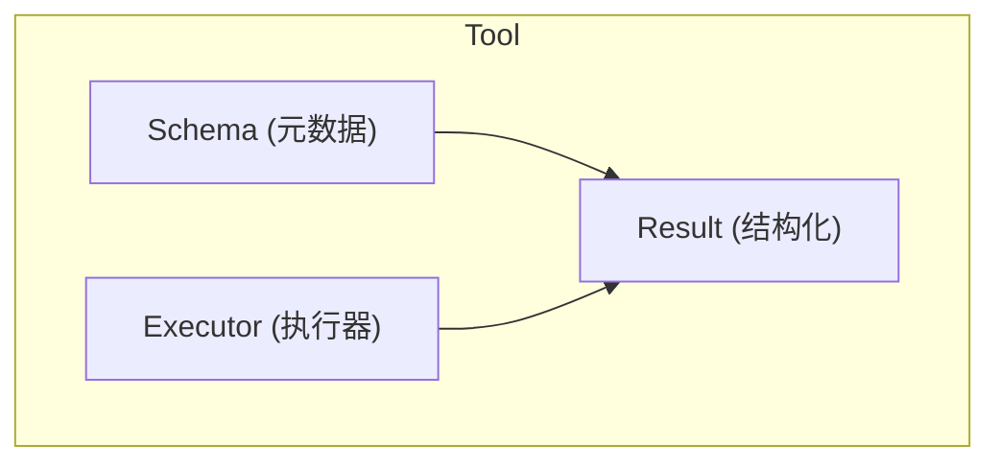

# 03. 工具系统

## 一、工具的本质

在 Agent Runtime 中，**工具（Tool）是 LLM 与外部世界交互的桥梁**。LLM 本身只能生成文本，工具赋予它操作文件系统、执行命令、调用 API、查询数据库的能力。

一个工具由三个不可分割的部分组成：



| 组件 | 职责 | 说明 |
|------|------|------|
| **Schema** | 告诉 LLM 这个工具是什么、怎么调用 | 包含 name、description、parameters（JSON Schema） |
| **Executor** | 实际执行工具逻辑 | 接收解析后的参数，执行操作，返回结果 |
| **Result** | 将执行结果序列化回 LLM | 统一的成功/失败格式，可包含文本、JSON、错误信息 |

## 二、Tool Schema 设计

### 2.1 Schema 是 LLM 的"说明书"

LLM 通过 Schema 了解工具的存在和能力。Schema 的质量直接影响工具调用的准确率。

```
struct ToolSchema:
    name: String                    // 工具的唯一标识符
    description: String             // 对 LLM 可见的工具说明
    parameters: JsonSchema          // 参数的 JSON Schema

// 好的 description 示例
readFileTool = ToolSchema {
    name: "read_file",
    description: "Read the contents of a file. Use this when you need to examine code, configuration, or documentation. Returns the file content as text, or an error if the file doesn't exist.",
    parameters: {
        type: "object",
        properties: {
            path: {
                type: "string",
                description: "The absolute path to the file to read. Example: '/home/user/project/src/main.js'"
            },
            limit: {
                type: "integer",
                description: "Maximum number of lines to read. Use this for large files to avoid context overflow.",
                default: null
            }
        },
        required: ["path"]
    }
}
```

### 2.2 Schema 设计的最佳实践

1. **description 要具体**：不要写"读取文件"，要写"读取文件内容，用于查看代码或配置。当文件不存在时返回错误。"
2. **参数 description 要带示例**：LLM 对示例的理解远优于抽象描述
3. **必填参数明确标记**：通过 `required` 数组告诉 LLM 哪些参数不能省略
4. **枚举值优先使用 enum**：当参数只有几种可能值时，用 `enum` 约束比自由文本更准确
5. **为复杂操作提供专门工具**：不要把"读文件+改文件+写文件"合并为一个工具，LLM 需要看到中间结果

## 三、Tool Registry（工具注册表）

工具不是硬编码的。Runtime 必须支持**动态注册和发现**。

### 3.1 Registry 的核心接口

```
interface ToolRegistry:
    function register(tool: ToolDefinition): void
    function unregister(toolName: String): void
    function get(toolName: String): ToolDefinition
    function list(): List<ToolDefinition>
    function listForLlm(): List<ToolSchema>   // 返回给 LLM 的 Schema 列表
    function clear(): void
```

### 3.2 动态注册的场景

```
// 场景一：启动时注册内置工具
runtime.onStartup:
    registry.register(readFileTool)
    registry.register(writeFileTool)
    registry.register(executeCommandTool)
    registry.register(searchCodeTool)

// 场景二：用户启用某个 Skill 时动态添加
runtime.onSkillEnabled(skill):
    for tool in skill.tools:
        registry.register(tool)

// 场景三：运行时接入外部 MCP Server
runtime.onMcpServerConnected(server):
    tools = server.listTools()
    for tool in tools:
        registry.register(wrapMcpTool(tool))

// 场景四：Agent 切换时更换工具集
runtime.onAgentHandoff(toAgent):
    registry.clear()
    for tool in toAgent.tools:
        registry.register(tool)
```

### 3.3 Registry 快照

每个 Turn 开始时，Runtime 应该对 Registry 做**快照**，确保当前 Turn 使用的工具集在整个推理过程中保持一致：

```
function startTurn(session):
    // 快照当前可用工具
    session.currentToolSet = registry.listForLlm()

    // 后续 LLM 调用使用这个快照
    stream = llm.streamChat(messages, session.currentToolSet)
```

**为什么需要快照？** 如果在 LLM 推理过程中工具被动态添加/移除，可能导致工具调用与可用工具不匹配。

## 四、工具执行策略

### 4.1 串行执行（Sequential）

一次执行一个工具，等待结果后再继续。这是最简单也最安全的模式。

```
function executeSequential(toolCalls: List<ToolCall>):
    results = []
    for call in toolCalls:
        result = executeSingleTool(call)
        results.append(result)
        // 每个工具执行后立即回填，LLM 可以看到中间结果
        emitEvent("tool_result", result)
    return results
```

**适用场景**：
- 工具间有依赖关系（B 需要 A 的结果）
- 工具是文件写操作（避免并发写冲突）
- 资源受限环境

### 4.2 并行执行（Parallel）

同时执行多个独立的工具，等待所有结果后统一回填。

```
function executeParallel(toolCalls: List<ToolCall>):
    promises = []
    for call in toolCalls:
        promise = asyncExecuteTool(call)
        promises.append(promise)

    // 等待全部完成
    results = awaitAll(promises, timeout: 30000)

    // 统一回填
    for result in results:
        emitEvent("tool_result", result)

    return results
```

**适用场景**：
- 多个独立的文件读取
- 并行的搜索查询
- 无依赖关系的 API 调用

### 4.3 混合策略

某些 Runtime 支持更复杂的执行策略：

```
function executeToolCalls(toolCalls: List<ToolCall>):
    // 按依赖关系分组
    groups = analyzeDependencies(toolCalls)

    for group in groups:
        if group.canParallelize:
            results = executeParallel(group.calls)
        else:
            results = executeSequential(group.calls)

        // 每组完成后回填，让后续组能看到前面组的结果
        session.history.append(createToolResultMessage(results))
```

## 五、Approval Gate（审批门）

不是所有工具都应该直接执行。敏感操作必须经过审批。

### 5.1 审批的触发条件

```
enum ApprovalLevel:
    ALLOW       // 直接执行，无需审批
    ASK         // 需要用户确认
    DENY        // 禁止执行

function determineApproval(toolCall: ToolCall, context: ExecutionContext): ApprovalLevel:
    tool = registry.get(toolCall.name)

    // 规则 1：按工具类型
    if tool.category == "filesystem_write":
        return ASK
    if tool.category == "command_execution":
        return ASK
    if tool.category == "network_request":
        return ASK

    // 规则 2：按参数敏感度
    if toolCall.arguments.path contains "~/.ssh":
        return DENY
    if toolCall.arguments.command contains "rm -rf /":
        return DENY

    // 规则 3：按上下文
    if context.isFirstTimeUsingTool(tool.name):
        return ASK
    if context.userPreference[tool.name] == "always_allow":
        return ALLOW

    return ALLOW
```

### 5.2 交互式审批流程

```
function executeWithApproval(toolCall: ToolCall):
    level = determineApproval(toolCall, context)

    if level == DENY:
        return ToolResult {
            status: "error",
            content: "This operation is not allowed by policy.",
            isError: true
        }

    if level == ASK:
        decision = await requestUserApproval({
            toolName: toolCall.name,
            arguments: toolCall.arguments,
            description: generateHumanReadableDescription(toolCall)
        })

        if decision == "reject":
            return ToolResult {
                status: "error",
                content: "User rejected this operation.",
                isError: true
            }

        if decision == "always_allow":
            context.rememberPreference(toolCall.name, "always_allow")

    // 执行工具
    return executeTool(toolCall)
```

### 5.3 审批的粒度

| 粒度 | 说明 | 示例 |
|------|------|------|
| **全局策略** | 所有用户/所有会话共享 | "禁止删除 `.git` 目录" |
| **Agent 级策略** | 特定 Agent 的工具权限 | "Coder Agent 可以写文件，Reviewer Agent 只能读" |
| **会话级策略** | 当前会话内生效 | "本次会话允许修改 `package.json`" |
| **单次策略** | 仅针对当前 tool-call | "允许这次删除操作" |

## 六、工具结果的序列化

工具执行的结果必须序列化为 LLM 能理解的文本格式。

### 6.1 成功结果的格式

```
// 文本结果
ToolResult {
    status: "success",
    content: "File content here...",
    metadata: {
        lineCount: 42,
        fileSize: 1024
    }
}

// 结构化结果（自动转换为文本）
ToolResult {
    status: "success",
    content: serializeToJson({
        files: ["src/main.js", "src/utils.js"],
        count: 2
    })
}
```

### 6.2 错误结果的格式

错误信息必须足够详细，让 LLM 能理解发生了什么并尝试修正：

```
ToolResult {
    status: "error",
    content: "Error: File not found at path '/home/user/nonexistent.js'",
    isError: true,
    errorType: "FILE_NOT_FOUND",
    suggestions: [
        "Check if the path is correct",
        "Use search_file to find the correct path"
    ]
}
```

**关键原则**：不要把错误信息隐藏或过度简化。LLM 需要原始错误信息才能做出合理的后续决策。

## 七、Tool Execution Context

每个工具执行时都应该携带一个执行上下文，包含环境信息：

```
struct ToolExecutionContext:
    // 身份标识
    sessionId: String
    turnId: String
    agentId: String

    // 环境信息
    workingDirectory: String
    environmentVariables: Map<String, String>
    userInfo: UserInfo

    // 执行限制
    timeoutMs: Integer
    maxOutputSize: Integer
    allowedPaths: List<String>
    blockedPaths: List<String>

    // 取消信号
    cancellationToken: CancellationToken
```

这个上下文用于：
- **隔离**：确保工具只能访问允许的目录
- **审计**：记录谁、在什么时候、调用了什么工具
- **限制**：防止工具无限运行或产生过大输出
- **取消**：用户取消时，正在执行的工具也能收到信号

## 八、内置工具的分类

生产级 Agent 通常提供以下类别的内置工具：

| 类别 | 工具示例 | 敏感度 |
|------|----------|--------|
| **文件系统** | read_file, write_file, list_directory, search_file | 高 |
| **命令执行** | execute_command, run_script | 高 |
| **代码分析** | find_symbol, get_definition, analyze_ast | 中 |
| **搜索** | grep, search_web, semantic_search | 中 |
| **版本控制** | git_status, git_diff, git_commit | 中 |
| **项目管理** | read_config, list_tasks | 低 |
| **通信** | ask_user, send_notification | 低 |

## 九、最佳实践

1. **工具应该小而专注**：每个工具只做一件事，组合使用完成复杂任务
2. **所有工具都必须有 Schema**：即使是内部工具，也要有完整的 description 和 parameters
3. **执行结果必须回填**：无论成功还是失败，都要让 LLM 知道结果
4. **超时是必须的**：每个工具执行都应该有超时限制，防止挂起
5. **输出大小要限制**：防止工具返回超大输出撑爆上下文窗口
6. **工具名要有命名空间**：如 `fs_read` 而不是 `read`，避免冲突
7. **区分只读和写入工具**：写入工具应该有更严格的审批策略
