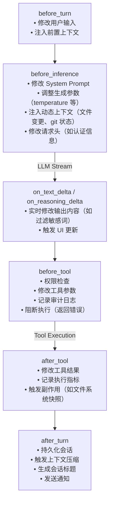
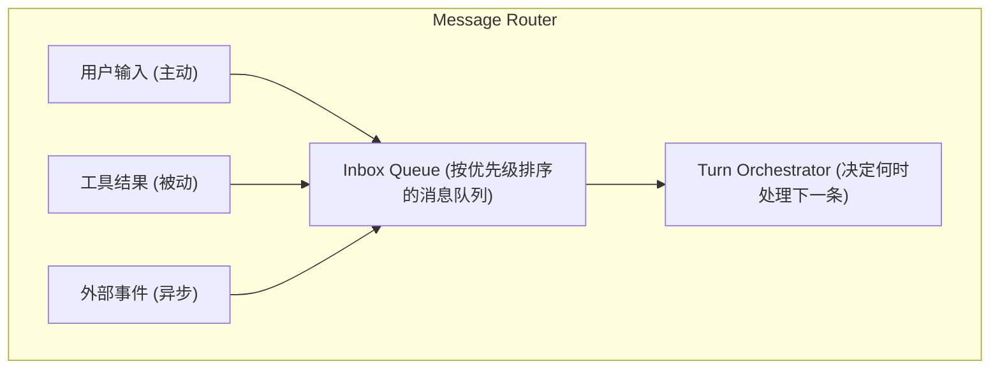

# 04. 消息与 Hook 设计

## 一、为什么消息必须是 Part-based

传统的聊天消息是简单的字符串：

```
Message {
    role: "assistant",
    content: "I'll help you with that. Let me read the file first."
}
```

但 Agent 的消息远比这复杂。一个 Assistant 的消息可能同时包含：
- 一段解释性文本
- 一个工具调用请求
- 一段推理过程（Chain-of-Thought）
- 一个图像引用

如果用纯字符串表示，Runtime 无法区分这些内容类型，也无法支持增量更新。

### 1.1 Part-based 消息模型

```
Message {
    id: String                    // 消息唯一标识
    role: "system" | "user" | "assistant" | "tool"
    parts: List<Part>            // 消息由多个 Part 组成
    metadata: MessageMetadata
    visibility: "user" | "internal"  // 用户可见 vs 仅 LLM 可见
}

union Part:
    TextPart          { content: String }
    ReasoningPart     { content: String, signature: String }
    ToolCallPart      { id: String, name: String, arguments: Json }
    ToolResultPart    { toolCallId: String, content: String, isError: Boolean }
    ImagePart         { source: ImageSource, mimeType: String }
    FilePart          { path: String, content: String, mimeType: String }
    PatchPart         { path: String, diff: String, before: String, after: String }
```

### 1.2 Part 的组合示例

一个典型的 Assistant Turn 消息：

```
Message {
    id: "msg_456",
    role: "assistant",
    parts: [
        TextPart {
            content: "I'll help you refactor the authentication module. Let me first examine the current implementation."
        },
        ToolCallPart {
            id: "call_123",
            name: "read_file",
            arguments: { path: "/src/auth.js" }
        },
        ToolCallPart {
            id: "call_124",
            name: "read_file",
            arguments: { path: "/src/auth.test.js" }
        }
    ],
    visibility: "user"
}
```

对应的 Tool Result 消息：

```
Message {
    id: "msg_457",
    role: "tool",
    parts: [
        ToolResultPart {
            toolCallId: "call_123",
            content: "function authenticate(user, pass) { ... }",
            isError: false
        },
        ToolResultPart {
            toolCallId: "call_124",
            content: "describe('auth', () => { ... })",
            isError: false
        }
    ],
    visibility: "internal"   // 用户通常不需要直接看到 tool result
}
```

## 二、增量更新机制

流式场景下，消息不是一次性构建完成的，而是边接收边组装。

### 2.1 Delta 更新模型

```
// 增量更新事件
union PartDelta:
    TextDelta          { partIndex: Integer, contentDelta: String }
    ReasoningDelta     { partIndex: Integer, contentDelta: String }
    ToolCallDelta      { partIndex: Integer, argumentsDelta: String }

function applyDelta(message: Message, delta: PartDelta):
    part = message.parts[delta.partIndex]

    if delta is TextDelta:
        part.content += delta.contentDelta
    else if delta is ReasoningDelta:
        part.content += delta.contentDelta
    else if delta is ToolCallDelta:
        part.arguments += delta.argumentsDelta

    emitEvent("part_updated", {messageId: message.id, delta: delta})
```

### 2.2 为什么需要增量更新

| 场景 | 全量更新 | 增量更新 |
|------|----------|----------|
| **流式渲染** | 每次收到新 token 都替换整个消息，UI 闪烁 | 只追加新内容，UI 平滑 |
| **持久化** | 每次更新都写完整消息，I/O 开销大 | 只写 delta，I/O 最小化 |
| **并发编辑** | 容易产生冲突 | 冲突概率低，易于合并 |
| **网络传输** | 带宽浪费 | 只传输变化部分 |

### 2.3 增量持久化

```
// 数据库中的消息存储
MessageTable:
    id: String (primary key)
    role: String
    created_at: Timestamp

PartTable:
    id: String (primary key)
    message_id: String (foreign key)
    type: String
    content: Text        // 当前完整内容
    content_delta: Text  // 最近的增量（可选，用于快速恢复流）

// 更新时只写 delta
function persistDelta(messageId: String, partId: String, delta: String):
    executeSQL(
        "UPDATE parts SET content = content || ?, content_delta = ?
         WHERE id = ? AND message_id = ?",
        [delta, delta, partId, messageId]
    )
```

## 三、Visibility：内部消息 vs 外部消息

并非所有消息都应该展示给最终用户。Runtime 需要区分：

| 可见性 | 谁可见 | 用途 |
|--------|--------|------|
| **user** | 用户 + LLM | 正常的对话内容 |
| **internal** | 仅 LLM | System prompt 注入、工具结果、内部上下文 |

### 3.1 内部消息的典型用途

```
// 内部 System Prompt 更新
Message {
    role: "system",
    parts: [TextPart { content: "Current working directory: /home/user/project" }],
    visibility: "internal"
}

// 文件变更快照（自动注入）
Message {
    role: "system",
    parts: [PatchPart {
        path: "/src/auth.js",
        diff: "+ function hashPassword(password) { ... }"
    }],
    visibility: "internal"
}

// 工具执行结果（通常内部，但可选择性展示摘要给用户）
Message {
    role: "tool",
    parts: [ToolResultPart { ... }],
    visibility: "internal"
}
```

### 3.2 内部消息的渲染策略

```
function renderMessageForUser(message: Message): String:
    if message.visibility == "internal":
        return null   // 不渲染

    return message.parts
        .filter(part -> part is TextPart)
        .map(part -> part.content)
        .join("\n")

function renderMessageForLlm(message: Message): List<LlmMessage>:
    // LLM 能看到所有消息，但需要按 provider 格式转换
    return convertToLlmFormat(message)
```

## 四、Hook 系统设计

Hook 是扩展 Agent Runtime 行为的唯一正确方式。**永远不要修改核心循环代码**，而是在关键生命周期点注入逻辑。

### 4.1 Hook 介入点全景



### 4.2 Hook 接口定义

```
interface AgentHook:
    function beforeTurn(context: TurnContext): void
    function beforeInference(context: InferenceContext): void
    function onTextDelta(context: DeltaContext): void
    function onReasoningDelta(context: DeltaContext): void
    function beforeTool(context: ToolContext): void
    function afterTool(context: ToolContext, result: ToolResult): void
    function afterTurn(context: TurnContext, turn: Turn): void
```

### 4.3 Hook 的执行顺序与优先级

```
class HookRegistry:
    hooks: Map<String, List<AgentHook>>   // phase -> hooks

    function register(phase: String, hook: AgentHook, priority: Integer):
        list = hooks.getOrCreate(phase)
        list.insertSorted(hook, priority)  // 高优先级先执行

    function execute(phase: String, context: Context):
        for hook in hooks[phase]:
            try:
                result = hook.execute(context)
                if result == BLOCK:
                    break   // 某个 Hook 阻断了后续执行
            catch error:
                logError("Hook failed", hook.id, error)
                if hook.isCritical:
                    throw error
```

### 4.4 Hook 的典型应用

```
// 示例 1：动态注入文件上下文
class FileContextHook implements AgentHook:
    function beforeInference(context):
        changedFiles = fileWatcher.getChangedFiles()
        if changedFiles.isNotEmpty():
            context.addSystemContext("Recently modified files: " + changedFiles.join(", "))

// 示例 2：敏感数据过滤
class SensitiveDataFilterHook implements AgentHook:
    function onTextDelta(context):
        if context.deltaContent.contains("password"):
            context.deltaContent = context.deltaContent.replace("password=", "password=***")

// 示例 3：工具执行审计
class AuditHook implements AgentHook:
    function beforeTool(context):
        auditLog.write({
            timestamp: now(),
            tool: context.toolName,
            arguments: context.arguments,
            user: context.userId
        })

// 示例 4：执行后自动快照
class SnapshotHook implements AgentHook:
    function afterTool(context, result):
        if context.toolName in ["write_file", "delete_file"]:
            snapshot = fileSystem.captureSnapshot()
            context.session.addInternalMessage(PatchPart { diff: snapshot.diff })
```

## 五、消息路由

Agent Runtime 可能同时接收来自多个来源的输入：



### 5.1 消息优先级

```
enum MessagePriority:
    CRITICAL    // 系统错误、取消信号
    HIGH        // 用户输入
    NORMAL      // 工具结果
    LOW         // 文件系统变更通知、定期状态更新
    BACKGROUND  // 遥测数据、日志
```

### 5.2 外部事件注入

Runtime 应该能接收异步外部事件并注入到当前对话中：

```
function onExternalEvent(event: ExternalEvent):
    if event.type == "file_changed":
        message = createInternalMessage({
            content: "File changed: " + event.filePath,
            visibility: "internal"
        })
        session.inbox.enqueue(message, priority: LOW)

    else if event.type == "user_interrupt":
        message = createSystemMessage({
            content: "User interrupted",
            priority: CRITICAL
        })
        session.inbox.enqueue(message, priority: CRITICAL)
        session.cancellationToken.cancel()
```

## 六、消息历史的维护

### 6.1 消息历史的结构

```
struct Session:
    id: String
    messages: List<Message>        // 完整消息历史
    turns: List<Turn>              // Turn 级别的索引
    systemPrompt: SystemPrompt
    metadata: SessionMetadata

struct Turn:
    id: String
    startMessageIndex: Integer    // 在 messages 数组中的起始位置
    endMessageIndex: Integer      // 结束位置
    status: TurnStatus
    tokenUsage: TokenUsage
```

### 6.2 消息历史的约束

```
function appendMessage(session: Session, message: Message):
    // 约束 1：消息顺序必须合法
    validateMessageOrder(session.messages.last, message)

    // 约束 2：tool 消息必须紧跟 assistant 的 tool-call
    if message.role == "tool":
        lastAssistant = findLastAssistantMessage(session)
        assert lastAssistant.hasToolCallFor(message.parts[0].toolCallId)

    // 约束 3：不允许修改已确认的消息
    if session.messages.last?.status == "committed":
        // 只能追加，不能修改
        session.messages.append(message)
    else:
        // 当前消息还在构建中（流式），可以更新
        updateCurrentMessage(session, message)
```

## 七、最佳实践

1. **所有消息必须有唯一 ID**：用于关联、追踪、增量更新
2. **Part 类型要可扩展**：使用 union/enum 模型，方便未来添加新类型（如 audio、video）
3. **Visibility 默认应该是 "user"**：只有在明确需要隐藏时才设为 "internal"
4. **Hook 必须是幂等的**：同一个 Hook 被多次调用不应该产生副作用
5. **Hook 错误不能破坏核心循环**：单个 Hook 失败不应该导致整个 Turn 失败
6. **消息历史是不可变的（逻辑上）**：一旦 Turn 完成，历史消息不应该被修改，只能通过追加新消息来改变上下文
7. **区分 "消息" 和 "事件"**：消息是持久化的对话内容，事件是瞬时的状态通知（如 `text_delta`）
